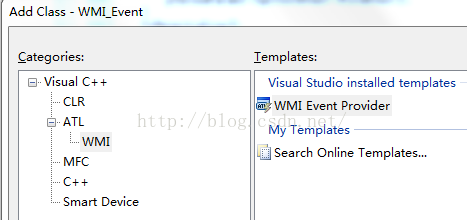
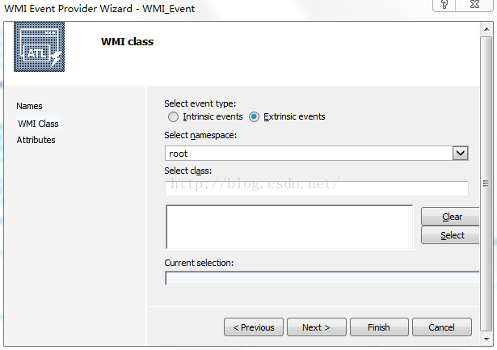
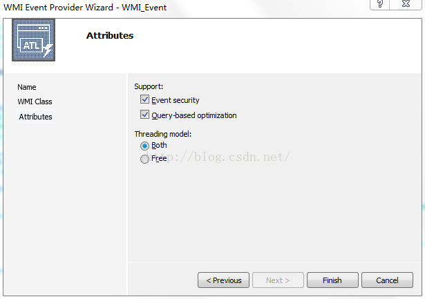
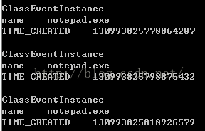
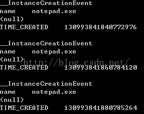

&emsp;&emsp;在《WMI技术介绍和应用——Instance/Method Provider》一文中，我们介绍了Instance和Method Provider的编写方法。本文我们将介绍更有意思的“事件提供者”。在《WMI技术介绍和应用——事件通知》中，我们曾经提到事件是分为两种：intrinsic event和extrinsic event。这两种事件提供者在编写上也非常类似，我们先以extrinsic event为例。  
&emsp;&emsp;**intrinsic event provider**  
&emsp;&emsp;之前生成工程的过程和《WMI技术介绍和应用——Instance/Method Provider》中介绍的一致，但是我们这次要新增的ATL class则不同  
  
&emsp;&emsp; 在”名称“页，我们在short name中填上我们事件提供者的名称”TestEvent"，其他输入框内容将自动生成。  
&emsp;&emsp; 事件类型我们选择extrinsic event，其他不填  
  
&emsp;&emsp; 在“属性”页，将Threading model设置为Both。Support选项都勾选上  
  
&emsp;&emsp; 执行完之后，我们就生成了一个mof文件、一个TestEvent.h和TestEvent.cpp文件。我们继续从mof文件入手，我们申明一个事件类  
```c++
[Locale(1033) : ToInstance,UUID("{E5EDE7F6-D9F9-4195-8E97-643B71F2FB91}") : ToInstance]   
class ClassEventInstance: __ExtrinsicEvent   
{  
string name = "CIN";  
string value = "CIV";  
};  
```
&emsp;&emsp; 然后注册一个事件提供者，并指定查询命令  
```c++
instance of __EventProviderRegistration  
{  
    provider = $TestEvent;  
    EventQueryList = {"select * from ClassEventInstance"};  
};  
```
&emsp;&emsp; 再回到cpp代码文件，首先我们要修改类名  
```c++
[cpp] view plain copy
const static WCHAR * s_pMyClassName = L"ClassEventInstance";   
```
&emsp;&emsp; 其次我们要修改AccessCheck函数，删除掉这行，否则我们查询不会成功  
```c++
hr = WBEM_E_ACCESS_DENIED;  
```
&emsp;&emsp; 我们需要修改ProvideEvents函数，在该函数末尾新增如下逻辑  
```c++
HANDLE hThread = (HANDLE)_beginthread(ThreadRoutine, 0, this);  
CloseHandle(hThread); 
```
&emsp;&emsp; 我们启动一个线程，用于事件的发送。我们传入this指针只是为了之后调用我们类中的一个方法。我们看下线程函数  
```c++
static void ThreadRoutine(void* param) {  
    OutputTrace("CTestEvent::ThreadRoutine");  
    CoInitializeEx(NULL, COINIT_MULTITHREADED);  
    CTestEvent* pThis = (CTestEvent*)(param);  
  
    while(true) {  
        Sleep(1000*2);  
        pThis->FireEvent();  
    }  
    CoUninitialize();  
};  
```
&emsp;&emsp; 这段逻辑，我们在一个死循环中每隔两秒钟触发一次事件——FireEvent。FireEvent本来是模板自动生成的，而我们借用它实现事件的触发。这儿需要注意一个文件，本文主要讲解搭建的关键步骤，而对很多其他细节和安全问题没有做过多处理，否则就喧宾夺主了。比如本文中所提到的线程执行函数，其实存在线程安全问题，而我又不想引入COM跨线程问题，所以就如此简单粗暴的编写。  

```c++
STDMETHODIMP CTestEvent::FireEvent()  
{  
    HRESULT hr = WBEM_S_NO_ERROR;  
    ATLASSERT(m_pEventClass);  
    CComPtr<IWbemClassObject> pInstance;  
    hr = m_pEventClass->SpawnInstance(0, &pInstance);  
    if(FAILED(hr)) {  
        return hr;  
    }  
  
    CComVariant value;  
    value.vt = VT_BSTR;  
    value.bstrVal = CComBSTR("notepad.exe");  
    pInstance->Put(L"name", 0, &value, 0);  
  
    return m_pSink->Indicate(1, &(pInstance.p) );  
}  
```
&emsp;&emsp; 我们Spawn一个实例，然后填充它的一些属性，最后将该对象放入客户端可以访问的sink中。  
&emsp;&emsp;我们使用之前实现的查询类查询该事件  

```c++
HANDLE hEvent = CreateEvent(NULL, FALSE, FALSE, NULL);  
CAsynNotifyQuery<CInstanceEvent> recvnotify(L"root\\default", L"SELECT * FROM ClassEventInstance", hEvent);  
recvnotify.ExcuteFun();  
```
&emsp;&emsp;我们即可以看到结果  
  


&emsp;&emsp;**extrinsic event provider**  
&emsp;&emsp;extrinsic event provider实现讲完了，我们再讲讲intrinsic event provider。工程向导方面和extrinsic event provider基本相同，只是在WMI Class页中选择intrinsic event。我们对新的provider取名为IntrinsicEvent。我们也从mof入手，看看怎么修改  
```c++
[  
dynamic : ToInstance,   
provider("IntrinsicEvent") : ToInstance, // uses the TestInstance Provider  
ClassContext("whatever!"),          // information is dynamically  
                                    // supported by the provider  
DisplayName("IntrinsicClassInstance"): ToInstance  
]                                      
  
class IntrinsicClassInstance   
{  
[key]  
string name = "CIN";  
[PropertyContext("IntrinsicClassInstance_Member")]  
string value = "CIV";  
}; 
```
&emsp;&emsp; 首先我们定义Event的类名——IntrinsicClassInstance，并申明其有两个属性——name和value。其次我们我们修改下事件提供者注册对象  

```c++
instance of __EventProviderRegistration  
{  
    provider = $IntrinsicEvent;  
    EventQueryList = {"select * from __InstanceCreationEvent where TargetInstance isa \"IntrinsicClassInstance\""};  
};   
```
&emsp;&emsp; 从WQL的写法我们可以发现，这种写法和检测进程创建的Win32_Process类类似，这就是内部（Intrinsic）事件的特点。cpp的修改和extrinsic event provider中介绍的过程类似，只是Intrinsic没有FireEvent方法，那我们就自己申明和定义一个  
```c++
STDMETHODIMP CIntrinsicEvent::FireEvent()  
{  
    HRESULT hr = WBEM_S_NO_ERROR;  
    ATLASSERT(m_pEventClass);  
    CComPtr<IWbemClassObject> pInstance;  
    hr = m_pDataClass->SpawnInstance(0, &pInstance);  
    if(FAILED(hr)) {  
        OutputTrace("CIntrinsicEvent::FireEvent1");  
        return hr;  
    }  
  
    CComVariant value;  
    value.vt = VT_BSTR;  
    value.bstrVal = CComBSTR("notepad.exe");  
    pInstance->Put(L"name", 0, &value, 0);  
  
  
    CComPtr<IWbemClassObject> pEventInstance;  
    hr = m_pEventClass->SpawnInstance(0, &pEventInstance);  
    if(FAILED(hr)) {  
        return hr;  
    }  
  
    CComVariant varTargetInst(pInstance);  
    pEventInstance->Put(L"TargetInstance", 0, &varTargetInst, 0);  
  
    return m_pSink->Indicate(1, &(pEventInstance.p) );  
}  
```

&emsp;&emsp; 我们将新生成的实例放入到`pEventInstance`实例的`"TargetInstance"`中，这也和上面的WQL的1“TargetInstance isa \"IntrinsicClassInstance\"”1相对应。pEventInstance实例的类是我们在模板基础上新增的，我们要修改Initialize函数，新增  
```c++
hr = m_pNamespace->GetObject(CComBSTR("__InstanceCreationEvent"),   
                             0,   
                             pCtx, //passing IWbemContext pointer to prevent deadlocks  
                             &m_pEventClass,   
                             NULL);  
if (FAILED(hr)) {  
    return hr;  
}  
```
&emsp;&emsp; 我们使用如下代码访问该事件  
```c++
HANDLE hEvent = CreateEvent(NULL, FALSE, FALSE, NULL);  
CAsynNotifyQuery<CInstanceEvent> recvnotify(L"root\\default", L"SELECT * FROM __InstanceCreationEvent WITHIN 1 WHERE TargetInstance ISA 'IntrinsicClassInstance'", hEvent);  
recvnotify.ExcuteFun();  
```
&emsp;&emsp; 我们可以得到如下结果  
