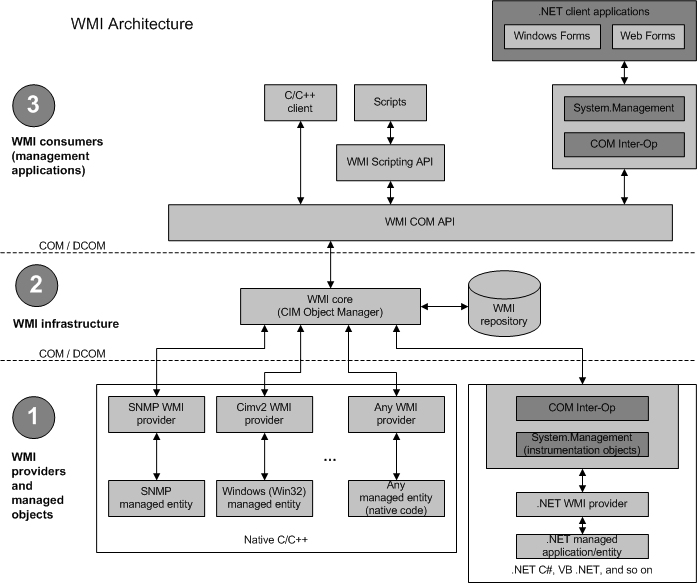
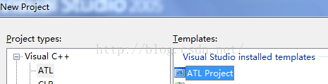
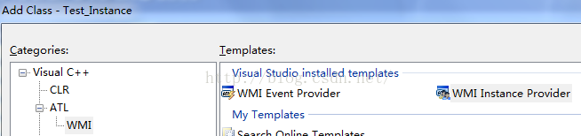
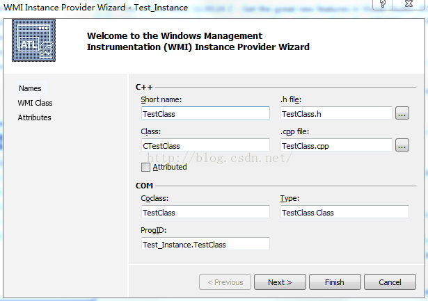
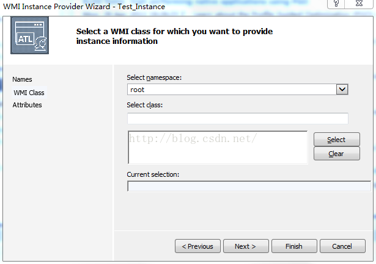
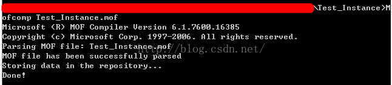
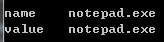

  

&emsp;&emsp;我们在1这层的Native C/C++里可以看到若干Provider，这些Provider将各个实例或者事件信息通过WMI core传递到上层。微软对这块内容在MSDN上没有给出详细的例子，所以一开始摸索起来非常困难，以致我一度想放弃对其的研究。但是好在找到一本《Developing WMI Solutions》，该书非常详细讲解了WMI的一些书写规则，虽然该书的网站已经不再维护，其事例代码也找不到了。但是循着书中的讲解，我还是将其摸索出来，以供大家参考。  

&emsp;&emsp;**instance provider**  
&emsp;&emsp;MSDN上说Virtual Studio的ATL模板里有WMI向导，并且推荐大家使用向导去生成WMI工程。需要注意的是，不是每个版本的VS都有这个向导，像我环境中的VS2015则没有，而VS2005则有。  
&emsp;&emsp;我们先创建一个名字为Test_Instance的ATL工程    
  
&emsp;&emsp;Server type选择Dynamic-link library (DLL)，其他不选，我们将生成Test_Instance和Test_InstancePS两个工程。Test_InstancePS工程我们不用关心，直接删除就行了。我们选中Test_Instance工程，右击并选择Add，添加一个class。在向导里我们可以看到ATL下有WMI相关模板  
  
&emsp;&emsp;Name字段还是填写Test_Instance，在Instance Provider的向导中，我们在short name项下填入我们需要实例化的类的名字TestClass  
  
&emsp;&emsp;在WMI Class项中，我们不做任何修改，使用默认的root空间，其实最终我们真实使用的是root\default。  
  
&emsp;&emsp;在Attribute项中，我们在Threading Model中选择Both，其他可选项都勾选上。  
&emsp;&emsp;通过向导的设定，我们的工程中新增了TestClass.cpp、TestClass.h和Test_Instance.mof三个文件。Test_Instance.mof是我们向WMI仓库注册使用的文件，其他则是我们的代码文件。  
&emsp;&emsp;向导已经帮我们在mof文件中生成了一大串内容。  
```c++
#pragma autorecover#pragma namespace ("\\\\.\\root\\default")  
  
class Win32_ProviderEx : __Win32Provider  
{  
    [Description ( "Hosting Model, provides compatibility with Windows XP and Windows Server .NET. Do not override." ) , Override("HostingModel")]  
    string HostingModel = "NetworkServiceHost";  
    [Description("..."),Override("SecurityDescriptor")]   
    string SecurityDescriptor;   
    UInt32 version = 1;  
} ;  
  
instance of Win32_ProviderEx as $TestClass  
{  
    Name    = "TestClass" ; //Name is the key property for __Provider objects.  
                                        //vendor|provider|version is the suggested format  
                                        //to prevent name collisions.  
  
    ClsId   = "{7F1C3BD1-7732-403F-844F-CC6ED9CA85FE}" ;     //provider GUID  
  
    DefaultMachineName = NULL;       //NULL for local machine  
  
    ClientLoadableCLSID = NULL;      //reserved  
  
    ImpersonationLevel = 0;          //reserved  
  
    InitializationReentrancy = 0;       //Set of flags that provide information about serialization:  
                                        //0 = all initialization of this provider must be serialized  
                                        //1 = all initializations of this provider in the same namespace must be serialized  
                                        //2 = no initialization serialization is necessary  
  
    InitializeAsAdminFirst = FALSE;     //Request to be fully initialized as "Admin" before   
                                        //initializations begin for users  
  
    PerLocaleInitialization = FALSE;    //Indicates whether the provider is initialized for each   
                                        //locale if a user connects to the same namespace more   
                                        //than once using different locales.  
  
    PerUserInitialization = FALSE;      //Indicates whether the provider is initialized once for each actual   
                                        //Windows NT/Windows 2000 NTLM user making requests of the provider.   
                                        //If set to FALSE, the provider is initialized once for all users  
  
    Pure = TRUE;                        //A pure provider exists only to service requests from   
                                        //applications and WMI. Most providers are pure providers.  
                                        //Non-pure providers transition to the role of client after they have   
                                        //finished servicing requests.   
  
  
    UnloadTimeout = NULL;               //Currently ignored  
                                        //Use __CacheControl class in the root namespace to control provider unloading.  
                                        //A string in the DMTF date/time format that specifies how long WMI   
                                        //allows the provider to remain idle before it is unloaded.  
                                          
  
} ;      
  
instance of __InstanceProviderRegistration  
{  
    Provider = $TestClass;  
  
    SupportsPut = "TRUE";   
    SupportsGet = "TRUE";   
    SupportsDelete = "TRUE";   
    SupportsEnumeration = "TRUE";   
  
    QuerySupportLevels = {"WQL:Associators","WQL:V1ProviderDefined","WQL:UnarySelect","WQL:References"};  
  
};  
  
instance of __MethodProviderRegistration  
{  
    Provider = $TestClass;  
};  
```

&emsp;&emsp;这一长串内容详细大家可以参看MSDN，其中主要的是__InstanceProviderRegistration和__MethodProviderRegistration实例申明。instance of __InstanceProviderRegistration是说我们需要一个Instance类型Provider的注册实例，instance of __MethodProviderRegistration是说我们需要一个Method类型Provider的注册实例。它们的Provider都是我们之前使用instance of Win32_ProviderEx as $TestClass申明的实例。前者用于实例方面的使用，比如获取对象、删除对象、查询信息等；后者用于方法方面的使用，比如我们之前说的Win32_Process的Create方法创建进程。  
&emsp;&emsp; 我们先修改mof文件，我们在文件末尾新增如下内容  
```c++
[  
dynamic : ToInstance,   
provider("TestClass") : ToInstance, // uses the TestClass Provider  
ClassContext("whatever!"),          // information is dynamically  
                                    // supported by the provider  
DisplayName("ClassInstance"): ToInstance  
]                                      
  
class ClassInstance   
{  
[key]  
string name = "CIN";  
[PropertyContext("ClassInstance_Member")]  
string value = "CIV";  
};  
```
&emsp;&emsp; 其中非常重要的是provider字段填写，它就是指向我们之前申明的provider。然后我们申明了一个ClassInstance的类，其有一个Key属性的变量name，还有一个普通类型变量value。  
&emsp;&emsp; 我们在到TestClass.cpp中修改相关内容。首先我们需要将类名定义为我们在mof文件中定义的类名  

```c++
//TODO: define provided class name, e.g.:  
const static WCHAR * s_pMyClassName = L"ClassInstance";  
```
&emsp;&emsp;为了支持WQL查询，我们需要修改ExecQueryAsync方法，我们在其方法中新增如下逻辑  
```c++
CComPtr<IWbemClassObject> sp_object;  
CComPtr<IWbemClassObject> pNewInst;  
hr = m_pClass->SpawnInstance(0, &pNewInst);  
if (FAILED(hr)) {   
    return WBEM_E_INVALID_CLASS;  
}  
sp_object = pNewInst;  
CComVariant value;  
value.vt = VT_BSTR;  
value.bstrVal = CComBSTR("notepad.exe");  
sp_object->Put(L"name", 0, &value, 0);  
sp_object->Put(L"value", 0, &value, 0);  
hr = pResponseHandler->Indicate(1, &sp_object.p);  
hr = pResponseHandler->SetStatus(0, WBEM_S_NO_ERROR, NULL, NULL);  
```

&emsp;&emsp;这段逻辑，我们通过SpawnInstance创建了mof定义的类的实例。然后通过Put方法，我们设置了其name和value变量的值。  
&emsp;&emsp;代码修改好后，我们编译工程。工程编译中，会对mof文件进行检查和注册。我们还可以手工使用Mofcomp工具对mof文件进行注册。  
  
&emsp;&emsp;使用regsvr32注册编译出来的dll文件。这样我们的实例便可以查询了，使用之前工程中的方法  
```c++
CSynQueryData recvnotify(L"root\\default", L"SELECT * FROM ClassInstance");  
recvnotify.ExcuteFun();  
```
&emsp;&emsp;可以得到  
  


&emsp;&emsp;**method provider**  
&emsp;&emsp;我们再说说Method Provider。一个类的方法有静态和非静态之分，我们在mof里定义的类也是如此。我们对上例中的ClassInstance类新增两个方法  
```c++
class ClassInstance   
{  
[key]  
string name = "CIN";  
[PropertyContext("ClassInstance_Member")]  
string value = "CIV";  
  
[implemented]  
void func();  
[static, implemented]  
void staticfunc();  
};  
```
&emsp;&emsp; 其中func方法是非静态方法，staticfunc是静态方法。和C++中定义类似，静态方法我们要使用类名+方法名调用；非静态方法要使用对象调用。在WMI Provider中，执行方法的函数是ExecMethodAsync，我们对其进行修改  

```c++
CComPtr<IWbemQualifierSet> pQualifierSet;  
hr = m_pClass->GetMethodQualifierSet(strMethodName, &pQualifierSet);  
if (SUCCEEDED(hr)) {  
    hr = pQualifierSet->Get(L"static", 0, NULL, NULL);  
    if (SUCCEEDED(hr)) {  
        // static function. go on  
    }  
    else {  
        CComPtr<IWbemClassObject> pInstance;  
        hr = GetInstanceByPath(strObjectPath,&pInstance);  
        if(FAILED(hr)) {  
            // object is not existed  
            return hr;  
        }  
        // object is existing. go on  
    }  
}  
else{  
    return hr;  
}  
```
&emsp;&emsp; 这段代码，我们检测函数是否使用了static修饰。如果是，则它是静态方法，我们就不用做对象是否存在的检查；如果不是静态方法，我们就要对对象是否存在进行检查，如果对象不存在，我们则应该返回相应错误，否则继续执行。  
&emsp;&emsp; 我想模拟Win32_Process的Create方法启动一个进程。我尝试了CreateProcess、ShellExcute等方法，均不成功。后来逆向了一下Win32_Process所以在的dll文件，发现其中启动进程是使用CreateProcessAsUser，且在此之前做了很多和用户有关的操作。为了简便，我们可以这样书写  
```c++
HANDLE TokenHandle = NULL;  
OpenThreadToken(GetCurrentThread(), TOKEN_QUERY | TOKEN_DUPLICATE | TOKEN_ASSIGN_PRIMARY, 1, &TokenHandle);  
  
STARTUPINFO StartupInfo;  
memset(&StartupInfo, 0 , sizeof(StartupInfo));  
StartupInfo.wShowWindow = SW_SHOWNORMAL;  
  
PROCESS_INFORMATION ProcessInformation;  
memset(&ProcessInformation, 0, sizeof(ProcessInformation));  
  
BOOL bRet = CreateProcessAsUser(   
    TokenHandle ,  
    L"C:\\windows\\notepad.exe",  
    NULL ,       
    NULL,  
    NULL,  
    FALSE ,   
    NORMAL_PRIORITY_CLASS | CREATE_BREAKAWAY_FROM_JOB ,  
    NULL,  
    NULL,  
    &StartupInfo,  
    &ProcessInformation);  
```
&emsp;&emsp;该过程我们获取的权限和我们启动查询的进程中的线程相同。这样我们便将notepad启动起来。  
&emsp;&emsp; 我们对static方法的调用是这样的

```c++
CExcuteMethod* excute_method = NULL;  
{  
    ParamsMap params;  
  
    excute_method = new CExcuteMethod(L"root\\default", L"ClassInstance", L"", L"staticfunc", L"", params);  
    excute_method->ExcuteFun();  
}  
delete excute_method;  
```

&emsp;&emsp; 对非static方法的调用，我们则要传入实例名
```c++
CExcuteMethod* excute_method = NULL;  
{  
    ParamsMap params;  
  
    excute_method = new CExcuteMethod(L"root\\default", L"ClassInstance", L"ClassInstance.name='notepad.exe'", L"staticfunc", L"", params);  
    excute_method->ExcuteFun();  
}  
delete excute_method;  
```
