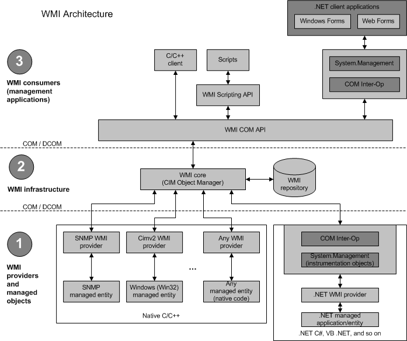

 &emsp;&emsp;WMI的全称是Windows Management Instrumentation，即Windows管理工具。它是Windows操作系统中管理数据和操作的基础模块。我们可以通过WMI脚本或者应用程序去管理本地或者远程计算机上的资源。对于VC和汇编程序员，想获取诸如CPU序列号和硬盘序列号等信息是非常容易的。但是对于VB以及其他一些脚本语言，想尝试获取系统中一些硬件信息可能就没那么容易了。微软为了能达到一种通用性目的（遵守某些行业标准），设计了WMI。**它提供了一个通过操作系统、网络和企业环境去管理本地或远程计算机的统一接口集。应用程序和脚本语言使用这套接口集去完成任务，而不是直接通过Windows API。** 可能有人要问，为什么不让设计的脚本直接在底层使用Windows API，而非要弄个新的技术呢？原因是在目前Windows API中，有些是不支持远程调用或者脚本调用的。这样通过统一模型的WMI，像VB和脚本语言就可以去访问部分系统信息了。但是并不是所有脚本语言都可以使用WMI技术：它要支持ActiveX技术。  
  
&emsp;&emsp; 那么WMI遵守的是哪个行业标准呢？是WBEM。WMI是对WBEM模型的一种实现。WBEM即Web-Based Enterprise Management，它是一个行业倡议：开发一款在企业环境下访问管理信息的标准技术。这个倡议规范了企业网络中受管资源的描述和使用。它对WMI技术影响最大是其组件CIM和MOF。CIM是Common Information Modal，即公共信息模型。MOF是Managed Object Format，即托管对象格式。WMI使用了这两个标准实现相关功能，我们将在之后的应用章节介绍它们。WBEM倡议目前已经得到微软、甲骨文、惠普等大公司的支持。  
  
&emsp;&emsp;虽然这种标准已被广泛支持，但是WMI技术可能还是鲜为人知。其实它的历史并不短暂。在Win2K之前的操作系统中，就已经支持了WMI技术，只是当时需要下载并安装一个开发包。从Win2K系统开始，系统就自带了WMI，并且WMI成为系统的一个重要组件。随着Xp、2003、Vista、Win7等的发布，WMI所能提供的功能也在不断的增强和完善中。因为增强和完善，我们将发现，在不同的系统中，调用相同的操作将会获得不同的信息（得到的子集不同），这也是影响WMI使用的一个因素。但是从技术角度说，这个不是问题。  
  
&emsp;&emsp;使用WMI技术主要分为两个大的方面：1 获取信息；2 提供数据。其中“获取信息”需要WMI Classes(以后称为WMI类)。“提供数据”需要WMI Provider(以后称为WMI提供者)。在之后的应用例子中，我将先介绍相对简单点的“获取信息”，然后再讲解稍微复杂点的“提供数据”。为什么说“获取信息”相对简单？我们就先看下WMI的构架图，下图来源为MSDN
  

&emsp;&emsp;总体看来，可以将WMI分成3层结构。我们由上而下介绍这3层结构。  

&emsp;&emsp;**WMI Consumers(WMI使用者)**  

&emsp;&emsp;它位于WMI构架的最顶层，是WMI技术使用的载体。如果我们是C++程序员，我们可以通过COM技术直接与下层通信。而脚本语言则要支持WMI Scripting API，间接与下层通信。对于.net平台语言，则要使用System.Management域相关功能与下层通信。这些WMI的使用者，可以查询、枚举数据，也可以运行Provider的方法，还可以向WMI订阅消息。当然这些数据操作都是要有相应的Provider来提供。  

&emsp;&emsp;**WMI Infrastructure(WMI基础结构)**  

&emsp;&emsp;WMI基础结构是Windows系统的系统组件。它包含两个模块：包含WMI Core(WMI核心)的**WMI Service(WMI服务)**(Winmgmt)和**WMI Repository(WMI存储库)。**  

&emsp;&emsp; WMI存储库是通过WMI Namespace(WMI命名空间)组织起来的。在系统启动时，WMI服务会创建诸如root\default、root\cimv2和root\subscription等WMI命名空间，同时会预安装一部分WMI类的定义信息到这些命名空间中。其他命名空间是在操作系统或者产品调用有关WMI提供者(WMI Provider)时才被创建出来的。简而言之，**WMI存储库是用于存储WMI静态数据的存储空间。**之后，我们将优先介绍访问WMI存储库来获取有用的信息。  

&emsp;&emsp; **WMI服务扮演着WMi提供者、管理应用和WMI存储库之间的协调者角色。**一般来说，它是通过一个共享的服务进程SVCHOST来实施工作的。当第一个管理应用向WMI命名空间发起连接时，WMI服务将会启动。当管理应用不再调用WMI时，WMI服务将会关闭或者进入低内存状态。如我们上图所示，WMI服务和上层应用之间是通过COM接口来实现的。当一个应用通过接口向WMI发起请求时，WMI将判断该请求是请求静态数据还是动态数据。如果请求的是一个静态数据，WMI将从WMI存储库中查找数据并返回；如果请求的是一个动态数据，比如一个托管对象的当前内存情况，WMI服务将请求传递给已经在WMI服务中注册的相应的WMI提供者。WMI提供者将数据返回给WMI服务，WMI服务再将结果返回给请求的应用。  

&emsp;&emsp;**Managed object and WMI providers(托管对象和WMI提供者)**  

&emsp;&emsp;WMI提供者是一个监控一个或者多个托管对象的COM接口。一个托管对象是一个逻辑或者物理组件，比如硬盘驱动器、网络适配器、数据库系统、操作系统、进程或者服务。和驱动相似，WMI提供者通过托管对象提供的数据向WMI服务提供数据，同时将WMI服务的请求传递给托管对象。  

&emsp;&emsp;从文件的角度来说，WMI提供者是由一个实现逻辑的DLL和承载着描述数据和操作的类的托管对象格式(Managed Object Format)文件组成。这个两个文件都保存在%Windir%\System32\Wbem目录下。  

&emsp;&emsp;通过以上对WMI的介绍，我想大家应该对WMI有了个初步的认识。下面我将讲解在VC中使用WMI的一些步骤，之后我会再从应用的角度讲解怎么使用WMI技术。    

&emsp;&emsp;在开发中，我们还是需要一些工具的。比如微软提供的“WMI Administrative Tools”。很可惜，我的环境下用不了其CIM Studio、Object Browser等工具。还好我找到了替代工具“WMI Explorer”。还有个工具非常重要——wbemtest（C:\Windows\System32\wbem下）。它可以用于删除我们之前注册的实例以及类，这对我们开发调试WMI Provider时非常重要。

[http://blog.csdn.net/breaksoftware/article/category/1313182](http://blog.csdn.net/breaksoftware/article/category/1313182)