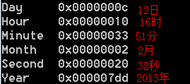
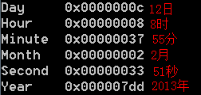
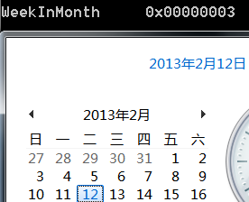

&emsp;&emsp;本文主要介绍[Win32_LocalTime](http://msdn.microsoft.com/en-us/library/windows/desktop/aa394171(v=vs.85).aspx)和[Win32_UTCTime](http://msdn.microsoft.com/en-us/library/windows/desktop/aa394510(v=vs.85).aspx)。  

&emsp;&emsp;**如何使用WMI获取本地时间？**  
```
SELECT Year,Month,Day,Hour,Minute,Second FROM Win32_LocalTime  
```
  


&emsp;&emsp;**如何使用WMI获取格林威治时间？**  
```
SELECT Year,Month,Day,Hour,Minute,Second FROM Win32_UTCTime  
```
  
&emsp;&emsp;从上面两个图可以看出，本地时间和格林威治时间相差8个小时。这个差值可以算出我们所处的时区——东八区。  

&emsp;&emsp;**如何使用WMI获取当前时间在所属月中属于第几个星期？**  
```
SELECT WeekInMonth FROM Win32_LocalTime  
```
  


&emsp;&emsp;**如何使用WMI获取当前时间是星期几？**  
```
SELECT DayOfWeek FROM Win32_LocalTime  
```
  
&emsp;&emsp;2代表是周二。
