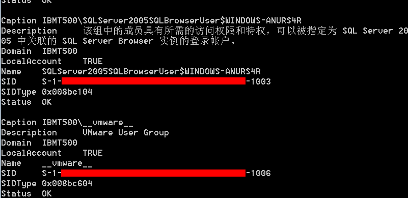
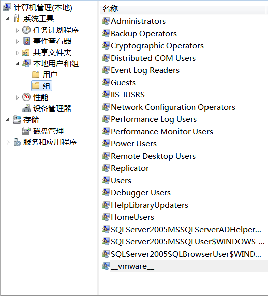
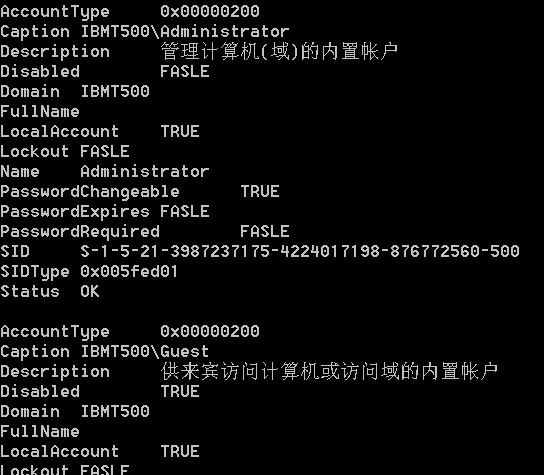

&emsp;&emsp; 本文主要介绍[Win32_Group](http://msdn.microsoft.com/en-us/library/windows/desktop/aa394151(v=vs.85).aspx)和[Win32_UserAccount](http://msdn.microsoft.com/en-us/library/windows/desktop/aa394507(v=vs.85).aspx)类。  

&emsp;&emsp;**如何使用WMI枚举所有的组内账户信息？**  
```
SELECT * FROM Win32_Group  
```
  
&emsp;&emsp;这组信息对应于系统中  
  
&emsp;&emsp;这组信息中可能有用的信息就是SID。即可以通过  
```
SELECT SID FROM Win32_Group WHERE Name = '__vmware__'  
```
  
&emsp;&emsp;查询到指定名字的组账号的SID。  


&emsp;&emsp;**如何使用WMI枚举本地用户信息？**  
```
SELECT * FROM Win32_UserAccount  
```
  

&emsp;&emsp;**如何使用WMI查询指定账号是否启用？**  
```
SELECT Disabled FROM Win32_UserAccount WHERE Name = 'Guest'  
```
  
&emsp;&emsp;这个标识我的系统中Guest账户没有被启用。  

&emsp;&emsp;**如何使用WMI查询指定账号是否需要密码？**  
```
SELECT PasswordRequired FROM Win32_UserAccount WHERE Name = 'Administrator'  
```
  
&emsp;&emsp;这标识我系统中Admin账号不需要密码。  

&emsp;&emsp;**如何使用WMI查询指定账号密码是否过期？**  
```
SELECT PasswordExpires FROM Win32_UserAccount WHERE Name = 'Administrator'  
```
  


&emsp;&emsp;**如何使用WMI查询指定账号的SID？**  
```
SELECT SID FROM Win32_UserAccount WHERE Name = 'Administrator'  
```
  
&emsp;&emsp;这个SID相对比较有实际意义。比如在注册表管理器中，`HKEY_CURRENT_USER`键对应于`HKEY_USERS`下的`S-1-5-21-3987237175-4224017198-876772560-500`子键。
