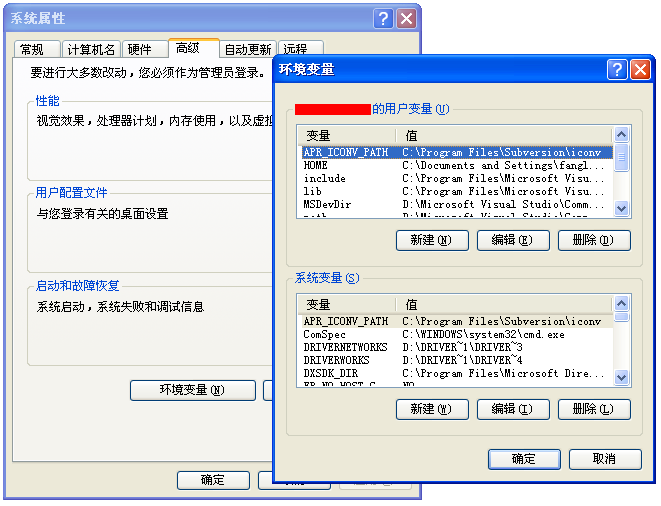
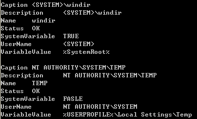
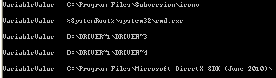

&emsp;&emsp; 我们可以通过系统属性查看当前系统和当前用户的环境变量。  
  

&emsp;&emsp; **如何使用WMI枚举所有环境变量的信息？**  
```c++
CSynQueryData recvnotify(L"root\\CIMV2",L"SELECT * FROM Win32_Environment" );  
recvnotify.ExcuteFun();  
```
  

&emsp;&emsp; **如何使用WMI获取所有系统环境变量的值？**  
&emsp;&emsp;SystemVariable属性标识该环境变量是系统变量还是用户环境变量。  
```c++
CSynQueryData recvnotify(L"root\\CIMV2",L"SELECT VariableValue FROM Win32_Environment WHERE SystemVariable = TRUE" );  
recvnotify.ExcuteFun();  
```
  

&emsp;&emsp; **如何使用WMI获取指定环境变量的值？**    
&emsp;&emsp;我们以系统环境变量中名字为TEMP的环境变量为例，来获取其对应的值。
```c++
CSynQueryData recvnotify(L"root\\CIMV2",L"SELECT VariableValue FROM Win32_Environment WHERE SystemVariable = TRUE AND Name = 'TEMP'" );  
recvnotify.ExcuteFun();  
```
  

&emsp;&emsp;更多环境变量信息可参考[Win32_Environment](http://msdn.microsoft.com/en-us/library/windows/desktop/aa394143(v=vs.85).aspx)。