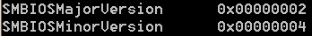
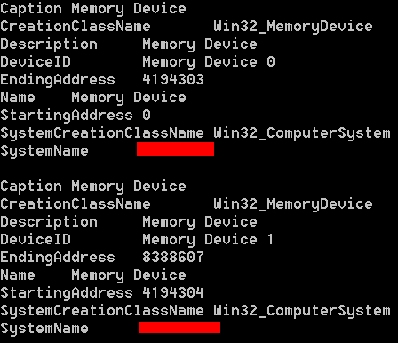
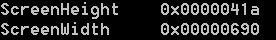
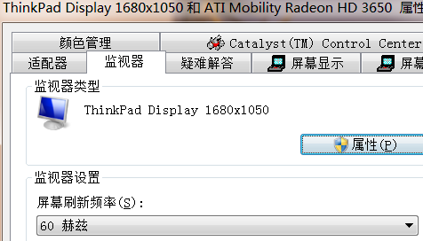
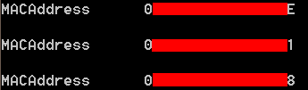
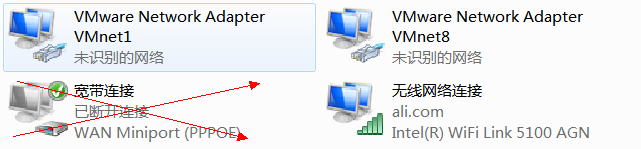

&emsp;&emsp;**查询硬盘信息**  
&emsp;&emsp;因为一台电脑上可以有多块硬盘，所以在查询硬盘信息之前，我们需要明确我们要查询哪块硬盘。其中我们将要使用到《WMI技术介绍和应用——查询磁盘分区和逻辑磁盘信息》中相关信息。本文我们将以获取系统启动盘所在的硬盘信息为例。首先我们通过  
```
SELECT DiskIndex FROM Win32_DiskPartition WHERE Bootable = TRUE    
```
  
&emsp;&emsp;查询得到系统盘所在硬盘的ID = 0。然后我们通过该ID，查询该硬盘信息。  

&emsp;&emsp;**如何使用WMI查询系统盘所在硬盘的硬盘序列号？**  
```
SELECT SerialNumber FROM Win32_DiskDrive WHERE Index = 0  
```
  
&emsp;&emsp;这儿必须要注意下，我这儿设置的Index = 0，是通过之前的查询得知系统盘所在硬盘的ID而定的，即在我的电脑上Index=0的硬盘是启动硬盘。  


&emsp;&emsp;**如何使用WMI查询系统盘所在的硬盘的接口类型？**  
```
SELECT InterfaceType FROM Win32_DiskDrive WHERE Index = 0  
```
  

&emsp;&emsp;**如何使用WMI查询系统盘所在的硬盘的名字？**  
```
SELECT Caption FROM Win32_DiskDrive WHERE Index = 0  
```
  

&emsp;&emsp;**如何使用WMI查询系统盘所在的硬盘的大小？**  
```
SELECT Size FROM Win32_DiskDrive WHERE Index = 0  
```
  
&emsp;&emsp;看这个数字，就是160G硬盘实际的byte数。注意这个是10进制数字，而我们在电脑上看到硬盘的大小为该数字除以（1024*1024*1024）。  

&emsp;&emsp;**查询主板信息**  

&emsp;&emsp;**如何使用WMI查询主板的序列号？**  
```
SELECT SerialNumber FROM Win32_BaseBoard  
```
  
  
&emsp;&emsp;**查询BIOS信息**  
&emsp;&emsp;**如何使用WMI查询BIOS的序列号？**  
```
SELECT SerialNumber FROM Win32_BIOS  
```
  


&emsp;&emsp;**如何使用WMI查询BIOS的厂商？**  
```
SELECT Manufacturer FROM Win32_BIOS 
```
  


&emsp;&emsp;**如何使用WMI查询BIOS的版本号？**  
```
SELECT SMBIOSMajorVersion,SMBIOSMinorVersion FROM Win32_BIOS  
```
  


&emsp;&emsp;**如何使用WMI查询内存信息？**  
```
SELECT * FROM Win32_MemoryDevice  
```
  


&emsp;&emsp;**查询显示器信息**  
&emsp;&emsp;**如何使用WMI查询显示器的分辨率？**  
```
SELECT ScreenHeight FROM Win32_DesktopMonitor  
```
  


&emsp;&emsp;**如何使用WMI查询屏幕刷新频率？**  
```
SELECT DisplayFrequency FROM Win32_DisplayConfiguration  
```
  
  

&emsp;&emsp;**查询网络适配器**  
&emsp;&emsp;**如何使用WMI查询处于活动状态的网卡MAC地址？**  
```
SELECT MACAddress FROM Win32_NetworkAdapter WHERE NetEnabled = 'TRUE'  
```
  
&emsp;&emsp;可以见得我这儿有三个处于活动状态的网卡，其对应于  
  
&emsp;&emsp;如果想排除VM虚拟出来的网卡，可以通过厂商名字限制。  


&emsp;&emsp;**查询CPU信息**  
&emsp;&emsp;**如何使用WMI查询CPU的序列号？**  
```
SELECT ProcessorId FROM Win32_Processor  
```
  

&emsp;&emsp;**如何使用WMI查询CPU的名称？**  
```
SELECT Name FROM Win32_Processor  
```
  

&emsp;&emsp;**如何使用WMI查询有几个物理核心和几个逻辑核心？**  
```
SELECT NumberOfCores,NumberOfLogicalProcessors FROM Win32_Processor  
```
  
&emsp;&emsp; 这个数据说明T9400是双核双线程CPU。  


&emsp;&emsp;**如何使用WMI判断当前系统是32位系统还是64位系统？**  
```
SELECT AddressWidth FROM Win32_Processor  
```
  
&emsp;&emsp;这个证明我当前系统是64位系统。  


&emsp;&emsp;**如何使用WMI获取CPU构架？**  
```
SELECT Architecture FROM Win32_Processor  
```
  
&emsp;&emsp; 该值表明T9400是x64构架CPU。    
| Value	 | Meaning |
| 0 | x86 |  
| 1 | MIPS |  
| 2 | Alpha |  
| 3 | PowerPC |  
| 5 | ARM |  
| 6 | Itanium-based systems |  
| 9 | x64 |  


&emsp;&emsp;**如何使用WMI查询CPU的外频？**  
```
SELECT ExtClock FROM Win32_Processor 
```
  
&emsp;&emsp;单位是MHz。即266MHz。  


&emsp;&emsp;**如何使用WMI查询CPU的主频？**  
```
SELECT CurrentClockSpeed FROM Win32_Processor 
```
  
&emsp;&emsp;单位是MHz。即2.534GHz。  
&emsp;&emsp;至此，使用WMI查询的内容就讲完了。之后我将讲解如何使用WMI监听事件，这也是个非常强大和有趣的功能，我们拭目以待吧。


