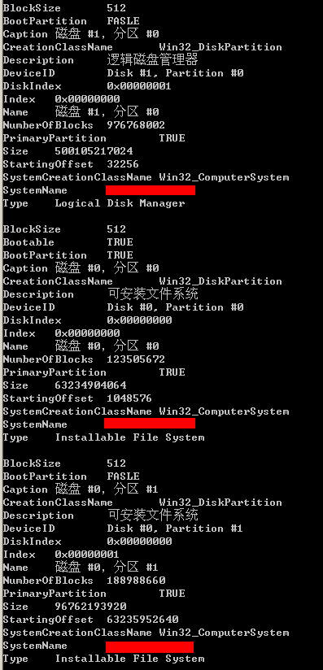
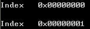
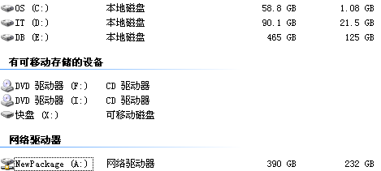
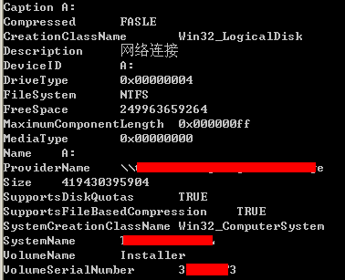
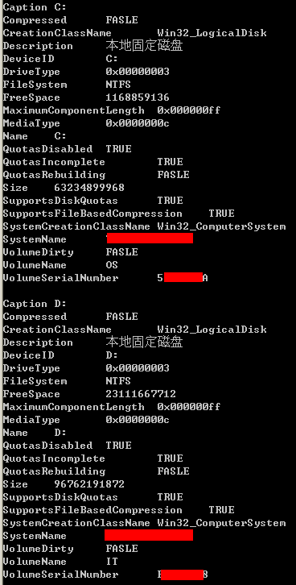
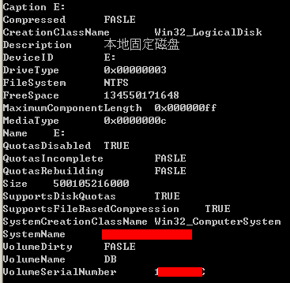
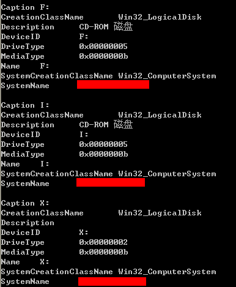

&emsp;&emsp;本节主要介绍[Win32_DiskPartition](http://msdn.microsoft.com/en-us/library/windows/desktop/aa394135(v=vs.85).aspx)和[Win32_LogicalDisk](http://msdn.microsoft.com/en-us/library/windows/desktop/aa394173(v=vs.85).aspx)两个类的应用。Win32_DiskPartition用于查询磁盘分区信息，Win32_LogicalDisk用于查询逻辑磁盘信息。  
  
&emsp;&emsp;**如何使用WMI枚举所有磁盘分区信息？**  
```
SELECT * FROM Win32_DiskPartition
```
  
&emsp;&emsp;以上是我查询我本机的信息。在我这台电脑上，装有两块硬盘，其中第二块安装上去的硬盘是500G，它的信息由上图第一组数据体现。第一款硬盘是160G，被分成60G的系统盘和90G的普通盘。其中系统盘信息由上图中第二组数据体现，而90G的逻辑盘由上图中最后一组数据体现。现在我们将拆开这些信息，讲解如何利用这些信息。  
  
&emsp;&emsp;**如何使用WMI获取系统启动盘所在的硬盘ID（非序列号）？**  
```
SELECT DiskIndex FROM Win32_DiskPartition WHERE Bootable = TRUE  
```
  
&emsp;&emsp;在装有多块硬盘的机器上，这个功能很重要。比如我们想尝试获取一个硬盘序列号，来作为计算用户唯一码的因子，此时获取一个固定的硬盘ID就很重要了。因为插拔硬盘的原因，WMI枚举到的第一个硬盘信息是不确定的。  

&emsp;&emsp;**如何使用WMI查询指定磁盘上有多少分区？**  
```
SELECT Index FROM Win32_DiskPartition WHERE DiskIndex = 0  
```
  
&emsp;&emsp;这标志该磁盘有两个分区。  

&emsp;&emsp;**如何使用WMI获取指定分区的大小？**  
```
SELECT Size FROM Win32_DiskPartition WHERE DiskIndex = 1 AND Index = 0  
```
  
&emsp;&emsp;该大小是以BYTES为单位的。  

&emsp;&emsp;**如何使用WMI获取指定分区上有多少块（BLOCK）及每块的大小？**
```
SELECT BlockSize,NumberOfBlocks FROM Win32_DiskPartition WHERE DiskIndex = 1 AND Index = 0 
```
  
&emsp;&emsp;这两个数值的积就是该磁盘的Size大小。  
  
&emsp;&emsp;**如何使用WMI枚举所有逻辑磁盘信息？**  
```
SELECT * FROM Win32_LogicalDisk  
```
&emsp;&emsp;目前我电脑上有如下逻辑磁盘  

  
&emsp;&emsp;其中A盘，是一个网络映射磁盘。它的信息是  
  

&emsp;&emsp;C、D盘是在一块硬盘上，它们的信息是  
  

&emsp;&emsp; E盘是在另一个独立的硬盘上，它的信息是  
  

&emsp;&emsp;其他磁盘的信息是：  


&emsp;&emsp;**如何使用WMI查询指定盘符的逻辑磁盘名？**  
```
SELECT VolumeName FROM Win32_LogicalDisk WHERE NAME = 'C:'  
```
  

&emsp;&emsp;**如何使用WMI查询指定盘符的逻辑磁盘类型？**  
```
SELECT DriveType FROM Win32_LogicalDisk WHERE NAME = 'C:'  
```
  
&emsp;&emsp;一般来说，逻辑磁盘可以分为：网络映射磁盘、本地磁盘和移动磁盘。如我电脑上A盘的类型就是4，CDE盘的类型是3，FI盘（光驱）的类型是5。有个特例，我电脑上的金山快盘是标记为2（移动磁盘类型）。它们具体的对应关系是  
| Value | Meaning |
| --- | --- |
| 0 | Unknown |
| 1 | No Root Directory |  
| 2 | Removable Disk |  
| 3 | Local Disk |  
| 4 | Network Drive |  
| 5 | Compact Disc |  
| 6 | RAM Disk |  

&emsp;&emsp;**如何使用WMI查询指定盘符的分区空间和剩余空间？**  
```
SELECT Size,FreeSpace FROM Win32_LogicalDisk WHERE NAME = 'C:'
```
  

&emsp;&emsp;**如何使用WMI查询指定盘符的分区的文件系统类型？**  
```
SELECT FileSystem FROM Win32_LogicalDisk WHERE NAME = 'C:'  
```
  

&emsp;&emsp;**如何使用WMI查询指定盘符的分区的序列号（非硬盘序列号）？**  
```
SELECT VolumeSerialNumber FROM Win32_LogicalDisk WHERE NAME = 'C:'  
```
