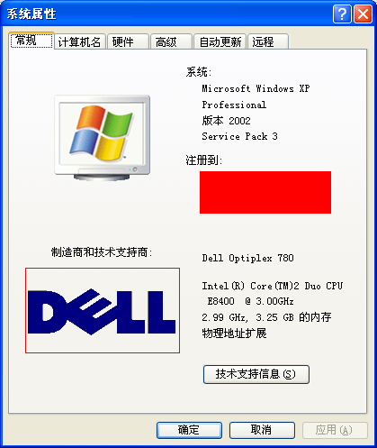
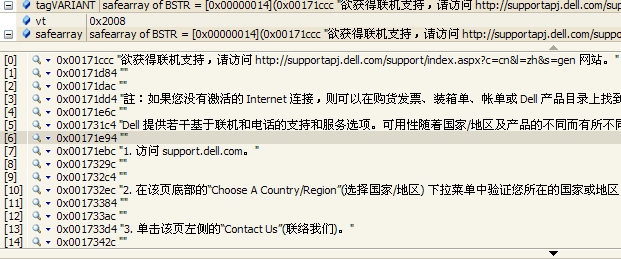
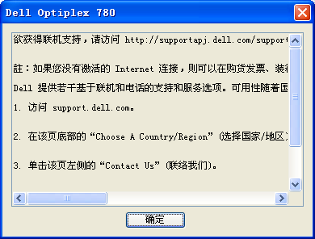

&emsp;&emsp;本机主要知识点是[Win32_ComputerSystem](http://msdn.microsoft.com/en-us/library/windows/desktop/aa394102(v=vs.85).aspx)类。通过该类我们将可以获取部分系统设置。  

&emsp;&emsp;**如何使用WMI查询是否开启了系统硬件安全设置密码？**  
```
SELECT AdminPasswordStatus FROM Win32_ComputerSystem  
```
  
&emsp;&emsp;我们开启了系统硬件安全设置密码，我们要修改BOIS信息将要求输入密码。这个功能一般很少用到。我电脑上没有设置这个密码，所以返回值是1。它其他值的解释是  
| Value | Meaning |
| --- | --- |
| 1 (0x1) | Disabled |
| 2 (0x2) | Enabled |  
| 3 (0x3) | Not Implemented |  
| 4 (0x4) | Unknown |  

&emsp;&emsp;**如何使用WMI查询当前系统的启动方式？**  
```
SELECT BootupState FROM Win32_ComputerSystem  
```
  
&emsp;&emsp;一般情况下，我们都是正常启动系统的。但是如果我们系统出现问题，比如上次电脑是意外关闭的，我们往往会看到Windows会让我们选择启动方式：正常启动（Normal boot）、安全模式启动（Fail-safe boot）、带网络的安全模式启动（Fail-safe with network boot）等。如果我们想知道本次电脑的启动方式，就可以使用这个方法查询到。同时，我们可以由此推断，在安全模式下，WMI也是可以使用的。  
  
&emsp;&emsp;**如何使用WMI查询当前系统所属的域？**
```
SELECT Domain FROM Win32_ComputerSystem  
```
  
&emsp;&emsp;我们在公司的环境下登录某个特定的环境，这个环境可能属于某个域。如果当前系统不在任何域中，则这个查询将返回工作组（WorkGroup）名字。那怎么辨别呢，我们看下面一个查询。  

&emsp;&emsp;**如何使用WMI查询当前系统是否属于某个域？**  
```
SELECT PartOfDomain FROM Win32_ComputerSystem  
```
  

&emsp;&emsp;**如何使用WMI查询当前系统属于哪个工作组？**  
```
SELECT Workgroup FROM Win32_ComputerSystem 
```
  
&emsp;&emsp;如果通过对PartOfDomain的查询得出FALSE的答案，则可以查询Workgroup字段，查看该系统属于哪个工作组。  

&emsp;&emsp;**如何使用WMI查询当前系统属于域或工作组中属于什么角色？**  
```
SELECT DomainRole FROM Win32_ComputerSystem  
```
  
&emsp;&emsp;这个字段的个释义是  
| Value | Meaning |
| --- | --- |  
| 0 (0x0) | Standalone Workstation |  
| 1 (0x1) | Member Workstation |
| 2 (0x2) | Standalone Server |  
| 3 (0x3) | Member Server |  
| 4 (0x4) | Backup Domain Controller |  
| 5 (0x5) | Primary Domain Controller |  

&emsp;&emsp;**如何使用WMI查询是否有红外端口？**  
```
SELECT InfraredSupported FROM Win32_ComputerSystem  
```
  
&emsp;&emsp;FALSE代表我电脑上没有红外端口，反之返回的是TRUE。  

&emsp;&emsp;**如何使用WMI查询是否设置了键盘密码（Keyboard Password）?**  
```
SELECT KeyboardPasswordStatus FROM Win32_ComputerSystem  
```
&emsp;&emsp;它的值的释义是  
| Value | Meaning |
| --- | --- |  
| 0 (0x0) | Disabled |  
| 1 (0x1) | Enabled |
| 2 (0x2) | Not Implemented |  
| 3 (0x3) | Unknown |  

&emsp;&emsp;**如何使用WMI查询当前电脑的制造商信息？**  
```
SELECT Manufacturer FROM Win32_ComputerSystem  
```
  
&emsp;&emsp;如果是组装电脑，该条信息返回的是主板厂商名称。  


&emsp;&emsp;**如何使用WMI查询当前电脑的产品名称？**  
```
SELECT Model FROM Win32_ComputerSystem 
```
  
&emsp;&emsp;结合以上信息，可以知道我电脑是Dell的OptiPlex 780。如果是组装电脑，该条数据将返回主板型号。   


&emsp;&emsp;**如何使用WMI查询当前系统的是否开启了网络服务模式？**  
```
SELECT NetworkServerModeEnabled FROM Win32_ComputerSystem  
```
  

&emsp;&emsp;**如何使用WMI获取当前系统类型？**  
```
SELECT SystemType FROM Win32_ComputerSystem 
```
  
&emsp;&emsp;以上值说明当前系统是X86体系的系统。它还可能是："x64-based PC"、"X86-based PC"、"MIPS-based PC"、"Alpha-based PC"、"Power PC"、"SH-x PC"、"StrongARM PC"、"64-bit Intel PC"、"64-bit Alpha PC"、"Unknown"、"X86-Nec98 PC"。  


&emsp;&emsp;**如何使用WMI查询当前电脑的物理内存大小？**  
```
SELECT TotalPhysicalMemory FROM Win32_ComputerSystem 
```
  
&emsp;&emsp; 该大小是以Bytes为单位的。  


&emsp;&emsp;**如何使用WMI获取OEM厂商的Logo？**  
```
SELECT OEMLogoBitmap FROM Win32_ComputerSystem  
```
  
&emsp;&emsp;这段内存信息可以见得是一个BMP文件。它就是  
  


&emsp;&emsp;**如何使用WMI获得上图中“技术支持信息”按钮点开后的信息？**  
```
SELECT SupportContactDescription FROM Win32_ComputerSystem  
```
  
  


&emsp;&emsp;**如何使用WMI查询是否设置了开机密码？**  
```
SELECT PowerOnPasswordStatus FROM Win32_ComputerSystem  
```
  
&emsp;&emsp;如果设置了开机密码，我们开机后，会进入黑屏，让我们输入密码。如果密码输入错了就不会启动系统。一般鲜见设置这个密码。它的释义是  
| Value | Meaning |
| --- | --- |  
| 0 (0x0) | Disabled |  
| 1 (0x1) | Enabled |
| 2 (0x2) | Not Implemented |  
| 3 (0x3) | Unknown |    


&emsp;&emsp;**如何使用WMI查询电脑是笔记本还是台式机？**  
```
SELECT PCSystemType FROM Win32_ComputerSystem 
```
  
&emsp;&emsp;该属性只有在XP以上的系统中可以使用。它的释义是  
| Value | Meaning |
| --- | --- |  
| 0 (0x0) | Unspecified |  
| 1 (0x1) | Desktop |
| 2 (0x2) | Mobile |  
| 3 (0x3) | Workstation |  
| 4 (0x4) | Enterprise Server |  
| 5 (0x5) | Small Office and Home Office (SOHO) Server |  
| 6 (0x6) | Appliance PC |    
| 7 (0x7) | Performance Server |    
| 8 (0x8) | Maximum |     
