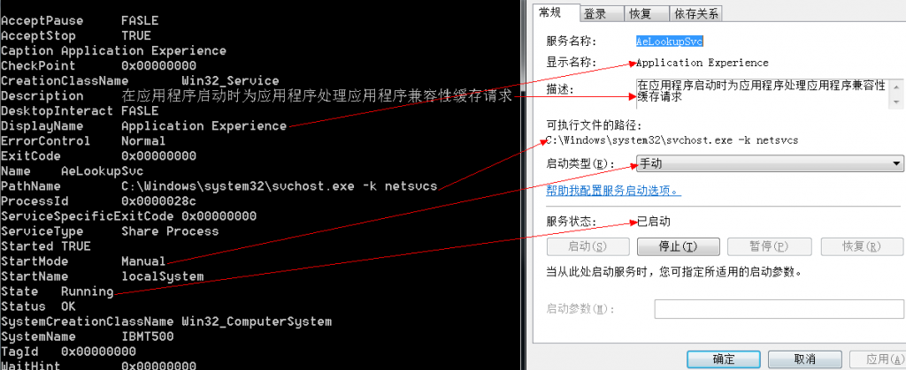

&emsp;&emsp;本文主要介绍[Win32_Service](http://msdn.microsoft.com/en-us/library/windows/desktop/aa394418(v=vs.85).aspx)类。  

&emsp;&emsp;**如何使用WMI枚举系统中的服务？**  
```
SELECT * FROM Win32_Service  
```
&emsp;&emsp;我们以Application Experience服务为例，介绍各对应关系。  
  

&emsp;&emsp;**如何使用WMI查询指定服务是否已经开启？**  
```
SELECT State FROM Win32_Service WHERE Name = 'AeLookupSvc'  
```
  


&emsp;&emsp;**如何使用WMI查询指定服务对应的进程ID？**  
```
SELECT ProcessID FROM Win32_Service WHERE Name = 'AeLookupSvc'  
```
