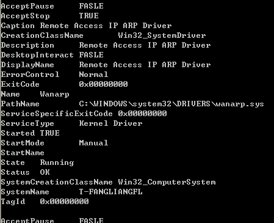
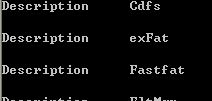

&emsp;&emsp;**如何使用WMI查询所有驱动信息？**  
```c++
CSynQueryData recvnotify(L"root\\CIMV2",L"SELECT * FROM Win32_SystemDriver" );  
recvnotify.ExcuteFun();  
```
  

&emsp;&emsp;**如何使用WMI查询指定驱动服务是否可以暂停？**    
```c++
CSynQueryData recvnotify(L"root\\CIMV2",L"SELECT AcceptPause FROM Win32_SystemDriver WHERE NAME = 'wanarp'" );  
recvnotify.ExcuteFun();  
```
  
&emsp;&emsp;可以见得我们指定的驱动服务不允许暂停。我发现我当前系统中没有哪个驱动服务可以暂停。  


&emsp;&emsp;**如何使用WMI查询指定驱动服务是否可以终止？**  
```c++
CSynQueryData recvnotify(L"root\\CIMV2",L"SELECT AcceptStop FROM Win32_SystemDriver WHERE NAME = 'wanarp'" );  
recvnotify.ExcuteFun();  
```
  
&emsp;&emsp; wanarp这个驱动服务是可以终止的，但是系统中海油很多不可以终止的驱动服务，比如usbscan（USB 扫描仪驱动程序）和usbstor（USB 大容量存储设备）等。  

&emsp;&emsp;**如何使用WMI查询指定驱动服务是否可以创建桌面窗口或者和桌面窗口通信？**  
```c++
CSynQueryData recvnotify(L"root\\CIMV2",L"SELECT DesktopInteract FROM Win32_SystemDriver WHERE NAME = 'wanarp'" );  
recvnotify.ExcuteFun();  
```
  
&emsp;&emsp;我枚举了下我当前的环境，没有发现该属性为TRUE的。
  
&emsp;&emsp;**如何使用WMI查询指定驱动服务的驱动文件路径？**   
```c++
CSynQueryData recvnotify(L"root\\CIMV2",L"SELECT PathName FROM Win32_SystemDriver WHERE NAME = 'wanarp'" );  
recvnotify.ExcuteFun();  
```
  

&emsp;&emsp;**如何使用WMI枚举所有文件系统驱动？**  
```c++
CSynQueryData recvnotify(L"root\\CIMV2",L"SELECT Description FROM Win32_SystemDriver WHERE ServiceType = 'File System Driver'" );  
recvnotify.ExcuteFun();  
```
  
&emsp;&emsp;该服务是什么类型，是由启动程序决定的。ServiceType的可选值有："Kernel Driver"、"File System Driver"、"Adapter"、"Recognizer Driver"、"Own Process"、"Share Process"和"Interactive Process"。  

&emsp;&emsp;**如何使用WMI判断指定驱动服务是否启动？**  
```c++
CSynQueryData recvnotify(L"root\\CIMV2",L"SELECT Started FROM Win32_SystemDriver WHERE NAME = 'wanarp'" );  
recvnotify.ExcuteFun();  
```
  

&emsp;&emsp;**如何使用WMI查询指定驱动服务的状态？**  
```c++
CSynQueryData recvnotify(L"root\\CIMV2",L"SELECT State FROM Win32_SystemDriver WHERE NAME = 'wanarp'" );  
recvnotify.ExcuteFun();  
```
  
&emsp;&emsp;State值还可以是："Stopped"、"Start Pending"、"Stop Pending"、"Running"、"Continue Pending"、"Pause Pending"、"Paused"和"Unknown"。  
  
&emsp;&emsp;**如何使用WMI查询指定驱动服务的启动方式？**  
```c++
CSynQueryData recvnotify(L"root\\CIMV2",L"SELECT StartMode FROM Win32_SystemDriver WHERE NAME = 'wanarp'" );  
recvnotify.ExcuteFun();  
```
  
  
&emsp;&emsp; 很有意思的一点时，截止到2013年1月9日，MSDN上对该字段的描述使用的是对ErrorControl属性的描述。MSDN也有如此低级的错误！我遍历了下系统，发现该属性可以有以下的值：System、Boot、Manual、Disabled和Auto。  

&emsp;&emsp;更多信息可参考[Win32_SystemDriver](http://msdn.microsoft.com/en-us/library/windows/desktop/aa394472(v=vs.85).aspx).