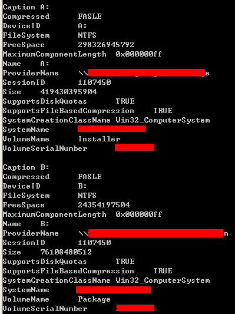
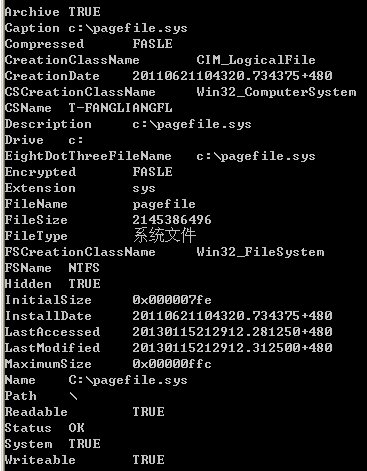
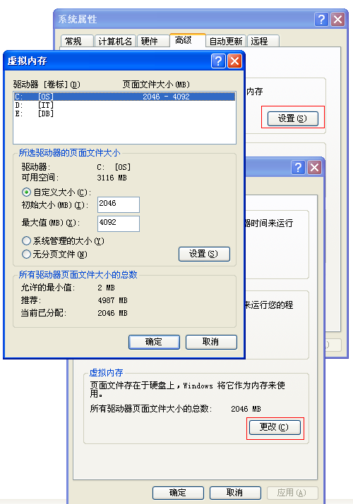
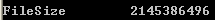
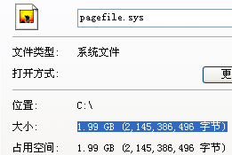
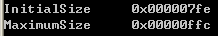

&emsp;&emsp;因为将要介绍的三个模块都比较简单，故将这三者合并在一起介绍。查询快捷方式信息是使用[Win32_ShortcutFile](http://msdn.microsoft.com/en-us/library/windows/desktop/aa394438(v=vs.85).aspx)类；查询映射磁盘信息是使用[Win32_MappedLogicalDisk](http://msdn.microsoft.com/en-us/library/windows/desktop/aa394194(v=vs.85).aspx)类；查询虚拟内存是使用[Win32_PageFile](http://msdn.microsoft.com/en-us/library/windows/desktop/aa394243(v=vs.85).aspx)、[Win32_PageFileSetting](http://msdn.microsoft.com/en-us/library/windows/desktop/aa394245(v=vs.85).aspx)和[Win32_PageFileUsage](http://msdn.microsoft.com/en-us/library/windows/desktop/aa394246(v=vs.85).aspx)类  

&emsp;&emsp;**如何使用WMI枚举电脑上所有快捷方式？**  
```
SELECT * FROM Win32_ShortcutFile  
```
&emsp;&emsp;查询的信息很多，我不列出。  
  
&emsp;&emsp;**如何使用WMI查询指定快捷方式所指向的运行文件路径？**  
```
SELECT Target FROM Win32_ShortcutFile WHERE Name = 'D:\\\\Tencent\\\\QQ\\\\Bin\\\\QQProtect\\\\Bin\\\\QQProtect.lnk'  
```
  
&emsp;&emsp;其他Win32_ShortcutFile属性，基本就是文件大小、最后修改时间等文件类型的属性。本节不再赘述。  

&emsp;&emsp;**如何使用WMI枚举所有映射的磁盘信息？**  
```
SELECT * FROM Win32_MappedLogicalDisk  
```
  
&emsp;&emsp;我在我的电脑上映射了两个磁盘。有多少个映射磁盘，就有多少组数据。  
  
&emsp;&emsp;**如何使用WMI查询指定的映射磁盘的映射地址？**  
```
SELECT ProviderName FROM Win32_MappedLogicalDisk WHERE Name = 'B:'  
```
  

&emsp;&emsp;**如何使用WMI查询指定的映射磁盘的大小？**  
```
SELECT Size FROM Win32_MappedLogicalDisk WHERE Name = 'B:'  
```
  
&emsp;&emsp; 该大小是以Bytes为单位的。  

&emsp;&emsp;**如何使用WMI枚举系统中所有分页文件信息？**  
```
SELECT * FROM Win32_PageFile  
```
  
&emsp;&emsp;我这台电脑上只有一个盘有分页文件。  
  

&emsp;&emsp;**如何使用WMI查询指定磁盘上分页文件路径？**  
```
SELECT Name FROM Win32_PageFile WHERE Drive = 'c:'  
```
  

&emsp;&emsp;**如何使用WMI查询指定磁盘上分页文件占用的空间？**  
```
SELECT FileSize FROM Win32_PageFile WHERE Drive = 'c:'  
```
   
  

&emsp;&emsp;**如何使用WMI查询指定分页文件的初始大小和最大值？**  
```
SELECT InitialSize,MaximumSize FROM Win32_PageFileSetting WHERE Name = 'C:\\\\pagefile.sys'
```
  
&emsp;&emsp;这两个值是以MB为单位的。对应于之前图中的2046和4092。