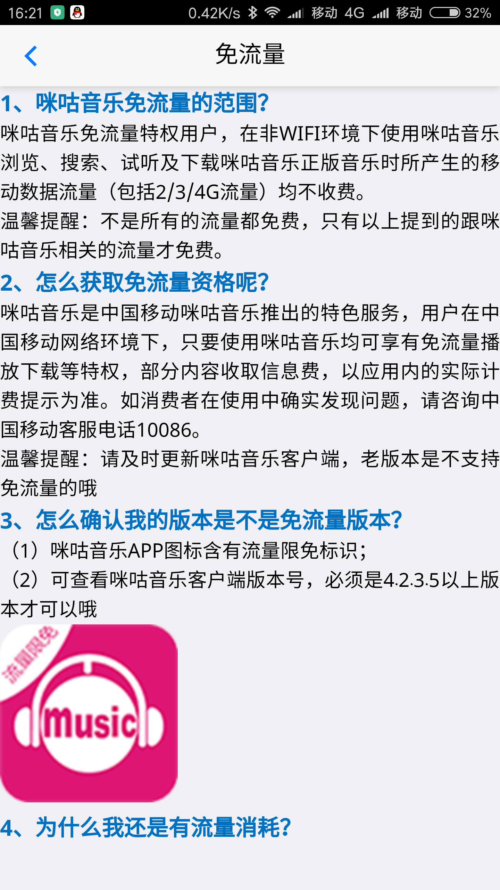
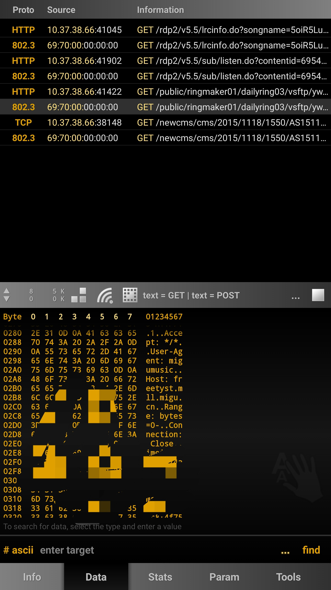
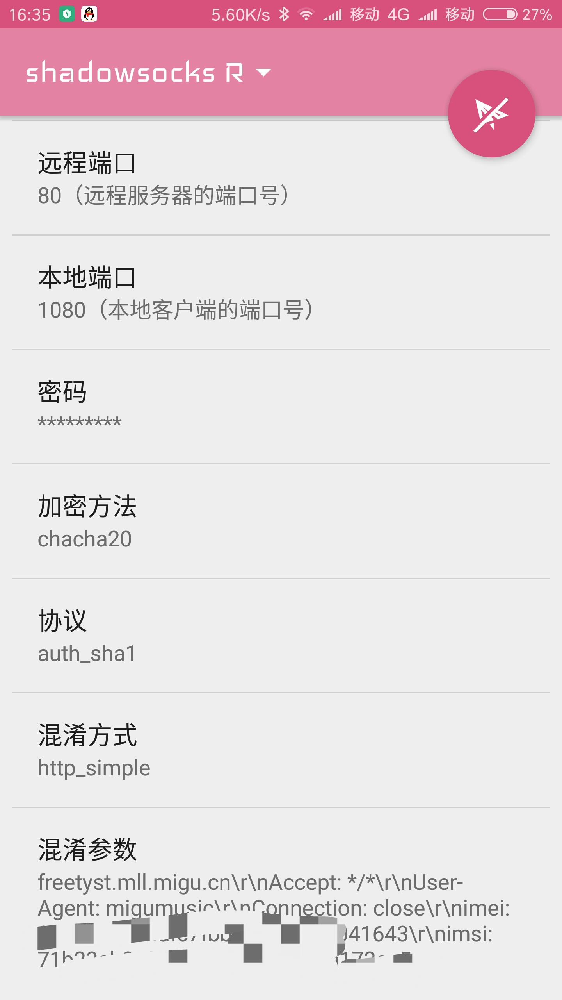
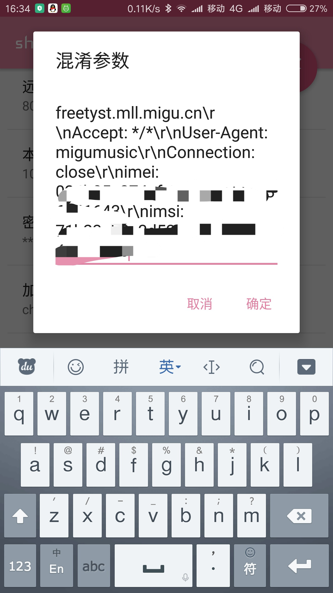
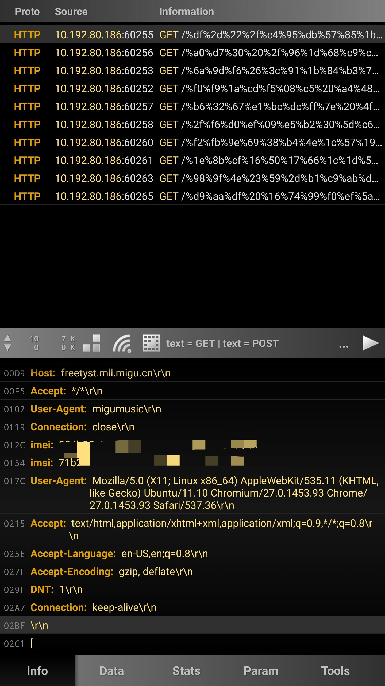
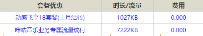

&emsp;&emsp;**免流常见原理**
1. 修改HTTP连接header:  
&emsp;&emsp;这里需要了解运营商如何分辨手机走的流量是否为免流流量,目前采用的多是检查HTTP header,查看是否是指定的Host、UA等,具体免流方法为将手机流量中,每一个HTTP请求中,均加入能够免流的Host、UA、或者其他一些免流参数即可.  
2. 指定端口免流:  
&emsp;&emsp;这个是比较早期的免流方法,目前在大多数地区均不可用,原理为使用ss、vpn等工具,通过指定的端口,如137/138/139等端口,即可免流.  
&emsp;&emsp;注：此方法中使用的免流代码已失效
&emsp;&emsp;**实战**  
1. 找到一款能够免流量费用的软件(直接使用即可免流量或者开通指定套餐免流量均可),或者网址.我这里找到的是咪咕音乐介绍中写了有免流量,实际测试发现确实是免流量的.  
  

2. 抓取数据包,打开咪咕音乐,播放音乐,使用wi.cap进行抓包,结果如图所示.  
  

&emsp;&emsp;可以看到有Host、Accept、User-Agent、Connection、imei、imsi等header.  
3. 使用可以手工构造HTTP header的,类似于HTTP/HTTPS协议的vpn软件,如openvpn、ssr等,这里我使用的是ssr.搭建ssr服务器,搭建时注意ss服务器端口和咪咕音乐服务器端口一致,这里是80端口,协议选择auth_sha1,混淆方式使用http_simple.这里我使用了一段网上搭建ssr的脚本,可以直接`wget http://vpn.ximcx.cn/SSR/SSR & bash SSR`使用.脚本内容为  
 
4.  搭建好后在手机端进行设置.  
  

  

&emsp;&emsp;使用的混淆代码如下
```c++
freetyst.mll.migu.cn\r\nAccept: */*\r\nUser-Agent: migumusic\r\nConnection: close\r\nimei: 000000000000000000\r\nimsi: 00000000000000000000
```
&emsp;&emsp; 使用openvpn的话，免流代码如下  
```vpn
http-proxy-option EXT1 "GET http://migumovie.lovev.com"
http-proxy-option EXT1 "Host: freetyst.mll.migu.cn"
http-proxy-option EXT1 "Accept: */*"
http-proxy-option EXT1 "User-Agent: migumusic"
http-proxy-option EXT1 "Connection: close"
http-proxy 10.0.0.172 80
```
&emsp;&emsp;最后的10.0.0.172 80是移动的HTTP代理服务器,也可以自己搭建HTTP代理服务器,然后修改10.0.0.172为自己的代理服务器  
5. 手机上开启ss，抓包查看  
  
&emsp;&emsp;移动网上营业厅截图  
  

&emsp;&emsp;**总结**  
&emsp;&emsp;这里免流的核心其实就是找到一个移动运营商允许的可以免流量使用的软件
而手机流量通过移动运行商时,移动运行商会检查数据包中有没有不收取流量的数据包
检查方法基本是使用的HTTP header中的关键字
因此,只需要找到检测的关键字,把手机上发出的每一个数据包都带上这个关键字,就可以免流了
同理,如果需要手机开热点出来给电脑用,也是一样的,只要发出的数据包带有这个关键字,就能免流
以上方法为HTTP协议的免流,如果发现某个软件使用的tcp等协议,也可以分析包里的特征,实现免流
如果使用的免流服务器为国外的服务器，当流量太大时,可能会被gfw干掉,另外据说有人使用国外服务器免流,被运营商发现过,真伪未知
