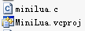
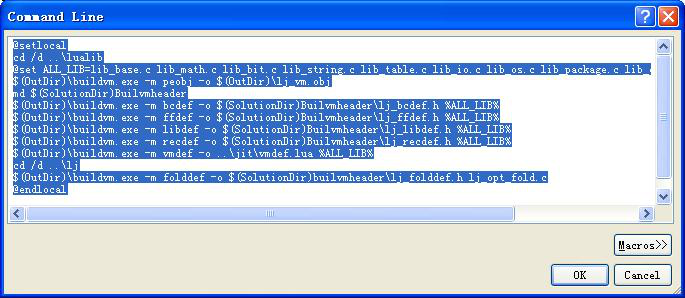
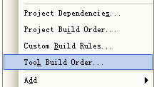
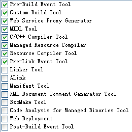

&emsp;&emsp;前些天听到一个需求：某业务方需要我们帮忙清理用户电脑上的一些废弃文件。同事完成这个逻辑的方案便是在我们程序中加入了一个很“独立”的业务逻辑：检索和删除某个程序产生的废弃文件。试想，该“独立”的逻辑之后会如何？被删掉？一直保留着？不管如何，这都意味着我们代码需要做修改，我们生成的二进制文件将产生差异，我们要为了这个需求要发一次版本。想一想客户端升级这样一个漫长且耗流量的过程，我甚至认为为了这么一个需求去浪费这些非常不值得。那么有没有一种比较好的办法，让我们不修改代码，不发布版本就能完成这样的“一次性”需求呢？当然有！是否记得若干年前，某个大公司和某个大公司吵架，当时那位新上任的CEO说某某公司可以“云暗杀”。且这种“暗杀”是一次性的，做完后可以销毁证据，且非常难以捕捉。我没有考究这个说法，但是从技术层面来说，这样的技术可以说并不复杂。那如何实现呢？就是本系列文章中讨论的：在程序中嵌入Lua脚本引擎。  

&emsp;&emsp;首先简要介绍下Lua。它是巴西里约热内卢某高校发明的一种轻量级脚本语言。设计该语言的目标是：要成为一个很容易嵌入其它语言中使用的语言。由于“轻量级”和“易嵌入”这两个特性，会减少我们内嵌其的代价，这也是我选择它的最主要原因。至于稳定性，我无法评说，但是目前很多游戏中都内嵌了lua的脚本引擎，其中不乏《魔兽世界》这样的大作。我觉得像这样的产品都选用Lua，那么至少证明Lua的安全和稳定性还是非常可靠的。  

&emsp;&emsp;Luajit是Lua的一个即时编译器，它就是我们要内嵌windows程序的目标。http://luajit.org/是它的官方网站，我们可以从它的子页面得到源码。我正式准备该系列文章的时间是2012年11月份，此时2.0beta11已经发布。我决定以这个最新的源码作为我们的例子。  


&emsp;&emsp;**下载**  
&emsp;&emsp;[ http://luajit.org/download/LuaJIT-2.0.0-beta11.zip]( http://luajit.org/download/LuaJIT-2.0.0-beta11.zip)  
&emsp;&emsp;**目录结构**  
  

&emsp;&emsp;**编译**  
&emsp;&emsp;在http://luajit.org/install.html#windows里有详细的说明，我们只要在使用VS的Command Prompt中定位到src目录，然后执行msvcbuild.bat。  
&emsp;&emsp;**VS IDE编译Luajit**  
&emsp;&emsp;如此便编译成功了。但是，往往我们的工程不是用批处理文件编译的，而是用IDE。本文主要就是说明如何将该批处理文件转换为IDE编译环境。这个操作的过程将拆分各个编译和链接过程，在这个过程中，我们将发现Luajit的生成过程，这将有助于我们之后对Luajit的改造。  
&emsp;&emsp;总体来说，Luajit的编译和链接分为3个大部分：  
1. 生成minilua程序。利用minilua产生一些文件。  
2. 使用minilua产生的一些文件生成buildvm程序。使用buildvm产生一些文件。  
3. 使用buildvm产生的一些文件生成lua程序。  
&emsp;&emsp;**编译环境准备**  
&emsp;&emsp;在msvcbuild.bat中有这么一段设置编译环境的  
```bash
@set LJCOMPILE=cl /nologo /c /MD /O2 /W3 /D_CRT_SECURE_NO_DEPRECATE  
```
&emsp;&emsp;其中非常关键的一个选项是/02，它对应于“工程属性”中Configuration Properties->C/C++->Optimization->Optimization的Maximize Speed(/O2)。设置该属性后，还要设置Configuration Properties->C/C++->Debug Information Format为Program Database(/Zi)。这个设置非常重要，否则会报很多错误。我说的这些设置是针对All Configurations的，这样在debug和release下编译和链接才不会有问题。  
&emsp;&emsp;**编译MiniLua辅助程序**  
&emsp;&emsp;在批处理中有  
```bash
%LJCOMPILE% host\minilua.c  
@if errorlevel 1 goto :BAD  
%LJLINK% /out:minilua.exe minilua.obj  
@if errorlevel 1 goto :BAD  
if exist minilua.exe.manifest^  
  %LJMT% -manifest minilua.exe.manifest -outputresource:minilua.exe  
```
&emsp;&emsp;于是我们要在项目中新建一个空的console工程，并命名为MiniLua。我们将该工程需要的文件host\minilua.c放入工程目录，同时加入工程。编译生成MiniLua.exe。  
  

&emsp;&emsp;Minilua是用于根据平台来生成平台相关的代码。这些生成的代码将在之后创建的Buildvm工程中使用到。  
&emsp;&emsp;**编译Buildvm辅助程序**  
&emsp;&emsp;在批处理中有  
```bash
%LJCOMPILE% /I "." /I %DASMDIR% host\buildvm*.c  
@if errorlevel 1 goto :BAD  
%LJLINK% /out:buildvm.exe buildvm*.obj  
@if errorlevel 1 goto :BAD  
if exist buildvm.exe.manifest^  
  %LJMT% -manifest buildvm.exe.manifest -outputresource:buildvm.exe  
```
&emsp;&emsp;我们新建一个空的Console程序，并命名为Buildvm。再将host下所有以buildvm开头的文件拷贝进入该工程目录（buildvm_peobj.c、buildvm_lib.c、buildvm_fold.c、buildvm_asm.c、buildvm.h、buildvm.c），并将其加入工程。  
&emsp;&emsp;其实只有这些是不够的，我们之前提过：MiniLua是用于生成Buildvm需要的文件。  
```bash
@set DASMFLAGS=-D WIN -D JIT -D FFI -D P64  
@set LJARCH=x64  
@minilua  
@if errorlevel 8 goto :X64  
@set DASMFLAGS=-D WIN -D JIT -D FFI  
@set LJARCH=x86  
:X64  
minilua %DASM% -LN %DASMFLAGS% -o host\buildvm_arch.h vm_x86.dasc  
@if errorlevel 1 goto :BAD  
```
&emsp;&emsp;我们大致可以猜到minilua是使用vm_x86.dasc，在host目录下生成buildvm_arch.h。而我为了让工程分离，我已经将buildvm开头的文件搬到Buildvm工程目录了。于是我们要在Buildvm工程的Pre-Build Event中设置（将元目录的*.dasc文件拷贝到Buildvm工程目录下，因为只有这个工程需要使用到它）  
```bash
$(OutDir)\MiniLua.exe $(SolutionDir)dynasm/dynasm.lua -LN -D WIN -D JIT -D FFI -o $(SolutionDir)Buildvm/buildvm_arch.h archdasc/vm_x86.dasc  
```
&emsp;&emsp;我们再将生成的buildvm_arch.h加入工程。  
&emsp;&emsp; 因为Buildvm编译和Minilua生成后都要使用原目录下的dynasm文件夹下文件。我们将dynasm文件夹拷贝到和这两个项目同等级的目录下（LuaProject\dynasm），在Buildvm工程中引用这些文件。  
&emsp;&emsp;buidlvm*文件还依赖原src目录下的lj_*文件，我们将这些文件拷贝到LuaProject\Lj目录下。并将其相关的头文件lua.h、luaconf.h、luajit.h拷贝到LuaProject\Header中。在工程设置中设置C\C++->General->Additional Include Directories为"$(SolutionDir)Lj";"$(SolutionDir)Header"。  
&emsp;&emsp; Buildvm也是辅助程序，在它生成后，要使用它再生成一些文件。我们将 ALL_LIB中文件（lib_base.c lib_math.c lib_bit.c lib_string.c lib_table.c lib_io.c lib_os.c lib_package.c lib_debug.c lib_jit.c lib_ffi.c）从原目录src下拷贝到LuaProject\Lualib的目录下。  
```bash
buildvm -m peobj -o lj_vm.obj  
@if errorlevel 1 goto :BAD  
pause  
buildvm -m bcdef -o lj_bcdef.h %ALL_LIB%  
@if errorlevel 1 goto :BAD  
pause  
buildvm -m ffdef -o lj_ffdef.h %ALL_LIB%  
@if errorlevel 1 goto :BAD  
buildvm -m libdef -o lj_libdef.h %ALL_LIB%  
@if errorlevel 1 goto :BAD  
buildvm -m recdef -o lj_recdef.h %ALL_LIB%  
@if errorlevel 1 goto :BAD  
buildvm -m vmdef -o jit\vmdef.lua %ALL_LIB%  
@if errorlevel 1 goto :BAD  
buildvm -m folddef -o lj_folddef.h lj_opt_fold.c  
@if errorlevel 1 goto :BAD  
```
&emsp;&emsp;  我们在Buildvm的Post-Build Event事件中设置如下  
  
  
```bash
@setlocal  
cd /d ..\lualib  
@set ALL_LIB=lib_base.c lib_math.c lib_bit.c lib_string.c lib_table.c lib_io.c lib_os.c lib_package.c lib_debug.c lib_jit.c lib_ffi.c lib_fl.c  
$(OutDir)\buildvm.exe -m peobj -o $(OutDir)\lj_vm.obj  
md $(SolutionDir)Builvmheader  
$(OutDir)\buildvm.exe -m bcdef -o $(SolutionDir)Builvmheader\lj_bcdef.h %ALL_LIB%  
$(OutDir)\buildvm.exe -m ffdef -o $(SolutionDir)Builvmheader\lj_ffdef.h %ALL_LIB%  
$(OutDir)\buildvm.exe -m libdef -o $(SolutionDir)Builvmheader\lj_libdef.h %ALL_LIB%  
$(OutDir)\buildvm.exe -m recdef -o $(SolutionDir)Builvmheader\lj_recdef.h %ALL_LIB%  
$(OutDir)\buildvm.exe -m vmdef -o ..\jit\vmdef.lua %ALL_LIB%  
cd /d ..\lj  
$(OutDir)\buildvm.exe -m folddef -o $(SolutionDir)builvmheader\lj_folddef.h lj_opt_fold.c  
@endlocal  
```
&emsp;&emsp; 将Buildvm生成为lj_*.h文件生成到LuaProject\Buildvmheader目录下。将生成的vmdef.lua放到LuaProject\jit（从原src\jit拷贝来的）的目录下。  
&emsp;&emsp;**生成obj文件**  
```bash
%LJCOMPILE% /DLUA_BUILD_AS_DLL lj_*.c lib_*.c  
```
&emsp;&emsp;该处理要将原src下所有lj_*.c和lib_*.c生成obj，以供之后不同场景进行连接。
&emsp;&emsp;我们新建一个win32项目，将之前没有放入LuaProject\Lualib的lib_aux.c、lib_init.c拷贝到LuaProject\OtherLualib目录下。这样我们Lua工程将引用LuaProject\Builvmheader、LuaProject\Lj、LuaProject\OtherLualib、LuaProject\Lualib。现在我们要让我们工程只编译不链接，并将生成的obj文件拷贝到LuaProject\ljobj目录下。我们在Pre-Link Event事件中设置  
```bash
md $(TargetDir)ljobj  
md $(TargetDir)libobj  
copy $(InputDir)$(IntDir)\lj_*.obj $(TargetDir)ljobj\lj_*.obj  
copy $(InputDir)$(IntDir)\lib_*.obj $(TargetDir)libobj\lib_*.obj  
```
&emsp;&emsp;右击Lua工程，选择Tool Build Order  
  
&emsp;&emsp; 设置如下  
  
&emsp;&emsp; 这样就Lua工程就只编译不链接。  

&emsp;&emsp; **生成Dll文件**  
```bash
%LJLINK% /DLL /out:lua51.dll lj_*.obj lib_*.obj  
```
&emsp;&emsp;我们新建一个win32 dll工程LuaDllProject。并为该工程增加一个空的cpp文件。并在Linker->Input->Additional Dependencies中设置  
```bash
$(TargetDir)libobj\lib_*.obj $(TargetDir)ljobj\lj_*.obj $(TargetDir)lj_vm.obj  
```
&emsp;&emsp;这样就可以生成DLL文件。  
&emsp;&emsp;**生成Lib文件**  
```bash
%LJLIB% /OUT:lua51.lib lj_*.obj lib_*.obj  
```
&emsp;&emsp;除了我们要新建一个win32 lib工程外，其他设置和DLL一样。  
&emsp;&emsp;**生成Exe文件**  
```bash
%LJCOMPILE% luajit.c  
@if errorlevel 1 goto :BAD  
%LJLINK% /out:luajit.exe luajit.obj lua51.lib  
@if errorlevel 1 goto :BAD  
if exist luajit.exe.manifest^  
  %LJMT% -manifest luajit.exe.manifest -outputresource:luajit.exe  
```
&emsp;&emsp;新建一个Win32 Exe工程LuajitExe，将luajit.c拷贝到工程中，同时设置Linker->Input->Additional Dependencies的值为$(TargetDir)LualibProject.lib。在C\C++->General->Additional Include Directories设置"$(SolutionDir)Header";"$(SolutionDir)OtherHeader";"$(SolutionDir)Lj";"$(SolutionDir)Builvmheader";"$(SolutionDir)OtherLualib";"$(SolutionDir)Lualib"。这样Exe程序生成OK。  
  
&emsp;&emsp;当然，不否认。将批处理生成修改成IDE生成是一个简单到复杂的过程。但是这个过程将有助于我们熟悉luajit的生成过程。也将有助于我们之后对其的改造。  
