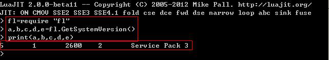
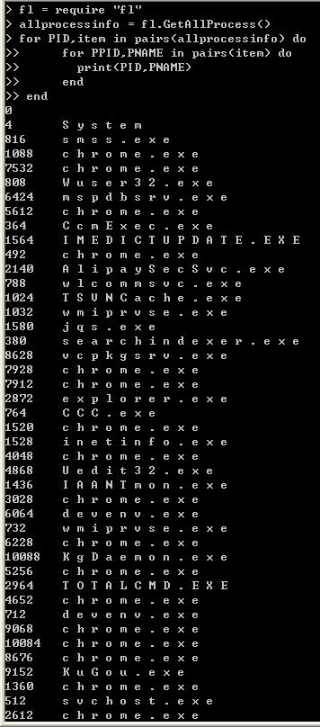

&emsp;&emsp;  在《在windows程序中嵌入Lua脚本引擎--建立一个简易的“云命令”执行的系统》一文中，我提到了使用Lua的ffi库，可以让我们像写C代码一样写lua程序。这是个非常令我们这些C程序员激动的事。但是我们使用ffi库写出来的程序往往比较大，因为我们可能要声明一些API的原型和结构体。比如我们看luajit的wiki中关于使用ffi调用kernel32的一个例子。如果我们要使用  
```c++
BOOL HeapWalk(HANDLE hHeap, PROCESS_HEAP_ENTRY * lpEntry);  
```
&emsp;&emsp; 则在Lua中要做如下声明  
```c++
ffi.cdef[[  
typedef struct _PROCESS_HEAP_ENTRY {  
    PVOID lpData;  
    DWORD cbData;  
    BYTE cbOverhead;  
    BYTE iRegionIndex;  
    WORD wFlags;  
    union {  
        struct {  
            HANDLE hMem;  
            DWORD dwReserved[ 3 ];  
        } Block;  
        struct {  
            DWORD dwCommittedSize;  
            DWORD dwUnCommittedSize;  
            LPVOID lpFirstBlock;  
            LPVOID lpLastBlock;  
        } Region;  
    } DUMMYUNIONNAME;  
} PROCESS_HEAP_ENTRY, *LPPROCESS_HEAP_ENTRY, *PPROCESS_HEAP_ENTRY;  
  
BOOL HeapWalk(HANDLE hHeap, PROCESS_HEAP_ENTRY * lpEntry);  
]]  
```
&emsp;&emsp; 即告诉Lua，我们要调用的函数的名字和函数使用的结构体的原型。  
&emsp;&emsp;看到这，可能会让想使用ffi库的朋友打起了退堂鼓。那我们如何才可以比较简洁的调用这个函数呢？那就是：编写我们自己的Lua库"fl"。  
&emsp;&emsp;我们可以参考luajit中os库的声明方式。  
1. lualib.h中新增我们库的名字"fl"，并声明注册我们库的函数luaopen_fl  

```c++
……  
#define LUA_FFILIBNAME  "ffi"  
#define LUA_FLLIBNAME   "fl"  

……  
LUALIB_API int luaopen_ffi(lua_State *L);  
LUALIB_API int luaopen_fl(lua_State *L);  
```
2. 在lib_init.c中，将我们的库名字和打开库的名字banding  

```c++
……  
  { LUA_JITLIBNAME, luaopen_jit },  
  { LUA_FLLIBNAME, luaopen_fl },  
  { NULL,       NULL }  
```
3.  在Lualib目录下新建一个lib_fl.c文件
&emsp;&emsp; 实现最基本的函数和结构。主要是实现注册我们库的luaopen_fl函数，和函数名和函数地址绑定结构体数组uaL_Reg_fl_lib
```c++
#include "lua.h"  
#include "lauxlib.h"  
#include "lualib.h"  
#include "lj_lib.h"  
static const luaL_Reg fl_lib[] = {  
    { NULL, NULL }  
};  
  
LUALIB_API int luaopen_fl(lua_State *L)  
{  
    luaL_register(L, LUA_FLLIBNAME, fl_lib);  
    return 1;  
}  
```

 4. 将lib_fl.c加入《在windows程序中嵌入Lua脚本引擎--使用VS IDE编译Luajit脚本引擎》中介绍的Lua工程。
 5. 修改《在windows程序中嵌入Lua脚本引擎--使用VS IDE编译Luajit脚本引擎》中介绍的Buildvm工程的生成后事件。在事件中，将lib_fl.c加入ALL_LIB中
 ```bash
 @set ALL_LIB=lib_base.c lib_math.c lib_bit.c lib_string.c lib_table.c lib_io.c lib_os.c lib_package.c lib_debug.c lib_jit.c lib_ffi.c lib_fl.c  
 ```
 6. 在ljamalg.c中新增#include "lib_fl.c"  
&emsp;&emsp; 如此我们便新增了一个名字叫fl的库，我们可以  
```c++
fl = require "fl"  
fl.……  
```

&emsp;&emsp; 这样调用它。  
&emsp;&emsp;现在我们要扩充我的库：   
&emsp;&emsp;A 在fl库中新增一个获取系统版本信息的函数  
```c++
LJLIB_CF(fl_GetSystemVersion)  
{  
    OSVERSIONINFOA osver;  
    ZeroMemory(&osver, sizeof(OSVERSIONINFOA));  
    osver.dwOSVersionInfoSize = sizeof(osver);  
    if ( GetVersionExA(&osver) )  
    {  
        lua_pushnumber(L, osver.dwMajorVersion);  
        lua_pushnumber(L, osver.dwMinorVersion);  
        lua_pushnumber(L, osver.dwBuildNumber);  
        lua_pushnumber(L, osver.dwPlatformId);  
        lua_pushstring(L, osver.szCSDVersion);  
        return 5;  
    }  
    else  
    {  
        return 0;  
    }  
}  
```
&emsp;&emsp; 并在fl_lib数组中新增名字和该函数的地址的绑定  
```c++
static const luaL_Reg fl_lib[] = {  
    { "GetSystemVersion",   lj_cf_fl_GetSystemVersion },  
    { NULL, NULL }  
}; 
```
&emsp;&emsp;这样我们编译出来的luajit便可以使用简单的方法调用获取系统版本了。  
  

&emsp;&emsp; B 在fl库中一个获取系统中所有进程的函数
&emsp;&emsp;为了让我们的这个例子尽可能复杂，我不准备使用快照的方法去获取进程信息。而是使用Windows未公开的函数NtQuerySystemInformation。我在之前的[《使用APIHOOK实现进程隐藏》](http://blog.csdn.net/breaksoftware/article/details/7106842)中介绍过该方法。  
```c++
#include <windows.h>  
  
#define MAXLOOPCOUNT 5   
#define MAXPROCSSNUM 1024  
  
#define STATUS_SUCCESS 0x00000000  
#define SystemProcessInformation 5  
#define STATUS_SUCCESS 0x00000000  
#define STATUS_INFO_LENGTH_MISMATCH ((ULONG)0xC0000004L)  
  
typedef DWORD (WINAPI * Fun_NtQuerySystemInformation)( DWORD, PVOID, DWORD, PDWORD );  
  
typedef struct _UNICODE_STRING {  
    USHORT Length;  
    USHORT MaximumLength;  
    PWSTR  Buffer;  
} UNICODE_STRING;  
typedef UNICODE_STRING *PUNICODE_STRING;  
typedef const UNICODE_STRING *PCUNICODE_STRING;  
  
typedef struct _SYSTEM_PROCESS_INFORMATION  
{  
    DWORD           dwNextEntryOffset;                  // 下段结构对象的偏移  
    DWORD           dwNumberOfThreads;                  // 线程数  
    LARGE_INTEGER   qSpareLi1;                            
    LARGE_INTEGER   qSpareLi2;  
    LARGE_INTEGER   qSpareLi3;  
    LARGE_INTEGER   qCreateTime;                        // 创建时间  
    LARGE_INTEGER   qUserTime;                          // 用户态时间  
    LARGE_INTEGER   qKernelTime;                        // 内核态时间  
    UNICODE_STRING  ImageName;                          // 文件名（非路径）  
    int             nBasePriority;                      // 基本优先级  
    DWORD           dwProcessId;                        // 进程ID  
    DWORD           dwInheritedFromUniqueProcessId;     // 父进程ID  
    DWORD           dwHandleCount;                      // 句柄数  
    DWORD           dwSessionId;  
    ULONG           dwSpareUl3;  
    SIZE_T          tPeakVirtualSize;  
    SIZE_T          tVirtualSize;  
    DWORD           dwPageFaultCount;  
    DWORD           dwPeakWorkingSetSize;  
    DWORD           dwWorkingSetSize;  
    SIZE_T          tQuotaPeakPagedPoolUsage;  
    SIZE_T          tQuotaPagedPoolUsage;  
    SIZE_T          tQuotaPeakNonPagedPoolUsage;  
    SIZE_T          tQuotaNonPagedPoolUsage;  
    SIZE_T          tPagefileUsage;  
    SIZE_T          tPeakPagefileUsage;  
    SIZE_T          tPrivatePageCount;  
    LARGE_INTEGER   qReadOperationCount;  
    LARGE_INTEGER   qWriteOperationCount;  
    LARGE_INTEGER   qOtherOperationCount;  
    LARGE_INTEGER   qReadTransferCount;  
    LARGE_INTEGER   qWriteTransferCount;  
    LARGE_INTEGER   qOtherTransferCount;  
}SYSTEM_PROCESS_INFORMATION, *PSYSTEM_PROCESS_INFORMATION;  
  
BOOL GetNtQuerySystemInfoBuffer( IN DWORD SystemInformationClass, void** lpBuffer )  
{  
    BOOL bSuccess = FALSE;  
    HMODULE hNtDll =  NULL;  
    Fun_NtQuerySystemInformation NtQuerySystemInformation = NULL;  
    ULONG cbBuffer = 0x0001;  
    ULONG ulNeedBytes = cbBuffer;  
    int nloopcount = 0;  
    ULONG nstatus = 0;  
    void* pBuffer = NULL;  
    *lpBuffer = NULL;  
  
    hNtDll = GetModuleHandle( L"ntdll.dll" );  
    do {  
        if( NULL == hNtDll ) {  
            // 加载ntdll失败，返回FALSE  
            break;  
        }  
  
        NtQuerySystemInformation =   
            ( Fun_NtQuerySystemInformation ) GetProcAddress( hNtDll, "NtQuerySystemInformation" );  
  
        if ( NULL == NtQuerySystemInformation ) {  
            // 获取导出函数NtQuerySystemInformation失败，返回FALSE  
            break;  
        }  
  
        // 预分配的空间大小,先分配一个小空间，理论上使用这个空间去获取信息是失败的  
        cbBuffer = 0x0001;  
        ulNeedBytes = cbBuffer;  
        // 分配内存用于保存进程信息，只分配不释放，由外部释放  
        *lpBuffer = malloc( cbBuffer );  
  
        nloopcount = 0;  
  
        do {  
            // 为了防止无限循环，做个最大循环限制  
            if ( nloopcount > MAXLOOPCOUNT ) {  
                break;  
            }  
            nloopcount++;  
  
            if( NULL == *lpBuffer ) {  
                // 分配内存失败，返回FALSE  
                break;  
            }  
  
            // 理论上，第一次执行这个函数会失败的，因为分配的空间太小  
            nstatus = NtQuerySystemInformation(   
                SystemInformationClass,   
                *lpBuffer,  
                cbBuffer,  
                &ulNeedBytes );  
  
            if ( STATUS_INFO_LENGTH_MISMATCH == nstatus ) {  
                // 理论上，第一次执行NtQuerySystemInformation后会进入这里进行内存的再次扩容  
                cbBuffer = ulNeedBytes;  
                // 重新分配内存用于保存进程信息，只分配不释放，由外部释放  
                pBuffer = realloc( *lpBuffer, cbBuffer );  
                if (pBuffer != NULL)  
                    *lpBuffer = pBuffer;  
                continue;  
            }  
            else if ( STATUS_SUCCESS == nstatus ) {  
                // 成功  
                bSuccess = TRUE;  
                break;  
            }  
            else {  
                // 非内存大小分配不够导致的错误  
                bSuccess = FALSE;  
                break;  
            }  
        } while(1);  
  
    } while( 0 );  
  
    if ( NULL != hNtDll ) {  
        FreeLibrary( hNtDll );  
        hNtDll = NULL;  
    }  
  
    if ( FALSE == bSuccess ) {  
        // 如果获取信息失败，则释放分配的内存  
        if ( NULL !=  *lpBuffer ) {  
            free( *lpBuffer );  
            *lpBuffer = NULL;  
        }  
    }  
    return bSuccess;  
}    
```

&emsp;&emsp;看到如上结构体，要是在lua中用ffi去声明，岂不是很崩溃！我们再看下填充数据的辅助函数
```c++
BOOL GetProcessFullInfo(lua_State *L)  
{  
    BOOL bSuccess = FALSE;  
    PSYSTEM_PROCESS_INFORMATION pInfo = NULL;  
    int nloopcount = 0;  
  
    do {  
        LPVOID pBuffer = NULL;  
  
        if ( FALSE == GetNtQuerySystemInfoBuffer( SystemProcessInformation, &pBuffer) ) {  
            // 获取失败，直接返回，不用释放pBuffer，因为GetZwQuerySystemInfoBuffer内部就释放了  
            break;  
        }  
  
        if ( NULL == pBuffer ) {  
            break;  
        }  
  
        pInfo = ( PSYSTEM_PROCESS_INFORMATION ) pBuffer;  
        nloopcount = 0;  
  
        lua_newtable( L );  
  
        while( NULL != pInfo ) {  
            // 为了防止无限循环，做个最大进程数限制  
            if ( nloopcount > MAXPROCSSNUM ) {  
                break;  
            }  
            nloopcount++;  
  
            if( 0 == pInfo->dwNextEntryOffset ) {  
                // 找到末尾最后一个了，就退出循环  
                break;  
            }  
            else {  
                lua_pushinteger( L, pInfo->dwProcessId);  
                //////////////////////////////////////////////////////////////////////////  
                lua_newtable( L );  
                lua_pushinteger( L, pInfo->dwInheritedFromUniqueProcessId );  
  
                lua_pushlstring( L, (char*)pInfo->ImageName.Buffer, pInfo->ImageName.Length );  
                lua_settable( L, -3 );  
                //////////////////////////////////////////////////////////////////////////  
                lua_settable( L, -3 );  
  
                // 利用偏移，找到下一个结构对象  
                pInfo = ( PSYSTEM_PROCESS_INFORMATION)(   
                    ( (PUCHAR) pInfo ) + pInfo->dwNextEntryOffset );  
            }  
        }  
  
        if ( NULL != pBuffer ) {  
            free( pBuffer );  
            pBuffer = NULL;  
        }  
  
        bSuccess = TRUE;  
    } while( 0 );  
  
    return bSuccess;  
}  
```

&emsp;&emsp;该函数生成一个如同  
```c++
struct PINFO{  
DWORD dwPPID; // 父进程ID  
wstring wstrProcessName; // 本进程名字  
};  
  
struct PINFOEX{  
DWORD dwPID;  // 本进程ID  
PINFO Info;  
}  
  
list<PINFOEX> PINFOLIST;  
```
&emsp;&emsp;的结果。
&emsp;&emsp;如果我们执行如此简短的Lua脚本  

```lua
fl = require "fl"  
allprocessinfo = fl.GetAllProcess()  
for PID,item in pairs(allprocessinfo) do  
    for PPID,PNAME in pairs(item) do  
      print(PPID,PNAME)  
    end  
end  
```
&emsp;&emsp;将把我们系统中进程信息打印出来。  
