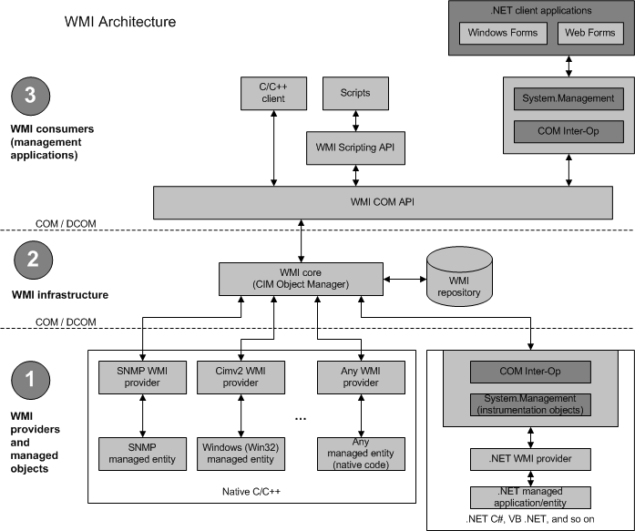

&emsp;&emsp; 在《WMI技术介绍和应用——WMI概述》中介绍了我们可以使用C++、.net或者支持ActiveX技术的脚本语言来使用WMI。但是各种语言对WMI的控制能力是不同的，比如脚本语言只能用来从WMI获取数据或者接收事件通知。而C++还可以编写WMI提供者和发送消息。和脚本语言相比，C++对WMI有强大的控制和定制性，当然也具有更大的复杂性。本文将主要讲述使用VC如何搭建一个使用WMI的框架。  
&emsp;&emsp; 为了方便使用，我将该搭建步骤封转到了一个类中  
```c++
class CWMI  
{  
public:  
    CWMI();  
    ~CWMI(void);  
public:  
    HRESULT ExcuteFun();  
protected:  
    VOID SetNamespace(wstring wstrNamespace);  
private:  
    HRESULT InitialCom();  
    HRESULT SetComSecLevels();  
    HRESULT ObtainLocator2WMI(CComPtr<IWbemLocator>& pLoc);  
    HRESULT Connect2WMI(CComPtr<IWbemLocator> pLoc,CComPtr<IWbemServices>& pSvc);  
    HRESULT SetProxySecLevels(CComPtr<IWbemServices> pSvc);  
    virtual HRESULT Excute(CComPtr<IWbemServices> pSvc) = 0;  
private:  
    wstring m_wstrNamespace;  
};  
```
&emsp;&emsp;  SetNamespace用于设置命名空间。在《WMI技术介绍和应用——WMI概述》中我们提到，WMI中存在诸如root\default、root\cimv2等WMI命令空间。因为我们要使用的WMI功能和命名空间有很大的关联，所以该类将提供这个设置命令空间的函数。  
```c++
VOID CWMI::SetNamespace(wstring wstrNamespace)  
{  
    m_wstrNamespace = wstrNamespace;  
}  
```
&emsp;&emsp;剩下的函数就承载着了使用WMI步骤的逻辑和流程。  
&emsp;&emsp;**初始化COM库**  
&emsp;&emsp;我们还要将之前的WMI框架图列出来  
  
&emsp;&emsp; WMI是基于COM技术的。在WMI Consumers层，我们发现，C++程序是直接和WMI COM API进行交互。所以我们要先初始化COM组件库。  
```c++
HRESULT CWMI::InitialCom()  
{  
    HRESULT hr = E_FAIL;  
    do {  
        hr = CoInitializeEx(0, COINIT_MULTITHREADED);  
        CHECKHR(hr);  
  
    } while (0);  
    return hr;  
}
```

&emsp;&emsp; **设置进程COM安全信息**  
&emsp;&emsp;因为WMI是基于COM技术的，所以我们可以使用`CoInitializeSecurity`设置我们应用的认证信息和扮演等级(Impersonation Levels)。如果我们不调用该函数，COM将通过读取注册表中的相关键值去决定我们应用的认证信息和扮演等级。然而，往往注册表中记录的认证信息和扮演等级是非常低的。一般来说，注册表记录的扮演等级是`RPC_C_IMP_LEVEL_IDENTIFY`，而绝大部分WMI提供者至少需要`RPC_C_IMP_LEVEL_IMPERSONATE`等级。对于认证信息，在特殊场景下，我们可能需要用其他用户身份去使用COM。但是目前，我在管理员权限下运行程序，权限基本上是够得，所以设置也很简单。  
```c++
HRESULT CWMI::SetComSecLevels()  
{  
    // Set general COM security levels --------------------------  
    // Note: If you are using Windows 2000, you must specify -  
    // the default authentication credentials for a user by using  
    // a SOLE_AUTHENTICATION_LIST structure in the pAuthList ----  
    // parameter of CoInitializeSecurity ------------------------  
  
    HRESULT hr = E_FAIL;  
    do {  
        hr = CoInitializeSecurity(  
            NULL,   
            -1,                          // COM negotiates service  
            NULL,                        // Authentication services  
            NULL,                        // Reserved  
            RPC_C_AUTHN_LEVEL_DEFAULT,   // Default authentication   
            RPC_C_IMP_LEVEL_IMPERSONATE, // Default Impersonation    
            NULL,                        // Authentication info  
            EOAC_NONE,                   // Additional capabilities   
            NULL                         // Reserved  
            );  
        CHECKHR(hr);  
  
    } while (0);  
    return hr;  
}  
```
&emsp;&emsp;**创建进程内COM服务器**  
&emsp;&emsp; 我们应用中使用WMI完成相关功能，比如查询硬盘ID，实际执行查询的操作是在WMI服务中执行的，而不是我们的应用。比如，在XP上，svchost.exe服务是WMI服务的载体。我们应用通过COM告诉svchost.exe我们的请求，svchost.exe将我们请求执行后，会将结果通过COM传递给我们的应用。这样就要求我们应用和WMI服务进程有通信。在我们应用这边，就需要创建一个进程内COM服务器用于接发数据。

```c++
HRESULT CWMI::ObtainLocator2WMI(CComPtr<IWbemLocator>& pLoc)  
{  
    HRESULT hr = E_FAIL;  
    do {  
        hr = CoCreateInstance(  
            CLSID_WbemLocator,               
            0,   
            CLSCTX_INPROC_SERVER,   
            IID_IWbemLocator, (LPVOID *) &pLoc);  
        CHECKHR(hr);  
  
    } while (0);  
    return hr;  
}  
```
&emsp;&emsp;**连接WMI命名空间**  
&emsp;&emsp;这步是使用WMI的关键一步。我们使用上一步创建的IWbemLocator实例的ConnectServer函数连接本地或者远程的WMI命名空间。我们看一下函数声明  

```c++
HRESULT ConnectServer(  
  [in]   const BSTR strNetworkResource,  
  [in]   const BSTR strUser,  
  [in]   const BSTR strPassword,  
  [in]   const BSTR strLocale,  
  [in]   LONG lSecurityFlags,  
  [in]   const BSTR strAuthority,  
  [in]   IWbemContext *pCtx,  
  [out]  IWbemServices **ppNamespace  
);  
```
&emsp;&emsp;第一个参数strNetworkResource是命名空间的名字，比如"root\default"或者"\\.\root\default"。第二三个是用户名和密码，如果是远程计算机，则这两个参数非常有用。最后一个参数返回了IWbemServices结构的代理。我们可以通过该代理访问WMI服务。  

```c++
HRESULT CWMI::Connect2WMI( CComPtr<IWbemLocator> pLoc,CComPtr<IWbemServices>& pSvc )  
{  
    HRESULT hr = E_FAIL;  
    do {  
        hr = pLoc->ConnectServer(  
            CComBSTR(m_wstrNamespace.c_str()),   
            NULL, NULL, NULL, NULL, NULL, NULL, &pSvc );  
        CHECKHR(hr);  
    } while (0);  
    return hr;  
}  
```
&emsp;&emsp;**设置WMI连接的安全等级**  
&emsp;&emsp; 一般来说，如果没有设置正确的安全属性，COM是不允许一个进程去访问另一个进程的中的对象。我们上步获得的IWbemServices接口代理就需要访问WMI服务进程中的对象，所以我们要对该代理设置安  
全等级。  
```c++
HRESULT CWMI::SetProxySecLevels( CComPtr<IWbemServices> pSvc )  
{  
    HRESULT hr = E_FAIL;  
    do {  
        hr = CoSetProxyBlanket(  
            pSvc,                        // Indicates the proxy to set  
            RPC_C_AUTHN_WINNT,           // RPC_C_AUTHN_xxx   
            RPC_C_AUTHZ_NONE,            // RPC_C_AUTHZ_xxx   
            NULL,                        // Server principal name   
            RPC_C_AUTHN_LEVEL_CALL,      // RPC_C_AUTHN_LEVEL_xxx   
            RPC_C_IMP_LEVEL_IMPERSONATE, // RPC_C_IMP_LEVEL_xxx  
            NULL,                        // client identity  
            EOAC_NONE                    // proxy capabilities   
            );  
        CHECKHR(hr);  
    } while (0);  
    return hr;  
}  
```
&emsp;&emsp;**发起WMI请求**  
&emsp;&emsp;通过以上一系列过程，我们终于可以开始使用WMI了。在我定义的类中，我将该步骤封装成一个纯虚函数Excute，继承CWMI的类将实现具体的工作。  
&emsp;&emsp;**清理**  
&emsp;&emsp;我们在使用完以上的代理和实例后，我们要释放它们，并且最后要释放COM库。  
```c++
CWMI::~CWMI(void)  
{  
    CoUninitialize();  
}  
```

&emsp;&emsp;总体来说执行的流程用代码可以描述为  
```c++
HRESULT CWMI::ExcuteFun()  
{  
    HRESULT hr = E_FAIL;  
    CComPtr<IWbemLocator> pLoc = NULL;  
    CComPtr<IWbemServices> pSvc = NULL;  
  
    do {  
        hr = InitialCom();  
        CHECKHR(hr);  
  
        hr = SetComSecLevels();  
        CHECKHR(hr);  
  
        hr = ObtainLocator2WMI(pLoc);  
        CHECKHR(hr);  
  
        hr = Connect2WMI(pLoc, pSvc);  
        CHECKHR(hr);  
  
        hr = SetProxySecLevels(pSvc);  
        CHECKHR(hr);  
  
        hr = Excute(pSvc);  
        CHECKHR(hr);  
  
    } while (0);  
    return hr;  
}  
```
