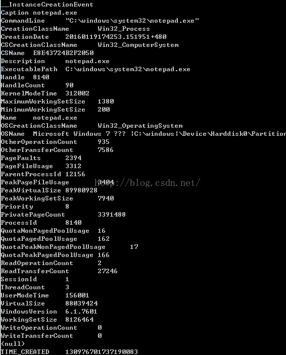
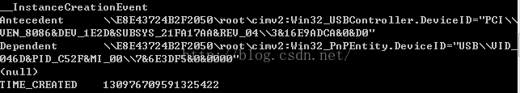
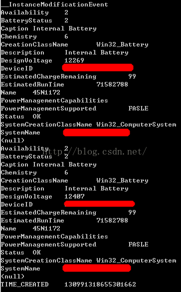

&emsp;&emsp;**监控进程创建和死亡**  
&emsp;&emsp;首先提一个问题，如何监控系统创建进程？比如有些软件会监控竞品是否创建，如果创建了就通知用户“不安全”。有一种做法就是使用Windows API遍历系统的进程，而实际上我们可以通过WMI获取这样的信息。  
```
SELECT * FROM __InstanceCreationEvent WITHIN 1 WHERE TargetInstance ISA 'Win32_Process'
```
&emsp;&emsp;我打开一个记事本，来看看程序的输出  
  
&emsp;&emsp;这组信息，我们可能觉得有用的是进程名（Name）、进程启动命令（CommandLine）、创建时间（CreationDate）、进程所在路径（ExecutablePath），进程ID（ProcessId ）、线程数（ThreadCount）等。  


&emsp;&emsp;我们可以使用如下指令监控进程的死亡，其返回字段和上图中一致  
```
SELECT * FROM __InstanceDeletionEvent WITHIN 1 WHERE TargetInstance ISA 'Win32_Process'  
```

&emsp;&emsp;**监控USB设备插拔**  
&emsp;&emsp;之前做PC版的手机助手，其中有一个功能就是监控USB设备插拔功能。如果有设备插入，则用ADB检测下是否有安卓设备插入。  
```
SELECT * FROM __InstanceCreationEvent WITHIN 1 WHERE TargetInstance ISA 'Win32_USBCOntrollerDevice  
```
 &emsp;&emsp;该指令可以监控设备的创建（插入）  
   


&emsp;&emsp;其中有意义的信息是字段中包含的设备路径。  
&emsp;&emsp;可以使用如下指令监控设备移除，返回字段和上图一样，我就不贴了  
```
SELECT * FROM __InstanceDeletionEvent WITHIN 1 WHERE TargetInstance ISA 'Win32_USBCOntrollerDevice'  
```

&emsp;&emsp;**监控某个进程 **  
&emsp;&emsp;我们可以通过指定进程名或者进程ID的形式，监控进程的改变  
```
SELECT * FROM __InstanceModificationEvent WITHIN 1 WHERE TargetInstance ISA 'Win32_Process' And TargetInstance.Name = 'Notepad.exe'  
```
```
SELECT * FROM __InstanceModificationEvent WITHIN 1 WHERE TargetInstance ISA 'Win32_Process' And TargetInstance.ProcessId  = 13792  
```
&emsp;&emsp;WMI的确是个强大的功能，如果一个进程内部集成一个WMI查询器，那么很多复杂的功能就会变成简单的WQL语句。当然它被使用最广的还是远程查询，我们可能在之后的章节中介绍这块的使用。  

&emsp;&emsp;**监控电量**  
&emsp;&emsp; 随着平板和移动设备的兴起，电量将变量设备的一个重要性能，所以监控电量变化，可以衍生出很多产品。  
```
SELECT * FROM __InstanceModificationEvent WITHIN 1 WHERE TargetInstance ISA 'Win32_Battery'  
```
  
&emsp;&emsp;其中比较有用的字段是Availability和BatteryStatus  

| Availability | Meaning |    
| --- | --- |  
| 1 (0x1) | Other |  
| 2 (0x2) | Unknown |  
| 3 (0x3) | Running or Full Power |  
| 4 (0x4) | Warning |  
| 5 (0x5) | In Test |  
| 6 (0x6) | Not Applicable |  
| 7 (0x7) | Power Off |  
| 8 (0x8) | Off Line |  
| 9 (0x9) | Off Duty |  
| 10 (0xA) | Degraded |  
| 11 (0xB) | Not Installed |  
| 12 (0xC) | Install Error |  
| 13 (0xD) | Power Save - Unknown The device is known to be in a power save mode, but its exact status is unknown. |  
| 14 (0xE) | Power Save - Low Power Mode The device is in a power save state but still functioning, and may exhibit degraded performance. |  
| 15 (0xF) | Power Save - Standby The device is not functioning, but could be brought to full power quickly. |  
| 16 (0x10) | Power Cycle |  
| 17 (0x11) | Power Save - Warning The device is in a warning state, though also in a power save mode. |  
  
    
&emsp;&emsp;

| BatteryStatus | Meaning |  
| --- | --- |  
| 1 (0x1) | The battery is discharging. |  
| 2 (0x2) | The system has access to AC so no battery is being discharged. However, the battery is not necessarily charging. |  
| 3 (0x3) | Fully Charged |  
| 4 (0x4) | Low |  
| 5 (0x5) | Critical |  
| 6 (0x6) | Charging |  
| 7 (0x7) | Charging and High |  
| 8 (0x8) | Charging and Low |  
| 9 (0x9) | Charging and Critical |  
| 10 (0xA) | Undefined |  
| 11 (0xB) | Partially Charged |  