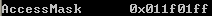
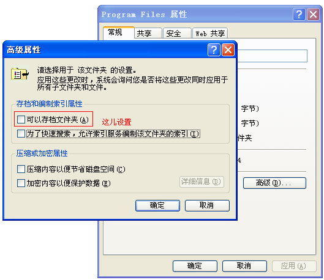
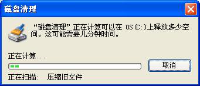
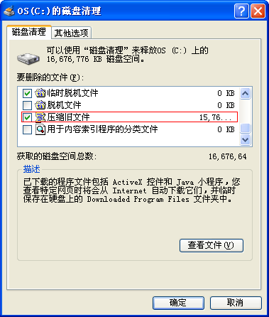
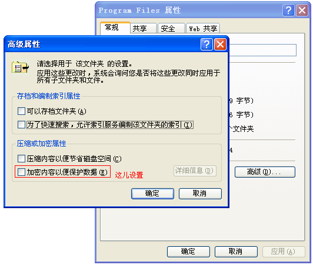
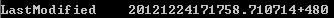

&emsp;&emsp; 本节主要介绍[Win32_Directory](https://msdn.microsoft.com/en-us/library/windows/desktop/aa394130(v=vs.85).aspx)类。通过该类我们将可以获得部分常用的文件夹信息。在该类中，有属性Name，该属性标志文件的路径。由于尝试枚举文件夹是非常耗时的。本文将介绍如何获取指定文件夹的信息  

&emsp;&emsp; **如何使用WMI获取指定文件夹的访问属性**  
```c++
SELECT AccessMask FROM Win32_Directory WHERE Name = 'c:\\\\Program Files'  
```
  
&emsp;&emsp;该属性若干属性的'或'运算的结果。  
| Value | Meaning |
| --- | --- |
| FILE_READ_DATA (file), FILE_LIST_DIRECTORY (directory) 0 (0x0) | Grants the right to read data from the file. For a directory, this value grants the right to list the contents of the directory. |
| FILE_WRITE_DATA (file), FILE_ADD_FILE (directory) 1 (0x1) | Grants the right to write data to the file. For a directory, this value grants the right to create a file in the directory. |  
| FILE_APPEND_DATA (file), FILE_ADD_SUBDIRECTORY 4 (0x4) | Grants the right to append data to the file. For a directory, this value grants the right to create a subdirectory. |  
| FILE_READ_EA 8 (0x8) | Grants the right to read extended attributes. |
| FILE_WRITE_EA 16 (0x10) | Grants the right to write extended attributes. |  
| FILE_EXECUTE (file), FILE_TRAVERSE (directory) 32 (0x20) | Grants the right to execute a file. For a directory, the directory can be traversed. |  
| FILE_DELETE_CHILD 64 (0x40) | Grants the right to delete a directory and all of the files it contains (its children), even if the files are read-only. |  
| FILE_READ_ATTRIBUTES 128 (0x80) | Grants the right to read file attributes. |  
| FILE_WRITE_ATTRIBUTES 256 (0x100) | Grants the right to change file attributes. |  
| DELETE 65536 (0x10000) | Grants delete access. |  
| READ_CONTROL131072 (0x20000) | Grants read access to the security descriptor and owner. |  
| WRITE_DAC 262144 (0x40000) | Grants write access to the discretionary ACL. |  
| WRITE_OWNER 524288 (0x80000) | Assigns the write owner. |  
| SYNCHRONIZE 1048576 (0x100000) | Synchronizes access and allows a process to wait for an object to enter the signaled state. |  
| ACCESS_SYSTEM_SECURITY 18809343 (0x11F01FF) | Controls the ability to get or set the SACL in an object's security descriptor. |  
&emsp;&emsp; 可以见得，我们这个文件夹是ACCESS_SYSTEM_SECURITY属性。此处要注意下该路径的写法，不能写成C:\\Program Files，而要写成C:\\\\Program Files。  
  
&emsp;&emsp; **如何使用WMI判断指定文件夹是否有存档属性？**  
```c++
SELECT Archive FROM Win32_Directory WHERE Name = 'c:\\\\Program Files'  
```
  
&emsp;&emsp;该属性是DOS系统遗留下来的，但是我们依然可以在系统中设置它。  
  

&emsp;&emsp;**如何使用WMI判断指定文件夹是否有可压缩属性？**  
```c++
SELECT Compressed FROM Win32_Directory WHERE Name = 'c:\\\\Program Files'  
```
  
&emsp;&emsp;当我们磁盘空间不足时，系统将会对该磁盘中文件进行扫描  
  
&emsp;&emsp;扫描结果中我们可以看到“”就是指标有压缩属性的文件夹。  
  
&emsp;&emsp;我们可以在中进行设置。  
    
  
&emsp;&emsp;**如何使用WMI判断指定文件夹是否有加密属性？**  
```c++
SELECT Encrypted FROM Win32_Directory WHERE Name = 'c:\\\\Program Files'  
```
  
&emsp;&emsp;该属性我们可以在中设置。  
  
&emsp;&emsp;该属性还是很有意思的。如果这个文件夹被加上了这个属性，那么本机的其他用户将无法访问该文件夹。如果我们把这个文件夹拷贝到另外一台电脑上，除非在有证书的情况下，否则无法打开这个文件夹。一般，如果我们发现我们电脑上某个文件或者文件夹的名字是蓝色的，那它往往就是被压缩或者被加密的文件或文件夹。  

&emsp;&emsp;**如何使用WMI获取指定文件夹的创建时间？**  
```c++
SELECT CreationDate FROM Win32_Directory WHERE Name = 'c:\\\\Program Files'  
```
  
&emsp;&emsp; 可以见得我们这个文件是2008年6月18日21时15分14秒创建的。该串最后+480，是标志我们是东八区(60*8)。  
  
&emsp;&emsp;**如何使用WMI获取指定文件夹的最后访问时间？**  
```c++
SELECT LastAccessed FROM Win32_Directory WHERE Name = 'c:\\\\Program Files'  
```
  

&emsp;&emsp;**如何使用WMI获取指定文件夹的最后修改时间？**  
```c++
SELECT LastModified FROM Win32_Directory WHERE Name = 'c:\\\\Program Files'  
```
  
  
&emsp;&emsp;**如何使用WMI判断指定文件夹是否可读？**  
```c++
SELECT Readable FROM Win32_Directory WHERE Name = 'c:\\\\Program Files'  
```
  
&emsp;&emsp; 为True代表可读。  
  
&emsp;&emsp;**如何使用WMI判断指定文件夹是否可写？**  
```c++
SELECT Writeable FROM Win32_Directory WHERE Name = 'c:\\\\Program Files'  
```
  
  
&emsp;&emsp;**如何使用WMI判断指定文件夹是否有隐藏属性？**  
```c++
SELECT Hidden FROM Win32_Directory WHERE Name = 'c:\\\\Program Files'
```

