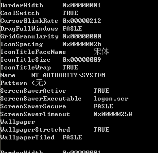
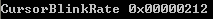
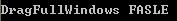
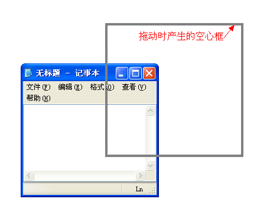
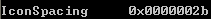
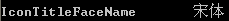
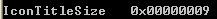
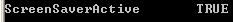
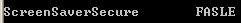
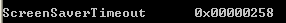

&emsp;&emsp; 在Windows操作系统中，存在很多Windows Station。而每一个Windows Station又存在一个或者多个Windows Desktop。我们一般所说的桌面只是这些众多桌面中的一个。以下内容将介绍如何使用WMI查询桌面的相关信息。  

&emsp;&emsp; **如何使用WMI枚举所有的桌面？**  
```c++
CSynQueryData recvnotify(L"root\\CIMV2",L"SELECT * FROM Win32_Desktop" );  
recvnotify.ExcuteFun();
```
  

&emsp;&emsp;一些字段我会在之后解释，我们先看下Name这个字段。每个桌面都有自己的Name信息。在我当前XP系统中，存在以下桌面的名字：  
&emsp;&emsp; NT AUTHORITY\SYSTEM  
&emsp;&emsp; NT AUTHORITY\LOCAL SERVICE  
&emsp;&emsp; NT AUTHORITY\NETWORK SERVICE  
&emsp;&emsp; 我当前登录的域+用户名（对应名字省略）  
&emsp;&emsp; .DEFAULT  
&emsp;&emsp; 一般来说，我们会比较关心一般意义上的桌面信息。我们可以通过指定域+用户名的方式获取它的信息：`SELECT * FROM Win32_Desktop WHERE NAME = 'Your Login Name'。`  

&emsp;&emsp;**如何使用WMI判断指定桌面是否支持ALT+TAB（快速任务切换）？**  
```c++
CSynQueryData recvnotify(L"root\\CIMV2",L"SELECT CoolSwitch FROM Win32_Desktop WHERE Name = 'Your Login Name'" );  
recvnotify.ExcuteFun();  
```
  
&emsp;&emsp;可以见的，我的电脑上是支持ALT+TAB进行切换的。  

&emsp;&emsp;**如何使用WMI查询光标闪烁的时间间隔时间？**  
```c++
CSynQueryData recvnotify(L"root\\CIMV2",L"SELECT CursorBlinkRate FROM Win32_Desktop WHERE Name = 'Your Login Name'" );  
recvnotify.ExcuteFun();  
```
  
&emsp;&emsp;这个时间是以毫秒为单位的。可以见的，在我这个桌面中光标闪烁的时间间隔是530毫秒  

&emsp;&emsp;**如何使用WMI判断拖动窗口时，窗口内部也在跟着移动？**  
```c++
CSynQueryData recvnotify(L"root\\CIMV2",L"SELECT DragFullWindows FROM Win32_Desktop WHERE Name = 'Your Login Name'" );  
recvnotify.ExcuteFun();  
```
  
&emsp;&emsp;我们按住非客户区拖动窗口，可能存在两种效果：  
&emsp;&emsp;1. 原窗口还在原来位置，而只有一个空心的框子跟着我们鼠标在拖动。等到我们鼠标松开，窗口才移动过去。这种情况，我们的查询将返回FALSE。    
  
&emsp;&emsp;2. 原窗口随着鼠标的位置移动而移动。这种情况我们将返回TRUE。    

&emsp;&emsp;**如何使用WMI查询桌面上两个图标之间的距离？**  
```c++
CSynQueryData recvnotify(L"root\\CIMV2",L"SELECT IconSpacing FROM Win32_Desktop WHERE Name = 'Your Login Name'" );  
recvnotify.ExcuteFun();  
```
  
&emsp;&emsp;可以见得我这个桌面中两个图标之间的间距是43像素，我量了一下，的确如此。  
  

&emsp;&emsp;**如何使用WMI获取桌面图标下的文字的字体？**  
```c++
CSynQueryData recvnotify(L"root\\CIMV2",L"SELECT IconTitleFaceName FROM Win32_Desktop WHERE Name = 'Your Login Name'" );  
recvnotify.ExcuteFun(); 
```
  
  
&emsp;&emsp;**如何使用WMI查询桌面图标下的文字字体大小？**    
```c++
[cpp] view plain copy
CSynQueryData recvnotify(L"root\\CIMV2",L"SELECT IconTitleSize FROM Win32_Desktop WHERE Name = 'Your Login Name'" );  
recvnotify.ExcuteFun();  
```
  
&emsp;&emsp; 注意此处是使用Point为单位的  
  
&emsp;&emsp; **如何使用WMI判断是否开启了屏保？**
```c++
CSynQueryData recvnotify(L"root\\CIMV2",L"SELECT ScreenSaverActive FROM Win32_Desktop WHERE Name = 'Your Login Name'" );  
recvnotify.ExcuteFun();  
```
  
&emsp;&emsp; 该字段为TRUE就是启用了屏保。  
  
&emsp;&emsp; **如何使用WMI获取屏保程序的路径？**  
```c++
CSynQueryData recvnotify(L"root\\CIMV2",L"SELECT ScreenSaverExecutable FROM Win32_Desktop WHERE Name = 'Your Login Name'" );  
recvnotify.ExcuteFun();  
```
  

&emsp;&emsp;**如何使用WMI判断从屏保恢复后是否需要输入密码？**  
```c++
CSynQueryData recvnotify(L"root\\CIMV2",L"SELECT ScreenSaverSecure FROM Win32_Desktop WHERE Name = 'Your Login Name'" );  
recvnotify.ExcuteFun(); 
```
  
&emsp;&emsp;可见当前桌面中从屏保恢复后不用输入密码。  

&emsp;&emsp;**如何使用WMI获取需要等待多久才开启屏保？**  
```c++
CSynQueryData recvnotify(L"root\\CIMV2",L"SELECT ScreenSaverTimeout FROM Win32_Desktop WHERE Name = 'Your Login Name'" );  
recvnotify.ExcuteFun();  
```
  
&emsp;&emsp;这个时间单位是秒。可以见得当前桌面等待600秒后将进入屏保程序。  

&emsp;&emsp;**如何使用WMI查询桌面的背景图路径？**    
```c++
CSynQueryData recvnotify(L"root\\CIMV2",L"SELECT Wallpaper FROM Win32_Desktop WHERE Name = 'Your Login Name'" );  
recvnotify.ExcuteFun();  
```
  

&emsp;&emsp;**如何使用WMI判断桌面背景图是拉伸效果？**  
```c++
CSynQueryData recvnotify(L"root\\CIMV2",L"SELECT WallpaperStretched FROM Win32_Desktop WHERE Name = 'Your Login Name'" );  
recvnotify.ExcuteFun();  
```
   
&emsp;&emsp;可以见的，当前桌面的背景图是拉伸效果。但是如果该值是FALSE，则说明不是拉伸效果，即可能是平铺或者居中。那

&emsp;&emsp;**如何使用WMI在已知不是拉伸效果的情况下，如何判断是平铺或者居中呢？**  
```c++
CSynQueryData recvnotify(L"root\\CIMV2",L"SELECT WallpaperTiled FROM Win32_Desktop WHERE Name = 'Your Login Name'" );  
recvnotify.ExcuteFun();   
```
  
&emsp;&emsp;在WallpaperStretched为FALSE的情况下，如果WallpaperTiled为TRUE，则证明当前桌面背景图是平铺的，否则说明是居中的。  

&emsp;&emsp;更多的信息在[Win32_Desktop](http://msdn.microsoft.com/zh-cn/library/windows/desktop/aa394121(v=vs.85).aspx)。