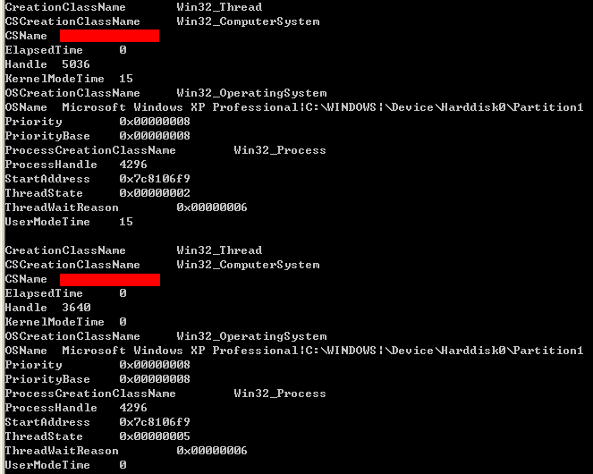
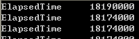
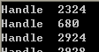
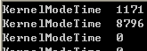
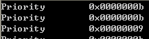
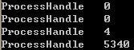

&emsp;&emsp;一般来说，如果试图枚举系统中的线程。需要先枚举系统中的进程，然后再枚举每个进程中的线程。而WMI给我们提供了一种比较简便的枚举线程信息的方法。  
&emsp;&emsp;**如何使用WMI枚举所有线程的所有信息？**  
```c++
CSynQueryData recvnotify(L"root\\CIMV2",L"SELECT * FROM Win32_Thread" );   
recvnotify.ExcuteFun();  
```
  
 &emsp;&emsp;以下我粗略介绍下各个属性的应用。  
 &emsp;&emsp;**如何使用WMI枚举正在运行的线程的占用时间？**  
 ```c++
 CSynQueryData recvnotify(L"root\\CIMV2",L"SELECT ElapsedTime FROM Win32_Thread" );      
recvnotify.ExcuteFun();  
 ```
     
&emsp;&emsp;该时间是以毫秒（Milliseconds）为单位。  
&emsp;&emsp; **如何使用WMI枚举正在运行的线程的句柄**  
```c++
CSynQueryData recvnotify(L"root\\CIMV2",L"SELECT Handle FROM Win32_Thread" );  
recvnotify.ExcuteFun();  
```
  
&emsp;&emsp; MSDN中说明，该句柄具有所有访问权限。  
&emsp;&emsp; **如何使用WMI枚举正在运行的线程的内核时间？**  
```c++
CSynQueryData recvnotify(L"root\\CIMV2",L"SELECT KernelModeTime FROM Win32_Thread" );  
recvnotify.ExcuteFun();  
```
  
&emsp;&emsp;  该时间以100纳秒为单位。  
&emsp;&emsp; **如何使用WMI枚举枚举正在运行的线程基础等级？**  
```c++
CSynQueryData recvnotify(L"root\\CIMV2",L"SELECT PriorityBase FROM Win32_Thread" );  
recvnotify.ExcuteFun();  
```
  
&emsp;&emsp; 该值是线程基数等级，可以选0~31之间的值。值越高，代表该线程等级越高。  
&emsp;&emsp; **如何使用WMI枚举枚举正在运行的线程动态等级？**  
```c++
CSynQueryData recvnotify(L"root\\CIMV2",L"SELECT Priority FROM Win32_Thread" );      
recvnotify.ExcuteFun();  
```
  

&emsp;&emsp; 该等级是个动态调整的等级。系统通过该等级决定哪个线程享有CPU资源。除了动态等级，还有个基础等级概念。线程在初始化阶段会将动态等级设置成基础等级值。然后根据需要提升或者降低动态等级。只有基础等级在0~15的线程的动态等级才会被调整。而系统并不会提升基础等级在16-31的线程的动态等级。  

&emsp;&emsp; **如何使用WMI枚举所有正在等待非CPU资源的线程的等待原因？**  
```c++
CSynQueryData recvnotify(L"root\\CIMV2",L"SELECT ThreadWaitReason FROM Win32_Thread Where ThreadState = 6" );  
recvnotify.ExcuteFun();  
```
&emsp;&emsp;此处要说明两个字段的含义。TreadWaitReason字段代表线程等待的原因，而该字段只有在ThreadState为6时有效。ThreadState为6时代表该线程在等待非CPU资源。我们看下ThreadState的值说明  

| Value | Meaning |
| --- | --- |
| 0 | Initialized — It is recognized by the microkernel. |
| 1 | Ready — 该线程已经做好准备运行，等待下一个CPU资源。 |
| 2 | Running — 该线程正在运行。 |
| 3 | Standby — 该线程正准备运行。在一个时刻只有一个线程可以处于这种状态。 |
| 4 | Terminated — 该线程已经完成执行 |
| 5 | Waiting — 该线程还没做好运行的准备。当它处于Ready状态时，它将会被调度。 |
| 6 | Transition — 该线程在等待非CPU资源。 |
| 7 | Unknown — 该线程状态未知。 |  


&emsp;&emsp;我们再看下TreadWaitReason字段的说明  
| Value | Meaning |
| --- | --- |
| 0 | Executive |
| 1 | FreePage |
| 2 | PageIn |
| 3 | PoolAllocation |
| 4 | ExecutionDelay |
| 5 | FreePage |
| 6 | PageIn |
| 7 | Executive |
| 8 | FreePage |
| 9 | PageIn |
| 10 | PoolAllocation |
| 11 | ExecutionDelay |
| 12 | FreePage |
| 13 | PageIn |
| 14 | EventPairHigh |
| 15 | EventPairLow |
| 16 | LPCReceive |
| 17 | LPCReply |
| 18 | VirtualMemory |
| 19 | PageOut |
| 20 | Unknown |  

&emsp;&emsp;**如何使用WMI枚举线程状态（ThreadState）不是5（Waiting）的线程所在的进程ID？**  
```c++
CSynQueryData recvnotify(L"root\\CIMV2",L"SELECT ProcessHandle FROM Win32_Thread Where ThreadState <> 5" );  
recvnotify.ExcuteFun();
```
  
&emsp;&emsp;更多关于线程的信息可以参略[Win32_Thread](https://msdn.microsoft.com/en-us/library/windows/desktop/aa394494(v=vs.85).aspx)。
