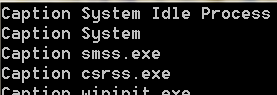
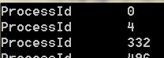
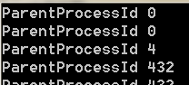
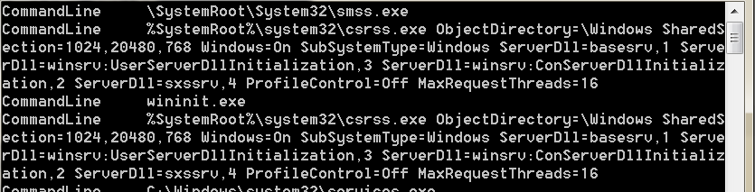
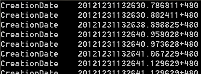
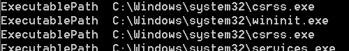
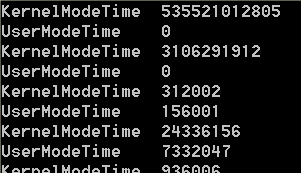
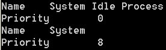

&emsp;&emsp;**如何使用WMI枚举正在运行的进程的进程名？**  

```c++
CSynQueryData recvnotify(L"root\\CIMV2",L"SELECT Caption FROM Win32_Process" );  
recvnotify.ExcuteFun();  
```
  

&emsp;&emsp;**如何使用WMI枚举正在运行的进程的进程ID？**  
```c++
CSynQueryData recvnotify(L"root\\CIMV2",L"SELECT ProcessId FROM Win32_Process" );  
recvnotify.ExcuteFun();  
```
  

&emsp;&emsp;**如何使用WMI枚举正在运行的进程的父进程ID？**
```c++
CSynQueryData recvnotify(L"root\\CIMV2",L"SELECT ParentProcessId FROM Win32_Process" );  
recvnotify.ExcuteFun();  
```
  

&emsp;&emsp;**如何使用WMI枚举正在运行的进程在启动时的命令？**  
```c++
CSynQueryData recvnotify(L"root\\CIMV2",L"SELECT CommandLine FROM Win32_Process" );  
recvnotify.ExcuteFun();  
```
  
&emsp;&emsp;**如何使用WMI枚举正在运行的进程是何时启动的？**
```c++
CSynQueryData recvnotify(L"root\\CIMV2",L"SELECT CreationDate FROM Win32_Process" );  
recvnotify.ExcuteFun();  
```
  

&emsp;&emsp;**如何使用WMI枚举正在运行的进程的文件路径？**  
```c++
CSynQueryData recvnotify(L"root\\CIMV2",L"SELECT ExecutablePath FROM Win32_Process" );  
recvnotify.ExcuteFun();
```
  

&emsp;&emsp;**如何使用WMI枚举正在运行的进程的用户时间和内核时间？**  
```c++
CSynQueryData recvnotify(L"root\\CIMV2",L"SELECT UserModeTime,KernelModeTime FROM Win32_Process" );  
recvnotify.ExcuteFun();  
```
  

&emsp;&emsp;**如何使用WMI枚举正在运行的进程的线程数？**  
```c++
CSynQueryData recvnotify(L"root\\CIMV2",L"SELECT ThreadCount FROM Win32_Process" );  
recvnotify.ExcuteFun(); 
```
  

&emsp;&emsp;**如何使用WMI获取指定进程ID的进程的优先级？**  
```c++
CSynQueryData recvnotify(L"root\\CIMV2",L"SELECT Name,Priority FROM Win32_Process Where ProcessId = 0 or ProcessID = 4" );  
p;   recvnotify.ExcuteFun(); 
```
  

&emsp;&emsp;本文主要通过介绍WMI类Win32_Process来介绍查询进程信息，只是抛砖引玉。如果想查询该类的更多信息，可以上MSDN检索。这个类是个非常重要的类，我会在之后的章节中介绍该类的一些方法。