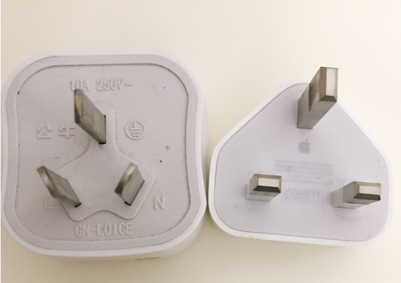
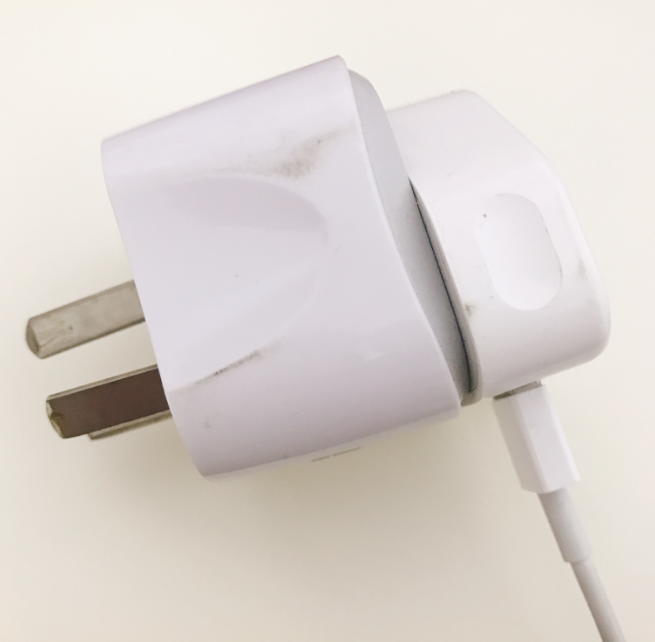

#### 简介（你用过港式插座转换器么？）  

**姓名** ：适配器模式  

**英文名** ：Adapter Pattern  

**价值观** ：老媒人，牵线搭桥  

**个人介绍** ： Convert the interface of a class into another interface clients expect.Adapter lets classes work together that couldn't otherwise because of incompatible interfaces. 将一个类的接口变换成客户端所期待的另一种接口，从而使原本因接口不匹配而无法在一起工作的两个类能够在一起工作。 （来自《设计模式之禅》）  

#### 你要的故事

大家有买过港式的 Apple 产品么？在深圳的同学估计买过，毕竟港式的 Apple 产品基本比国内便宜 500 以上。我手机和平板都是在香港买的，买来后这充电器是没法直接充电的，因为港版的电子产品都是英式的插头，而咱们国内是中式的，所以用上港版电子产品的同学免不了要用上这么一个转换器：将英式的插孔转为中式的插孔，方可插入咱家里的插座充电。这个转换器就是今天想讲的适配器。  

没见过的同学可以看看图片熟悉一下，下图右边为港版苹果手机充电器，插头比较大，左边为某品牌转换器，插头为中国家用标准形状。  
  
下图为使用时的图片  
  

在这描述一下这个场景。用港式插头要在国内充电，因为插头和插座大小对不上，所以需要加一个适配器，这个适配器充当插头和插座，它的插头可以插入国内标准的插座，它的插座可以插入港式标准的插头，这样子就可以用港式充电器在国内为手机充电。  

下面用适配器模式代码实现这个场景。  

首先需要找到被适配的对象是什么？在这里我们的被适配对象是英式充电器。  

```java
/**
 * 英式充电器
 */
class BritishCharger {

    public void chargeByBritishStandard(){
        System.out.println("用英式充电器充电");
    }

}
```

在这个场景的目的是什么？在中国为港式手机充电，因此目的是让英式充电器能够在中国标准的插座充电。  

```java
/**
 * 使用中式插座充电
 */
interface Target {

    void chargeByChineseStandard();

}
```

接下来是这个设计模式的主角：适配器。它需要连接中式插座以及英式充电器，在中间做适配功能。  

```java
/**
 * 充电器适配器
 */
class ChargerAdapter implements Target {

    private BritishCharger britishCharger;

    public ChargerAdapter(BritishCharger britishCharger) {
        this.britishCharger = britishCharger;
    }

    @Override
    public void chargeByChineseStandard() {
        System.out.println("使用中英式插头转换器");
        britishCharger.chargeByBritishStandard();
    }
}
```

上面是适配器模式的一个简单的例子，要学习适配器模式也可以看看 Java 的 IO 实现源码，里面是应用适配器模式的官方很好的代码。  

#### 总结  

适配器很好的将 2 个无法关联的类结合起来，在中间起桥梁作用。另外新增适配器代码不会影响原来被适配者的正常使用，他们可以一起被使用。在工作中和外部系统对接的时候，大可能外部系统的数据格式和自己系统的数据格式并不相同，这时候就可以利用适配器模式来实现。