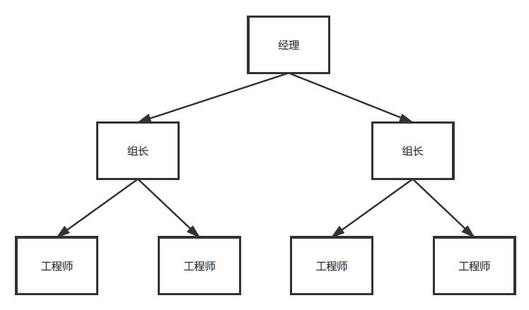

#### 简介（程序猿组织架构）  

**姓名** ：组合模式  

**英文名** ：Composite Pattern  

**价值观** ：专门解决各种树形疑难杂症  

**个人介绍** ： Compose objects into tree structures to represent part-whole hierarchies.Composite lets clients treat individual objects and compositions of objects uniformly. 将对象组合成树形结构以表示“部分-整体”的层次结构，使得用户对单个对象和组合对象的使用具有一致性。 （来自《设计模式之禅》）  


#### 你要的故事  

今天咱们再讲讲咱们程序猿的组织架构。技术类的组织架构比较单一，基本上都是这样：经理--->组长--->工程师，如下图所示。  
  

各个公司的 title 可能不太一样，但是基本是差不多这种架构，按职业发展，从入职到能独立开发需求便为工程师，从独立开发需求到能带小团队开发便为组长，从带小团队开发到能带几个团队一起协作开发便为经理。  

假设目前有一家公司，技术部就 4 个人，大熊担任经理，中熊担任组长，小熊1和小熊2担任工程师。下面的代码都围绕这个假设编写。  

#### 非组合模式  

我们先来一个非正常的实现方案：从组织架构里，有 3 个角色，分别是经理、组长、工程师，那么我们就按角色去实现一番。  

##### Manager 为经理类，经理下有多个组长 leaders。  

```java
/**
 * 经理
 */
class Manager {

    private String name;
    private List<Leader> leaders;

    public Manager(String name) {
        this.name = name;
        this.leaders = new LinkedList<>();
    }

    public void add(Leader leader) {
        this.leaders.add(leader);
    }

    public void remove(Leader leader) {
        this.leaders.remove(leader);
    }

    public void display(int index) {
        for (int i = 0; i < index; i++) {
            System.out.print("----");
        }
        System.out.println("经理：" + this.name);
        leaders.forEach(leader -> {
            leader.display(index+1);
        });
    }

}
```

##### Leader 为组长类，组长下有多个工程师 engineers。  

```java
/**
 * 组长
 */
class Leader {

    private String name;
    private List<Engineer> engineers;

    public Leader(String name) {
        this.name = name;
        this.engineers = new LinkedList<>();
    }

    public void add(Engineer engineer) {
        this.engineers.add(engineer);
    }

    public void remove(Engineer engineer) {
        this.engineers.remove(engineer);
    }

    public void display(int index) {
        for (int i = 0; i < index; i++) {
            System.out.print("----");
        }
        System.out.println("组长：" + this.name);
        engineers.forEach(engineer -> {
            engineer.display(index + 1);
        });
    }
}
```

##### Engineer 为工程师类，工程师没有下属。  

```java
/**
 * 工程师
 */
class Engineer {

    private String name;

    public Engineer(String name) {
        this.name = name;
    }

    public void display(int index) {
        for (int i = 0; i < index; i++) {
            System.out.print("----");
        }
        System.out.println("工程师：" + this.name);
    }

}
```

##### 测试代码  

```java
public class NoCompositeTest {

    public static void main(String[] args) {
        Manager manager = new Manager("大熊");
        Leader leader = new Leader("中熊");
        Engineer engineer1= new Engineer("小熊1");
        Engineer engineer2 = new Engineer("小熊2");

        manager.add(leader);
        leader.add(engineer1);
        leader.add(engineer2);

        manager.display(0);
    }

}

打印结果：
经理：大熊
----组长：中熊
--------工程师：小熊1
--------工程师：小熊2
```

这份代码看完之后，有什么想法？是不是感觉代码有点冗余？经理和组长的代码几乎一致，而工程师类和经理类、组长类也有共同点，唯一的区别就是工程师没有下属，因此没有对下属的增删操作方法。  


#### 安全模式

通过上面一层思考，这 3 个角色有相通性，我们可以抽象出一个 Employee2 类，把 3 个角色共同的特性放到 Employee2 类中，经理和组长合并共用一个类，因为在这个例子里，这 2 个角色完全一样的。下面看代码。  

##### Employee2 抽象类，它有这 3 个角色共有的特性，名称设置获取以及显示数据。  

```java
abstract class Employee2 {

    private String name;

    public String getName() {
        return name;
    }

    public void setName(String name) {
        this.name = name;
    }

    public abstract void display(int index);

}
```

##### Leader2 领导类，把上面的经理类和组长类都合并到这个领导类，因为他们都是领导层。  

```java
class Leader2 extends Employee2 {

    private List<Employee2> employees;

    public Leader2(String name) {
        this.setName(name);
        this.employees = new ArrayList<>();
    }

    public void add(Employee2 employee) {
        this.employees.add(employee);
    }

    public void remove(Employee2 employee) {
        this.employees.remove(employee);
    }

    @Override
    public void display(int index) {
        for(int i = 0; i < index; i++) {
            System.out.print("----");
        }
        System.out.println("领导：" + this.getName());
        this.employees.forEach(employee -> {
            employee.display(index + 1);
        });
    }
}
```

##### Engineer2 工程师类，工程师类比较简单，因为名称设置获取在抽象类 Employee2 有了，所以就只需实现显示数据的功能。  

```java
class Engineer2 extends Employee2 {

    public Engineer2(String name) {
        this.setName(name);
    }

    @Override
    public void display(int index) {
        for(int i = 0; i < index; i++) {
            System.out.print("----");
        }
        System.out.println("工程师：" + this.getName());
    }
}
```


##### 测试代码  

```java
public class CompositeTest {

    public static void main(String[] args) {
        // 安全模式
        Leader2 leader1 = new Leader2("大熊");
        Leader2 leader2 = new Leader2("中熊");
        Engineer2 engineer1 = new Engineer2("小熊1");
        Engineer2 engineer2 = new Engineer2("小熊2");

        leader1.add(leader2);
        leader2.add(engineer1);
        leader2.add(engineer2);

        leader1.display(0);
    }

}

打印结果：
领导：大熊
----领导：中熊
--------工程师：小熊1
--------工程师：小熊2
```

看下运行结果和上面是一致的，这份代码比第一份代码有更好的封装性，也更符合面向对象的编程方式，经理和组长被合并成 Leader2，也就是咱们今天讲的组合模式，Leader2 为组合对象。上面讲的是安全模式，安全模式指的是抽象类 Employee2 只提供了 3 个角色中共有的特性，安全是相对透明模式所说的，因为这里领导类 Leader2 和工程师类 Engineer2 都只提供了自己能提供的方法，Engineer2 不会有多余的方法，而透明模式则不是。下面讲讲透明模式。  


#### 透明模式  

透明模式把组合对象（即领导类）使用的方法放到抽象类中，而因为工程师没有下属，则不具体实现对应的方法。代码如下。  

##### Employee3 抽象类，将组合对象的属性 employees 和 方法 add()、 remove() 都放到这个类里面。  

```java
abstract class Employee3 {

    private String name;
    private List<Employee3> employees;

    public String getName() {
        return name;
    }

    public void setName(String name) {
        this.name = name;
    }

    public List<Employee3> getEmployees() {
        return employees;
    }

    public void setEmployees(List<Employee3> employees) {
        this.employees = employees;
    }

    public abstract void add(Employee3 employee);

    public abstract void remove(Employee3 employee);

    public abstract void display(int index);

}
```

##### Leader3 领导类，具体实现 Employee3 提供的所有方法。  

```java
class Leader3 extends Employee3 {

    public Leader3(String name) {
        this.setName(name);
        this.setEmployees(new ArrayList<>());
    }

    @Override
    public void add(Employee3 employee) {
        this.getEmployees().add(employee);
    }

    @Override
    public void remove(Employee3 employee) {
        this.getEmployees().remove(employee);
    }

    @Override
    public void display(int index) {
        for(int i = 0; i < index; i++) {
            System.out.print("----");
        }
        System.out.println("领导：" + this.getName());
        this.getEmployees().forEach(employee -> {
            employee.display(index + 1);
        });
    }
}
```

##### Engineer3 工程师类，只具体实现 Employee3 中的 display() 方法，add() 和 remove() 方法不是工程师具备的，所以留空，不做具体实现。  

```java
class Engineer3 extends Employee3 {

    public Engineer3(String name) {
        this.setName(name);
    }

    @Override
    public void add(Employee3 employee) {
        // 没有下属
    }

    @Override
    public void remove(Employee3 employee) {
        // 没有下属
    }

    @Override
    public void display(int index) {
        for(int i = 0; i < index; i++) {
            System.out.print("----");
        }
        System.out.println("工程师：" + this.getName());
    }
}
```

##### 测试代码：  

```java
public class CompositeTest {

    public static void main(String[] args) {
        // 透明模式
        Leader3 leader3 = new Leader3("大熊");
        Leader3 leader31 = new Leader3("中熊");
        Engineer3 engineer31 = new Engineer3("小熊1");
        Engineer3 engineer32 = new Engineer3("小熊2");

        leader3.add(leader31);
        leader31.add(engineer31);
        leader31.add(engineer32);

        leader3.display(0);

    }

打印结果：
领导：大熊
----领导：中熊
--------工程师：小熊1
--------工程师：小熊2
}
```

安全模式把 3 个角色的共同点抽象到 Employee2 中，透明模式则把 3 个角色中的领导者（组合对象）的内容抽象到 Employee3 中。透明模式有些不好的地方在于工程师也有领导者的下属对象和相应的方法，其实工程师并没有这些功能。安全模式把领导者和工程师分开，每个对象都只提供自己具有的功能，这样子在使用的时候也就更安全。  


#### 总结  

我们根据 IT 组织架构，从简单的每个角色对应一个类的实现，再到抽象出每个角色共同的功能、组合领导类的安全模式，接着再到抽象起来领导类（组合）所有功能的透明模式，分析了组合模式的完整过程，也讲了安全模式和透明模式的差异。组合模式让对象更加有层次，将对象的划分更加清晰，特别是树形结构的层次，利用组合模式会更加简化。