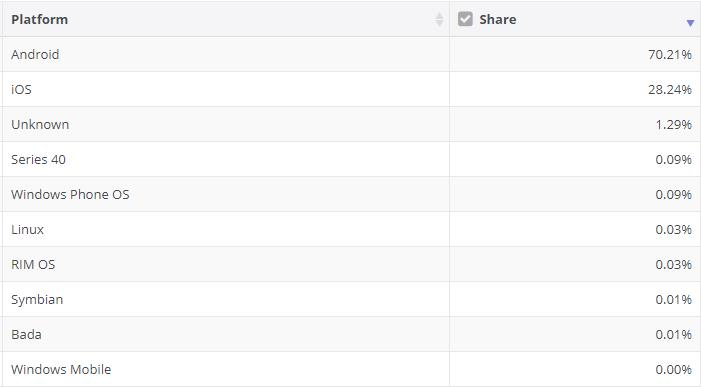

#### 简介（IOS、Android 二分天下）  

**姓名** ：桥接模式  

**英文名** ：Bridge Pattern  

**价值观** ：解耦靠我  

**个人介绍** ： Decouple an abstraction from its implementation so that the two can vary independently. 将抽象和实现解耦，使得两者可以独立地变化。 （来自《设计模式之禅》）  

#### 你要的故事  

现在手机二分天下，安卓手机和苹果手机目前占有率高居 98.45%，其中安卓手机占有率为 70.21%，苹果手机占有率为 28.24%，如下图所示。  
  

因为有这 2 个系统，所以很多软件商都不得不开发 2 个系统的 APP。我们就拿这个案例来讲，目前手机有安卓手机和苹果手机，软件有谷歌浏览器和火狐浏览器，通过手机打开软件这一过程来讲讲桥接模式。  

从个人介绍可见，需要抽象化和实现化，然后使用桥接模式将抽象和实现解耦。  

`抽象化`：把一类对象共有的东西抽象到一个类里面，该类作为这类对象的基类。在这里我们可以抽象化的便是**手机**。  

`实现化`：将接口或抽象类的未实现的方法进行实现。在这里我们可以实现化的就是**软件**。  

`将抽象和实现解耦`：有了上面的抽象化和实现化，通过桥接模式来实现解耦。在这里，我们把打开软件` open() `放到软件实现中，而抽象的手机利用模板方法模式定义 `openSoftware()` 供手机子类去实现，手机子类也是调用软件的 `open() `方法，并没有自己实现打开逻辑，也就是解耦了这个打开软件过程。  

#### 下面给出案例的代码。  

##### Phone 手机抽象类代码。  

属性 system 代表系统名称，software 代表要打开的软件，openSoftware() 对外提供打开软件的方法。  

```java
abstract class Phone {

    private String system;
    private Software software;

    public abstract void openSoftware();

    public String getSystem() {
        return system;
    }

    public void setSystem(String system) {
        this.system = system;
    }

    public Software getSoftware() {
        return software;
    }

    public void setSoftware(Software software) {
        this.software = software;
    }

}
```

##### AndroidPhone 安卓系统手机代码。  

```java
class AndroidPhone extends Phone {

    public AndroidPhone(Software software){
        this.setSystem("Android");
        this.setSoftware(software);
    }

    @Override
    public void openSoftware() {
        this.getSoftware().open(this);
    }
}
```

##### IOSPhone IOS 系统手机代码（也就是苹果手机）。  

```java
class IOSPhone extends Phone {

    public IOSPhone(Software software) {
        this.setSystem("IOS");
        this.setSoftware(software);
    }

    @Override
    public void openSoftware() {
        this.getSoftware().open(this);
    }
}
```

##### Software 软件接口代码。它有一个方法 open()，用于打开该软件。  

```java
interface Software {
    void open(Phone phone);
}
```

##### Chrome 谷歌浏览器软件代码。  

```java
class Chrome implements Software {

    @Override
    public void open(Phone phone) {
        System.out.println("打开 " + phone.getSystem() + " 手机的 Chrome 浏览器");
    }

}
```

##### FireFox 火狐浏览器软件代码。  

```java
class FireFox implements Software {

    @Override
    public void open(Phone phone) {
        System.out.println("打开 " + phone.getSystem() + " 手机的 Firefox 浏览器");
    }

}
```

##### 测试代码如下。

```java
public class BridgeTest {

    public static void main(String[] args) {
        Software chrome = new Chrome();
        Software firefox = new FireFox();

        Phone androidPhone = new AndroidPhone(chrome);
        androidPhone.openSoftware();

        androidPhone.setSoftware(firefox);
        androidPhone.openSoftware();

        Phone iosPhone = new IOSPhone(chrome);
        iosPhone.openSoftware();

        iosPhone.setSoftware(firefox);
        iosPhone.openSoftware();
    }

}

打印结果：
打开 Android 手机的 Chrome 浏览器
打开 Android 手机的 Firefox 浏览器
打开 IOS 手机的 Chrome 浏览器
打开 IOS 手机的 Firefox 浏览器
```

桥接模式代码已经写完。为什么叫桥接模式呢？因为它将打开软件的具体实现放到了软件实现里面，而不是放在了手机，通过聚合方式去调用软件打开的方法，这就像一条桥一样连接手机和软件。  

#### 总结  

桥接模式利用了聚合的优点去解决继承的缺点，使得抽象和实现进行分离解耦。正由于解耦，使得有更好的扩展性，加手机类型或者加软件都非常容易，也不会破坏原有的代码。