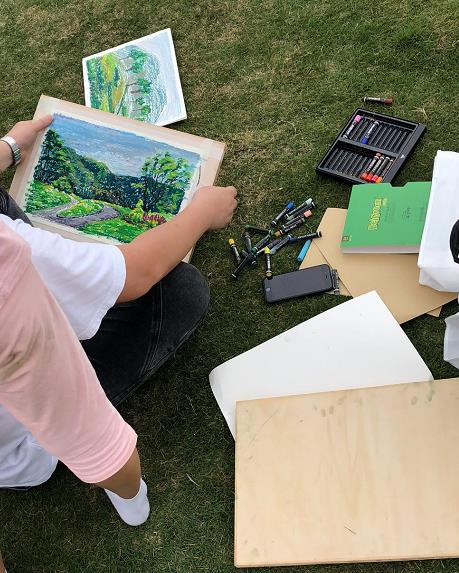

#### 简介（还记得童年的蜡笔画么？）  

**姓名** ：享元模式  

**英文名** ：Flyweight Pattern  

**价值观** ：共享富贵  

**个人介绍** ： Use sharing to support large numbers of fine-grained objects efficiently. 使用共享对象可有效地支持大量的细粒度的对象。 （来自《设计模式之禅》）  


#### 你要的故事  

还记得笔袋么？可能有人已经忘记了，在写这篇文章之前其实我也忘了，从初中开始就再也没用过笔袋。拿笔袋来讲享元模式再适合不过了。笔袋放各种各样的笔，今天我们不讲别的，就讲蜡笔。前段时间在逛公园的时候，看到一位老师在画画，画的就是蜡笔画，第一次看到真正的蜡笔画，真的很震撼，原来蜡笔也可以把景色画得那么美。当时偷偷拍了一张，看下图。  
  

我们就拿这幅画来说，里面画了草、树、路、山、天空等等。如果没有用享元模式，我们可能这样子实现。  

蜡笔接口。  

```java
interface ICrayon {

    void draw(String place);

}
```

蜡笔。  

```java
/**
 * 蜡笔
 */
class Crayon implements ICrayon {

    private String color;

    public Crayon(String color) {
        System.out.println("---新建【" + color + "】蜡笔" );
        this.color = color;
    }

    @Override
    public void draw(String place) {
        System.out.println("用" + this.color + "蜡笔画" + place);
    }
}
```

测试代码。这幅画是小明和小红一起画，小明画了草和路，小红画了树和蓝天。  

```java
public class NoFlyweightTest {

    public static void main(String[] args) {
        drawByXiaoMing();
        drawByXiaoHong();
    }

    public static void drawByXiaoMing() {
        ICrayon greenCrayon = new Crayon("绿色");
        greenCrayon.draw("草");

        ICrayon grayCrayon = new Crayon("灰色");
        grayCrayon.draw("路");
    }

    public static void drawByXiaoHong() {
        ICrayon blueCrayon = new Crayon("蓝色");
        blueCrayon.draw("蓝天");

        ICrayon greenCrayon = new Crayon("绿色");
        greenCrayon.draw("树");
    }

}

打印结果：
---新建【绿色】蜡笔
用绿色蜡笔画草
---新建【灰色】蜡笔
用灰色蜡笔画路
---新建【蓝色】蜡笔
用蓝色蜡笔画蓝天
---新建【绿色】蜡笔
用绿色蜡笔画树
```

我们发现小明和小红都用了绿色蜡笔，而这里新建了 2 次绿色蜡笔，也就是在整个作画过程中，小明和小红并不是共用一套蜡笔，而是各自用一套蜡笔，在现实中是没什么问题的，但是在软件开发中，如果这种情况出现，其实相当于资源浪费，因为每个蜡笔都会占用内存，可以共用的我们尽量共用，节省一些内存空间，特别是出现很多这种可以共享却没有共享的对象时候。下面我们引入享元模式。享元模式实现方法相当于我们蜡笔都放在了笔袋，小明和小红用完就放到笔袋里面，每一种颜色的蜡笔只有一根，也就是他们共用一套蜡笔。代码如下所示。  

笔袋代码。我们用了 Map 作为容器，如果容器里面没有想要颜色的蜡笔，则创建新的蜡笔，并存到容器里。  

```java
/**
 * 笔袋
 */
class CrayonFactory {

    private static Map<String, ICrayon> data = new HashMap<>();

    public static ICrayon getCrayon(String color) {
        if (data.containsKey(color)) {
            return data.get(color);
        }
        ICrayon crayon = new Crayon(color);
        data.put(color, crayon);
        return crayon;
    }

}
```

测试代码。  

```java
public class FlyweightTest {

    public static void main(String[] args) {
        drawByXiaoMing();
        drawByXiaoHong();
    }

    public static void drawByXiaoMing() {
        ICrayon greenCrayon = CrayonFactory.getCrayon("绿色");
        greenCrayon.draw("草");

        ICrayon grayCrayon = CrayonFactory.getCrayon("灰色");
        grayCrayon.draw("路");
    }

    public static void drawByXiaoHong() {
        ICrayon blueCrayon = CrayonFactory.getCrayon("蓝色");
        blueCrayon.draw("蓝天");

        ICrayon greenCrayon = CrayonFactory.getCrayon("绿色");
        greenCrayon.draw("树");
    }
}

打印结果：
---新建【绿色】蜡笔
用绿色蜡笔画草
---新建【灰色】蜡笔
用灰色蜡笔画路
---新建【蓝色】蜡笔
用蓝色蜡笔画蓝天
用绿色蜡笔画树
```

利用享元模式实现的结果，小红画树所用到的绿色蜡笔跟小明画草的绿色蜡笔一样，小红用到时并没有新建绿色蜡笔。  


#### 总结  

是不是有一种，原来这就是享元模式的感觉？平时开发过程中经常见到这种因为很多重复的对象，所以利用享元模式来实现的场景。享元模式合理提高了对象的复用性，减少了程序的内存占用，还有一个提高性能的地方就是减少了对象创建的过程。好了，收下这个简单的设计模式。欢迎关注公众号，一起学习进步。  
