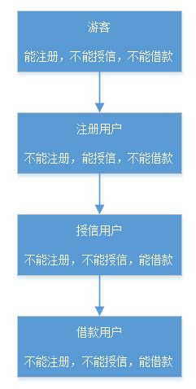

#### 简介（P2P借款状态流程）  

**姓名** ：状态模式  

**英文名** ：State Pattern  

**价值观** ：有啥事让状态我来维护  

**个人介绍** ： Allow an object to alter its behavior when its internal state changes.The object will appear to change its class. 当一个对象内在状态改变时允许其改变行为，这个对象看起来像改变了其类。 （来自《设计模式之禅》）  


#### 你要的故事  

现在有好多个人贷款软件，比如：支付宝、360借条(打广告。。。)等等。贷款会有一个用户状态流程，游客->注册用户->授信用户->借款用户(这里简化了状态，只用 4 个)。每个状态拥有的权限不一样，如下图所示。  
  

从上图可以看到，一个用户有 3 种行为，分别是注册、授信、借款。当注册成功后，用户的状态就从『游客』改变为『注册用户』；当授信成功后，用户的状态就从『注册用户』改变为『授信用户』；当借款成功后，用户的状态就从『授信用户』改变为『借款用户』。现在我们就来实现用户注册、授信、借款的过程，因为每个状态的权限不一样，所以这里需要根据用户的状态来限制用户行为。  

很快，我们就完成下面的代码。  

```java
    private String state;

    public String getState() {
        return state;
    }

    public void setState(String state) {
        this.state = state;
    }

    public void register() {
        if ("none".equals(state)) {
            System.out.println("游客。注册中。。。");
        }else if ("register".equals(state)) {
            System.out.println("注册用户。不需要再注册。");
        } else if ("apply".equals(state)) {
            System.out.println("授信用户。不需要再注册。");
        } else if ("draw".equals(state)) {
            System.out.println("借款用户。不需要再注册。");
        }
    }

    public void apply() {
        if ("none".equals(state)) {
            System.out.println("游客。不能申请授信。");
        }else if ("register".equals(state)) {
            System.out.println("注册用户。授信申请中。。。");
        } else if ("apply".equals(state)) {
            System.out.println("授信用户。不需要再授信。");
        } else if ("draw".equals(state)) {
            System.out.println("借款用户。不需要再授信。");
        }
    }

    public void draw(double money) {
        if ("none".equals(state)) {
            System.out.println("游客。申请借款【" + money + "】元。不能申请借款。");
        } else if ("register".equals(state)) {
            System.out.println("注册用户。申请借款【" + money + "】元。还没授信，不能借款。");
        } else if ("apply".equals(state)) {
            System.out.println("授信用户。申请借款【" + money + "】元。申请借款中。。。");
        } else if ("draw".equals(state)) {
            System.out.println("授信用户。申请借款【" + money + "】元。申请借款中。。。");
        }
    }
}

public class NoStateTest {

    public static void main(String[] args) {
        User user = new User();
        user.setState("register");
        user.draw(1000);
    }

}

打印结果：
注册用户。申请借款【1000.0】元。还没授信，不能借款。
```

上面代码实现了用户 register (注册)，apply (授信)，draw (借款) 这 3 种行为，每个行为都会根据状态 state 来做权限控制。看起来有点繁琐，扩展性不高，假设新增了一个状态，那么注册、授信、借款这 3 种行为的代码都要修改。下面通过`状态模式`来解决这个问题。  

我们把`状态`给抽出来，作为一个接口，因为在每种`状态`中都可能有注册、授信、借款行为，所以把这 3 个行为作为状态接口的方法，让每个状态子类都实现相应的行为控制。如下代码所示。  

```java
interface State {

    void register();

    void apply();

    void draw(double money);
}

/**
 * 游客
 */
class NoneState implements State {

    @Override
    public void register() {
        System.out.println("游客。注册中。。。");
    }

    @Override
    public void apply() {
        System.out.println("游客。不能申请授信。");
    }

    @Override
    public void draw(double money) {
        System.out.println("游客。申请借款【" + money + "】元。不能申请借款。");
    }
}

/**
 * 注册状态
 */
class RegisterState implements State {

    @Override
    public void register() {
        System.out.println("注册用户。不需要再注册。");
    }

    @Override
    public void apply() {
        System.out.println("注册用户。授信申请中。。。");
    }

    @Override
    public void draw(double money) {
        System.out.println("注册用户。申请借款【" + money + "】元。还没授信，不能借款。");
    }
}

/**
 * 授信状态
 */
class ApplyState implements State {

    @Override
    public void register() {
        System.out.println("授信用户。不需要再注册。");
    }

    @Override
    public void apply() {
        System.out.println("授信用户。不需要再授信。");
    }

    @Override
    public void draw(double money) {
        System.out.println("授信用户。申请借款【" + money + "】元。申请借款中。。。");
    }
}

/**
 * 借款状态
 */
class DrawState implements State {

    @Override
    public void register() {
        System.out.println("借款用户。不需要再注册。");
    }

    @Override
    public void apply() {
        System.out.println("借款用户。不需要再授信。");
    }

    @Override
    public void draw(double money) {
        System.out.println("申请借款【" + money + "】元。申请借款中。。。");
    }
}

class User1 {
    private State state;

    public State getState() {
        return state;
    }

    public void setState(State state) {
        this.state = state;
    }

    public void register() {
        this.state.register();
    }

    public void apply() {
        this.state.apply();
    }

    public void draw(double money) {
        this.state.draw(money);
    }
}

public class StateTest {
    public static void main(String[] args) {
        User1 user1 = new User1();
        user1.setState(new RegisterState());
        user1.apply();
        user1.draw(1000);
        user1.setState(new ApplyState());
        user1.draw(2000);
    }

}


打印结果：
注册用户。授信申请中。。。
注册用户。申请借款【1000.0】元。还没授信，不能借款。
授信用户。申请借款【2000.0】元。申请借款中。。。
```

看上面代码，我们抽象了 State 接口，4 种状态分别用 **NoneState (游客)、RegisterState (注册)、ApplyState (授信)、DrawState (借款) **表示。而每个状态都有 3 种行为，它们各自对这些行为进行权限控制。这样子实现可以让权限逻辑分离开，分散到每个状态里面去，如果以后要业务扩展，要新增状态，那就很方便了，只需要再实现一个状态类就可以，不会影响到其他代码。这也是为什么《阿里巴巴 Java 开发手册》里面讲的，当超过 3 层的` if-else `的逻辑判断代码，推荐用状态模式来重构代码。  

#### 总结  

`状态模式` 很好的减低了代码的复杂性，从而提高了系统的可维护性。在业务开发中可以尝试使用，比如在迭代开发中，业务逻辑越来越复杂，从而不得不使用很多` if-else `语句来实现时，就可以考虑一下是不是可以用 状态模式 来重构，特别是一些有状态流程转换方面的业务。看到这篇文章，想想工作中是不是有些复杂的代码可以重构，赶紧行动起来。