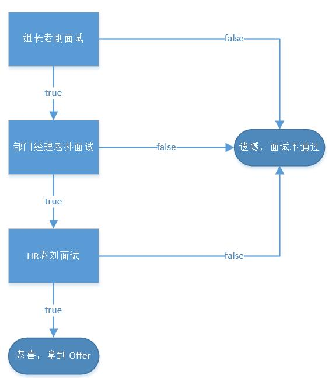

#### 简介（面试过五关斩六将）  

**姓名** ：责任链模式  

**英文名** ：Chain of Responsibility Pattern  

**价值观** ：责任归我  

**个人介绍 **：  

Avoid coupling the sender of a request to its receiver by giving more than one object a chance to handle the request.Chain the receiving objects and pass the request along the chain until an object handles it. 使多个对象都有机会处理请求，从而避免了请求的发送者和接受者之间的耦合关系。将这些对象连成一条链，并沿着这条链传递该请求，直到有对象处理它为止。 （来自《设计模式之禅》）  


#### 你要的故事  

快要金三银四了，很多同学蠢蠢欲动想要去外面看看世界，而大家有没有提前了解各大企业的面试流程呢？这里我就给大家科普一下大多数互联网企业的面试流程，正好责任链模式用得上。  

在互联网企业中，程序员这个岗位的招聘流程大同小异，而一般至少都会有 3 轮面试，分别是 2 轮技术面和 1 轮 HR 面。而这几轮面试都是层层递进的，最开始面试一般是组长面试，通过之后就是部门领导面试，再通过之后就是 HR 面试，HR 面试通过之后就可以成功拿到 Offer 了。  

故事从小明参加某公司的面试开始，某公司的招聘流程就是上面说的 3 轮面试。招聘流程的面试官分别是：第一面是组长老刚，第二面是部门经理老孙，第三面也就是终面是 HR 老刘。为什么说这个场景符合责任链模式呢？首先不管是组长还是部门经理还是 HR，他们都作为面试官，面试官赋予他们的权利是去面试来公司面试的同学，而面试的结果是可传递性的，也就是如果面试通过，就会到下一轮面试，最终成为一条传递链。我们用代码模拟这个过程。  


```java
public class ChainOfResponsibilityTest {

    public static void main(String[] args) {
        Interviewee interviewee = new Interviewee("小明");
        TeamLeader teamLeader = new TeamLeader("老刚");
        DepartMentManager departMentManager = new DepartMentManager("老孙");
        HR hr = new HR("老刘");
        // 设置面试流程
        teamLeader.setNextInterviewer(departMentManager);
        departMentManager.setNextInterviewer(hr);
        // 开始面试
        teamLeader.handleInterview(interviewee);
    }

}

/**
 * 面试者
 */
class Interviewee {

    private String name;

    private boolean teamLeaderOpinion;
    private boolean departMentManagerOpinion;
    private boolean hrOpinion;

    public Interviewee(String name) {
        this.name = name;
    }

    public String getName() {
        return name;
    }

    public void setName(String name) {
        this.name = name;
    }

    public boolean isTeamLeaderOpinion() {
        return teamLeaderOpinion;
    }

    public void setTeamLeaderOpinion(boolean teamLeaderOpinion) {
        this.teamLeaderOpinion = teamLeaderOpinion;
    }

    public boolean isDepartMentManagerOpinion() {
        return departMentManagerOpinion;
    }

    public void setDepartMentManagerOpinion(boolean departMentManagerOpinion) {
        this.departMentManagerOpinion = departMentManagerOpinion;
    }

    public boolean isHrOpinion() {
        return hrOpinion;
    }

    public void setHrOpinion(boolean hrOpinion) {
        this.hrOpinion = hrOpinion;
    }
}

/**
 * 面试官
 */
abstract class Interviewer {

    protected String name;
    protected Interviewer nextInterviewer;

    public Interviewer(String name) {
        this.name = name;
    }

    public Interviewer setNextInterviewer(Interviewer nextInterviewer) {
        this.nextInterviewer = nextInterviewer;
        return this.nextInterviewer;
    }

    public abstract void handleInterview(Interviewee interviewee);

}

/**
 * 组长
 */
class TeamLeader extends Interviewer {

    public TeamLeader(String name) {
        super(name);
    }

    @Override
    public void handleInterview(Interviewee interviewee) {
        System.out.println("组长[" + this.name + "]面试[" + interviewee.getName() + "]同学");
        interviewee.setTeamLeaderOpinion(new Random().nextBoolean());
        if (interviewee.isTeamLeaderOpinion()) {
            System.out.println("[" + interviewee.getName() + "]同学组长轮面试通过");
            this.nextInterviewer.handleInterview(interviewee);
        } else {
            System.out.println("[" + interviewee.getName() + "]同学组长轮面试不通过");
        }
    }
}

/**
 * 部门经理
 */
class DepartMentManager extends Interviewer {

    public DepartMentManager(String name) {
        super(name);
    }

    @Override
    public void handleInterview(Interviewee interviewee) {
        System.out.println("部门经理[" + this.name + "]面试[" + interviewee.getName() + "]同学");
        interviewee.setDepartMentManagerOpinion(new Random().nextBoolean());
        if (interviewee.isDepartMentManagerOpinion()) {
            System.out.println("[" + interviewee.getName() + "]同学部门经理轮面试通过");
            this.nextInterviewer.handleInterview(interviewee);
        } else {
            System.out.println("[" + interviewee.getName() + "]同学部门经理轮面试不通过");
        }
    }
}

/**
 * HR
 */
class HR extends Interviewer {

    public HR(String name) {
        super(name);
    }

    @Override
    public void handleInterview(Interviewee interviewee) {
        System.out.println("HR[" + this.name + "]面试[" + interviewee.getName() + "]同学");
        interviewee.setHrOpinion(new Random().nextBoolean());
        if (interviewee.isHrOpinion()) {
            System.out.println("[" + interviewee.getName() + "]同学HR轮面试通过, 恭喜拿到 Offer");
        } else {
            System.out.println("[" + interviewee.getName() + "]同学HR轮面试不通过");
        }
    }
}

打印结果：
组长[老刚]面试[小明]同学
[小明]同学组长轮面试通过
部门经理[老孙]面试[小明]同学
[小明]同学部门经理轮面试通过
HR[老刘]面试[小明]同学
[小明]同学HR轮面试通过, 恭喜拿到 Offer
```

上面代码打印结果是小明通过层层筛选，通过了面试，拿到了 Offer。下面的图来展现这次面试的流程。  
  

讲解一下代码，Interviewee 是面试者，对于企业来说这个面试者来面试的过程会有 3 个关键标识，就是 3 位面试官对这位面试者的评价，只有都评价好才能通过面试拿到 Offer，所以 Interviewee 类有 3 位面试官的面试结果。  

Interviewer 是面时官，企业中面试官不是一个职位，而是一个工作，帮企业招到合适的人才，所以它是一个抽象类，有一个抽象方法就是去面试应聘者，具体面试过程又各面试官实现，而因为这个面试会有结果反馈，结果好的会进入下一轮面试，所以会有下一个面试官的对象引用，责任链模式也就在这里体现。TeamLeader、DepartMentManager、HR 则为公司的不同职位，而这些职位当公司需要招聘时，都需要去充当面试官，所以都继承了 Interviewer。这整个过程就构成了责任链模式代码示例，希望在金三银四各位蠢蠢欲动的朋友们都能闯到最后一关拿下 HR 姐姐。  

代码： [Chain of Responsibility Pattern](https://github.com/1CSH1/DesignPatterns/blob/master/src/com/liebrother/designpatterns/chainofresponsibility/)  


#### 总结  

责任链模式很好的把**处理的逻辑封装起来**，在代码中，我们看到的只是组长面试，但是其实背后隐藏着部门经理和HR的面试。责任链是不是看起来很熟悉？在开发 Java Web 项目的时候是不是有用到过？Filter 过滤器里面就是用责任链模式来实现的。上面代码还用到了另一个模式，不明确指出来了，考验大家学习这些设计模式的效果，知道的同学可以留言说一下。