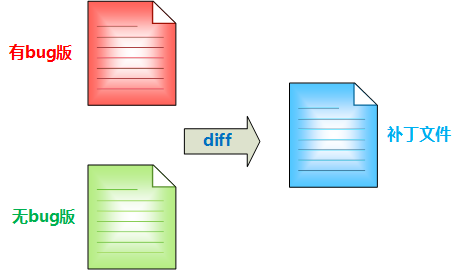
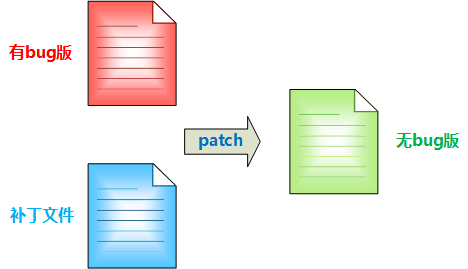
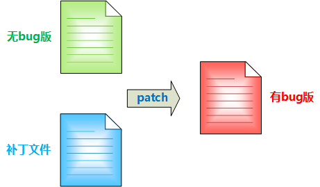

&emsp;&emsp;一般来说，如果我们在研发过程中需要对代码进行修改，是不需要通过打补丁的方式的，因为我们可以直接改动文件即可。但是如果针对一款要上线的产品，我们总不能在研发的电脑上编译通过后直接发布到线上的。（转载请指明出于breaksoftware的csdn博客）因为这样做有很多缺陷：  
* 最后负责编译的同事，可能忘记提交最终的代码。这样代码库中的代码逻辑和线上运行的产品逻辑将存在差异。
* 最后负责编译的同事的编译环境可能已经感染病毒，从而导致编译的产品也携带病毒。这样的产品发布到线上将污染生产环境。
* 无法保证最后负责编译的同事是否对产品逻辑“做过手脚”。
* 无法保证最后负责编译的系统版本和关联库版本和线上环境一致。  

&emsp;&emsp;因为存在种种弊端，所以很多公司都会有专门的编译系统。大家把代码提交到代码库，然后触发编译平台。编译平台会挑选一些编译环境将代码从代码库中拉取下来，然后在这些与外网隔绝的稳定环境中进行代码编译。这样可以杜绝上述问题。  

&emsp;&emsp;在一些成规模的公司，会有很多可供大家公用的代码库。如果我们要实现一个功能，可能会用到这些代码库——即依赖，其与我们工程的关系可以分为以下两种：  
1. 把这些依赖放在我们工程代码内部，成为我们自己的私有代码。
2. 依赖以独立模块存在，不属于我们自己维护的工程代码。只有在编译前才拉取下来。  

&emsp;&emsp;可以看出方案1非常不易于维护，因为我们的依赖库会不定期更新，这样就需要定期检查每个依赖库是否有更新并同步更新。而方案2可以让我们从上述繁琐的工作中解脱出来。我们只要在编译前把库（可能是最新的）拉取到本地或者编译环境下即可，而不用关心库的维护者什么时候进行了更新。因此。一般项目我们都是选用方案2的。  

&emsp;&emsp;上述看着一切都很美好。而然现实往往比理想要复杂很多。比如我们发现依赖库存在bug，而维护者没有时间去验证bug从而无法提供一个我们认为“稳定”的版本。我们又无法登陆公司的编译环境（实际上公司也不会让普通员工登陆编译环境，否则就太危险了），不可以手工修改依赖库的代码。这种条条规则框住的“无解”问题怎么办？给代码打patch此时就有了用武之地了。  

&emsp;&emsp;给代码打patch需要用到两个工具——diff和patch，它们都是linux系统上工具，我们可以很放心的使用。  

&emsp;&emsp;diff工具是用于生成补丁文件的。比如依赖库文件中文件A.cpp有bug，我们修改了bug并将文件另存为A_modify.cpp，这样通过下面命令生成补丁文件A_patch.cpp  

```bash
diff -up A.cpp A_modify.cpp > A_patch.cpp  
```
  
&emsp;&emsp; 在编译前，调用下面指令将补丁临时放到依赖库的A.cpp中  
```bash
patch -p0 < A_patch.cpp  
```
  

&emsp;&emsp; 这个时候A.cpp代码就已经没有bug了，我们执行编译。等编译结束后，我们可以使用下面指令，还原A.cpp到原始的内容，即去除补丁  
```bash
patch -RE -p0 < A_patch.cpp  
```
  

&emsp;&emsp; 举个例子：src目录下有不能修改的代码，而我们需要修改其中若干个文件。则我们将创建一个叫做modiy_src的目录，其中文件和src中文件相对路径一致。这样我们就可以修改modify_src下的代码，然后使用cmp工具对比每个文件。如果发现modify_src中的文件和src中的文件不一致，则在patch_src目录下生成一个相对路径一致的补丁文件  

```bash
#!/bin/sh  
  
function left_to_right(){  
    for element in `ls $1`  
    do  
        left_dir_or_file=$1"/"$element  
        right_dir_or_file=$2"/"$element  
        patch_dir_or_file=$3"/"$element  
        if [ -d $left_dir_or_file ];  
        then  
            left_to_right $left_dir_or_file $right_dir_or_file $patch_dir_or_file  
        else  
            extension=${left_dir_or_file##*.}  
            if [ "$extension"  != "c" -a  "$extension"  != "h" ];  
            then  
                continue  
            fi  
  
            if [ ! -f "$right_dir_or_file" ];  
            then  
                right_path_floder=$(dirname $right_dir_or_file)  
                if [ ! -d "$right_path_floder" ];  
                then  
                    mkdir -p $right_path_floder  
                fi  
                cp $left_dir_or_file $right_dir_or_file  
            else  
                cmp -s $left_dir_or_file $right_dir_or_file  
                different=$?  
                if [ 0 == $different ];  
                then  
                    continue  
                fi  
                patch_path_floder=$(dirname $patch_dir_or_file)  
                if [ ! -d "$patch_path_floder" ];  
                then  
                    mkdir -p $patch_path_floder  
                fi  
                diff -up $left_dir_or_file $right_dir_or_file > $patch_dir_or_file  
            fi  
        fi  
    done  
}  
  
left_to_right src/ modify_src/ patch_src/  
```

&emsp;&emsp; 然后再写一个脚本，对patch_src下文件进行遍历，并且根据传入的参数决定“打补丁”还是“去除补丁”。
```bash
#!/bin/sh  
  
function patch_files(){  
    if [ "$2" == "recover" ];  
    then  
        cover=0  
    elif [ "$2" == "cover" ];  
    then  
        cover=1  
    else  
        echo "sh patch_files cover/recover"  
        exit  
    fi  
  
    for element in `ls $1`  
    do  
        patch_dir_or_file=$1"/"$element  
        if [ -d $patch_dir_or_file ];  
        then  
            patch_files $patch_dir_or_file $2  
        else  
            if [ 0 == $cover ];  
            then  
                patch -RE -p0 < $patch_dir_or_file  
            else  
                patch -p0 < $patch_dir_or_file  
            fi  
        fi  
    done  
}  
  
patch_files patch_src/ $1  
```
&emsp;&emsp; 这样在编译时我们这么做，以保证编译正确的代码，同时在编译结束后将代码还原

```bash
sh ./patch_files.sh cover  
make  
sh ./patch_files.sh recover  
```