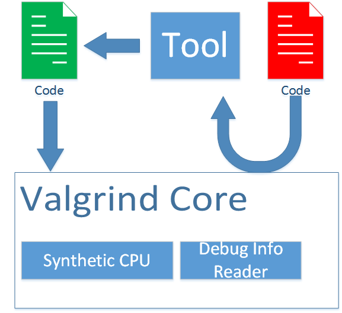
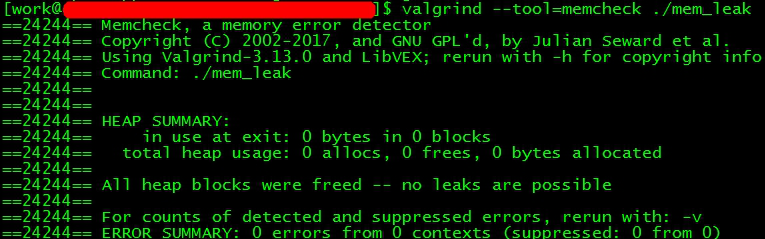
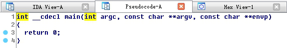
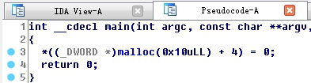
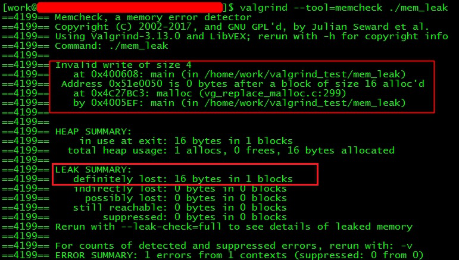
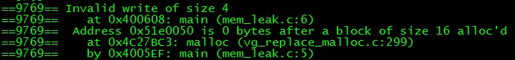
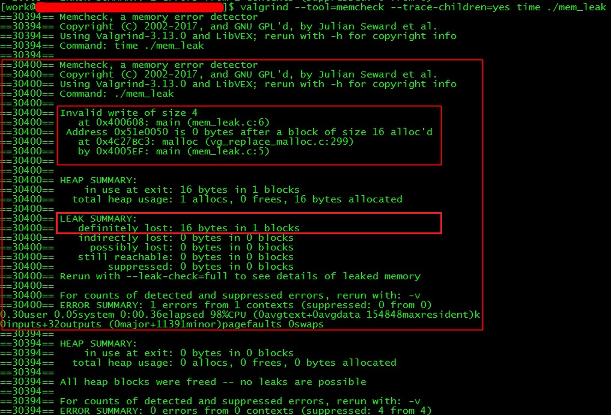

&emsp;&emsp; [valgrind](http://valgrind.org/downloads/repository.html)是一个知名的分析软件集。我们可以使用它进行内存、多线程及性能等各种问题的分析。它采用非侵入方式，所谓非侵入方式是指：我们不用在代码中插入分析工具的库。这对于开发者来说是友好的。因为如果要将工具编译到文件中，或者要调用其提供的一些API，才能进行问题分析，无疑增大了用户的学习和使用成本。  
```bash
valgrind [valgrind-options] your-prog [your-prog-options]  
```
&emsp;&emsp;当我们需要分析一款软件时，只要采用上面格式的调用。其中your-prog是被分析的程序文件路径，your-prog-options是原本要传递给待分析程序的参数。valgrind-options是valgrind的一些参数，最常用的是--tool=【tool_name】。我们可以使用不同的tool进行不同的分析，比如使用memcheck进行内存问题分析。  
```bash
valgrind --tool=memcheck ls -l  
```
&emsp;&emsp;那么valgrind和memcheck到底是什么关系呢？我们可以通过下图表达出  
  
&emsp;&emsp;当待分析程序片段第一次被执行时，valgrind会将代码片段交给工具——比如内存调试时使用的memcheck处理，工具会在代码中插入一些辅助分析的代码片段。新的代码会在valgrind模拟出的CPU上执行。然后valgrind会结合之前读取到的待执行程序和其所关联的库文件的调试信息，输出分析结果。  
&emsp;&emsp;因为有新插入的代码逻辑，valgrind运行下的程序都比其独立运行时要慢。视选择的工具不同，其效率可能是正常值的1/4~1/50。所以使用valgrind做性能分析时，一般不使用绝对数据，而使用相同环境下的相对数据进行对比。  
&emsp;&emsp;为了让valgrind读取出准确的调试信息，待分析程序最好**使用-O0禁止编译器优化**，以及**使用-g让编译器把行号信息编入到文件中**。比如对于下面的代码  
```c++
#include <stdlib.h>  
  
int main() {  
    const int array_count = 4;  
    int* p = malloc(array_count * sizeof(int));  
    p[array_count] = 0;  
    return 0;  
}  
```
&emsp;&emsp;如果我们使用O2参数让编译器去做优化  

```bash
gcc -O2 mem_leak.c -o mem_leak  
```
&emsp;&emsp;编译器会认为4~6行是没有意义的，于是被优化了。于是使用valgrind分析不出代码的问题  
  
&emsp;&emsp;这并不是valgrind的错误，因为编译器的确编译出了一个空的main函数。我们可以用IDA反编译看看  
  
&emsp;&emsp;所以我们要使用O0禁止编译优化  
```bash
gcc -O0 mem_leak.c -o mem_leak  
```
 &emsp;&emsp;此时编译出来的二进制代码可以被解读为  
   
   
&emsp;&emsp;此时使用valgrind分析，可以看到它给出内存写违例和内存泄露的报告。  
  

&emsp;&emsp;但是它没有告诉我们哪行出错了，于是我们要加上-g编译参数  
```bash
gcc -g -O0 mem_leak.c -o mem_leak  
```
&emsp;&emsp;这样我们可以看到第6行导致写违例。  
  
&emsp;&emsp;有时候，待分析的程序会启动子程序。如果我们希望分析子程序，则需要增加--trace-children=yes。比如我们使用time启动上面的程序  
  
&emsp;&emsp; 可以看出，valgrind分析出作为父程序的time是没有问题的，但是作为子程序的mem_leak有两个错误。  


下载地址:http://valgrind.org/downloads/current.html#current  

安装过程：（可以直接查看README文档来确认安装过程）  

```console
tools/valgrind-3.12.0> pwd
/proj/MPS_DEV_REPO/xchonxu/tools
> tar -jxf valgrind-3.12.0.tar.bz2
> cd /proj/MPS_DEV_REPO/xchonxu/tools/valgrind-3.12.0
> vim README
> ls
> ./autogen.sh
> ./configure --prefix=/home/xchonxu/bin
> make
> make install

#验证是否成功：
> cd ~
> ls
> cd bin/
> ls
> cd bin/
> ls
> ./valgrind ls -l
> ./valgrind --leak-check=full ls -l
```

Valgrind 命令介绍：  

```console
#用法: valgrind [options] prog-and-args 
[options]: 常用选项，适用于所有Valgrind工具

    -tool=<name> 最常用的选项。运行 valgrind中名为toolname的工具。默认memcheck。

        memcheck ------> 这是valgrind应用最广泛的工具，一个重量级的内存检查器，能够发现开发中绝大多数内存错误使用情况，比如：使用未初始化的内存，使用已经释放了的内存，内存访问越界等。
        callgrind ------> 它主要用来检查程序中函数调用过程中出现的问题。
        cachegrind ------> 它主要用来检查程序中缓存使用出现的问题。
        helgrind ------> 它主要用来检查多线程程序中出现的竞争问题。
        massif ------> 它主要用来检查程序中堆栈使用中出现的问题。
        extension ------> 可以利用core提供的功能，自己编写特定的内存调试工具

    -h –help 显示帮助信息。
    -version 显示valgrind内核的版本，每个工具都有各自的版本。
    -q –quiet 安静地运行，只打印错误信息。
    -v –verbose 更详细的信息, 增加错误数统计。
    -trace-children=no|yes 跟踪子线程? [no]
    -track-fds=no|yes 跟踪打开的文件描述？[no]
    -time-stamp=no|yes 增加时间戳到LOG信息? [no]
    -log-fd=<number> 输出LOG到描述符文件 [2=stderr]
    -log-file=<file> 将输出的信息写入到filename.PID的文件里，PID是运行程序的进行ID
    -log-file-exactly=<file> 输出LOG信息到 file
    -log-file-qualifier=<VAR> 取得环境变量的值来做为输出信息的文件名。 [none]
    -log-socket=ipaddr:port 输出LOG到socket ，ipaddr:port

#LOG信息输出
    -xml=yes 将信息以xml格式输出，只有memcheck可用
    -num-callers=<number> show <number> callers in stack traces [12]
    -error-limit=no|yes 如果太多错误，则停止显示新错误? [yes]
    -error-exitcode=<number> 如果发现错误则返回错误代码 [0=disable]
    -db-attach=no|yes 当出现错误，valgrind会自动启动调试器gdb。[no]
    -db-command=<command> 启动调试器的命令行选项[gdb -nw %f %p]

#适用于Memcheck工具的相关选项：
    -leak-check=no|summary|full 要求对leak给出详细信息? [summary]
    -leak-resolution=low|med|high how much bt merging in leak check [low]
    -show-reachable=no|yes show reachable blocks in leak check? [no]

#最常用的命令格式：
valgrind --tool=memcheck --leak-check=full ./test
```