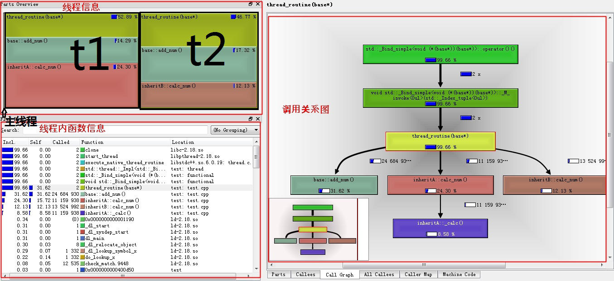
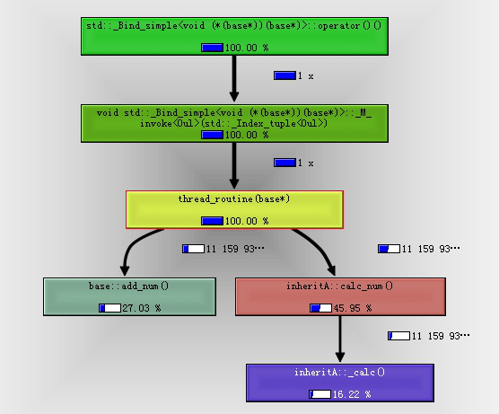
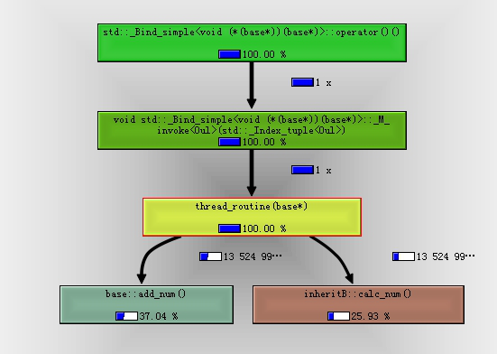
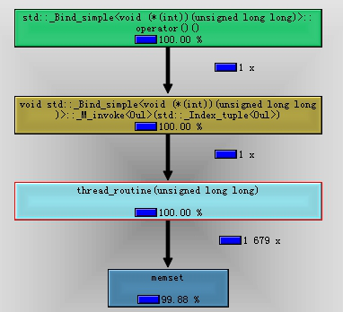
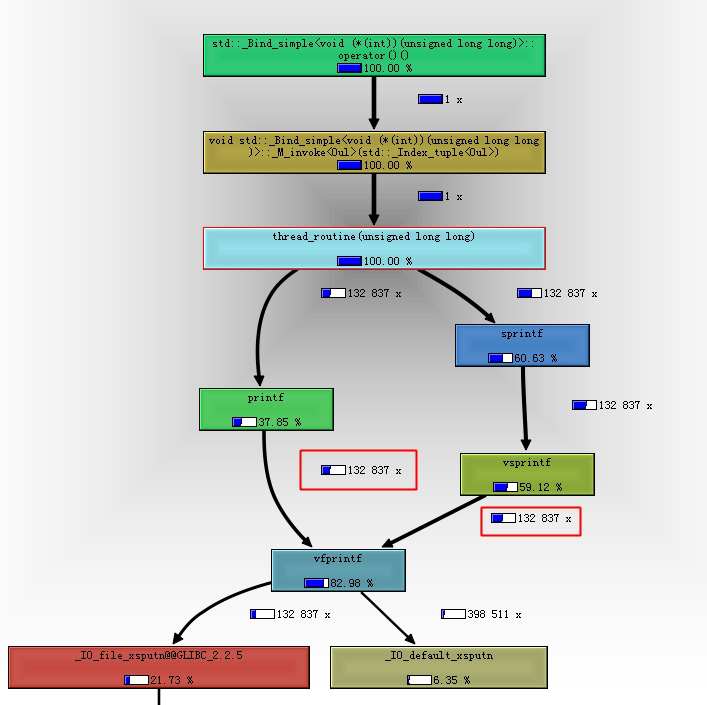

&emsp;&emsp;在《内存、性能问题分析的利器——valgraind》一文中我们简单介绍了下valgrind工具集，本文将使用callgrind工具进行动态执行流程分析和性能瓶颈分析。（转载请指明出于breaksoftware的csdn博客）  
&emsp;&emsp;之前的《利器》系列中，我们介绍了两种静态分析函数调用关系的工具（《静态分析C语言生成函数调用关系的利器——calltree》和《静态分析C语言生成函数调用关系的利器——cflow》)。一般来说，静态分析工具比较适合做代码前期检查，或者辅助阅读理解。但是对于问题排查，或者非常规的函数调用，动态分析功能可能更适合。  
&emsp;&emsp;我们以虚函数调用为例。base基类包含一个虚函数calc_num()，一个protected型变量n，和一个将n进行自增的public方法add_num()  
```c++
class base {  
public:  
    virtual void calc_num() = 0;  
public:  
    void add_num () {  
        n++;  
    }     
protected:  
    unsigned long long n;  
};  
```
&emsp;&emsp;inheritA类继承于base基类。其定义了一个私有函数_calc()为虚函数calc_num()提供计算结果。为了不引入干扰阅读的逻辑，我们简单给的让其返回0。  
```c++
class inheritA  :  
    public base  
{  
public:  
    void calc_num() {  
        n = _calc();  
    }     
private:  
    unsigned long long _calc() {  
        return 0;  
    }     
};  
```
&emsp;&emsp; inheritB也继承虚base基类。它只是简单的实现了虚函数calc_num，让其等于0。  
&emsp;&emsp;现在我们启动两个线程，t1线程运行的是inheritA逻辑，t2线程运行的是inheritB逻辑。（最后我没释放new出来的对象，只是为了让程序稳定运行起来。这种方式不可以作为参考。）  
```c++
void thread_routine(base* obj_ptr) {  
    while (true) {  
        obj_ptr->calc_num();  
        obj_ptr->add_num();  
    }  
}  
  
int main() {  
    base* t1_data = new inheritA;  
    std::thread t1(thread_routine, t1_data);  
    t1.detach();  
  
    base* t2_data = new inheritB;  
    std::thread t2(thread_routine, t2_data);  
    t2.detach();  
  
    sleep(10);      
    return 0;    
}
```
&emsp;&emsp; 我们使用下面指令进行编译  

```bash
g++ -O0 -g -std=c++11 -lpthread test.cpp -o test 
```
&emsp;&emsp;然后使用valgrind进行分析。因为我们的程序是多线程的，所以要开启--separate-threads=yes  
```bash
valgrind --tool=callgrind --separate-threads=yes ./test  
```
&emsp;&emsp;这样在当前目录下，产生如下文件：callgrind.out.12830，callgrind.out.12830-01，callgrind.out.12830-02，callgrind.out.12830-03。没有后缀的文件只是用于标记这次分析属于哪个进程。01是主线程的信息，02、03是主线程启动的两个子线程的信息。

&emsp;&emsp;如果我们文本阅读工具打开这些文件，可以发现内容不太容易解读  
```c++
fl=(23)  
fn=(1202)  
39 4  
+2 6  
cfn=(1230) inheritB::calc_num()  
calls=1 -7   
* 7  
* 81149946  
cfn=(1230)  
calls=13524991 -7   
* 94674937  
+1 40574976  
cfn=(1208) base::add_num()  
calls=13524992 -32   
* 135249920  
-3 13524991  
```
&emsp;&emsp;一个强大的工具，肯定不能这么让人去使用，否则会大大增加了其使用成本。[kcachegrind](https://jaist.dl.sourceforge.net/project/precompiledbin/kcachegrind.zip)就是一款帮助我们分析这些数据的工具。  
&emsp;&emsp;在kcachegrind中，打开callgrind.out.12830文件。  
  
&emsp;&emsp;这个界面主要分为3个区域。线程信息可以显示该进程有多少线程信息被统计。每个线程信息在图上都有一定的显示宽度，其宽度占比和线程在整个进程中CPU占用占比一致。所以我们看到，在例子中，忙碌的两个子线程在图中显示最为明显，而主线程因为几乎一致在执行sleep，所以我们几乎只能看到一根线。  
&emsp;&emsp;我们点击线程信息区域的t1，再在线程内函数信息区域点击thread_routine，调用关系图区域显示  
  
&emsp;&emsp;以同样步骤切换到t2线程，显示  
  
&emsp;&emsp;该图没法显示一个函数内的函数调用关系，比如上图中base::add_num和inheritB::calc_num哪个先调用是看不出来的。但是我们可以看到每个函数内部的CPU资源占用——函数框内部的百分比数值，和每个函数的调用次数——线条旁的数字。这些信息也可以在线程内函数信息区域看到。  
&emsp;&emsp;有了CPU资源占用占比和调用次数等信息，我们就可以分析性能瓶颈了。虽然在valgrind中运行的程序比正常运行的都要慢很多，但是这种慢可以认为是对所有操作都慢，所以我们只要查看某个过程在整体中的占比就可以了。  
&emsp;&emsp;我们再次简化例子  
```c++
#include <unistd.h>  
#include <stdlib.h>  
#include <thread>    
#include <iostream>  
  
void thread_routine(unsigned long long n) {  
    while (true) {  
        const int array_size = 32;  
        char buf[array_size] = {0};  
        sprintf(buf, "%lu\n", n++);  
        printf(buf);  
    }     
}  
  
int main() {  
    std::thread t(thread_routine, 0);   
    t.detach();  
    sleep(10);      
    return 0;    
}  
```

&emsp;&emsp;这段程序进行简单的累加和打印操作。经过几次运行，平均每次可以打印到150,000。  
&emsp;&emsp;稍微改动下代码，将array_size改成1024 * 1024 * 8。  
```c++
const int array_size = 1024 * 1024 * 8;  
```
&emsp;&emsp;再次编译运行后，发现平均每次可以打印到16,500。  
&emsp;&emsp;可以见得，改动后程序执行效率只有之前的1/10。这种慢已经慢出一个数量级了！  
&emsp;&emsp;我们使用valgrind进行分析，过程和之前分析调用关系一样。我们只简单的解读下结果  
  
&emsp;&emsp;上图我们看到,memset几乎占用的所有的CPU资源。可是我们代码中没有memset啊！  
&emsp;&emsp;虽然我们代码中没有显示调用memset，但是在使用0初始化数组时，编译器是使用memset实现的。  
&emsp;&emsp; 那么我们不初始化数组（虽然教课书上教我们需要初始化，但是应用场景和实验室场景需要考虑的问题是不太一样的，要灵活应变），代码改成  
```c++
const int array_size = 1024 * 1024 * 8;  
char buf[array_size]; // = {0};  
sprintf(buf, "%lu\n", n++);  
```
&emsp;&emsp; 编译运行之，可以发现程序的效率回到140,000左右。  
&emsp;&emsp; 假如我们对这个数据还不满意，继续使用上述方法分析  
  
&emsp;&emsp;最耗时的是vfprintf，其占到了82.98%的CPU资源。代码中printf和sprintf都会调用到它，且它们调用次数相等——132,837次，这也和代码逻辑是一致的。但是相同调用次数下，不同渠道来的CPU资源占比不一样。printf（包括自身和其调用的vfprintf）资源占比只有37.85%，而sprintf资源占比则有60.63%。那么如果我们优化掉sprintf，则调用效率应该又会有所提升。把代码改成  
```c++
void thread_routine(unsigned long long n) {  
    while (true) {  
        printf("%lu\n", n++);  
    }     
}  
```
&emsp;&emsp;编译运行后，还是输出还是在150,000！  
&emsp;&emsp; 这并不符合我们的分析，那什么原因呢？  
&emsp;&emsp;屏幕设备也是一种资源！我们在屏幕上输出信息也是占用一种资源，而且这种资源是稀缺的。所以我们将输出重定向到文件中，则发现优化前的方案可以输出到60,000,000左右；优化后的方案可以输出到80,000,000。虽然效率增幅没有想象中那么大，但是也有33%。