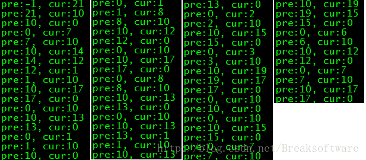
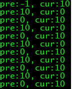

&emsp;&emsp;在工作中，我们可能遇到这样的需求：如何评估程序在一核和多核下的工作效率差距？最简单的想法是找一台只有一个CPU逻辑核的机器和一台有多个逻辑核的机器。但是这种方式有明显的问题：  
* 不容易找到这样的机器。  
* 找到的机器不能保证其他配置一致，比如CPU主频。  
* 找的的机器不能保证环境一致，比如操作系统或者运行中的其他程序。  
&emsp;&emsp;于是比较好的方式是：在一台多逻辑核的机器上指定程序可以运行在哪些核上。为了可以证明我们程序在多个核心上切换，我编写了如下代码  
```c++
// build script:gcc -lpthread bind_core.c -o bind_core  
#include <stdio.h>  
#include <pthread.h>  
#include <sched.h>  
  
void* thread_routine(void* arg) {  
    int cpu = -1;  
    while(1) {  
        int cur_cpu = sched_getcpu();  
        if (cur_cpu != cpu) {  
          printf("pre:%d, cur:%d\n", cpu, cur_cpu);  
         cpu = cur_cpu;  
        }  
    }  
};  
  
void test_cpu_switch() {  
    pthread_t thread;  
    pthread_create(&thread, NULL, thread_routine, NULL);  
    pthread_detach(thread);  
    sleep(100);  
}  
```
&emsp;&emsp;这段代码中启动了一个线程，通过sched_getcpu函数不停检测当前占用的逻辑核心编号。如果发生核心切换，就打印出来。在一台相对繁忙的40个逻辑核心机器上，其输出结果如下：  
  

&emsp;&emsp;上图可以看出，程序分别在：0,1,2,3,7,8,10,12,13,14,15,17,19,21号逻辑核上运行过。为了让CPU在固定的核心上执行，我们可以使用taskset指令，让程序绑定逻辑核心。  
```bash
taskset -c 0,10 ./bind_core  
```
&emsp;&emsp;上面指令让bind_core执行于0和10号逻辑核心上，这样我就可以看到它在这两个核心上的切换  
  

&emsp;&emsp;基于上面的基础，我们可以编写测试代码，看看多线程程序在单核心和多核心下的处理能力  
```c++
#include <stdio.h>  
#include <pthread.h>  
#include <sched.h>  
  
unsigned long g_a = 0;  
unsigned long g_b = 0;  
  
void* thread_routine(void* arg) {  
    while(1) {  
        (*((unsigned long*)arg))++;  
    }  
};  
  
void test_cpu_ability() {  
    pthread_t thread_a;  
    pthread_create(&thread_a, NULL, thread_routine, &g_a);  
    pthread_detach(thread_a);  
  
    pthread_t thread_b;  
    pthread_create(&thread_b, NULL, thread_routine, &g_b);  
    pthread_detach(thread_b);  
  
    sleep(3);  
    printf("a:%lu\tb:%lu\n", g_a, g_b);  
};  
```
&emsp;&emsp;这段代码启动了两个线程，每个线程分别不停自增。过了3秒后，通过两个全局变量的值表达出不同场景的处理能力：  
1. 不设置CPU绑定

```bash
./bind_core  
a:999409723     b:994174648  
```
2. 设置绑定到0号CPU逻辑核心  
```bash
taskset -c 0 ./bind_core  
a:563819215     b:564766868  
```
3. 设置绑定到0,1号CPU逻辑核心  
```bash
taskset -c 0,1 ./bind_core  
a:1113333145    b:1072107088  
```
4. 设置绑定到0,1,2号CPU逻辑核心  
```bash
taskset -c 0,1,2 ./bind_core  
a:1114825104    b:1113289961  
```
&emsp;&emsp;可以看到，当启动两个线程时，绑定一个核心的处理能力是绑定两个核心的处理能力的一半左右。而绑定的核心数超过线程数时（如绑定到0,1,2号逻辑核心），其效率并没有明显提高。当然上述结论有个前提：这是CPU资源密集型的场景。