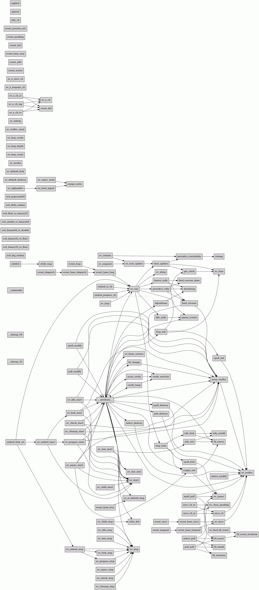

&emsp;&emsp;当项目中引入了一些第三方或者开源库时，如果没有详细的文档说明，我们往往有种“盲人摸象”的感觉。如果只是简单的使用还好，但是这些代码需要被定制时，就需要深入阅读理解其实现。这个时候又往往有种“无从入手”的感觉。特别是对一些大型的项目，管理者往往需要划分出不同模块交由下属去理解，于是划分的依据是什么？如果没有一个总体统筹的认识，很多工作都无法开展下去。本文将探讨的工具将协助我们解决这些问题。  

&emsp;&emsp;对于C语言的项目，一些文件动辄几千行代码，上百个函数体，理解起来颇有些费劲。这个时候我们可以使用calltree工具对代码进行静态分析，然后产生调用关系树，使得我们可以对代码的构成有个初步的认识。这样可以让我们站在高处，俯览全局，制定出一个着实可行的阅读理解方案。(题外话：静态分析中发生不准确的现象很常见)  

&emsp;&emsp;**calltree的说明**  
&emsp;&emsp; calltree是个很古老的项目，其英文资料也不太好找，我在此粘贴下我找到的说明：  
&emsp;&emsp; calltree - static call tree generator for C programs The calltree command parses a collection of input files (assuming C syntax) and builds a graph that represents the static call structure of these files. Calltree is similar to cflow(1) but unlike cflow(1), calltree is not based on lint(1). Calltree implements some more functions than cflow(1), but does not list the return types of the functions. This is because calltree includes an own C parser and thus may be used even on systems that don't have lint(1). The disadvantage is that the C parser that is used by calltree is not completely correct and may not find all calls of a function. This is mainly true for calls that are done via function pointers. Calltree is able to detect recursive function calls (e.g. functions that call themselves). Recursive function calls are marked with an ellipsis in the output.  

&emsp;&emsp; 这段问题大意是：calltree是一个针对C语言代码的静态分析工具。它可以以图像的形式产出函数的调用关系。但是calltree和cflow不一样，cflow使用的是lint工具（一个更古老的工具）去预处理代码，而calltree使用的是自己的解释器。这样带来什么问题呢？那就是calltree可以运行于没有预装lint工具的系统，增强了其适用性。可惜的是calltree的C语言代码解释器实现的不是那么好，导致其可能无法找到所有函数。一个典型的例子就是通过函数指针进行函数调用的场景。  

&emsp;&emsp; 上文中还提到一个工具cflow。可能有人要问为什么不使用cflow去分析呢？每个工具都有利弊，calltree是我觉得正好够用且使用方便的一个工具。特别是其可以指定函数名去分析，这个原生的功能非常重要。因为一般在开源项目中，如果对全局或者某个文件进行分析，可能分析出非常杂乱的调用关系图。导致分析出来的结果对代码的解读没有一点帮助。如果希望了解cflow的使用方法，可以参见《静态分析C语言生成函数调用关系的利器——cflow》。  
&emsp;&emsp; 接下来我们将讲解其编译过程。  
  
&emsp;&emsp; **calltree的编译**    
&emsp;&emsp; 由于项目过于古老，我只能在https://directory.fsf.org/wiki/Calltree上找到2004年发布的2.3版本。但是不知道是不是“Great Wall”的问题，其提供的下载地址已经不能访问。于是只能选用国内网站上提供的包(http://download.chinaunix.net/down.php?id=2245&ResourceID=1172&site=1)。  
&emsp;&emsp; 使用下面的指令进行解压
```bash
tar -jxvf calltree-2.3.tar.bz2  
```
&emsp;&emsp; 进入解压后的文件夹执行make命令或报错
```bash
In file included from calltree.c:33:0:  
../include/schily.h:110:12: error: conflicting types for 鈥榝execve鈥  
 extern int fexecve __PR((const char *, FILE *, FILE *, FILE *,  
            ^  
In file included from ../include/unixstd.h:37:0,  
                 from calltree.c:31:  
/usr/include/unistd.h:557:12: note: previous declaration of 鈥榝execve鈥was here  
 extern int fexecve (int __fd, char *const __argv[], char *const __envp[])  
            ^  
In file included from calltree.c:33:0:  
../include/schily.h:186:12: error: conflicting types for 鈥榞etline鈥  
 extern int getline __PR((char *, int));  
            ^  
In file included from calltree.c:28:0:  
/usr/include/stdio.h:678:20: note: previous declaration of 鈥榞etline鈥was here  
 extern _IO_ssize_t getline (char **__restrict __lineptr,  
                    ^  
../RULES/r-gmake.obj:33: recipe for target 'OBJ/i686-linux-cc/calltree.o' failed  
make[1]: *** [OBJ/i686-linux-cc/calltree.o] Error 1  
```
&emsp;&emsp; 其原因是calltree作者在编写代码时，给自己的函数起了一个之后被gcc使用了的名称，这样就造成了冲突。很显然，这种场景我们优先想到的是修改“用户”的代码，而不是去给GCC打patch。于是我们调用下面命令修改冲突的函数名  
```bash
find . -name "*.[c|h]" |xargs sed -i -e "s/fexecve/fexecve_calltree/"  
find . -name "*.[c|h]" |xargs sed -i -e "s/getline/getline_calltree/"  
```
&emsp;&emsp; 然后再make就不会出错了。在我的系统中，calltree最终被编译在./calltree/OBJ/i686-linux-cc/目录下  
&emsp;&emsp;为了方便使用，可以将calltree软链到bin下  
```bash
ln -s 【Your Path】/calltree-2.3/calltree/OBJ/i686-linux-cc/calltree calltree  
```

&emsp;&emsp; **calltree的使用**  
&emsp;&emsp;使用calltree --help指令我们可以看到其参数说明
```bash
Usage:  calltree [calltree_options] [cpp_options] file1..filen  
Options:  
        -b              Print a vertial Bar at each tab stop.  
        -r              Invert the structure of the tree.  
        -f              Flattened (cumulative) tree.  
        -g              Print file names past procedure names.  
        -m              Call structure for main only.  
        -p              Use C Preprocessor (default).  
        -np             Don't use C Preprocessor.  
        -u              List all functions not called via 'main'.  
        -e              List all functions not called.  
        -x              List all external functions.  
        -xvcg           Format output for xvcg.  
        -dot            Format output for graphviz.  
        -v              Be verbose.  
        -help           Print this help.  
        -version        Print version number.  
        igorefile=file  Don't list functions found in 'file'.  
        listfile=file   List only functions found in 'file'.  
        list=name       Produce call graph only for function 'name'.  
        depth=#         Set the maximum printed nesting depth to #.  
        s=#             Set indentation to #.  
ignorefile=, listfile= and depth= may be abbreviated by first letter.  
list= may be abbreviated by lf=.  
```
&emsp;&emsp;我只列出我觉得有意思的几个参数：  
&emsp;&emsp;-g输出函数所在文件的目录  
&emsp;&emsp;-m参数只用于分析main函数中的函数调用关系。  
&emsp;&emsp;-p参数是默认的。它表示要使用C语言预处理程序分析代码。缺点是它会产生很多我们不关心的消息。
&emsp;&emsp;-np和-p是相反的。它表示不要使用C语言预处理程序分析代码。如果指定它，可能会导致分析过程出错。因为像开源项目，有几个不需要预处理处理下呢？  
&emsp;&emsp; -xvcg参数表示导出一个可以使用VCG软件处理的格式的文件。  
&emsp;&emsp;-dot参数表示导出一个dot格式文件，可以供graphviz处理的。  
&emsp;&emsp;list可以让我们指定仅仅需要分析的函数里的函数调用。  

&emsp;&emsp;**文本输出**  
&emsp;&emsp;文本输出只是为了展示calltree的能力。我们libev库的ev_run方法为例，切到代码目录后调用  
```bash
calltree -bg list="ev_run" *.c   
```
&emsp;&emsp;输出如下（过滤掉一些无关输出）  
```bash
ev_run [ev.c:3336]:  
|   __assert_fail [/usr/include/assert.h:71]  
|   __builtin_expect  
|   __volatile__  
|   ev_feed_event  
|   ev_sleep [ev.c:1696]  
|   |   nanosleep  
|   fd_reify [ev.c:1867]  
|   getpid [/usr/include/unistd.h:628]  
|   idle_reify [ev.c:3099]  
|   |   __builtin_expect  
|   |   queue_events [ev.c:1821]  
|   |   |   ev_feed_event  
|   loop_fork [ev.c:2839]  
|   |   close  
|   |   epoll_fork [ev_epoll.c:272]  
|   |   |   close  
|   |   |   epoll_create [/usr/include/i386-linux-gnu/sys/epoll.h:100]  
|   |   |   ev_syserr [ev.c:1487]  
|   |   |   |   abort [/usr/include/stdlib.h:515]  
|   |   |   |   perror  
|   |   |   |   syserr_cb  
|   |   |   fcntl  
|   |   |   fd_rearm_all  
|   |   ev_feed_event  
|   |   ev_io_stop  
|   |   ev_ref [ev.c:3514]  
|   |   evpipe_init [ev.c:2183]  
|   |   |   __errno_location [/usr/include/i386-linux-gnu/bits/errno.h:50]  
|   |   |   close  
|   |   |   dup2 [/usr/include/unistd.h:534]  
|   |   |   ev_io_start  
|   |   |   ev_syserr [ev.c:1487]  
|   |   |   |   abort [/usr/include/stdlib.h:515]  
|   |   |   |   perror  
|   |   |   |   syserr_cb  
|   |   |   ev_unref [ev.c:3520]  
|   |   |   eventfd  
|   |   |   fd_intern [ev.c:2008]  
|   |   |   |   fcntl  
|   |   |   pipe [/usr/include/unistd.h:417]  
|   |   infy_fork [ev.c:4193]  
|   |   |   close  
|   |   |   ev_io_start  
|   |   |   ev_io_stop  
|   |   |   ev_ref [ev.c:3514]  
|   |   |   ev_timer_again  
|   |   |   ev_unref [ev.c:3520]  
|   |   |   fd_intern [ev.c:2008]  
|   |   |   |   fcntl  
|   |   |   infy_add  
|   |   |   infy_newfd [ev.c:4160]  
|   |   |   |   inotify_init [/usr/include/i386-linux-gnu/sys/inotify.h:84]  
|   |   |   |   inotify_init1 [/usr/include/i386-linux-gnu/sys/inotify.h:87]  
|   periodics_reify [ev.c:3186]  
|   |   __assert_fail [/usr/include/assert.h:71]  
|   |   downheap [ev.c:2042]  
|   |   |   __builtin_expect  
|   |   ev_periodic_stop  
|   |   feed_reverse [ev.c:1806]  
|   |   |   __attribute__ [/usr/include/string.h:538]  
|   |   |   |   __assert_fail [/usr/include/assert.h:71]  
|   |   |   |   __attribute__ [/usr/include/string.h:538] ....  
|   |   |   |   __builtin_expect  
|   |   |   |   __builtin_offsetof  
|   |   |   |   __errno_location [/usr/include/i386-linux-gnu/bits/errno.h:50]  
|   |   |   |   __volatile__  
|   |   |   |   adjustheap [ev.c:2144]  
|   |   |   |   |   downheap [ev.c:2042]  
|   |   |   |   |   |   __builtin_expect  
|   |   |   |   |   upheap [ev.c:2122]  
|   |   |   |   array_realloc [ev.c:1747]  
|   |   |   |   |   array_nextsize [ev.c:1726]  
|   |   |   |   |   ev_realloc [ev.c:1534]  
|   |   |   |   |   |   abort [/usr/include/stdlib.h:515]  
|   |   |   |   |   |   alloc  
|   |   |   |   |   |   fprintf  
|   |   |   |   array_verify [ev.c:2919]  
|   |   |   |   |   __assert_fail [/usr/include/assert.h:71]  
|   |   |   |   |   verify_watcher [ev.c:2895]  
|   |   |   |   |   |   __assert_fail [/usr/include/assert.h:71]  
|   |   |   |   cb  
|   |   |   |   clear_pending [ev.c:3577]  
|   |   |   |   close  
|   |   |   |   epoll_destroy [ev_epoll.c:265]  
|   |   |   |   |   array_free  
|   |   |   |   |   ev_free  
|   |   |   |   |   ev_realloc [ev.c:1534]  
|   |   |   |   |   |   abort [/usr/include/stdlib.h:515]  
|   |   |   |   |   |   alloc  
|   |   |   |   |   |   fprintf  
|   |   |   |   ev_backend [ev.c:2570]  
|   |   |   |   ev_feed_event  
|   |   |   |   ev_io_start  
|   |   |   |   ev_io_stop  
|   |   |   |   ev_is_default_loop [ev.h:567]  
|   |   |   |   |   ev_default_loop_uc_ [ev.h:559]  
|   |   |   |   ev_linux_version [ev.c:1433]  
|   |   |   |   |   uname [/usr/include/i386-linux-gnu/sys/utsname.h:81]  
|   |   |   |   ev_periodic_start  
|   |   |   |   ev_periodic_stop  
|   |   |   |   ev_realloc [ev.c:1534]  
|   |   |   |   |   abort [/usr/include/stdlib.h:515]  
|   |   |   |   |   alloc  
|   |   |   |   |   fprintf  
|   |   |   |   ev_ref [ev.c:3514]  
|   |   |   |   ev_run [ev.c:3336] ....  
|   |   |   |   ev_signal_start  
|   |   |   |   ev_signal_stop  
|   |   |   |   ev_start [ev.c:3613]  
|   |   |   |   |   ev_ref [ev.c:3514]  
|   |   |   |   |   pri_adjust [ev.c:3604]  
|   |   |   |   ev_stat_stat [ev.c:4247]  
|   |   |   |   |   lstat [/usr/include/i386-linux-gnu/sys/stat.h:263]  
|   |   |   |   ev_stop [ev.c:3621]  
|   |   |   |   |   ev_unref [ev.c:3520]  
|   |   |   |   ev_supported_backends  
|   |   |   |   ev_timer_again  
|   |   |   |   ev_timer_start  
|   |   |   |   ev_timer_stop  
|   |   |   |   ev_unref [ev.c:3520]  
|   |   |   |   evpipe_init [ev.c:2183]  
|   |   |   |   |   __errno_location [/usr/include/i386-linux-gnu/bits/errno.h:50]  
|   |   |   |   |   close  
|   |   |   |   |   dup2 [/usr/include/unistd.h:534]  
|   |   |   |   |   ev_io_start  
|   |   |   |   |   ev_syserr [ev.c:1487]  
|   |   |   |   |   |   abort [/usr/include/stdlib.h:515]  
|   |   |   |   |   |   perror  
|   |   |   |   |   |   syserr_cb  
|   |   |   |   |   ev_unref [ev.c:3520]  
|   |   |   |   |   eventfd  
|   |   |   |   |   fd_intern [ev.c:2008]  
|   |   |   |   |   |   fcntl  
|   |   |   |   |   pipe [/usr/include/unistd.h:417]  
|   |   |   |   fcntl  
|   |   |   |   fd_change [ev.c:1927]  
|   |   |   |   |   __attribute__ [/usr/include/string.h:538] ....  
|   |   |   |   |   __builtin_expect  
|   |   |   |   |   array_realloc [ev.c:1747]  
|   |   |   |   |   |   array_nextsize [ev.c:1726]  
|   |   |   |   |   |   ev_realloc [ev.c:1534]  
|   |   |   |   |   |   |   abort [/usr/include/stdlib.h:515]  
|   |   |   |   |   |   |   alloc  
|   |   |   |   |   |   |   fprintf  
|   |   |   |   fd_intern [ev.c:2008]  
|   |   |   |   |   fcntl  
|   |   |   |   floor [/usr/include/i386-linux-gnu/bits/mathcalls.h:184]  
|   |   |   |   getegid [/usr/include/unistd.h:684]  
|   |   |   |   geteuid [/usr/include/unistd.h:678]  
|   |   |   |   getgid [/usr/include/unistd.h:681]  
|   |   |   |   getuid [/usr/include/unistd.h:675]  
|   |   |   |   infy_add  
|   |   |   |   infy_del  
|   |   |   |   infy_wd  
|   |   |   |   inotify_add_watch [/usr/include/i386-linux-gnu/sys/inotify.h:92]  
|   |   |   |   inotify_rm_watch [/usr/include/i386-linux-gnu/sys/inotify.h:95]  
|   |   |   |   loop_init [ev.c:2628]  
|   |   |   |   |   atoi [/usr/include/stdlib.h:148]  
|   |   |   |   |   clock_gettime [/usr/include/time.h:342]  
|   |   |   |   |   enable_secure  
|   |   |   |   |   epoll_init [ev_epoll.c:240]  
|   |   |   |   |   |   __errno_location [/usr/include/i386-linux-gnu/bits/errno.h:50]  
|   |   |   |   |   |   epoll_create [/usr/include/i386-linux-gnu/sys/epoll.h:100]  
|   |   |   |   |   |   epoll_create1 [/usr/include/i386-linux-gnu/sys/epoll.h:104]  
|   |   |   |   |   |   ev_malloc  
|   |   |   |   |   |   ev_realloc [ev.c:1534]  
|   |   |   |   |   |   |   abort [/usr/include/stdlib.h:515]  
|   |   |   |   |   |   |   alloc  
|   |   |   |   |   |   |   fprintf  
|   |   |   |   |   |   fcntl  
|   |   |   |   |   ev_recommended_backends  
|   |   |   |   |   ev_time [ev.c:1655]  
|   |   |   |   |   |   gettimeofday [/usr/include/i386-linux-gnu/sys/time.h:72]  
|   |   |   |   |   get_clock [ev.c:1673]  
|   |   |   |   |   |   __builtin_expect  
|   |   |   |   |   |   clock_gettime [/usr/include/time.h:342]  
|   |   |   |   |   |   ev_time [ev.c:1655]  
|   |   |   |   |   |   |   gettimeofday [/usr/include/i386-linux-gnu/sys/time.h:72]  
|   |   |   |   |   getenv [/usr/include/stdlib.h:564]  
|   |   |   |   |   getpid [/usr/include/unistd.h:628]  
|   |   |   |   |   poll_init [ev_poll.c:131]  
|   |   |   |   |   select_init [ev_select.c:276]  
|   |   |   |   memset [/usr/include/string.h:66]  
|   |   |   |   periodic_recalc  
|   |   |   |   poll_destroy [ev_poll.c:144]  
|   |   |   |   |   ev_free  
|   |   |   |   |   ev_realloc [ev.c:1534]  
|   |   |   |   |   |   abort [/usr/include/stdlib.h:515]  
|   |   |   |   |   |   alloc  
|   |   |   |   |   |   fprintf  
|   |   |   |   queue_events [ev.c:1821]  
|   |   |   |   |   ev_feed_event  
|   |   |   |   reschedule_cb  
|   |   |   |   select_destroy [ev_select.c:305]  
|   |   |   |   |   ev_free  
|   |   |   |   |   ev_realloc [ev.c:1534]  
|   |   |   |   |   |   abort [/usr/include/stdlib.h:515]  
|   |   |   |   |   |   alloc  
|   |   |   |   |   |   fprintf  
|   |   |   |   sigaction [/usr/include/signal.h:260]  
|   |   |   |   sigaddset [/usr/include/signal.h:221]  
|   |   |   |   sigdelset [/usr/include/signal.h:224]  
|   |   |   |   sigemptyset [/usr/include/signal.h:215]  
|   |   |   |   sigfillset [/usr/include/signal.h:218]  
|   |   |   |   signal [/usr/include/signal.h:103]  
|   |   |   |   signalfd  
|   |   |   |   sigprocmask [/usr/include/signal.h:249]  
|   |   |   |   stat_timer_cb  
|   |   |   |   statfs [/usr/include/i386-linux-gnu/sys/statfs.h:32]  
|   |   |   |   strcpy [/usr/include/string.h:130]  
|   |   |   |   strlen [/usr/include/string.h:399]  
|   |   |   |   strrchr [/usr/include/string.h:263]  
|   |   |   |   upheap [ev.c:2122]  
|   |   |   |   verify_heap [ev.c:2904]  
|   |   |   |   |   __assert_fail [/usr/include/assert.h:71]  
|   |   |   |   |   verify_watcher [ev.c:2895]  
|   |   |   |   |   |   __assert_fail [/usr/include/assert.h:71]  
|   |   |   |   verify_watcher [ev.c:2895]  
|   |   |   |   |   __assert_fail [/usr/include/assert.h:71]  
|   |   |   |   wlist_add [ev.c:3554]  
|   |   |   |   wlist_del [ev.c:3561]  
|   |   |   |   |   __builtin_expect  
|   |   |   __builtin_expect  
|   |   |   array_realloc [ev.c:1747]  
|   |   |   |   array_nextsize [ev.c:1726]  
|   |   |   |   ev_realloc [ev.c:1534]  
|   |   |   |   |   abort [/usr/include/stdlib.h:515]  
|   |   |   |   |   alloc  
|   |   |   |   |   fprintf  
|   |   feed_reverse_done [ev.c:1813]  
|   |   |   ev_feed_event  
|   |   periodic_recalc  
|   |   reschedule_cb  
|   queue_events [ev.c:1821]  
|   |   ev_feed_event  
|   time_update [ev.c:3267]  
|   |   __builtin_expect  
|   |   ev_time [ev.c:1655]  
|   |   |   gettimeofday [/usr/include/i386-linux-gnu/sys/time.h:72]  
|   |   get_clock [ev.c:1673]  
|   |   |   __builtin_expect  
|   |   |   clock_gettime [/usr/include/time.h:342]  
|   |   |   ev_time [ev.c:1655]  
|   |   |   |   gettimeofday [/usr/include/i386-linux-gnu/sys/time.h:72]  
|   |   periodics_reschedule [ev.c:3229]  
|   |   |   periodic_recalc  
|   |   |   reheap [ev.c:2154]  
|   |   |   |   upheap [ev.c:2122]  
|   |   |   reschedule_cb  
|   |   timers_reschedule [ev.c:3252]  
|   timers_reify [ev.c:3122]  
|   |   __assert_fail [/usr/include/assert.h:71]  
|   |   downheap [ev.c:2042]  
|   |   |   __builtin_expect  
|   |   ev_timer_stop  
|   |   feed_reverse [ev.c:1806]  
|   |   |   __attribute__ [/usr/include/string.h:538]  
|   |   |   |   __assert_fail [/usr/include/assert.h:71]  
|   |   |   |   __attribute__ [/usr/include/string.h:538] ....  
|   |   |   |   __builtin_expect  
|   |   |   |   __builtin_offsetof  
|   |   |   |   __errno_location [/usr/include/i386-linux-gnu/bits/errno.h:50]  
|   |   |   |   __volatile__  
|   |   |   |   adjustheap [ev.c:2144]  
|   |   |   |   |   downheap [ev.c:2042]  
|   |   |   |   |   |   __builtin_expect  
|   |   |   |   |   upheap [ev.c:2122]  
|   |   |   |   array_realloc [ev.c:1747]  
|   |   |   |   |   array_nextsize [ev.c:1726]  
|   |   |   |   |   ev_realloc [ev.c:1534]  
|   |   |   |   |   |   abort [/usr/include/stdlib.h:515]  
|   |   |   |   |   |   alloc  
|   |   |   |   |   |   fprintf  
|   |   |   |   array_verify [ev.c:2919]  
|   |   |   |   |   __assert_fail [/usr/include/assert.h:71]  
|   |   |   |   |   verify_watcher [ev.c:2895]  
|   |   |   |   |   |   __assert_fail [/usr/include/assert.h:71]  
|   |   |   |   cb  
|   |   |   |   clear_pending [ev.c:3577]  
|   |   |   |   close  
|   |   |   |   epoll_destroy [ev_epoll.c:265]  
|   |   |   |   |   array_free  
|   |   |   |   |   ev_free  
|   |   |   |   |   ev_realloc [ev.c:1534]  
|   |   |   |   |   |   abort [/usr/include/stdlib.h:515]  
|   |   |   |   |   |   alloc  
|   |   |   |   |   |   fprintf  
|   |   |   |   ev_backend [ev.c:2570]  
|   |   |   |   ev_feed_event  
|   |   |   |   ev_io_start  
|   |   |   |   ev_io_stop  
|   |   |   |   ev_is_default_loop [ev.h:567]  
|   |   |   |   |   ev_default_loop_uc_ [ev.h:559]  
|   |   |   |   ev_linux_version [ev.c:1433]  
|   |   |   |   |   uname [/usr/include/i386-linux-gnu/sys/utsname.h:81]  
|   |   |   |   ev_periodic_start  
|   |   |   |   ev_periodic_stop  
|   |   |   |   ev_realloc [ev.c:1534]  
|   |   |   |   |   abort [/usr/include/stdlib.h:515]  
|   |   |   |   |   alloc  
|   |   |   |   |   fprintf  
|   |   |   |   ev_ref [ev.c:3514]  
|   |   |   |   ev_run [ev.c:3336] ....  
|   |   |   |   ev_signal_start  
|   |   |   |   ev_signal_stop  
|   |   |   |   ev_start [ev.c:3613]  
|   |   |   |   |   ev_ref [ev.c:3514]  
|   |   |   |   |   pri_adjust [ev.c:3604]  
|   |   |   |   ev_stat_stat [ev.c:4247]  
|   |   |   |   |   lstat [/usr/include/i386-linux-gnu/sys/stat.h:263]  
|   |   |   |   ev_stop [ev.c:3621]  
|   |   |   |   |   ev_unref [ev.c:3520]  
|   |   |   |   ev_supported_backends  
|   |   |   |   ev_timer_again  
|   |   |   |   ev_timer_start  
|   |   |   |   ev_timer_stop  
|   |   |   |   ev_unref [ev.c:3520]  
|   |   |   |   evpipe_init [ev.c:2183]  
|   |   |   |   |   __errno_location [/usr/include/i386-linux-gnu/bits/errno.h:50]  
|   |   |   |   |   close  
|   |   |   |   |   dup2 [/usr/include/unistd.h:534]  
|   |   |   |   |   ev_io_start  
|   |   |   |   |   ev_syserr [ev.c:1487]  
|   |   |   |   |   |   abort [/usr/include/stdlib.h:515]  
|   |   |   |   |   |   perror  
|   |   |   |   |   |   syserr_cb  
|   |   |   |   |   ev_unref [ev.c:3520]  
|   |   |   |   |   eventfd  
|   |   |   |   |   fd_intern [ev.c:2008]  
|   |   |   |   |   |   fcntl  
|   |   |   |   |   pipe [/usr/include/unistd.h:417]  
|   |   |   |   fcntl  
|   |   |   |   fd_change [ev.c:1927]  
|   |   |   |   |   __attribute__ [/usr/include/string.h:538] ....  
|   |   |   |   |   __builtin_expect  
|   |   |   |   |   array_realloc [ev.c:1747]  
|   |   |   |   |   |   array_nextsize [ev.c:1726]  
|   |   |   |   |   |   ev_realloc [ev.c:1534]  
|   |   |   |   |   |   |   abort [/usr/include/stdlib.h:515]  
|   |   |   |   |   |   |   alloc  
|   |   |   |   |   |   |   fprintf  
|   |   |   |   fd_intern [ev.c:2008]  
|   |   |   |   |   fcntl  
|   |   |   |   floor [/usr/include/i386-linux-gnu/bits/mathcalls.h:184]  
|   |   |   |   getegid [/usr/include/unistd.h:684]  
|   |   |   |   geteuid [/usr/include/unistd.h:678]  
|   |   |   |   getgid [/usr/include/unistd.h:681]  
|   |   |   |   getuid [/usr/include/unistd.h:675]  
|   |   |   |   infy_add  
|   |   |   |   infy_del  
|   |   |   |   infy_wd  
|   |   |   |   inotify_add_watch [/usr/include/i386-linux-gnu/sys/inotify.h:92]  
|   |   |   |   inotify_rm_watch [/usr/include/i386-linux-gnu/sys/inotify.h:95]  
|   |   |   |   loop_init [ev.c:2628]  
|   |   |   |   |   atoi [/usr/include/stdlib.h:148]  
|   |   |   |   |   clock_gettime [/usr/include/time.h:342]  
|   |   |   |   |   enable_secure  
|   |   |   |   |   epoll_init [ev_epoll.c:240]  
|   |   |   |   |   |   __errno_location [/usr/include/i386-linux-gnu/bits/errno.h:50]  
|   |   |   |   |   |   epoll_create [/usr/include/i386-linux-gnu/sys/epoll.h:100]  
|   |   |   |   |   |   epoll_create1 [/usr/include/i386-linux-gnu/sys/epoll.h:104]  
|   |   |   |   |   |   ev_malloc  
|   |   |   |   |   |   ev_realloc [ev.c:1534]  
|   |   |   |   |   |   |   abort [/usr/include/stdlib.h:515]  
|   |   |   |   |   |   |   alloc  
|   |   |   |   |   |   |   fprintf  
|   |   |   |   |   |   fcntl  
|   |   |   |   |   ev_recommended_backends  
|   |   |   |   |   ev_time [ev.c:1655]  
|   |   |   |   |   |   gettimeofday [/usr/include/i386-linux-gnu/sys/time.h:72]  
|   |   |   |   |   get_clock [ev.c:1673]  
|   |   |   |   |   |   __builtin_expect  
|   |   |   |   |   |   clock_gettime [/usr/include/time.h:342]  
|   |   |   |   |   |   ev_time [ev.c:1655]  
|   |   |   |   |   |   |   gettimeofday [/usr/include/i386-linux-gnu/sys/time.h:72]  
|   |   |   |   |   getenv [/usr/include/stdlib.h:564]  
|   |   |   |   |   getpid [/usr/include/unistd.h:628]  
|   |   |   |   |   poll_init [ev_poll.c:131]  
|   |   |   |   |   select_init [ev_select.c:276]  
|   |   |   |   memset [/usr/include/string.h:66]  
|   |   |   |   periodic_recalc  
|   |   |   |   poll_destroy [ev_poll.c:144]  
|   |   |   |   |   ev_free  
|   |   |   |   |   ev_realloc [ev.c:1534]  
|   |   |   |   |   |   abort [/usr/include/stdlib.h:515]  
|   |   |   |   |   |   alloc  
|   |   |   |   |   |   fprintf  
|   |   |   |   queue_events [ev.c:1821]  
|   |   |   |   |   ev_feed_event  
|   |   |   |   reschedule_cb  
|   |   |   |   select_destroy [ev_select.c:305]  
|   |   |   |   |   ev_free  
|   |   |   |   |   ev_realloc [ev.c:1534]  
|   |   |   |   |   |   abort [/usr/include/stdlib.h:515]  
|   |   |   |   |   |   alloc  
|   |   |   |   |   |   fprintf  
|   |   |   |   sigaction [/usr/include/signal.h:260]  
|   |   |   |   sigaddset [/usr/include/signal.h:221]  
|   |   |   |   sigdelset [/usr/include/signal.h:224]  
|   |   |   |   sigemptyset [/usr/include/signal.h:215]  
|   |   |   |   sigfillset [/usr/include/signal.h:218]  
|   |   |   |   signal [/usr/include/signal.h:103]  
|   |   |   |   signalfd  
|   |   |   |   sigprocmask [/usr/include/signal.h:249]  
|   |   |   |   stat_timer_cb  
|   |   |   |   statfs [/usr/include/i386-linux-gnu/sys/statfs.h:32]  
|   |   |   |   strcpy [/usr/include/string.h:130]  
|   |   |   |   strlen [/usr/include/string.h:399]  
|   |   |   |   strrchr [/usr/include/string.h:263]  
|   |   |   |   upheap [ev.c:2122]  
|   |   |   |   verify_heap [ev.c:2904]  
|   |   |   |   |   __assert_fail [/usr/include/assert.h:71]  
|   |   |   |   |   verify_watcher [ev.c:2895]  
|   |   |   |   |   |   __assert_fail [/usr/include/assert.h:71]  
|   |   |   |   verify_watcher [ev.c:2895]  
|   |   |   |   |   __assert_fail [/usr/include/assert.h:71]  
|   |   |   |   wlist_add [ev.c:3554]  
|   |   |   |   wlist_del [ev.c:3561]  
|   |   |   |   |   __builtin_expect  
|   |   |   __builtin_expect  
|   |   |   array_realloc [ev.c:1747]  
|   |   |   |   array_nextsize [ev.c:1726]  
|   |   |   |   ev_realloc [ev.c:1534]  
|   |   |   |   |   abort [/usr/include/stdlib.h:515]  
|   |   |   |   |   alloc  
|   |   |   |   |   fprintf  
|   |   feed_reverse_done [ev.c:1813]  
|   |   |   ev_feed_event  
```
&emsp;&emsp;**图形化输出**  
&emsp;&emsp;图像化输出我们只看dot格式。  
&emsp;&emsp;首先我们使用下面命令把结果保存到我们指定的文件中  
```bash
calltree -dot list="ev_run" *.c > ev_run.dot  
```
&emsp;&emsp;然后调用graphviz（没有安装的可以使用apt-get install graphviz先安装）  
```bash
dot -Tgif ev_run.dot -o ev_run.gif  
```
&emsp;&emsp; 然后我们将图片打开查看，就发现图形化输出更加便于理解  
  

&emsp;&emsp;**总结**  
&emsp;&emsp;calltree除了在编译时会遇到一点小曲折外，其他功能基本是够用的。所以我认为calltree+graphviz是分析C源码很好的组合。有人提出使用cflow替代calltree，一是因为calltree不再维护，而cflow“一直在更新”。然后我发现，calltree的最后一个版本是2004年的；cflow最后一个版本是2011年的。就目前而言，它们两的更新都停滞了，所以我认为“更新进度”不能成为排除calltree而选择cflow的原因。而且相对于cflow，calltree的使用非常方便，并且它具有一个cflow不具备的优点：calltree可以直接生成dot文件，然后借助graphviz将其转换成图片。而cflow只能输出ASCII的调用关系图，不借助中间工具不能转成dot。