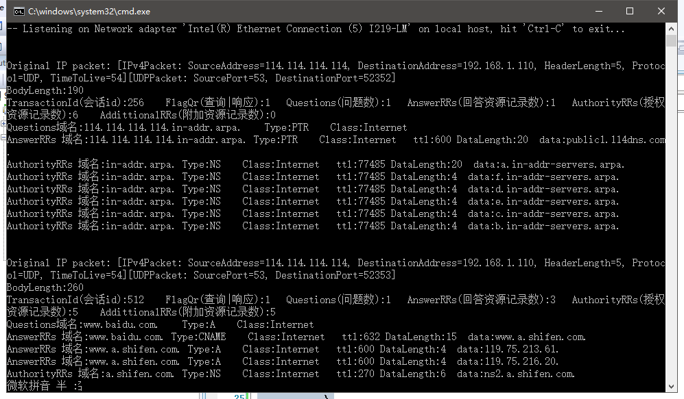

工具：  
[sharppcap](https://github.com/chmorgan/sharppcap)  
[RFC1035报文格式](https://tools.ietf.org/html/rfc1035)  

用sharppcap 抓取报文  
```c#
using System;
using System.Collections.Generic;
using System.Linq;
using System.Net;
using System.Net.NetworkInformation;
using System.Text;
using PacketDotNet;
using SharpPcap;
using SharpPcap.LibPcap;

namespace PackageFilter
{
    internal class Program
    {
        private static void Main(string[] args)
        {
            string ver = SharpPcap.Version.VersionString;
            Console.WriteLine("SharpPcap {0}", ver);
            CaptureDeviceList devices = CaptureDeviceList.Instance;

            if (devices.Count < 1)
            {
                Console.WriteLine("No devices were found on this machine");
                return;
            }
            int i = 0;
            foreach (ICaptureDevice dev in devices)
            {
                Console.WriteLine("{0}) {1} {2}", i, dev.Name, dev.Description);
                i++;
            }

            Console.WriteLine();
            Console.Write("-- Please choose a device to gather statistics on: ");
            //var choice = 2;// int.Parse(Console.ReadLine());
            var choice = int.Parse(Console.ReadLine());
            ICaptureDevice device = null;
            if (choice == i)
            {
                Console.Write("-- Please enter an input capture file name: ");
                string capFile = Console.ReadLine();
                device = new CaptureFileReaderDevice(capFile);
            }
            else
            {
                device = devices[choice];
            }
            //Register our handler function to the 'packet arrival' event
            device.OnPacketArrival +=
                new PacketArrivalEventHandler(device_OnPacketArrival);

            // Open the device for capturing
            device.Open();
            device.Filter = "src port 53 and port domain";
            Console.WriteLine();
            Console.WriteLine
                ("-- Listening on {0}, hit 'Ctrl-C' to exit...",
                device.Description);

            // Start capture 'INFINTE' number of packets
            device.Capture();

            // Close the pcap device
            // (Note: this line will never be called since
            //  we're capturing infinite number of packets
            device.Close();
        }

        private static void device_OnPacketArrival(object sender, CaptureEventArgs e)
        {
            var packet = PacketDotNet.Packet.ParsePacket(e.Packet.LinkLayerType, e.Packet.Data);
            if (packet is PacketDotNet.EthernetPacket)
            {
                var ip = (PacketDotNet.IPv4Packet)packet.Extract(typeof(PacketDotNet.IPv4Packet));
                if (ip != null)
                {
                    var udp = (PacketDotNet.UdpPacket)packet.Extract(typeof(PacketDotNet.UdpPacket));
                    if (udp != null)
                    {
                        //manipulate UDP parameters
                        //udp.SourcePort = 9999;
                        //udp.DestinationPort = 53;
                        Console.WriteLine("");
                        Console.WriteLine("");
                        Console.WriteLine("Original IP packet: " + ip.ToString());
                        //Console.WriteLine("Original UDP packet: " + udp.ToString());
                        //Console.WriteLine(udp.PrintHex());
                        int nHeaderIndex = 0;
                        int TransactionId = BitConverter.ToUInt16(udp.PayloadData, nHeaderIndex);
                        nHeaderIndex += 2;
                        ushort flags = BitConverter.ToUInt16(udp.PayloadData, nHeaderIndex);
                        nHeaderIndex += 2;
                        short Questions = IPAddress.NetworkToHostOrder((short)BitConverter.ToUInt16(udp.PayloadData, nHeaderIndex));
                        nHeaderIndex += 2;
                        short AnswerRRs = IPAddress.NetworkToHostOrder((short)BitConverter.ToUInt16(udp.PayloadData, nHeaderIndex));
                        nHeaderIndex += 2;
                        short AuthorityRRs = IPAddress.NetworkToHostOrder((short)BitConverter.ToUInt16(udp.PayloadData, nHeaderIndex));
                        nHeaderIndex += 2;
                        short AddittionalRRs = IPAddress.NetworkToHostOrder((short)BitConverter.ToUInt16(udp.PayloadData, nHeaderIndex));
                        nHeaderIndex += 2;
                        Console.WriteLine("BodyLength:" + udp.PayloadData.Length);
                        Console.WriteLine("TransactionId(会话id):{0}    FlagQr(查询|响应):{1}   Questions(问题数):{2}   AnswerRRs(回答资源记录数):{3}   AuthorityRRs(授权资源记录数):{4}    AddittionalRRs(附加资源记录数):{5}"
                            , TransactionId, (flags >> 15), Questions, AnswerRRs, AuthorityRRs, AddittionalRRs);

                        int nBodyIndex = nHeaderIndex;
                        if (Questions > 0)
                        {
                            for (int i = 0; i < Questions; i++)
                            {
                                string domain = "";
                                do
                                {
                                    int nLenght = (int)(udp.PayloadData[nBodyIndex++]);
                                    byte[] dest = new byte[nLenght];
                                    Array.Copy(udp.PayloadData, nBodyIndex, dest, 0, nLenght);
                                    domain += System.Text.Encoding.ASCII.GetString(dest);
                                    nBodyIndex += nLenght;
                                    domain += ".";
                                } while (udp.PayloadData[nBodyIndex] != 0x00);
                                nBodyIndex++;
                                Int16 nQueryType = IPAddress.NetworkToHostOrder((short)BitConverter.ToUInt16(udp.PayloadData, nBodyIndex));
                                nBodyIndex += 2;
                                Int16 nQueryClass = IPAddress.NetworkToHostOrder((short)BitConverter.ToUInt16(udp.PayloadData, nBodyIndex));
                                nBodyIndex += 2;
                                string strQueryType = "";
                                string strQueryClass = "";
                                switch (nQueryType)
                                {
                                    case 1: strQueryType = "A"; break;
                                    case 2: strQueryType = "NS"; break;
                                    case 5: strQueryType = "CNAME"; break;
                                    case 6: strQueryType = "SOA"; break;
                                    case 11: strQueryType = "WKS"; break;
                                    case 12: strQueryType = "PTR"; break;
                                    case 13: strQueryType = "HINFO"; break;
                                    case 15: strQueryType = "MX"; break;
                                    case 28: strQueryType = "AAAA"; break;
                                    case 252: strQueryType = "AXFR"; break;
                                    case 255: strQueryType = "ANY"; break;
                                }
                                switch (nQueryClass)
                                {
                                    case 1: strQueryClass = "Internet"; break;
                                }
                                Console.WriteLine("Questions域名:{0}    Type:{1}    Class:{2}",
                                    domain, strQueryType, strQueryClass);
                            }
                        }
                        int nTotalRRS = AnswerRRs + AuthorityRRs + AddittionalRRs;
                        if (nTotalRRS > 0)
                        {
                            for (int i = 0; i < nTotalRRS; i++)
                            {
                                bool bIsPtrDomainData = udp.PayloadData[nBodyIndex] >> 6 == 3 ? true : false;//11000000  ptr data
                                string domain = "";
                                if (bIsPtrDomainData)
                                {
                                    byte[] newData = new byte[2] { udp.PayloadData[nBodyIndex + 1], (byte)(udp.PayloadData[nBodyIndex] & 0x3F) };
                                    short nPtrIndex = (short)BitConverter.ToUInt16(newData, 0);//0011 1111 1111 1111
                                    nBodyIndex += 2;
                                    do
                                    {
                                        bIsPtrDomainData = udp.PayloadData[nPtrIndex] >> 6 == 3 ? true : false;//11000000  ptr data
                                        if (bIsPtrDomainData)
                                        {//如果是压缩编码，则计算起始偏移量
                                            byte[] newDataTmp = new byte[2] { udp.PayloadData[nPtrIndex + 1], (byte)(udp.PayloadData[nPtrIndex] & 0x3F) };
                                            nPtrIndex = (short)BitConverter.ToUInt16(newDataTmp, 0);
                                            continue;
                                        }

                                        short nLenght = (short)(char)udp.PayloadData[nPtrIndex++];
                                        byte[] dest = new byte[nLenght];
                                        Array.Copy(udp.PayloadData, nPtrIndex, dest, 0, nLenght);
                                        domain += System.Text.Encoding.ASCII.GetString(dest);
                                        nPtrIndex += nLenght;
                                        domain += ".";
                                    } while (udp.PayloadData[nPtrIndex] != 0x00);
                                }
                                else
                                {
                                    do
                                    {
                                        int nLenght = (int)udp.PayloadData[nBodyIndex++];
                                        byte[] dest = new byte[nLenght];
                                        Array.Copy(udp.PayloadData, nBodyIndex, dest, 0, nLenght);
                                        domain += System.Text.Encoding.ASCII.GetString(dest);
                                        nBodyIndex += nLenght;
                                        domain += ".";
                                    } while (udp.PayloadData[nBodyIndex] != 0x00);
                                    nBodyIndex++;
                                }
                                Int16 nQueryType = IPAddress.NetworkToHostOrder((short)BitConverter.ToUInt16(udp.PayloadData, nBodyIndex));
                                nBodyIndex += 2;
                                Int16 nQueryClass = IPAddress.NetworkToHostOrder((short)BitConverter.ToUInt16(udp.PayloadData, nBodyIndex));
                                nBodyIndex += 2;
                                Int32 nTTL = IPAddress.NetworkToHostOrder(BitConverter.ToInt32(udp.PayloadData, nBodyIndex));
                                nBodyIndex += 4;
                                string strQueryType = "";
                                string strQueryClass = "";
                                switch (nQueryType)
                                {
                                    case 1: strQueryType = "A"; break;
                                    case 2: strQueryType = "NS"; break;
                                    case 5: strQueryType = "CNAME"; break;
                                    case 6: strQueryType = "SOA"; break;
                                    case 11: strQueryType = "WKS"; break;
                                    case 12: strQueryType = "PTR"; break;
                                    case 13: strQueryType = "HINFO"; break;
                                    case 15: strQueryType = "MX"; break;
                                    case 28: strQueryType = "AAAA"; break;
                                    case 252: strQueryType = "AXFR"; break;
                                    case 255: strQueryType = "ANY"; break;
                                }
                                switch (nQueryClass)
                                {
                                    case 1: strQueryClass = "Internet"; break;
                                }

                                string strData = "";
                                Int16 nDataLenght = IPAddress.NetworkToHostOrder((short)BitConverter.ToUInt16(udp.PayloadData, nBodyIndex));
                                nBodyIndex += 2;

                                if (nQueryType == 1 || nQueryType == 28)
                                {
                                    for (int k = 0; k < nDataLenght; k++)
                                    {
                                        strData += udp.PayloadData[nBodyIndex + k];
                                        strData += ".";
                                    }
                                }
                                else
                                {
                                    int nPtrIndex = nBodyIndex;
                                    do
                                    {
                                        bIsPtrDomainData = udp.PayloadData[nPtrIndex] >> 6 == 3 ? true : false;//11000000  ptr data
                                        if (bIsPtrDomainData)
                                        {//如果是压缩编码，则计算起始偏移量
                                            byte[] newDataTmp = new byte[2] { udp.PayloadData[nPtrIndex + 1], (byte)(udp.PayloadData[nPtrIndex] & 0x3F) };
                                            nPtrIndex = (short)BitConverter.ToUInt16(newDataTmp, 0);
                                            continue;
                                        }

                                        int nLenght = (int)(char)udp.PayloadData[nPtrIndex++];
                                        byte[] dest = new byte[nLenght];
                                        Array.Copy(udp.PayloadData, nPtrIndex, dest, 0, nLenght);
                                        strData += System.Text.Encoding.ASCII.GetString(dest);
                                        nPtrIndex += nLenght;
                                        strData += ".";
                                    } while (udp.PayloadData[nPtrIndex] != 0x00);
                                }
                                nBodyIndex += nDataLenght;

                                string answerdata = "AnswerRRs";
                                if (i >= AnswerRRs && i < (AnswerRRs + AuthorityRRs))
                                {
                                    answerdata = "AuthorityRRs";
                                }
                                else if (i >= (AnswerRRs + AuthorityRRs))
                                {
                                    answerdata = "AddittionalRRs";
                                }
                                Console.WriteLine("{0} 域名:{1} Type:{2}    Class:{3}   ttl:{4} DataLength:{5}  data:{6}"
                                    , answerdata, domain, strQueryType, strQueryClass, nTTL, nDataLenght, strData);
                            }
                        }
                    }
                }
            }
        }
    }
}
```

