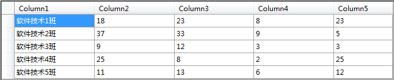
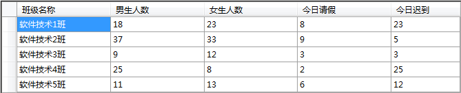
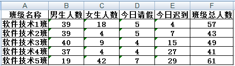

# 简介  
https://www.cnblogs.com/cang12138/p/8992506.html  

Aspose.Cells是一款功能强大的 Excel 文档处理和转换控件，不依赖 Microsoft Excel 环境，支持所有 Excel 格式类型的操作。  
下载 [Aspose.Cells.dll](http://files.cnblogs.com/files/cang12138/Aspose.Cells.zip)  


# 获取Excel数据  

```c#
Workbook workbook = new Workbook("E:\\test.xlsx");
Cells cells = workbook.Worksheets[0].Cells;
for (int i = 0; i < cells.MaxDataRow + 1; i++)
{
    for (int j = 0; j < cells.MaxDataColumn + 1; j++)
    {
        string s = cells[i, j].StringValue.Trim();
        //一行行的读取数据，插入数据库的代码也可以在这里写
    }
}
```


# 返回DataTable数据  

```c#
Workbook workbook = new Workbook("E:\\test.xlsx");
Cells cells = workbook.Worksheets[0].Cells;
System.Data.DataTable dataTable1 = cells.ExportDataTable(1, 0, cells.MaxDataRow, cells.MaxColumn);//没有标题
System.Data.DataTable dataTable2 = cells.ExportDataTable(0, 0, cells.MaxDataRow + 1, cells.MaxColumn, true);//有标题
```

无标题  
  

有标题  
  


# 使用小结  

## 生成Excel  

```c#
/// <summary>
/// DataTable数据导出Excel
/// </summary>
/// <param name="data"></param>
/// <param name="filepath"></param>
public static void DataTableExport(DataTable data, string filepath)
{
    try
    {
        //Workbook book = new Workbook("E:\\test.xlsx"); //打开工作簿
        Workbook book = new Workbook(); //创建工作簿
        Worksheet sheet = book.Worksheets[0]; //创建工作表
        Cells cells = sheet.Cells; //单元格
        //创建样式
        Aspose.Cells.Style style = book.Styles[book.Styles.Add()];
        style.Borders[Aspose.Cells.BorderType.LeftBorder].LineStyle = Aspose.Cells.CellBorderType.Thin; //应用边界线 左边界线  
        style.Borders[Aspose.Cells.BorderType.RightBorder].LineStyle = Aspose.Cells.CellBorderType.Thin; //应用边界线 右边界线  
        style.Borders[Aspose.Cells.BorderType.TopBorder].LineStyle = Aspose.Cells.CellBorderType.Thin; //应用边界线 上边界线  
        style.Borders[Aspose.Cells.BorderType.BottomBorder].LineStyle = Aspose.Cells.CellBorderType.Thin; //应用边界线 下边界线   
        style.HorizontalAlignment = TextAlignmentType.Center; //单元格内容的水平对齐方式文字居中
        style.Font.Name = "宋体"; //字体
        style1.Font.IsBold = true; //设置粗体
        style.Font.Size = 11; //设置字体大小
        //style.ForegroundColor = System.Drawing.Color.FromArgb(153, 204, 0); //背景色
        //style.Pattern = Aspose.Cells.BackgroundType.Solid; //背景样式
        //style.IsTextWrapped = true; //单元格内容自动换行
        
        //表格填充数据
        int Colnum = data.Columns.Count;//表格列数 
        int Rownum = data.Rows.Count;//表格行数 
        //生成行 列名行 
        for (int i = 0; i < Colnum; i++)
        {
            cells[0, i].PutValue(data.Columns[i].ColumnName); //添加表头
            cells[0, i].SetStyle(style); //添加样式
            //cells.SetColumnWidth(i, data.Columns[i].ColumnName.Length * 2 + 1.5); //自定义列宽
            //cells.SetRowHeight(0, 30); //自定义高
        }
        //生成数据行 
        for (int i = 0; i < Rownum; i++)
        {
            for (int k = 0; k < Colnum; k++)
            {
                cells[1 + i, k].PutValue(data.Rows[i][k].ToString()); //添加数据
                cells[1 + i, k].SetStyle(style); //添加样式
            }
            cells[1 + i, 5].Formula = "=B" + (2 + i) + "+C" + (2 + i);//给单元格设置计算公式，计算班级总人数
        }
        sheet.AutoFitColumns(); //自适应宽
        book.Save(filepath); //保存
        GC.Collect();
    }
    catch (Exception e)
    {
        logger.Error("生成excel出错：" + e.Message);
    }
}
```

## 调用Excel（例子）  

```c#
public void DownExcel()
{
    //创建DataTable
    DataTable dt = new DataTable("Table_AX");
    dt.Columns.Add("班级名称", System.Type.GetType("System.String"));
    dt.Columns.Add("男生人数", System.Type.GetType("System.String"));
    dt.Columns.Add("女生人数", System.Type.GetType("System.String"));
    dt.Columns.Add("今日请假", System.Type.GetType("System.String"));
    dt.Columns.Add("今日迟到", System.Type.GetType("System.String"));
    Random ran = new Random();
    for (int i = 1; i < 6; i++)
    {
        DataRow dr = dt.NewRow();
        dr["班级名称"] = "软件技术" + i + "班";
        dr["男生人数"] = ran.Next(1, 50);
        dr["女生人数"] = ran.Next(1, 50);
        dr["今日请假"] = ran.Next(0, 10);
        dr["今日迟到"] = ran.Next(1, 30);
        dt.Rows.Add(dr);
    }
    //地址
    string fileName = "班级概况.xls";
    string filePath = AppDomain.CurrentDomain.BaseDirectory.Replace("\\", "/") + "GxContent/data/student/" + fileName + "";
    //生成Excel
    ExcelHelper.DataTableExport(dt, filePath);
    //下载
    if (System.IO.File.Exists(filePath))
    {
        try
        {
            System.IO.FileInfo fileInfo = new System.IO.FileInfo(filePath);
            if (fileInfo.Exists == true)
            {
                //每次读取文件，只读取1M，这样可以缓解服务器的压力
                const long ChunkSize = 1048576;
                byte[] buffer = new byte[ChunkSize];

                Response.Clear();
                //获取文件
                System.IO.FileStream iStream = System.IO.File.OpenRead(filePath);
                //获取下载的文件总大小
                long dataLengthToRead = iStream.Length;
                Response.ContentType = "application/octet-stream";
                //通知浏览器下载文件而不是打开 
                Response.AddHeader("Content-Disposition", "attachment; filename=" + fileName);
                using (iStream)//解决文件占用问题，using 外 iStream.Dispose() 无法释放文件
                {
                    while (dataLengthToRead > 0 && Response.IsClientConnected)
                    {
                        int lengthRead = iStream.Read(buffer, 0, Convert.ToInt32(ChunkSize));//读取的大小
                        Response.OutputStream.Write(buffer, 0, lengthRead);
                        Response.Flush();
                        dataLengthToRead = dataLengthToRead - lengthRead;
                    }
                    iStream.Dispose();
                    iStream.Close();
                }
                Response.End();
            }
        }
        catch
        {
            Response.Write("<script>alert('文件未占用或文件未生成，请稍后重试！');window.close();</script>");
        }
    }
    else
    {
        Response.Write("<script>alert('文件还未生成完，请稍后重试！');window.close();</script>");
    }
}
```

效果  
