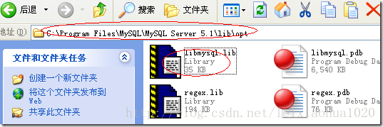
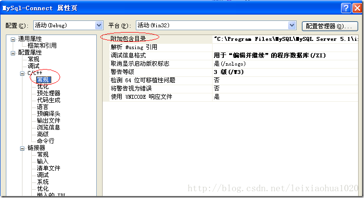
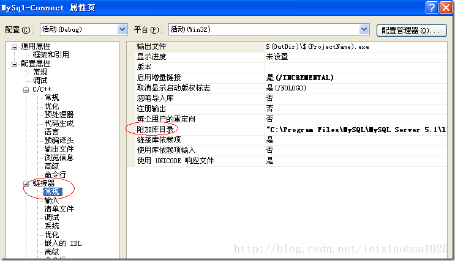
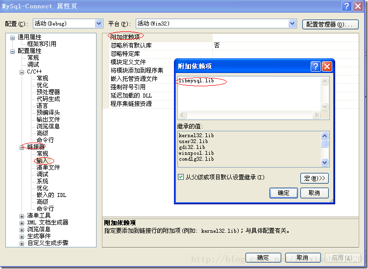

# 一、VS2008工程设置工作  
由于我们要使用Mysql的API，并且我们机子上肯定安装了Mysql数据库，所以我们要将工程的头文件路径指向Mysql安装目录的同文件mysql.h所在的位置，将连接库路径指向libmysql.lib所在的路径，在我的机子上，Mysql 的安装路径为：`C:\Program Files\MySQL\MySQL Server 5.1`  
  
  
我们需要把VS2008的工程中的头文件路径和连接库路径指向上面的两个地方：  

将项目属性页的C/C++->常规->附加包含目录指向：`C:\Program Files\MySQL\MySQL Server 5.1\include`  
  

将项目属性页的链接器->常规->附加库目录指向:`C:\Program Files\MySQL\MySQL Server 5.1\lib\opt`  
  

将链接器->输入->附加依赖项中添加libmysql.lib  
  
这样就OK了。  


# 二、连接Mysql和从MySql中取出数据的API介绍  

```c++
MYSQL *mysql_real_connect(
    MYSQL *mysql, //第一个参数应该是一个现存MYSQL结构的地址。在调用mysql_real_connect()之前，你必须调用mysql_init()初始化MYSQL结构。见下面的例子。
    const char *host, //host值可以是一个主机名或一个IP地址。如果host是NULL或字符串"localhost"，假定是到本地主机的一个连接。如果OS支持套接字(Unix)或命名管道(Win32)，使用他们而不是TCP/IP与服务器连接。
    const char *user, //user参数包含用户的MySQL登录ID。如果user是NULL，假定是当前用户。在Unix下，它是当前登录名。在Windows ODBC下，必须明确地指定当前用户名字。见16.4 怎样填写ODBC管理程序中各种域。
    const char *passwd, //passwd参数为user包含口令。如果passwd是NULL，只有在user表中对于有一个空白口令字段的用户的条目将被检查一个匹配。这允许数据库主管设置MySQL权限，使用户获得不同的口令，取决于他们是否已经指定一个口令。注意：不要试图在调用mysql_real_connect()前加密口令；口令加密自动被客户API处理。
    const char *db, //db是数据库名。如果db不是NULL，连接将缺省数据库设置为这个值。
    unsigned int port, //如果port不是0，值对于TCP/IP连接将用作端口号。注意host参数决定连接的类型。
    const char *unix_socket, //如果unix_socket不是NULL，字符串指定套接字或应该被使用的命名管道。注意host参数决定连接的类型。
    unsigned int client_flag//client_flag值通常是0，但是在很特殊的情况下可以被设置为下列标志的组合：标志名字 意味着的标志
                            //CLIENT_FOUND_ROWS 返回找到的(匹配的)行数，不是受到影响的行数。
                            //CLIENT_NO_SCHEMA 不允许db_name.tbl_name.col_name语法。这是为了ODBC；如果你使用该语法，导致语法分析器产生一个错误，它是为在一些ODBC程序捕捉错误是有用的。
                            //CLIENT_COMPRESS 使用压缩协议。
                            //CLIENT_ODBC 客户是一个ODBC客户。这使mysqld变得对ODBC更友好。
);

//返回值
//如果连接成功，一个 MYSQL*连接句柄。如果连接失败，NULL。对一个成功的连接，返回值与第一个参数值相同，除非你传递NULL给该参数。

//错误
//CR_CONN_HOST_ERROR;不能连接MySQL服务器。
//CR_CONNECTION_ERROR;不能连接本地MySQL服务器。
//CR_IPSOCK_ERROR;不能创建一个IP套接字。
//CR_OUT_OF_MEMORY;内存溢出。
//CR_SOCKET_CREATE_ERROR;不能创建一个Unix套接字。
//CR_UNKNOWN_HOST;不能找到主机名的IP地址。
//CR_VERSION_ERROR;由于试图使用一个不同协议版本的一个客户库与一个服务器连接导致的一个协议失配。如果你使用一个非常老的客户库连接一个没有使用--old-protocol选项启动的新服务器，这就能发生。
//CR_NAMEDPIPEOPEN_ERROR;不能在 Win32 上创建一个命名管道。
//CR_NAMEDPIPEWAIT_ERROR;不能在 Win32 上等待一个命名管道。
//CR_NAMEDPIPESETSTATE_ERROR;不能在 Win32 上得到一个管道处理器。
```


```c++
int mysql_select_db(
    MYSQL *mysql, //使得由db指定的数据库成为 在由mysql指定的连接上的缺省(当前)数据库。在随后的查询中，这个数据库对于不包括一个显式的数据库指定符的表的引用是缺省数据库。
    const char *db//除非连接的用户能被认证允许使用数据库，否则mysql_select_db()失败。
);

//返回值 成功，零。如果发生一个错误，非零。  

//错误
//CR_COMMANDS_OUT_OF_SYNC;命令以一个不适当的次序被执行。
//CR_SERVER_GONE_ERROR;MySQL服务器关闭了。
//CR_SERVER_LOST;对服务器的连接在查询期间失去。
//CR_UNKNOWN_ERROR;发生一个未知的错误。
```  


```c++
int mysql_real_query(
    MYSQL *mysql, 
    const char *query, //执行由query指向的SQL查询，它应该是一个length个字节的字符串。查询必须由一个单个的SQL语句组成。你不应该在语句后增加一个终止的分号(“;”)或\g。
    unsigned int length
);

//对于包含二进制数据的查询，你必须使用mysql_real_query()而不是mysql_query()，因为二进制代码数据可能包含“\0”字符，而且，mysql_real_query()比mysql_query()更快，因为它对查询字符串调用strlen()。  

//返回值 如果查询成功，零。如果发生一个错误，非零。

//错误  
//CR_COMMANDS_OUT_OF_SYNC;命令以一个不适当的次序被执行。
//CR_SERVER_GONE_ERROR;MySQL服务器关闭了。
//CR_SERVER_LOST;对服务器的连接在查询期间失去。
//CR_UNKNOWN_ERROR;发生一个未知的错误。
```


```c++
MYSQL_RES *mysql_store_result(
    MYSQL *mysql
);

//返回值 A MYSQL_RES result structure with the results. NULL (0) if an error occurred.

mysql_fetch_row(MYSQL_RES *)

//返回值 A MYSQL_ROW structure for the next row. NULL if there are no more rows to retrieve or if an error occurred.  

//错误
//CR_SERVER_LOST;The connection to the server was lost during the query.
//CR_UNKNOWN_ERROR;An unknown error occurred.
```

参考资料：http://dev.mysql.com/doc/refman/5.6/en/index.html  


# 三、利用Mysql库提供的API编写连接Mysql和从Mysql中取出数据的代码  


```c++

#include <windows.h>
#include "stdio.h"
#include "winsock.h" 
#include "mysql.h" 
 
 
int main()
{
 
MYSQL * con; //= mysql_init((MYSQL*) 0); 
MYSQL_RES *res;
MYSQL_ROW row;
 
 
char tmp[400];
 
//database configuartion
char dbuser[30]="root"; 
char dbpasswd[30]="apple";
char dbip[30]="localhost";
char dbname[50]="excel";
char tablename[50]="test";
char *query=NULL;
 
 
int x;
int y;
int rt;//return value
unsigned int t;
 
int count = 0;
 
 
printf("input x,y\n");
scanf("%d,%d",&x,&y);
fflush(stdin);
printf("input over\n");
con = mysql_init((MYSQL*) 0); 
 
 
if ( con !=NULL && mysql_real_connect(con,dbip,dbuser,dbpasswd,dbname,3306/*TCP IP端口*/,NULL/*Unix Socket 连接类型*/,0/*运行成ODBC数据库标志*/) ) 
{ 
    if (!mysql_select_db(con,dbname)) 
    { 
        printf("Select successfully the database!\n"); 
        
        con ->reconnect = 1; 
 
        query = "set names \'GBK\'";
        //mysql_query(con,"set names \'GBK\'"); 
        
        rt=mysql_real_query(con,query,strlen(query));
        if (rt)
        {
            printf("Error making query: %s !!!\n",mysql_error(con));
        }
        else
        {
            printf("query %s succeed!\n",query);
        }
        
    }
}
 
else
{
    MessageBoxA(NULL,"Unable to connect the database,check your configuration!","",NULL);
 
}
 
    //sprintf(tmp,"update %s set 商品=\'%s\',卖出=%d,成交=%d,涨跌=%d,买进=%d,总量=%d,涨幅=%f,时间=\'%s\' where  %s",tablename,goods,sold,deal,fluctuate,buy,total,delta,time,UpdateCon);
    sprintf(tmp,"insert into %s values(%s,%d,%d)",tablename,"null",x,y); //注意如何向具有自增字段的数据库中插入记录
    //MessageBoxA(NULL,tmp,tmp,MB_OK);
    //mysql_query(con,tmp);
 
    rt=mysql_real_query(con,tmp,strlen(tmp));
    if (rt)
    {
        printf("Error making query: %s !!!\n",mysql_error(con));
    }
    else
    {
        printf("%s executed!!!\n",tmp);
    }
    
    sprintf(tmp,"select * from %s",tablename);
    
    rt=mysql_real_query(con,tmp,strlen(tmp));
    if (rt)
    {
        printf("Error making query: %s !!!\n",mysql_error(con));
    } 
    else
    {
        printf("%s executed!!!\n",tmp);
    }
    
    res = mysql_store_result(con);//将结果保存在res结构体中
 
    while(row = mysql_fetch_row(res))  
    {  
        /** 
        * MYSQL_ROW STDCALL mysql_fetch_row(MYSQL_RES *result); 
         * 检索行 
        */  
 
       for(t=0;t<mysql_num_fields(res);t++)  
        {  
            printf("%s  ",row[t]);  
        }  
        printf(".............\n");  
        count ++;
    }  
   printf("number of rows %d\n",count);
    printf("mysql_free_result...\n");  
    mysql_free_result(res);  
 
    mysql_close(con);
    return 0;
 
}

```


# 四、运行结果  
  


# 五、数据库脚本  

```sql

SET FOREIGN_KEY_CHECKS=0;
-- ----------------------------
-- Table structure for `test`
-- ----------------------------
DROP TABLE IF EXISTS `test`;
CREATE TABLE `test` (
  `x` bigint(4) NOT NULL AUTO_INCREMENT,
  `y` int(4) DEFAULT NULL,
  `z` int(4) DEFAULT NULL,
  PRIMARY KEY (`x`)
) ENGINE=InnoDB AUTO_INCREMENT=118 DEFAULT CHARSET=latin1;
 
-- ----------------------------
-- Records of test
-- ----------------------------
INSERT INTO `test` VALUES ('95', '12432', '4334');
INSERT INTO `test` VALUES ('96', '213', '321');
INSERT INTO `test` VALUES ('97', '213', '213');
INSERT INTO `test` VALUES ('98', '123', '231');
INSERT INTO `test` VALUES ('99', '321', '231');
INSERT INTO `test` VALUES ('100', '123', '32132');
INSERT INTO `test` VALUES ('101', '777', '32213');
INSERT INTO `test` VALUES ('102', '123', '213');
INSERT INTO `test` VALUES ('103', '21', '321');
INSERT INTO `test` VALUES ('104', '324', '432');
INSERT INTO `test` VALUES ('105', '132', '231');
INSERT INTO `test` VALUES ('106', '324', '342');
INSERT INTO `test` VALUES ('107', '23', '23');
INSERT INTO `test` VALUES ('108', '12', '21');
INSERT INTO `test` VALUES ('109', '231', '321');
INSERT INTO `test` VALUES ('110', '123', '231');
INSERT INTO `test` VALUES ('111', '123', '231');
INSERT INTO `test` VALUES ('112', '123', '123');
INSERT INTO `test` VALUES ('113', '312', '231');
INSERT INTO `test` VALUES ('114', '312', '321');
INSERT INTO `test` VALUES ('115', '23', '3');
INSERT INTO `test` VALUES ('116', '213', '312');
INSERT INTO `test` VALUES ('117', '2', '3');
 
-- ----------------------------
-- Table structure for `xqdata`
-- ----------------------------
DROP TABLE IF EXISTS `xqdata`;
CREATE TABLE `xqdata` (
  `代码` varchar(20) NOT NULL DEFAULT '',
  `商品` varchar(20) CHARACTER SET utf8 DEFAULT NULL,
  `卖出` bigint(20) DEFAULT NULL,
  `成交` bigint(20) DEFAULT NULL,
  `涨跌` bigint(20) DEFAULT NULL,
  `买进` bigint(20) DEFAULT NULL,
  `总量` bigint(20) DEFAULT NULL,
  `涨幅` double DEFAULT NULL,
  `时间` time DEFAULT NULL,
  PRIMARY KEY (`代码`)
) ENGINE=InnoDB DEFAULT CHARSET=latin1;
 
-- ----------------------------
-- Records of xqdata
-- ----------------------------
INSERT INTO `xqdata` VALUES ('FITX*1', '商品', '34', '43', '23', '34', '0', '1.4', '13:23:08');

```