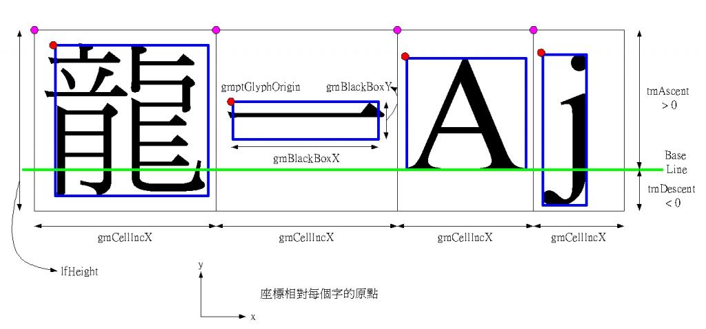

# 用GetGlyphOutline搞字模 
GetGlyphOutline
制作字模是汉化的一个基本能力吧，不过有很多好用的软件，比如Crystal Tile2，以至于我一直没高兴去研究。
搞字模大约这么两条路，一个是TextOut出来，然后一个点一个点读取。另一个就是调用GetGlyphOutline。
我这次是使用GetGlyphOutline这个函数，原型如下：
```c++
DWORD GetGlyphOutline(
    HDC hdc,// handle of device context
    UINT uChar,// character to query
    UINT uFormat,// format of data to return
    LPGLYPHMETRICS lpgm,// address of structure for metrics
    DWORD cbBuffer,// size of buffer for data
    LPVOID lpvBuffer,// address of buffer for data
    CONST MAT2 *lpmat2 // address of transformation matrix structure
);
```
里面重要一点的参数是uForamt，有GGO_BITMAP、GGO_GRAY2_BITMAP、GGO_GRAY4_BITMAP和GGO_GRAY8_BITMAP等等选项可供选择。
里面主要的就是灰度点阵，就是后面3个选项，因为纯点阵的话，用Crystal Tile2就搞定了，也不用麻烦。不过我实际使用下来灰度的效果也一般，聊胜于无了。
还有一点讨厌的是n位色是n^2+1级颜色，比如4位色，GGO_GRAY4_BITMAP，搞出来的灰度是17级，从0到10000B，一般游戏的字模4位色的肯定16级的吧。
然后就是lpgm，这个是本文的重点。等下说明。
最后就是lpmat2，用来做矩阵变换用的，可以拉伸、倾斜，学过计算机绘图总有点概念的。平时没事设置成单位矩阵就是了。
下面讲GLYPHMETRICS，先看下它的声明：
```c++
typedef struct _GLYPHMETRICS { // glmt
    UINTgmBlackBoxX;
    UINTgmBlackBoxY;
    POINT gmptGlyphOrigin;
    short gmCellIncX;
    short gmCellIncY;
} GLYPHMETRICS;
```
关于这玩意儿的介绍很少，我网上好不容易找到一张图（忘记从哪里搞来的了，无法标明链接，罪过罪过），可以明白的说明这些参数：

首先，外面那个大框就是Cell，gmCellIncX和gmCellIncY就是这个框的宽和高。
然后一个字真正占据的部分叫做Black box，显然“国”的Black box要比“一”来的大。同样gmBlackBoxX和gmBlackBoxY就是Black box的宽和高。
gmptGlyphOrigin就是Black box的左上的顶点，但是要注意的是这个gmptGlyphOrigin的坐标并不是以Cell的左下角顶点为轴心的。
而是以base line和左边线的焦点为轴心。注意base line这个概念被不存在于汉字中，这是拉丁文的概念，相当于英文练习本中四线中的第三条线。可以看下右边的两个英文字母。
至于base line多少大，图中标明是tmDescent，这是TEXTMETRIC结构的成员。我反正要获取16左右的字模，base line总是2
假如说你要提取字模的时候，要求四边都不留空。那么就应该提取
`(gmptGlyphOrigin.x, gmptGlyphOrigin.y + tmDescent) – (gmptGlyphOrigin.x + gmBlackBoxX, gmptGlyphOrigin.y + tmDescent – gmBlackBoxY)`
这部分内容。
上述坐标是以cell的左下角为轴心的，其实并不符合大家left, top的习惯，而且处理lpvBuffer的时候也不对。
转成左上角为轴心的话，坐标如下：
`(gmptGlyphOrigin.x, gmCellIncY - gmptGlyphOrigin.y - tmDescent) – (gmptGlyphOrigin.x + gmBlackBoxX, gmCellIncY - gmptGlyphOrigin.y - tmDescent + gmBlackBoxY)
描边
有时候字模需要描边，我网上搜了很久，确认并没有什么函数可以方便地搞定描边这件事情。也许有描边函数存在于某个超级大的3D开发包中，没有兴趣去装。
可以用个简单的算法完成描边，就是将字模上下左右移动1位，如果是灰度字模的话，只要有颜色就改成黑色。最后再用原始的字模原位写一遍。得到的结果基本可以接受。