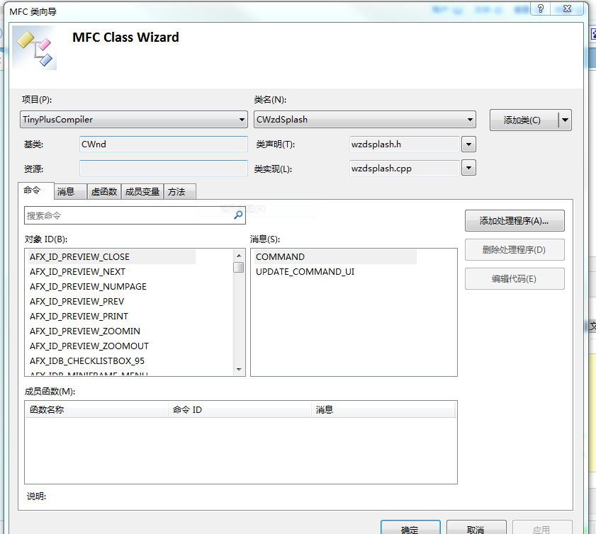

在VC6.0时代，我们通过在MFC工程中插入Splash组件来简单方便的实现这个功能，但在VS2008以后就没有了这个功能，所以如果想给自己的程序添加一个显示Logo的启动画面，就需要自己添加代码来实现，参考了下VC6.0中这个Splash组件添加后的代码，就很容易在自己的项目里实现这个功能。如下图。  
  

首先，在菜单的“项目”中选择“类向导”，生成一个启动画面的Splash类。  
  

然后，实现代码主要是在CwzdSplash类的头文件和cpp文件中实现。在CwzdSplash类的头文件中我们添加下面的代码：  

```c++
#pragma once
// CWzdSplash
class CWzdSplash : public CWnd
{
	DECLARE_DYNAMIC(CWzdSplash)
public:
	CWzdSplash();
	virtual ~CWzdSplash();
protected:
	DECLARE_MESSAGE_MAP()
public:
	CBitmap m_bitmap;
//	void Create(void);
	void Create(UINT nBitmapID);
	afx_msg void OnPaint();
	afx_msg void OnTimer(UINT_PTR nIDEvent);
};
```

在CwzdSplash类的cpp文件中我们添加下面的代码：  

```c++

// WzdSplash.cpp : 实现文件
//
#include "stdafx.h"
#include "TinyPlusCompiler.h"
#include "WzdSplash.h"
// CWzdSplash
IMPLEMENT_DYNAMIC(CWzdSplash, CWnd)
	CWzdSplash::CWzdSplash()
{
}
CWzdSplash::~CWzdSplash()
{
}
BEGIN_MESSAGE_MAP(CWzdSplash, CWnd)
	ON_WM_PAINT()
	ON_WM_TIMER()
END_MESSAGE_MAP()
// CWzdSplash 消息处理程序
void CWzdSplash::Create(UINT nBitmapID)
{
	m_bitmap.LoadBitmap(nBitmapID);
	BITMAP bitmap;
	m_bitmap.GetBitmap(&bitmap);
	//CreateEx(0,AfxRegisterWndClass(0),"",WS_POPUP|WS_VISIBLE|WS_BORDER,0,0,bitmap.bmWidth,bitmap.bmHeight,NULL,0);
	CreateEx(0,
			AfxRegisterWndClass(0, AfxGetApp()->LoadStandardCursor(IDC_ARROW)),
			NULL, WS_POPUP | WS_VISIBLE, 0, 0, bitmap.bmWidth, bitmap.bmHeight, NULL , NULL);
}
void CWzdSplash::OnPaint()
{
	// TODO: 在此处添加消息处理程序代码
	// 不为绘图消息调用 CWnd::OnPaint()
	CPaintDC dc(this); // device context forpainting
	BITMAP bitmap;
	m_bitmap.GetBitmap(&bitmap);
	CDC dcComp;
	dcComp.CreateCompatibleDC(&dc);
	dcComp.SelectObject(&m_bitmap);
	// draw bitmap
	dc.BitBlt(0,0,bitmap.bmWidth,bitmap.bmHeight,&dcComp,0,0,SRCCOPY);
}
void CWzdSplash::OnTimer(UINT_PTR nIDEvent)
{
	// TODO: 在此添加消息处理程序代码和/或调用默认值
	//CWnd::OnTimer(nIDEvent);
	DestroyWindow(); //销毁初始画面窗口
}
 
```

最后在项目的主窗口视图的Create函数中添加下面的实例化过程就可以显示出我们自定义的Logo启动画面了：  

```c++
///////////////显示Splash，2010-10-15///////////////////////////////////
        CWzdSplash wndSplash;                 //创建启动窗口类的实例
	wndSplash.Create(IDB_SPLASH);
	wndSplash.CenterWindow();
	wndSplash.UpdateWindow();          //send WM_PAINT
	Sleep(1500);
	wndSplash.DestroyWindow();//销毁初始画面窗口
 
```

注明一下要注意的地方：wndSplash.Create(IDB_SPLASH);中的IDB_SPLASH是在添加位图资源时添加进来的资源ID,自己可以定义自己所喜欢的启动图画。  

如果不使用Sleep()函数让线程休眠几秒，我们很难看到这个启动画面，但这样存在一个问题，让线程休眠不是一个好的办法，感觉应该用定时器去实现这功能的，但不是很熟悉定时器的使用，研究一下再把它改过来。  
