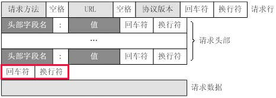

http头的格式  
  

* 请求行  
请求行由请求方法字段、URL字段和HTTP协议版本字段3个字段组成，它们用空格分隔。例如，GET /index.html HTTP/1.1。  
HTTP协议的请求方法有GET、POST、HEAD、PUT、DELETE、OPTIONS、TRACE、CONNECT。这里介绍最常用的GET方法和POST方法  
GET：当客户端要从服务器中读取文档时，使用GET方法。GET方法要求服务器将URL定位的资源放在响应报文的数据部分，回送给客户端。使用GET方法时，请求参数和对应的值附加  
在URL后面，利用一个问号（“?”）代表URL的结尾与请求参数的开始，传递参数长度受限制。例如，/index.jsp?id=100&op=bind。  
POST：当客户端给服务器提供信息较多时可以使用POST方法。POST方法将请求参数封装在HTTP请求数据中，以名称/值的形式出现，可以传输大量数据，可用来传送文件。  
* 请求头部  
请求头部由关键字/值对组成，每行一对，关键字和值用英文冒号“:”分隔。请求头部通知服务器有关于客户端请求的信息，典型的请求头有：  
User-Agent：产生请求的浏览器类型。  
Accept：客户端可识别的内容类型列表。  
Host：请求的主机名，允许多个域名同处一个IP地址，即虚拟主机。  

* 空行  
最后一个请求头之后是一个空行，发送回车符和换行符，通知服务器以下不再有请求头。  
对于一个完整的http请求来说空行是必须的，否则服务器会认为本次请求的数据尚未完全发送到服务器，处于等待状态。  

* 请求数据  
请求数据不在GET方法中使用，而是在POST方法中使用。POST方法适用于需要客户填写表单的场合。与请求数据相关的最常使用的请求头是Content-Type和Content-Length。  

* 示例程序
```c++
int main()
{
     int sockfd;
     int len;
     struct sockaddr_in address; 
     struct hostent *server;
     int result;
     //club.edu.sina.com.cn/bbs/forum-209-1.html
     string path("/TJUBBS/bbslogin?id=zongyuan&pw=91117891");
     string host("bbs.tju.edu.cn");
     stringstream stream;
     //GET请求方式
     /*
     stream<< "GET " << path << " HTTP/1.0\r\n"
             << "Host: " << host << "\r\n"
             <<"User-Agent: Mozilla/5.0 (Windows; U; Windows NT 5.1; zh-CN; rv:1.9.2.3) Gecko/20100401 Firefox/3.6.3\r\n"
             <<"Connection:close\r\n"
              << "\r\n";
     */
     //POST请求方式
     char *post_content = new char[128];
     memcpy(post_content,"id=*********&pw=*********",128);
     int content_length = strlen(post_content);
     cout<<"content length is "<<content_length<<endl;
     stream<< "POST " << path << " HTTP/1.0\r\n"
            << "Host: " << host << "\r\n"
           <<"User-Agent: Mozilla/5.0 (Windows; U; Windows NT 5.1; zh-CN; rv:1.9.2.3) Gecko/20100401 Firefox/3.6.3\r\n"
           <<"Content-Type:application/x-www-form-urlencoded\r\n"
           <<"Content-Length:"<<content_length<<"\r\n"
           <<"Connection:close\r\n"
           << "\r\n"
           <<post_content;

     delete[] post_content;
     string request = stream.str();
     sockfd = socket(AF_INET,SOCK_STREAM,0);
     address.sin_family = AF_INET;
     server = gethostbyname(host.c_str()); 
     memcpy((char *)&address.sin_addr.s_addr,(char*)server->h_addr, server->h_length);
     address.sin_port = htons(80);
     len = sizeof(address);
     result = connect(sockfd,(struct sockaddr *)&address,len);

     if(result==-1){
        cout<<"connection error!"<<endl; 
     }
     write(sockfd,request.c_str(),request.size());
     char buf[1024*1024];
     memset(buf,0,1024*1024);
     int offset = 0;
     int rc;
     while(rc = read(sockfd,buf+offset,1024)){
          offset += rc;
     }

     close(sockfd);
     buf[offset] = 0;
     // cout<<strlen(buf)<<endl;
     cout<<buf<<endl;
     /*
     int size = offset;
     int outlen = 2*size; //  注意编码转换之后的字符串长度会发生变化，因此此处定义为2倍长度，确保能够容纳转换之后得到的字符串
     char *output = new char[outlen];
     memset(output,0,outlen);
     //进行编码转换，将gbk转换为utf-8
     covert("utf-8","gbk",buf,size,output,outlen);
     output[outlen] = 0;
     cout<<strlen(output)<<endl;
     // cout<<output<<endl;
     delete[] output;
     */
     return 0;
}

//使用libiconv库实现的编码转换函数
int covert(char *desc, char *src, char *input, size_t ilen, char *output, size_t olen)
{
    char **pin = &input;
    char **pout = &output;
    iconv_t cd = iconv_open(desc, src);
    if (cd == (iconv_t)-1)
    {
        iconv_close(cd);
        return -1;
    }
    memset(output, 0, olen);
    if (iconv(cd, pin, &ilen, pout, &olen)){
      cout<<"convert failed!"<<endl;
      iconv_close(cd);
      return -1;
    }
    iconv_close(cd);
    return 0;
}
```

* 后续  
 访问url时经常发生页面跳转的情况，如何能够适应跳转，获取想要的页面，需要进一步学习。  
 