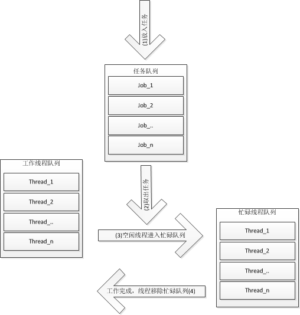

线程池，简单来说就是有一堆已经创建好的线程（最大数目一定），初始时他们都处于空闲状态，当有新的任务进来，从线程池中取出一个空闲的线程处理任务，然后当任务处理完成之后，该线程被重新放回到线程池中，供其他的任务使用，当线程池中的线程都在处理任务时，就没有空闲线程供使用，此时，若有新的任务产生，只能等待线程池中有线程结束任务空闲才能执行，下面是线程池的工作原理图：  

  

简单来说就是线程本身存在开销，我们利用多线程来进行任务处理，单线程也不能滥用，无止禁的开新线程会给系统产生大量消耗，而线程本来就是可重用的资源，不需要每次使用时都进行初始化，因此可以采用有限的线程个数处理无限的任务。  

```c++
//condition.h
#ifndef _CONDITION_H_
#define _CONDITION_H_

#include <pthread.h>

//封装一个互斥量和条件变量作为状态
typedef struct condition
{
    pthread_mutex_t pmutex;
    pthread_cond_t pcond;
}condition_t;

//对状态的操作函数
int condition_init(condition_t *cond);
int condition_lock(condition_t *cond);
int condition_unlock(condition_t *cond);
int condition_wait(condition_t *cond);
int condition_timedwait(condition_t *cond, const struct timespec *abstime);
int condition_signal(condition_t* cond);
int condition_broadcast(condition_t *cond);
int condition_destroy(condition_t *cond);

#endif
```

```c++
//condition.c
#include "condition.h"

//初始化
int condition_init(condition_t *cond)
{
    int status;
    if((status = pthread_mutex_init(&cond->pmutex, NULL)))
        return status;
    
    if((status = pthread_cond_init(&cond->pcond, NULL)))
        return status;
    
    return 0;
}

//加锁
int condition_lock(condition_t *cond)
{
    return pthread_mutex_lock(&cond->pmutex);
}

//解锁
int condition_unlock(condition_t *cond)
{
    return pthread_mutex_unlock(&cond->pmutex);
}

//等待
int condition_wait(condition_t *cond)
{
    return pthread_cond_wait(&cond->pcond, &cond->pmutex);
}

//固定时间等待
int condition_timedwait(condition_t *cond, const struct timespec *abstime)
{
    return pthread_cond_timedwait(&cond->pcond, &cond->pmutex, abstime);
}

//唤醒一个睡眠线程
int condition_signal(condition_t* cond)
{
    return pthread_cond_signal(&cond->pcond);
}

//唤醒所有睡眠线程
int condition_broadcast(condition_t *cond)
{
    return pthread_cond_broadcast(&cond->pcond);
}

//释放
int condition_destroy(condition_t *cond)
{
    int status;
    if((status = pthread_mutex_destroy(&cond->pmutex)))
        return status;
    
    if((status = pthread_cond_destroy(&cond->pcond)))
        return status;
        
    return 0;
}
```

```c++
//threadpool.h
#ifndef _THREAD_POOL_H_
#define _THREAD_POOL_H_

//线程池头文件

#include "condition.h"

//封装线程池中的对象需要执行的任务对象
typedef struct task
{
    void *(*run)(void *args);  //函数指针，需要执行的任务
    void *arg;              //参数
    struct task *next;      //任务队列中下一个任务
}task_t;


//下面是线程池结构体
typedef struct threadpool
{
    condition_t ready;    //状态量
    task_t *first;       //任务队列中第一个任务
    task_t *last;        //任务队列中最后一个任务
    int counter;         //线程池中已有线程数
    int idle;            //线程池中kongxi线程数
    int max_threads;     //线程池最大线程数
    int quit;            //是否退出标志
}threadpool_t;

void threadpool_init(threadpool_t *pool, int threads);//线程池初始化
void threadpool_add_task(threadpool_t *pool, void *(*run)(void *arg), void *arg);//往线程池中加入任务
void threadpool_destroy(threadpool_t *pool);//摧毁线程池
#endif
```

```c++
//threadpool.c
#include "threadpool.h"
#include <stdlib.h>
#include <stdio.h>
#include <string.h>
#include <errno.h>
#include <time.h>

//创建的线程执行
void *thread_routine(void *arg)
{
    struct timespec abstime;
    int timeout;
    printf("thread %d is starting\n", (int)pthread_self());
    threadpool_t *pool = (threadpool_t *)arg;
    while(1)
    {
        timeout = 0;
        //访问线程池之前需要加锁
        condition_lock(&pool->ready);
        //空闲
        pool->idle++;
        //等待队列有任务到来 或者 收到线程池销毁通知
        while(pool->first == NULL && !pool->quit)
        {
            //否则线程阻塞等待
            printf("thread %d is waiting\n", (int)pthread_self());
            //获取从当前时间，并加上等待时间， 设置进程的超时睡眠时间
            clock_gettime(CLOCK_REALTIME, &abstime);  
            abstime.tv_sec += 2;
            int status;
            status = condition_timedwait(&pool->ready, &abstime);  //该函数会解锁，允许其他线程访问，当被唤醒时，加锁
            if(status == ETIMEDOUT)
            {
                printf("thread %d wait timed out\n", (int)pthread_self());
                timeout = 1;
                break;
            }
        }
        
        pool->idle--;
        if(pool->first != NULL)
        {
            //取出等待队列最前的任务，移除任务，并执行任务
            task_t *t = pool->first;
            pool->first = t->next;
            //由于任务执行需要消耗时间，先解锁让其他线程访问线程池
            condition_unlock(&pool->ready);
            //执行任务
            t->run(t->arg);
            //执行完任务释放内存
            free(t);
            //重新加锁
            condition_lock(&pool->ready);
        }
        
        //退出线程池
        if(pool->quit && pool->first == NULL)
        {
            pool->counter--;//当前工作的线程数-1
            //若线程池中没有线程，通知等待线程（主线程）全部任务已经完成
            if(pool->counter == 0)
            {
                condition_signal(&pool->ready);
            }
            condition_unlock(&pool->ready);
            break;
        }
        //超时，跳出销毁线程
        if(timeout == 1)
        {
            pool->counter--;//当前工作的线程数-1
            condition_unlock(&pool->ready);
            break;
        }
        
        condition_unlock(&pool->ready);
    }
    
    printf("thread %d is exiting\n", (int)pthread_self());
    return NULL;
    
}


//线程池初始化
void threadpool_init(threadpool_t *pool, int threads)
{
    
    condition_init(&pool->ready);
    pool->first = NULL;
    pool->last =NULL;
    pool->counter =0;
    pool->idle =0;
    pool->max_threads = threads;
    pool->quit =0;
    
}


//增加一个任务到线程池
void threadpool_add_task(threadpool_t *pool, void *(*run)(void *arg), void *arg)
{
    //产生一个新的任务
    task_t *newtask = (task_t *)malloc(sizeof(task_t));
    newtask->run = run;
    newtask->arg = arg;
    newtask->next=NULL;//新加的任务放在队列尾端
    
    //线程池的状态被多个线程共享，操作前需要加锁
    condition_lock(&pool->ready);
    
    if(pool->first == NULL)//第一个任务加入
    {
        pool->first = newtask;
    }        
    else    
    {
        pool->last->next = newtask;
    }
    pool->last = newtask;  //队列尾指向新加入的线程
    
    //线程池中有线程空闲，唤醒
    if(pool->idle > 0)
    {
        condition_signal(&pool->ready);
    }
    //当前线程池中线程个数没有达到设定的最大值，创建一个新的线性
    else if(pool->counter < pool->max_threads)
    {
        pthread_t tid;
        pthread_create(&tid, NULL, thread_routine, pool);
        pool->counter++;
    }
    //结束，访问
    condition_unlock(&pool->ready);
}

//线程池销毁
void threadpool_destroy(threadpool_t *pool)
{
    //如果已经调用销毁，直接返回
    if(pool->quit)
    {
    return;
    }
    //加锁
    condition_lock(&pool->ready);
    //设置销毁标记为1
    pool->quit = 1;
    //线程池中线程个数大于0
    if(pool->counter > 0)
    {
        //对于等待的线程，发送信号唤醒
        if(pool->idle > 0)
        {
            condition_broadcast(&pool->ready);
        }
        //正在执行任务的线程，等待他们结束任务
        while(pool->counter)
        {
            condition_wait(&pool->ready);
        }
    }
    condition_unlock(&pool->ready);
    condition_destroy(&pool->ready);
}
```

测试代码：  

```c++
//main.c

#include "threadpool.h"
#include <unistd.h>
#include <stdlib.h>
#include <stdio.h>

void* mytask(void *arg)
{
    printf("thread %d is working on task %d\n", (int)pthread_self(), *(int*)arg);
    sleep(1);
    free(arg);
    return NULL;
}

//测试代码
int main(void)
{
    threadpool_t pool;
    //初始化线程池，最多三个线程
    threadpool_init(&pool, 3);
    int i;
    //创建十个任务
    for(i=0; i < 10; i++)
    {
        int *arg = malloc(sizeof(int));
        *arg = i;
        threadpool_add_task(&pool, mytask, arg);
        
    }
    threadpool_destroy(&pool);
    return 0;
}
```