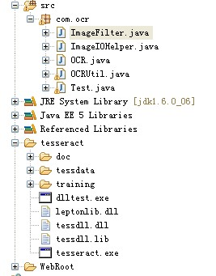
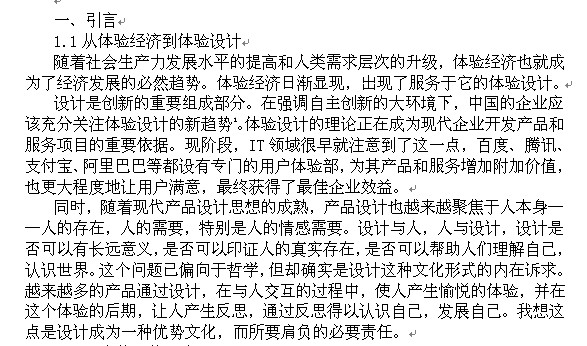
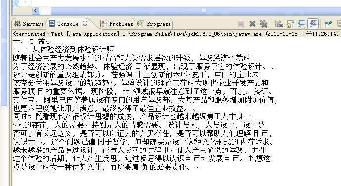

几天一直在研究OCR技术，据我了解的情况，国内最专业的OCR软件只有2家，清华TH-OCR和汉王OCR，看了很多的OCR技术发现好多对英文与数字的支持都很好，可惜很多都不支持中文字符。Asprise-OCR，Tesseract 3.0以前的版本，都不支持中文，其实我用了下Asprise-OCR算是速度比较的快了，可惜他鄙视中文，这个没有办法，正好这段时间知名的开源OCR引擎Tesseract 3.0版本发布了，他给我们带来的好消息就是支持中文，相关的下载项目网站是：`http://code.google.com/p/tesseract-ocr`  
虽然速度不是很客观可是毕竟人家开始支持中文也算是不错的，一个英文的语言包大概是1.8M,中文简体的语言包是39.5M,中文繁体的语言包是53M，这样就知道为什么识别中文慢的原因了  
太多人留邮箱了，我一个人发布过来，请大家需要源码的，去资源控件下载，这是一个完整的项目`http://download.csdn.net/detail/zhoushuyan/4050580`

```java
package com.ocr;

import java.awt.Graphics2D;
import java.awt.color.ColorSpace;
import java.awt.geom.AffineTransform;
import java.awt.image.AffineTransformOp;
import java.awt.image.BufferedImage;
import java.awt.image.ColorConvertOp;
import java.awt.image.ColorModel;
import java.awt.image.MemoryImageSource;
import java.awt.image.PixelGrabber;


/**
 *
 * 图像过滤,增强OCR识别成功率
 *
 */
public class ImageFilter {
    private BufferedImage image;
    private int iw;
    private int ih;
    private int[] pixels;

    public ImageFilter(BufferedImage image) {
        this.image = image;
        iw = image.getWidth();
        ih = image.getHeight();
        pixels = new int[iw * ih];
    }

    /** 图像二值化 */
    public BufferedImage changeGrey() {
        PixelGrabber pg = new PixelGrabber(image.getSource(), 0, 0, iw, ih,
                pixels, 0, iw);

        try {
            pg.grabPixels();
        } catch (InterruptedException e) {
            e.printStackTrace();
        }

        // 设定二值化的域值，默认值为100
        int grey = 100;

        // 对图像进行二值化处理，Alpha值保持不变
        ColorModel cm = ColorModel.getRGBdefault();

        for (int i = 0; i < (iw * ih); i++) {
            int red;
            int green;
            int blue;

            int alpha = cm.getAlpha(pixels[i]);

            if (cm.getRed(pixels[i]) > grey) {
                red = 255;
            } else {
                red = 0;
            }

            if (cm.getGreen(pixels[i]) > grey) {
                green = 255;
            } else {
                green = 0;
            }

            if (cm.getBlue(pixels[i]) > grey) {
                blue = 255;
            } else {
                blue = 0;
            }

            pixels[i] = (alpha << 24) | (red << 16) | (green << 8) | blue;
        }

        // 将数组中的象素产生一个图像
        return ImageIOHelper.imageProducerToBufferedImage(new MemoryImageSource(
                iw, ih, pixels, 0, iw));
    }

    /** 提升清晰度,进行锐化 */
    public BufferedImage sharp() {
        PixelGrabber pg = new PixelGrabber(image.getSource(), 0, 0, iw, ih,
                pixels, 0, iw);

        try {
            pg.grabPixels();
        } catch (InterruptedException e) {
            e.printStackTrace();
        }

        // 象素的中间变量
        int[] tempPixels = new int[iw * ih];

        for (int i = 0; i < (iw * ih); i++) {
            tempPixels[i] = pixels[i];
        }

        // 对图像进行尖锐化处理，Alpha值保持不变
        ColorModel cm = ColorModel.getRGBdefault();

        for (int i = 1; i < (ih - 1); i++) {
            for (int j = 1; j < (iw - 1); j++) {
                int alpha = cm.getAlpha(pixels[(i * iw) + j]);

                // 对图像进行尖锐化
                int red6 = cm.getRed(pixels[(i * iw) + j + 1]);
                int red5 = cm.getRed(pixels[(i * iw) + j]);
                int red8 = cm.getRed(pixels[((i + 1) * iw) + j]);
                int sharpRed = Math.abs(red6 - red5) + Math.abs(red8 - red5);
                int green5 = cm.getGreen(pixels[(i * iw) + j]);
                int green6 = cm.getGreen(pixels[(i * iw) + j + 1]);
                int green8 = cm.getGreen(pixels[((i + 1) * iw) + j]);
                int sharpGreen = Math.abs(green6 - green5) +
                    Math.abs(green8 - green5);
                int blue5 = cm.getBlue(pixels[(i * iw) + j]);
                int blue6 = cm.getBlue(pixels[(i * iw) + j + 1]);
                int blue8 = cm.getBlue(pixels[((i + 1) * iw) + j]);
                int sharpBlue = Math.abs(blue6 - blue5) +
                    Math.abs(blue8 - blue5);

                if (sharpRed > 255) {
                    sharpRed = 255;
                }

                if (sharpGreen > 255) {
                    sharpGreen = 255;
                }

                if (sharpBlue > 255) {
                    sharpBlue = 255;
                }

                tempPixels[(i * iw) + j] = (alpha << 24) | (sharpRed << 16) |
                    (sharpGreen << 8) | sharpBlue;
            }
        }

        // 将数组中的象素产生一个图像
        return ImageIOHelper.imageProducerToBufferedImage(new MemoryImageSource(
                iw, ih, tempPixels, 0, iw));
    }

    /** 中值滤波 */
    public BufferedImage median() {
        PixelGrabber pg = new PixelGrabber(image.getSource(), 0, 0, iw, ih,
                pixels, 0, iw);

        try {
            pg.grabPixels();
        } catch (InterruptedException e) {
            e.printStackTrace();
        }

        // 对图像进行中值滤波，Alpha值保持不变
        ColorModel cm = ColorModel.getRGBdefault();

        for (int i = 1; i < (ih - 1); i++) {
            for (int j = 1; j < (iw - 1); j++) {
                int red;
                int green;
                int blue;
                int alpha = cm.getAlpha(pixels[(i * iw) + j]);

                // int red2 = cm.getRed(pixels[(i - 1) * iw + j]);
                int red4 = cm.getRed(pixels[((i * iw) + j) - 1]);
                int red5 = cm.getRed(pixels[(i * iw) + j]);
                int red6 = cm.getRed(pixels[(i * iw) + j + 1]);

                // int red8 = cm.getRed(pixels[(i + 1) * iw + j]);
                // 水平方向进行中值滤波
                if (red4 >= red5) {
                    if (red5 >= red6) {
                        red = red5;
                    } else {
                        if (red4 >= red6) {
                            red = red6;
                        } else {
                            red = red4;
                        }
                    }
                } else {
                    if (red4 > red6) {
                        red = red4;
                    } else {
                        if (red5 > red6) {
                            red = red6;
                        } else {
                            red = red5;
                        }
                    }
                }

                // int green2 = cm.getGreen(pixels[(i - 1) * iw + j]);
                int green4 = cm.getGreen(pixels[((i * iw) + j) - 1]);
                int green5 = cm.getGreen(pixels[(i * iw) + j]);
                int green6 = cm.getGreen(pixels[(i * iw) + j + 1]);

                // int green8 = cm.getGreen(pixels[(i + 1) * iw + j]);
                // 水平方向进行中值滤波
                if (green4 >= green5) {
                    if (green5 >= green6) {
                        green = green5;
                    } else {
                        if (green4 >= green6) {
                            green = green6;
                        } else {
                            green = green4;
                        }
                    }
                } else {
                    if (green4 > green6) {
                        green = green4;
                    } else {
                        if (green5 > green6) {
                            green = green6;
                        } else {
                            green = green5;
                        }
                    }
                }

                // int blue2 = cm.getBlue(pixels[(i - 1) * iw + j]);
                int blue4 = cm.getBlue(pixels[((i * iw) + j) - 1]);

                int blue5 = cm.getBlue(pixels[(i * iw) + j]);

                int blue6 = cm.getBlue(pixels[(i * iw) + j + 1]);

                // int blue8 = cm.getBlue(pixels[(i + 1) * iw + j]);
                // 水平方向进行中值滤波
                if (blue4 >= blue5) {
                    if (blue5 >= blue6) {
                        blue = blue5;
                    } else {
                        if (blue4 >= blue6) {
                            blue = blue6;
                        } else {
                            blue = blue4;
                        }
                    }
                } else {
                    if (blue4 > blue6) {
                        blue = blue4;
                    } else {
                        if (blue5 > blue6) {
                            blue = blue6;
                        } else {
                            blue = blue5;
                        }
                    }
                }

                pixels[(i * iw) + j] = (alpha << 24) | (red << 16) |
                    (green << 8) | blue;
            }
        }

        // 将数组中的象素产生一个图像
        return ImageIOHelper.imageProducerToBufferedImage(new MemoryImageSource(
                iw, ih, pixels, 0, iw));
    }

    /** 线性灰度变换 */
    public BufferedImage lineGrey() {
        PixelGrabber pg = new PixelGrabber(image.getSource(), 0, 0, iw, ih,
                pixels, 0, iw);

        try {
            pg.grabPixels();
        } catch (InterruptedException e) {
            e.printStackTrace();
        }

        // 对图像进行进行线性拉伸，Alpha值保持不变
        ColorModel cm = ColorModel.getRGBdefault();

        for (int i = 0; i < (iw * ih); i++) {
            int alpha = cm.getAlpha(pixels[i]);

            int red = cm.getRed(pixels[i]);

            int green = cm.getGreen(pixels[i]);

            int blue = cm.getBlue(pixels[i]);

            // 增加了图像的亮度
            red = (int) ((1.1 * red) + 30);

            green = (int) ((1.1 * green) + 30);

            blue = (int) ((1.1 * blue) + 30);

            if (red >= 255) {
                red = 255;
            }

            if (green >= 255) {
                green = 255;
            }

            if (blue >= 255) {
                blue = 255;
            }

            pixels[i] = (alpha << 24) | (red << 16) | (green << 8) | blue;
        }

        // 将数组中的象素产生一个图像
        return ImageIOHelper.imageProducerToBufferedImage(new MemoryImageSource(
                iw, ih, pixels, 0, iw));
    }

    /** 转换为黑白灰度图 */
    public BufferedImage grayFilter() {
        ColorSpace cs = ColorSpace.getInstance(ColorSpace.CS_GRAY);

        ColorConvertOp op = new ColorConvertOp(cs, null);

        return op.filter(image, null);
    }

    /** 平滑缩放 */
    public BufferedImage scaling(double s) {
        AffineTransform tx = new AffineTransform();

        tx.scale(s, s);

        AffineTransformOp op = new AffineTransformOp(tx,
                AffineTransformOp.TYPE_BILINEAR);

        return op.filter(image, null);
    }

    public BufferedImage scale(Float s) {
        int srcW = image.getWidth();

        int srcH = image.getHeight();

        int newW = Math.round(srcW * s);

        int newH = Math.round(srcH * s);

        // 先做水平方向上的伸缩变换
        BufferedImage tmp = new BufferedImage(newW, newH, image.getType());

        Graphics2D g = tmp.createGraphics();

        for (int x = 0; x < newW; x++) {
            g.setClip(x, 0, 1, srcH);

            // 按比例放缩
            g.drawImage(image, x - ((x * srcW) / newW), 0, null);
        }

        // 再做垂直方向上的伸缩变换
        BufferedImage dst = new BufferedImage(newW, newH, image.getType());

        g = dst.createGraphics();

        for (int y = 0; y < newH; y++) {
            g.setClip(0, y, newW, 1);

            // 按比例放缩
            g.drawImage(tmp, 0, y - ((y * srcH) / newH), null);
        }

        return dst;
    }
}

```

```java
package com.ocr;

import com.sun.media.imageio.plugins.tiff.TIFFImageWriteParam;

import java.awt.Graphics2D;
import java.awt.Image;
import java.awt.Toolkit;
import java.awt.image.BufferedImage;
import java.awt.image.DataBufferByte;
import java.awt.image.ImageProducer;
import java.awt.image.WritableRaster;

import java.io.File;
import java.io.IOException;

import java.util.Iterator;
import java.util.Locale;

import javax.imageio.IIOImage;
import javax.imageio.ImageIO;
import javax.imageio.ImageReader;
import javax.imageio.ImageWriteParam;
import javax.imageio.ImageWriter;
import javax.imageio.metadata.IIOMetadata;
import javax.imageio.stream.ImageInputStream;
import javax.imageio.stream.ImageOutputStream;

import javax.swing.JOptionPane;


public class ImageIOHelper {
    public ImageIOHelper() {
    }

    public static File createImage(File imageFile, String imageFormat) {
        File tempFile = null;

        try {
            Iterator<ImageReader> readers = ImageIO.getImageReadersByFormatName(imageFormat);

            ImageReader reader = readers.next();

            ImageInputStream iis = ImageIO.createImageInputStream(imageFile);

            reader.setInput(iis);

            // Read the stream metadata
            IIOMetadata streamMetadata = reader.getStreamMetadata();

            // Set up the writeParam
            TIFFImageWriteParam tiffWriteParam = new TIFFImageWriteParam(Locale.US);
            tiffWriteParam.setCompressionMode(ImageWriteParam.MODE_DISABLED);

            // Get tif writer and set output to file
            Iterator<ImageWriter> writers = ImageIO.getImageWritersByFormatName(
                    "tiff");

            ImageWriter writer = writers.next();

            BufferedImage bi = reader.read(0);

            IIOImage image = new IIOImage(bi, null, reader.getImageMetadata(0));

            tempFile = tempImageFile(imageFile);

            ImageOutputStream ios = ImageIO.createImageOutputStream(tempFile);

            writer.setOutput(ios);

            writer.write(streamMetadata, image, tiffWriteParam);
            ios.close();
            writer.dispose();
            reader.dispose();
        } catch (Exception exc) {
            exc.printStackTrace();
        }

        return tempFile;
    }

    public static File createImage(BufferedImage bi) {
        File tempFile = null;

        try {
            tempFile = File.createTempFile("tempImageFile", ".tif");
            tempFile.deleteOnExit();

            TIFFImageWriteParam tiffWriteParam = new TIFFImageWriteParam(Locale.US);

            tiffWriteParam.setCompressionMode(ImageWriteParam.MODE_DISABLED);

            // Get tif writer and set output to file
            Iterator<ImageWriter> writers = ImageIO.getImageWritersByFormatName(
                    "tiff");

            ImageWriter writer = writers.next();

            IIOImage image = new IIOImage(bi, null, null);

            tempFile = tempImageFile(tempFile);

            ImageOutputStream ios = ImageIO.createImageOutputStream(tempFile);

            writer.setOutput(ios);

            writer.write(null, image, tiffWriteParam);

            ios.close();

            writer.dispose();
        } catch (Exception exc) {
            exc.printStackTrace();
        }

        return tempFile;
    }

    public static File tempImageFile(File imageFile) {
        String path = imageFile.getPath();

        StringBuffer strB = new StringBuffer(path);

        strB.insert(path.lastIndexOf('.'), 0);

        return new File(strB.toString().replaceFirst("(?<=//.)(//w+)$", "tif"));
    }

    public static BufferedImage getImage(File imageFile) {
        BufferedImage al = null;

        try {
            String imageFileName = imageFile.getName();

            String imageFormat = imageFileName.substring(imageFileName.lastIndexOf(
                        '.') + 1);

            Iterator<ImageReader> readers = ImageIO.getImageReadersByFormatName(imageFormat);

            ImageReader reader = readers.next();

            if (reader == null) {
                JOptionPane.showConfirmDialog(null,
                    "Need to install JAI Image I/O package./nhttps://jai-imageio.dev.java.net");

                return null;
            }

            ImageInputStream iis = ImageIO.createImageInputStream(imageFile);
            reader.setInput(iis);
            al = reader.read(0);
            reader.dispose();
        } catch (IOException ioe) {
            System.err.println(ioe.getMessage());
        } catch (Exception e) {
            System.err.println(e.getMessage());
        }

        return al;
    }

    public static BufferedImage imageToBufferedImage(Image image) {
        BufferedImage bufferedImage = new BufferedImage(image.getWidth(null),
                image.getHeight(null), BufferedImage.TYPE_INT_RGB);
        Graphics2D g = bufferedImage.createGraphics();
        g.drawImage(image, 0, 0, null);

        return bufferedImage;
    }

    public static BufferedImage imageProducerToBufferedImage(
        ImageProducer imageProducer) {
        return imageToBufferedImage(Toolkit.getDefaultToolkit()
                                           .createImage(imageProducer));
    }

    public static byte[] image_byte_data(BufferedImage image) {
        WritableRaster raster = image.getRaster();
        DataBufferByte buffer = (DataBufferByte) raster.getDataBuffer();

        return buffer.getData();
    }
}

```

```java
package com.ocr;

import org.jdesktop.swingx.util.OS;

import java.io.BufferedReader;
import java.io.File;
import java.io.FileInputStream;
import java.io.InputStreamReader;

import java.util.ArrayList;
import java.util.List;


public class OCR {
    private final String LANG_OPTION = "-l";
    private final String EOL = System.getProperty("line.separator");
    private String tessPath = new File("tesseract").getAbsolutePath();

    //private String tessPath="C://Program Files (x86)//Tesseract-OCR//";
    public String recognizeText(File imageFile, String imageFormat)
        throws Exception {
        File tempImage = ImageIOHelper.createImage(imageFile, imageFormat);

        File outputFile = new File(imageFile.getParentFile(), "output");

        StringBuffer strB = new StringBuffer();

        List<String> cmd = new ArrayList<String>();

        if (OS.isWindowsXP()) {
            cmd.add(tessPath + "//tesseract");

            //cmd.add(tessPath + "//Tesseract-OCR");
        } else if (OS.isLinux()) {
            cmd.add("tesseract");
        } else {
            //cmd.add(tessPath + "//Tesseract-OCR")
            cmd.add(tessPath + "//tesseract");
        }

        cmd.add("");
        cmd.add(outputFile.getName());
        cmd.add(LANG_OPTION);
        cmd.add("chi_sim");
        cmd.add("eng");

        ProcessBuilder pb = new ProcessBuilder();
        pb.directory(imageFile.getParentFile());
        cmd.set(1, tempImage.getName());
        pb.command(cmd);
        pb.redirectErrorStream(true);

        Process process = pb.start();

        //tesseract.exe 1.jpg 1 -l chi_sim
        int w = process.waitFor();
        // delete temp working files
        tempImage.delete();

        if (w == 0) {
            BufferedReader in = new BufferedReader(new InputStreamReader(
                        new FileInputStream(outputFile.getAbsolutePath() +
                            ".txt"), "UTF-8"));
            String str;

            while ((str = in.readLine()) != null) {
                strB.append(str).append(EOL);
            }

            in.close();
        } else {
            String msg;

            switch (w) {
            case 1:
                msg = "Errors accessing files. There may be spaces in your image's filename.";

                break;

            case 29:
                msg = "Cannot recognize the image or its selected region.";

                break;

            case 31:
                msg = "Unsupported image format.";

                break;

            default:
                msg = "Errors occurred.";
            }

            tempImage.delete();
            throw new RuntimeException(msg);
        }

        new File(outputFile.getAbsolutePath() + ".txt").delete();

        return strB.toString();
    }
}

```


```java
package com.ocr;
import java.io.File;

public class Test {
    /**
     * @param args
     */
    public static void main(String[] args) {
        // TODO Auto-generated method stub
        OCR ocr = new OCR();

        try {
            String maybe = new OCR().recognizeText(new File("E://temp//222.jpg"),
                    "jpg");
            System.out.println(maybe);
        } catch (Exception e) {
            // TODO Auto-generated catch block
            e.printStackTrace();
        }
    }
}

```

由于可以第三方包加起来有点大，告诉大家一个网站`www.findjar.com`去里面找你想要的包吧，需要相关包的留下邮件吧  
  
java 目录结构如上图  
效果图：  
  

解析出来的效果  
  
