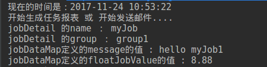
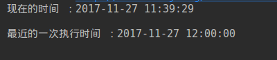

###### Quartz可以用来做什么
Quartz是一个强大任务调度框架，我工作时候会在这些情况下使用到quartz框架，当然还有很多的应用场景，在这里只列举2个实际用到的  
* 餐厅系统会在每周四晚上的22点自动审核并生成报表
* 人事系统会在每天早晨8点给有待办的人员自动发送Email提醒  

###### 使用Quartz之前的准备  
1. 建立一个Maven项目
2. 引入quartz的依赖  
    使用quartz，我们仅仅需要在maven的pom文件中添加依赖即可。我使用的是现在最新的一个版本2.3.0，大家可以在maven的仓库获取到最新的版本依赖，地址：http://mvnrepository.com/artifact/org.quartz-scheduler/quartz  
 　但然也可以使用这个2.3.0的依赖，下面的例子都是使用此依赖并实现了效果。  
```xml
<!-- https://mvnrepository.com/artifact/org.quartz-scheduler/quartz -->
<dependency>
    <groupId>org.quartz-scheduler</groupId>
    <artifactId>quartz</artifactId>
    <version>2.3.0</version>
</dependency>
```

###### 编写第一个Quartz任务案例(每隔2秒钟打印一次HelloQuartz)  
先实现一下这个基本的Quartz的任务再来介绍一下Quartz的3个重要组成，JobDetail，Trigger，Scheduler  
1. 创建一个类 HelloJob.java，这个类是编写我们的具体要实现任务（打印Hello Quartz）  

```java
import org.quartz.Job;
import org.quartz.JobExecutionContext;
import org.quartz.JobExecutionException;

import java.text.SimpleDateFormat;
import java.util.Date;
public class HelloJob implements Job{
　　public void execute(JobExecutionContext jobExecutionContext) throws JobExecutionException {
        //打印当前的执行时间 例如 2017-11-23 00:00:00
        Date date = new Date();
        SimpleDateFormat sf = new SimpleDateFormat("yyyy-MM-dd HH:mm:ss");
        System.out.println("现在的时间是："+ sf.format(date));
        //具体的业务逻辑
        System.out.println("Hello Quartz");
    }
}
```
2. 创建一个类HelloScheduler.java，这个是具体触发我们的任务  

```java
public class HelloScheduler {
    public static void main(String[] args) throws SchedulerException {
        //创建一个jobDetail的实例，将该实例与HelloJob Class绑定
        JobDetail jobDetail = JobBuilder.newJob(HelloJob.class).withIdentity("myJob").build();
        //创建一个Trigger触发器的实例，定义该job立即执行，并且每2秒执行一次，一直执行
        SimpleTrigger trigger = TriggerBuilder.newTrigger().withIdentity("myTrigger").startNow().withSchedule(SimpleScheduleBuilder.simpleSchedule().withIntervalInSeconds(2).repeatForever()).build();
        //创建schedule实例
        StdSchedulerFactory factory = new StdSchedulerFactory();
        Scheduler scheduler = factory.getScheduler();
        scheduler.start();
        scheduler.scheduleJob(jobDetail,trigger);

    }
}
```
3. 执行main方法，Run 'HelloScheduler.main()'，可以看见如下效果，表明任务执行成功了  
  
4. 一句话看懂quartz

```java
1、创建调度工厂();   　　 //工厂模式
2、根据工厂取得调度器实例();  　　//工厂模式
3、Builder模式构建子组件<Job,Trigger> 　　 // builder模式, 如JobBuilder、TriggerBuilder、DateBuilder
4、通过调度器组装子组件   调度器.组装<子组件1,子组件2...>  　　//工厂模式
5、调度器.start();　　 //工厂模式
```

###### 第二个案例(每日的9点40分触发任务打印HelloQuartz)  
   与上一个的简单案例的区别在于，SimpleTrigger/CronTrigger. 简单的定时任务,可以采用SimpleTrigger,复杂的任务一般采用CronTrigger.cronTrigger不仅可以设定单的触发时间表,更可以设定非常复杂的触发时间表。 CronTrigger 是基于 Unix类似于 cron 表达式,如果对cron表达式比较熟悉,那么学习起来经非常简单. 即使对cron表达式不熟悉,花一会儿的功夫也可以学会。（在工作中我们直接使用网上的在线生成表达式即可又快又准确）生成地址：http://cron.qqe2.com/  
    先上代码，然后介绍一下cron表达式生成规则。  
 1. 编写任务类 HelloJob.java，具体情况编写具体内容，如生成报表，发送邮件。  

```java
 public class HelloJob implements Job{
 public void execute(JobExecutionContext jobExecutionContext) throws JobExecutionException {
        //打印当前的执行时间 例如 2017-11-22 00:00:00
        Date date = new Date();
        SimpleDateFormat sf = new SimpleDateFormat("yyyy-MM-dd HH:mm:ss");
        System.out.println("现在的时间是："+ sf.format(date));
        //具体的业务逻辑
        System.out.println("开始生成任务报表 或 开始发送邮件");
    }
}
```
2. 编写任务触发类  CronScheduler.java  

```java
public class CronScheduler {
     public static void main(String[] args) throws SchedulerException, InterruptedException {
        //jobDetail
        JobDetail jobDetail = JobBuilder.newJob(HelloJob.class).withIdentity("cronJob").build();
        //cronTrigger
        //每日的9点40触发任务
        CronTrigger cronTrigger = TriggerBuilder.newTrigger().withIdentity("cronTrigger").withSchedule(CronScheduleBuilder.cronSchedule("0 40 9 * * ? ")).build();
        //1.每日10点15分触发      0 15 10 ？* *
        //2.每天下午的2点到2点59分（正点开始，隔5分触发）       0 0/5 14 * * ?
        //3.从周一到周五每天的上午10点15触发      0 15 10 ? MON-FRI
        //4.每月的第三周的星期五上午10点15触发     0 15 10 ? * 6#3
        //5.2016到2017年每月最后一周的星期五的10点15分触发   0 15 10 ? * 6L 2016-2017
        //Scheduler实例
        StdSchedulerFactory stdSchedulerFactory = new StdSchedulerFactory();
        Scheduler scheduler = stdSchedulerFactory.getScheduler();
        scheduler.start();
        scheduler.scheduleJob(jobDetail,cronTrigger);
    }
}
```
3. 触发的效果  
  

###### cron表达式编写规则  
1. Quartz Cron 表达式支持7个域 ,分别是秒/分/时/日/月/周/年.期中年是非必须项.如下图  

| 名称 | 是否必须 |     允许值      |     特殊字符     |
| --- | ------- | --------------- | --------------- |
| 秒   | 是      | 0-59            | , - * /         |
| 分   | 是      | 0-59            | , - * /         |
| 时   | 是      | 0-23            | , - * /         |
| 日   | 是      | 1-31            | , - * ? / L W C |
| 月   | 是      | 1-12 或 JAN-DEC | , - * /         |
| 周   | 是      | 1-7 或 SUN-SAT  | , - * ? / L C # |
| 年   | 否      | 空 或 1970-2099 | , - * /         |

注意在cron表达式中不区分大小写.  
星号(*)：可用在所有字段中，表示对应时间域的每一个时刻，例如， 在分钟字段时，表示“每分钟”；  
问号（?）：该字符只在日期和星期字段中使用，它通常指定为“无意义的值”，相当于点位符；  
减号(-)：表达一个范围，如在小时字段中使用“10-12”，则表示从10到12点，即10,11,12；  
逗号(,)：表达一个列表值，如在星期字段中使用“MON,WED,FRI”，则表示星期一，星期三和星期五；  
斜杠(/)：x/y表达一个等步长序列，x为起始值，y为增量步长值。如在分钟字段中使用0/15，则表示为0,15,30和45秒，而5/15在分钟字段中表示5,20,35,50，你也可以使用*/y，它等同于0/y；  
L：该字符只在日期和星期字段中使用，代表“Last”的意思，但它在两个字段中意思不同。L在日期字段中，表示这个月份的最后一天，如一月的31号，非闰年二月的28号；如果L用在星期中，则表示星期六，等同于7。但是，如果L出现在星期字段里，而且在前面有一个数值X，则表示“这个月的最后X天”，例如，6L表示该月的最后星期五；  
W：该字符只能出现在日期字段里，是对前导日期的修饰，表示离该日期最近的工作日。例如15W表示离该月15号最近的工作日，如果该月15号是星期六，则匹配14号星期五；如果15日是星期日，则匹配16号星期一；如果15号是星期二，那结果就是15号星期二。但必须注意关联的匹配日期不能够跨月，如你指定1W，如果1号是星期六，结果匹配的是3号星期一，而非上个月最后的那天。W字符串只能指定单一日期，而不能指定日期范围；  
LW组合：在日期字段可以组合使用LW，它的意思是当月的最后一个工作日；  
井号(#)：该字符只能在星期字段中使用，表示当月某个工作日。如6#3表示当月的第三个星期五(6表示星期五，#3表示当前的第三个)，而4#5表示当月的第五个星期三，假设当月没有第五个星期三，忽略不触发；  
C：该字符只在日期和星期字段中使用，代表“Calendar”的意思。它的意思是计划所关联的日期，如果日期没有被关联，则相当于日历中所有日期。例如5C在日期字段中就相当于日历5日以后的第一天。1C在星期字段中相当于星期日后的第一天。  
2. 官方的一些案例  

|          表示式           |                             说明                             |
| ------------------------ | ------------------------------------------------------------ |
| 0 0 12 * * ?             | 每天12点运行                                                  |
| 0 15 10 ? * *            | 每天10:15运行                                                 |
| 0 15 10 * * ?            | 每天10:15运行                                                 |
| 0 15 10 * * ? *          | 每天10:15运行                                                 |
| 0 15 10 * * ? 2008       | 在2008年的每天10：15运行                                       |
| 0 * 14 * * ?             | 每天14点到15点之间每分钟运行一次，开始于14:00，结束于14:59。      |
| 0 0/5 14 * * ?           | 每天14点到15点每5分钟运行一次，开始于14:00，结束于14:55。        |
| 0 0/5 14,18 * * ?        | 每天14点到15点每5分钟运行一次，此外每天18点到19点每5钟也运行一次。 |
| 0 0-5 14 * * ?           | 每天14:00点到14:05，每分钟运行一次。                            |
| 0 10,44 14 ? 3 WED       | 3月每周三的14:10分到14:44，每分钟运行一次。                     |
| 0 15 10 ? * MON-FRI      | 每周一，二，三，四，五的10:15分运行。                           |
| 0 15 10 15 * ?           | 每月15日10:15分运行。                                         |
| 0 15 10 L * ?            | 每月最后一天10:15分运行。                                      |
| 0 15 10 ? * 6L           | 每月最后一个星期五10:15分运行。                                 |
| 0 15 10 ? * 6L 2007-2009 | 在2007,2008,2009年每个月的最后一个星期五的10:15分运行。          |
| 0 15 10 ? * 6#3          | 每月第三个星期五的10:15分运行。                                 |

以上就可以实现大部分的业务的需求了，以下是对Quartz的API的一些了解  

######  Quartz的三个基本要素  
Quartz对任务调度的领域问题进行了高度的抽象，提出了调度器、任务和触发器这3个核心的概念，并在org.quartz通过接口和类对重要的这些核心概念进行描述：  
* Job：是一个接口，只有一个方法void execute(JobExecutionContext context)，开发者实现该接口定义运行任务，JobExecutionContext类提供了调度上下文的各种信息。Job运行时的信息保存在JobDataMap实例中；
* JobDetail：Quartz在每次执行Job时，都重新创建一个Job实例，所以它不直接接受一个Job的实例，相反它接收一个Job实现类，以便运行时通过newInstance()的反射机制实例化Job。因此需要通过一个类来描述Job的实现类及其它相关的静态信息，如Job名字、描述、关联监听器等信息，JobDetail承担了这一角色。  
    通过该类的构造函数可以更具体地了解它的功用：`JobDetail(java.lang.String name, java.lang.String group, java.lang.Class jobClass)`，该构造函数要求指定Job的实现类，以及任务在Scheduler中的组名和Job名称；  
 * Trigger：是一个类，描述触发Job执行的时间触发规则。主要有SimpleTrigger和CronTrigger这两个子类。当仅需触发一次或者以固定时间间隔周期执行，SimpleTrigger是最适合的选择；而CronTrigger则可以通过Cron表达式定义出各种复杂时间规则的调度方案：如每早晨9:00执行，周一、周三、周五下午5:00执行等；
 * Calendar：org.quartz.Calendar和java.util.Calendar不同，它是一些日历特定时间点的集合（可以简单地将org.quartz.Calendar看作java.util.Calendar的集合——java.util.Calendar代表一个日历时间点，无特殊说明后面的Calendar即指org.quartz.Calendar）。一个Trigger可以和多个Calendar关联，以便排除或包含某些时间点。  
     假设，我们安排每周星期一早上10:00执行任务，但是如果碰到法定的节日，任务则不执行，这时就需要在Trigger触发机制的基础上使用Calendar进行定点排除。针对不同时间段类型，Quartz在org.quartz.impl.calendar包下提供了若干个Calendar的实现类，如AnnualCalendar、MonthlyCalendar、WeeklyCalendar分别针对每年、每月和每周进行定义；
 * Scheduler：代表一个Quartz的独立运行容器，Trigger和JobDetail可以注册到Scheduler中，两者在Scheduler中拥有各自的组及名称，组及名称是Scheduler查找定位容器中某一对象的依据，Trigger的组及名称必须唯一，JobDetail的组和名称也必须唯一（但可以和Trigger的组和名称相同，因为它们是不同类型的）。Scheduler定义了多个接口方法，允许外部通过组及名称访问和控制容器中Trigger和JobDetail。  
    Scheduler可以将Trigger绑定到某一JobDetail中，这样当Trigger触发时，对应的Job就被执行。一个Job可以对应多个Trigger，但一个Trigger只能对应一个Job。可以通过SchedulerFactory创建一个Scheduler实例。Scheduler拥有一个SchedulerContext，它类似于ServletContext，保存着Scheduler上下文信息，Job和Trigger都可以访问SchedulerContext内的信息。SchedulerContext内部通过一个Map，以键值对的方式维护这些上下文数据，SchedulerContext为保存和获取数据提供了多个put()和getXxx()的方法。可以通过Scheduler# getContext()获取对应的SchedulerContext实例；  
* ThreadPool：Scheduler使用一个线程池作为任务运行的基础设施，任务通过共享线程池中的线程提高运行效率。  
    Job有一个StatefulJob子接口，代表有状态的任务，该接口是一个没有方法的标签接口，其目的是让Quartz知道任务的类型，以便采用不同的执行方案。无状态任务在执行时拥有自己的JobDataMap拷贝，对JobDataMap的更改不会影响下次的执行。而有状态任务共享共享同一个JobDataMap实例，每次任务执行对JobDataMap所做的更改会保存下来，后面的执行可以看到这个更改，也即每次执行任务后都会对后面的执行发生影响。  
    正因为这个原因，无状态的Job可以并发执行，而有状态的StatefulJob不能并发执行，这意味着如果前次的StatefulJob还没有执行完毕，下一次的任务将阻塞等待，直到前次任务执行完毕。有状态任务比无状态任务需要考虑更多的因素，程序往往拥有更高的复杂度，因此除非必要，应该尽量使用无状态的Job。  
    如果Quartz使用了数据库持久化任务调度信息，无状态的JobDataMap仅会在Scheduler注册任务时保持一次，而有状态任务对应的JobDataMap在每次执行任务后都会进行保存。  
    Trigger自身也可以拥有一个JobDataMap，其关联的Job可以通过JobExecutionContext#getTrigger().getJobDataMap()获取Trigger中的JobDataMap。不管是有状态还是无状态的任务，在任务执行期间对Trigger的JobDataMap所做的更改都不会进行持久，也即不会对下次的执行产生影响。  
    Quartz拥有完善的事件和监听体系，大部分组件都拥有事件，如任务执行前事件、任务执行后事件、触发器触发前事件、触发后事件、调度器开始事件、关闭事件等等，可以注册相应的监听器处理感兴趣的事件。  
    
###### Quartz的3大API之一  -  Job   
1. JobDetail & Job和JobDataMap  
    JobDetail是任务的定义，而Job是任务的执行逻辑。在JobDetail里会引用一个Job Class定义。  
    每一个JobDetail都会有一个JobDataMap。JobDataMap本质就是一个Map的扩展类，只是提供了一些更便捷的方法，比如getString()之类的。还是老样子，编写两个类来看效果。  
2. 编写触发类  CronScheduler.java  

```java
public class HelloScheduler {
    public static void main(String[] args) throws SchedulerException {
        //1.创建一个jobDetail的实例，将该实例与HelloJob Class绑定
        JobDetail jobDetail = JobBuilder
                .newJob(HelloJob.class) //定义Job类为HelloJob类，真正的执行逻辑所在
                .withIdentity("myJob", "group1") //定义name 和 group
                .usingJobData("message","hello myJob1") //加入属性到jobDataMap
                .usingJobData("FloatJobValue",8.88f) //加入属性到jobDataMap
                .build();

        //2.创建一个Trigger触发器的实例，定义该job立即执行，并且每2秒执行一次，一直执行
        SimpleTrigger trigger = TriggerBuilder.newTrigger()
                .withIdentity("myTrigger", "group1")
                .startNow()
                .withSchedule(SimpleScheduleBuilder.simpleSchedule().withIntervalInSeconds(2).repeatForever())
                .build();
        //3.创建schedule实例
        StdSchedulerFactory factory = new StdSchedulerFactory();
        Scheduler scheduler = factory.getScheduler();
        scheduler.start(); //启动
        scheduler.scheduleJob(jobDetail,trigger); // jobDetail和trigger加入调度

    }
}
```
3. 编写具体任务类HelloJob.java,并打印值

```java
public class HelloJob implements Job{
  public void execute(JobExecutionContext jobExecutionContext) throws JobExecutionException {
        //打印当前的执行时间 例如 2017-11-22 00:00:00
        Date date = new Date();
        SimpleDateFormat sf = new SimpleDateFormat("yyyy-MM-dd HH:mm:ss");
        System.out.println("现在的时间是："+ sf.format(date));
        //具体的业务逻辑
        System.out.println("开始生成任务报表 或 开始发送邮件....");
        JobKey key = jobExecutionContext.getJobDetail().getKey();
        System.out.println("jobDetail 的name ： "+key.getName());     //打印jobDetail 的name
        System.out.println("jobDetail 的group ： "+key.getGroup());    //打印jobDetail 的group
        JobDataMap jobDetailDataMap = jobExecutionContext.getJobDetail().getJobDataMap();
        String message = jobDetailDataMap.getString("message"); //
        float floatJobValue = jobDetailDataMap.getFloat("FloatJobValue");
        System.out.println("jobDataMap定义的message的值 : "+message );  //打印jobDataMap定义的message的值 
        System.out.println("jobDataMap定义的floatJobValue的值 : "+floatJobValue );   //jobDataMap定义的floatJobValue的值
    }
}
```
4. 实现的效果  
  
5. 通过get、Set方式获取dataMap中的值 （修改一下HelloJob.java）即可  

```java
public class HelloJob implements Job{

    //这里是第二种获取jobDataMap中的值的方法
    private String message;
    private Float floatJobValue;
    private Double doubleTriggerValue;

    public String getMessage() {
        return message;
    }

    public void setMessage(String message) {
        this.message = message;
    }

    public Float getFloatJobValue() {
        return floatJobValue;
    }

    public void setFloatJobValue(Float floatJobValue) {
        this.floatJobValue = floatJobValue;
    }

    public Double getDoubleTriggerValue() {
        return doubleTriggerValue;
    }

    public void setDoubleTriggerValue(Double doubleTriggerValue) {
        this.doubleTriggerValue = doubleTriggerValue;
    }

    public void execute(JobExecutionContext jobExecutionContext) throws JobExecutionException {
        //打印当前的执行时间 例如 2017-11-22 00:00:00
        Date date = new Date();
        SimpleDateFormat sf = new SimpleDateFormat("yyyy-MM-dd HH:mm:ss");
        System.out.println("现在的时间是："+ sf.format(date));
        System.out.println("jobDataMap定义的message的值 : "+message );  //打印jobDataMap定义的message的值
        System.out.println("jobDataMap定义的floatJobValue的值 : "+floatJobValue );   //jobDataMap定义的floatJobValue的值
　　 }
}
```
6. 效果如下  
  

###### Quartz的3大API之一  - Tigger  
1. startTime和endTime  
    有时候我们希望一个定时任务在一定的时间内是每天执行，比如2017年11月24日到2017年12月15日之间执行，这时候我们就要使用startTime和endTime来限定事件范围了。例子中我们把时间规定在几秒钟之内运行，方便查看效果。  
    * 编写Scheduler类SecondScheduler.java  

```java
 public class SecondScheduler {
    public static void main(String[] args) throws SchedulerException {
        //创建一个JobDetail的实例，将该实例与HelloJob绑定
        JobDetail jobDetail = JobBuilder.newJob(HelloJob.class).withIdentity("zhlJob").build();
        //开始时间 3秒钟之后  （具体时间按实际业务编写）
        Date sData = new Date();
        sData.setTime(sData.getTime()+3000); 
        //结束时间 6秒钟之后 （具体时间按实际业务编写）
        Date eData = new Date();
        eData.setTime(eData.getTime()+6000);
        //创建一个Trigger实例，定义该job3秒之后执行，在6秒之后结束
        SimpleTrigger zhlTrigger = TriggerBuilder.newTrigger().withIdentity("zhlTrigger")
                .startAt(sData) //设定开始时间
                .endAt(eData)   //设定结束时间
                .withSchedule(SimpleScheduleBuilder.simpleSchedule().withIntervalInSeconds(2).repeatForever()) //每两秒打印一次
                .build();
        //创建Scheduler实例
        StdSchedulerFactory stdSchedulerFactory = new StdSchedulerFactory();
        Scheduler scheduler = stdSchedulerFactory.getScheduler();
        scheduler.start();
        scheduler.scheduleJob(jobDetail,zhlTrigger);
    }
}
```
   * 编写job类
 
```java
public class HelloJob implements Job{public void execute(JobExecutionContext jobExecutionContext) throws JobExecutionException {
        //打印当前的执行时间 例如 2017-11-22 00:00:00
        Date date = new Date();
        SimpleDateFormat sf = new SimpleDateFormat("yyyy-MM-dd HH:mm:ss");
        System.out.println("现在的时间是："+ sf.format(date));
        //具体的业务逻辑
        System.out.println("具体执行的业务...");
        JobKey key = jobExecutionContext.getJobDetail().getKey();
        Trigger trigger = jobExecutionContext.getTrigger();
        System.out.println("开始的时间： "+sf.format(trigger.getStartTime())); //打印开始时间
        System.out.println("结束的事件： "+sf.format(trigger.getEndTime())); //打印结束时间
    }
}
```
  * 打印效果  
    

2. BaseCalndar  
    此calendar不是java.util.Calendar，calendar是为了补充Trigger的时间，可以拍除了或加入一下特定的时间。Quartz 的 Calender 专门用于屏闭一个时间区间，使 Trigger 在这个区间中不被触发。     
    * Quartz 包含了你的应用可用的许多的 Calender 类型  
      
        * AnnualCalendar:排除每一年中指定的一天或者多少天 ，精度是天
        * CronCalendar:使用表达式排除某些时间段不执行，精度取决于Cron表达式，最大精度到秒
        * DailyCalendar：指定的时间范围内的每一天不执行，指定每天的时间段，格式是HH:MM[:SS[:mmm]]。也就是最大精度可以到毫秒。
        * HolidayCalendar：排除节假日，精度到天
        * MonthlyCalendar：排除月份中的数天，可选值为1-31。精度是天
        * WeeklyCalendar：排除星期中的一天或多天，可选值比如为java.util.Calendar.SUNDAY，精度是天。  
 下面以AnnualCalendar举例，来实现某一天不执行程序。  
     * 编写Scheduler类CalendarSchedule.java  

```java
public class CalendarSchedule {
    public static void main(String[] args) throws SchedulerException {
        SimpleDateFormat sf = new SimpleDateFormat("yyyy-MM-dd HH:mm:ss");
        //创建一个JobDetail的实例，将该实例与HelloJob绑定
        JobDetail jobDetail = JobBuilder.newJob(HelloJob.class).withIdentity("zhlJob").build();
        AnnualCalendar holidays = new AnnualCalendar();
        GregorianCalendar nationalDay = new GregorianCalendar(2017, 10, 27);  // 排除今天的时间2017年11月27日（月份是从0～11的）
        
        holidays.setDayExcluded(nationalDay,true); //排除的日期，如果为false则为包含*/
        //创建Scheduler实例
        StdSchedulerFactory stdSchedulerFactory = new StdSchedulerFactory();
        Scheduler scheduler = stdSchedulerFactory.getScheduler();
        //向Scheduler注册日历
        scheduler.addCalendar("holidays",holidays,false,false);
        Trigger simpleTrigger = TriggerBuilder.newTrigger()
                .withIdentity("zhlTrigger")
                .withSchedule(SimpleScheduleBuilder.simpleSchedule().withIntervalInSeconds(1).repeatForever()) //每一秒执行一次job
                .modifiedByCalendar("holidays")   //将我们设置好的Calander与trigger绑定
                .build();
        //让trigger应用指定的日历规则
        //scheduler.scheduleJob(jobDetail,simpleTrigger);
        System.out.println("现在的时间 ："+sf.format(new Date()));
        System.out.println("最近的一次执行时间 ："+sf.format(scheduler.scheduleJob(jobDetail,simpleTrigger))); //scheduler与jobDetail、trigger绑定，并打印出最近一次执行的事件
        scheduler.start();
    }
}
```
   * 编写job类 ，仍然使用HelloJob就可以  
   
```java
public class HelloJob implements Job{public void execute(JobExecutionContext jobExecutionContext) throws JobExecutionException {
        //打印当前的执行时间 例如 2017-11-22 00:00:00
        Date date = new Date();
        SimpleDateFormat sf = new SimpleDateFormat("yyyy-MM-dd HH:mm:ss");
        System.out.println("现在的时间是："+ sf.format(date));
        //具体的业务逻辑
        System.out.println("具体执行的业务...");
        Trigger trigger = jobExecutionContext.getTrigger();
        System.out.println("开始的时间： "+sf.format(trigger.getStartTime())); //打印开始时间
        System.out.println("结束的事件： "+sf.format(trigger.getEndTime())); //打印结束时间
}
```
   * 执行后的效果  
   可以发现，我将程序设置为2017年11月27日也就是今天不执行，并打印出了程序最近的一次的执行时间，是明天。由此可见，排除时间成功。  
     

3. Trigger的实现类  
  
SimpleTrigger和CronTrigger之前已经介绍过了，接下来介绍一下CalendarIntervalTrigger 和 DailyTimeIntervalTrigger  
    * CalendarIntervalTrigger：是一个具体的Trigger，用来触发基于定时重复的JobDetail。  
    Trigger将会每隔N个calendar在trigger中定义的时间单元触发一次。这个trigger不适合使用SimpleTrigger完成(例如由于每一个月的时间不是固定的描述)，也不适用于CronTrigger(例如每5个月)。相较于SimpleTrigger有两个优势：1、更方便，比如每隔1小时执行，你不用自己去计算1小时等于多少毫秒。 2、支持不是固定长度的间隔，比如间隔为月和年。但劣势是精度只能到秒。它适合的任务类似于：9:00 开始执行，并且以后每周 9:00 执行一次  
    它的属性有:  
        * interval 执行间隔
        * intervalUnit 执行间隔的单位（秒，分钟，小时，天，月，年，星期）  
        例子：  

```java
CalendarIntervalScheduleBuilder
     .calendarIntervalSchedule()
     .withIntervalInDays(1)  //每天执行一次
   //.withIntervalInHours(1)
   //.withIntervalInMinutes(1)
   //.withIntervalInMonths(1)
   //.withIntervalInSeconds(1)
   //.withIntervalInWeeks(1)
   //.withIntervalInHours(1)
     .build()
```
   * DailyTimeIntervalTrigger  
       指定每天的某个时间段内，以一定的时间间隔执行任务。并且它可以支持指定星期。  
       它适合的任务类似于：指定每天9:00 至 18:00 ，每隔70秒执行一次，并且只要周一至周五执行。  
       它的属性有:  
       * startTimeOfDay 每天开始时间
       * endTimeOfDay 每天结束时间
       * daysOfWeek 需要执行的星期
       * interval 执行间隔
       * intervalUnit 执行间隔的单位（秒，分钟，小时，天，月，年，星期）
       * repeatCount 重复次数  
   * 编写Scheduler类  
 
```java
 public static void main(String[] args) throws SchedulerException {
        SimpleDateFormat sf = new SimpleDateFormat("yyyy-MM-dd HH:mm:ss");
        //1.创建一个jobDetail的实例，将该实例与HelloJob Class绑定
        JobDetail jobDetail = JobBuilder
                .newJob(HelloJob.class)
                .withIdentity("myJob", "group1") //定义name 和 group
                .build();

        //2.创建一个Trigger触发器的实例
        Trigger simpleTrigger = TriggerBuilder.newTrigger()
                .withIdentity("zhlTrigger")
                .withSchedule(
                        DailyTimeIntervalScheduleBuilder.dailyTimeIntervalSchedule()
                                .startingDailyAt(TimeOfDay.hourAndMinuteOfDay(8, 0)) //每天8：00开始
                                .endingDailyAt(TimeOfDay.hourAndMinuteOfDay(17, 0)) //17：00 结束
                                .onDaysOfTheWeek(MONDAY,TUESDAY,WEDNESDAY,THURSDAY,FRIDAY) //周一至周五执行
                                .withIntervalInHours(1) //每间隔1小时执行一次
                                .withRepeatCount(100) //最多重复100次（实际执行100+1次）
                )
                .modifiedByCalendar("holidays")   //将我们设置好的Calander与trigger绑定
                .build();

        //3.创建schedule实例
        StdSchedulerFactory factory = new StdSchedulerFactory();
        Scheduler scheduler = factory.getScheduler();
        System.out.println("现在的时间 ："+sf.format(new Date()));
        System.out.println();
        System.out.println("最近的一次执行时间 ："+sf.format(scheduler.scheduleJob(jobDetail,simpleTrigger))); //scheduler与jobDetail、trigger绑定，并打印出最近一次执行的事件
        scheduler.start();
    }
```
   * 打印的效果  
     


###### 总结：  
   虽然介绍了Quartz一些基本的用法，但是Quartz的强大不止这些，包括集成Spring，与Spring Boot的集成，quartz的listener，quartz的持久化，集群，插件等等，之后会陆续的介绍。最后，quartz是一个基于java的非常成熟的任务调度框架，适合于任何常规的使用，以及个性化的开发使用， 其次通过数据库的持久化，可以选择实现集群，大大增加了任务调度的可靠性，值得每个程序人借鉴使用。     
