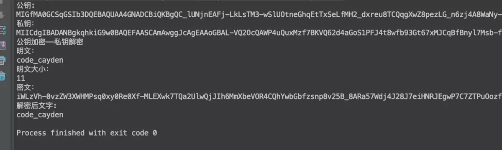

RSA是目前使用最广泛的公钥密码体制之一。它是1977年由罗纳德·李维斯特（Ron Rivest）、阿迪·萨莫尔（Adi Shamir）和伦纳德·阿德曼（Leonard Adleman）一起提出的。当时他们三人都在麻省理工学院工作。RSA就是他们三人姓氏开头字母拼在一起组成的。  

RSA算法的安全性基于RSA问题的困难性，也就是基于大整数因子分解的困难性上。但是RSA问题不会比因子分解问题更加困难，也就是说，在没有解决因子分解问题的情况下可能解决RSA问题，因此RSA算法并不是完全基于大整数因子分解的困难性上的。  

# 1. RSA算法描述  

## 1.1 RSA产生公私钥对  

具体实例讲解如何生成密钥对  

* 1.随机选择两个不相等的质数p和q。  
    alice选择了61和53。（实际应用中，这两个质数越大，就越难破解。）  

* 2.计算p和q的乘积n。  
    n = 61×53 = 3233  
    n的长度就是密钥长度。3233写成二进制是110010100001，一共有12位，所以这个密钥就是12位。实际应用中，RSA密钥一般是1024位，重要场合则为2048位。  
  
* 3.计算n的欧拉函数φ(n)。称作L  
   根据公式φ(n) = (p-1)(q-1)  
   alice算出φ(3233)等于60×52，即3120。  
 
* 4.随机选择一个整数e，也就是公钥当中用来加密的那个数字  
    条件是1< e < φ(n)，且e与φ(n) 互质。  
    alice就在1到3120之间，随机选择了17。（实际应用中，常常选择65537。）  

* 5.计算e对于φ(n)的模反元素d。也就是密钥当中用来解密的那个数字  
   所谓"模反元素"就是指有一个整数d，可以使得ed被φ(n)除的余数为1。ed ≡ 1 (mod φ(n))   
   alice找到了2753，即17*2753 mode 3120 = 1  

* 6.将n和e封装成公钥，n和d封装成私钥。  
   在alice的例子中，n=3233，e=17，d=2753，所以公钥就是 (3233,17)，私钥就是（3233, 2753）。  


## 1.2 RSA加密  
首先对明文进行比特串分组，使得每个分组对应的十进制数小于n，然后依次对每个分组m做一次加密，所有分组的密文构成的序列就是原始消息的加密结果，即m满足0<=m<n，则加密算法为：c≡ m^e mod n; c为密文，且0<=c<n。  

## 1.3 RSA解密  
对于密文0<=c<n，解密算法为：m≡ c^d mod n;  

## 1.4 RSA签名验证  
RSA密码体制既可以用于加密又可以用于数字签名。下面介绍RSA数字签名的功能。已知公钥（e，n），私钥d  

* 1.对于消息m签名为：sign ≡ m ^d mod n
* 2.验证：对于消息签名对（m，sign），如果m ≡ sign ^e mod n，则sign是m的有效签名  


# 2.RSA公开密钥密码体制  

所谓的公开密钥密码体制就是使用不同的加密密钥与解密密钥，是一种“由已知加密密钥推导出解密密钥在计算上是不可行的”密码体制。  

在公开密钥密码体制中，加密密钥（即公开密钥）PK是公开信息，而解密密钥（即秘密密钥）SK是需要保密的。加密算法E和解密算法D也都是公开的。虽然解密密钥SK是由公开密钥PK决定的，但却不能根据PK计算出SK。  

根据密钥的使用方法，可以将密码分为对称密码和公钥密码  

对称密码：加密和解密使用同一种密钥的方式  

公钥密码：加密和解密使用不同的密码的方式，因此公钥密码通常也称为非对称密码。  


# 3. Java实现RSA生成公私钥并加解密  

## 3.1代码如下  

```java
package com.tencent.blue.utils;

import org.apache.tomcat.util.codec.binary.Base64;
import org.apache.tomcat.util.http.fileupload.IOUtils;

import javax.crypto.Cipher;
import java.io.ByteArrayOutputStream;
import java.security.*;
import java.security.interfaces.RSAPrivateKey;
import java.security.interfaces.RSAPublicKey;
import java.security.spec.InvalidKeySpecException;
import java.security.spec.PKCS8EncodedKeySpec;
import java.security.spec.X509EncodedKeySpec;
import java.util.HashMap;
import java.util.Map;

/**
 * Created by cuiran on 19/1/9.
 */
public class RSAUtils {

    public static final String CHARSET = "UTF-8";
    public static final String RSA_ALGORITHM = "RSA";


    public static Map<String, String> createKeys(int keySize){
        //为RSA算法创建一个KeyPairGenerator对象
        KeyPairGenerator kpg;
        try{
            kpg = KeyPairGenerator.getInstance(RSA_ALGORITHM);
        }catch(NoSuchAlgorithmException e){
            throw new IllegalArgumentException("No such algorithm-->[" + RSA_ALGORITHM + "]");
        }

        //初始化KeyPairGenerator对象,密钥长度
        kpg.initialize(keySize);
        //生成密匙对
        KeyPair keyPair = kpg.generateKeyPair();
        //得到公钥
        Key publicKey = keyPair.getPublic();
        String publicKeyStr = Base64.encodeBase64URLSafeString(publicKey.getEncoded());
        //得到私钥
        Key privateKey = keyPair.getPrivate();
        String privateKeyStr = Base64.encodeBase64URLSafeString(privateKey.getEncoded());
        Map<String, String> keyPairMap = new HashMap<String, String>();
        keyPairMap.put("publicKey", publicKeyStr);
        keyPairMap.put("privateKey", privateKeyStr);

        return keyPairMap;
    }

    /**
     * 得到公钥
     * @param publicKey 密钥字符串（经过base64编码）
     * @throws Exception
     */
    public static RSAPublicKey getPublicKey(String publicKey) throws NoSuchAlgorithmException, InvalidKeySpecException {
        //通过X509编码的Key指令获得公钥对象
        KeyFactory keyFactory = KeyFactory.getInstance(RSA_ALGORITHM);
        X509EncodedKeySpec x509KeySpec = new X509EncodedKeySpec(Base64.decodeBase64(publicKey));
        RSAPublicKey key = (RSAPublicKey) keyFactory.generatePublic(x509KeySpec);
        return key;
    }

    /**
     * 得到私钥
     * @param privateKey 密钥字符串（经过base64编码）
     * @throws Exception
     */
    public static RSAPrivateKey getPrivateKey(String privateKey) throws NoSuchAlgorithmException, InvalidKeySpecException {
        //通过PKCS#8编码的Key指令获得私钥对象
        KeyFactory keyFactory = KeyFactory.getInstance(RSA_ALGORITHM);
        PKCS8EncodedKeySpec pkcs8KeySpec = new PKCS8EncodedKeySpec(Base64.decodeBase64(privateKey));
        RSAPrivateKey key = (RSAPrivateKey) keyFactory.generatePrivate(pkcs8KeySpec);
        return key;
    }

    /**
     * 公钥加密
     * @param data
     * @param publicKey
     * @return
     */
    public static String publicEncrypt(String data, RSAPublicKey publicKey){
        try{
            Cipher cipher = Cipher.getInstance(RSA_ALGORITHM);
            cipher.init(Cipher.ENCRYPT_MODE, publicKey);
            return Base64.encodeBase64URLSafeString(rsaSplitCodec(cipher, Cipher.ENCRYPT_MODE, data.getBytes(CHARSET), publicKey.getModulus().bitLength()));
        }catch(Exception e){
            throw new RuntimeException("加密字符串[" + data + "]时遇到异常", e);
        }
    }

    /**
     * 私钥解密
     * @param data
     * @param privateKey
     * @return
     */

    public static String privateDecrypt(String data, RSAPrivateKey privateKey){
        try{
            Cipher cipher = Cipher.getInstance(RSA_ALGORITHM);
            cipher.init(Cipher.DECRYPT_MODE, privateKey);
            return new String(rsaSplitCodec(cipher, Cipher.DECRYPT_MODE, Base64.decodeBase64(data), privateKey.getModulus().bitLength()), CHARSET);
        }catch(Exception e){
            throw new RuntimeException("解密字符串[" + data + "]时遇到异常", e);
        }
    }

    /**
     * 私钥加密
     * @param data
     * @param privateKey
     * @return
     */

    public static String privateEncrypt(String data, RSAPrivateKey privateKey){
        try{
            Cipher cipher = Cipher.getInstance(RSA_ALGORITHM);
            cipher.init(Cipher.ENCRYPT_MODE, privateKey);
            return Base64.encodeBase64URLSafeString(rsaSplitCodec(cipher, Cipher.ENCRYPT_MODE, data.getBytes(CHARSET), privateKey.getModulus().bitLength()));
        }catch(Exception e){
            throw new RuntimeException("加密字符串[" + data + "]时遇到异常", e);
        }
    }

    /**
     * 公钥解密
     * @param data
     * @param publicKey
     * @return
     */

    public static String publicDecrypt(String data, RSAPublicKey publicKey){
        try{
            Cipher cipher = Cipher.getInstance(RSA_ALGORITHM);
            cipher.init(Cipher.DECRYPT_MODE, publicKey);
            return new String(rsaSplitCodec(cipher, Cipher.DECRYPT_MODE, Base64.decodeBase64(data), publicKey.getModulus().bitLength()), CHARSET);
        }catch(Exception e){
            throw new RuntimeException("解密字符串[" + data + "]时遇到异常", e);
        }
    }

    private static byte[] rsaSplitCodec(Cipher cipher, int opmode, byte[] datas, int keySize){
        int maxBlock = 0;
        if(opmode == Cipher.DECRYPT_MODE){
            maxBlock = keySize / 8;
        }else{
            maxBlock = keySize / 8 - 11;
        }
        ByteArrayOutputStream
                out = new ByteArrayOutputStream();
        int offSet = 0;
        byte[] buff;
        int i = 0;
        try{
            while(datas.length > offSet){
                if(datas.length-offSet > maxBlock){
                    buff = cipher.doFinal(datas, offSet, maxBlock);
                }else{
                    buff = cipher.doFinal(datas, offSet, datas.length-offSet);
                }
                out.write(buff, 0, buff.length);
                i++;
                offSet = i * maxBlock;
            }
        }catch(Exception e){
            throw new RuntimeException("加解密阀值为["+maxBlock+"]的数据时发生异常", e);
        }
        byte[] resultDatas = out.toByteArray();
        IOUtils.closeQuietly(out);
        return resultDatas;
    }

    public static void main (String[] args) throws Exception {
        Map<String, String> keyMap = RSAUtils.createKeys(1024);
        String  publicKey = keyMap.get("publicKey");
        String  privateKey = keyMap.get("privateKey");
        System.out.println("公钥: \n\r" + publicKey);
        System.out.println("私钥： \n\r" + privateKey);

        System.out.println("公钥加密——私钥解密");
        String str = "code_cayden";
        System.out.println("\r明文：\r\n" + str);
        System.out.println("\r明文大小：\r\n" + str.getBytes().length);
        String encodedData = RSAUtils.publicEncrypt(str, RSAUtils.getPublicKey(publicKey));
        System.out.println("密文：\r\n" + encodedData);
        String decodedData = RSAUtils.privateDecrypt(encodedData, RSAUtils.getPrivateKey(privateKey));
        System.out.println("解密后文字: \r\n" + decodedData);


    }


}
```


## 3.2 运行结果如下  
