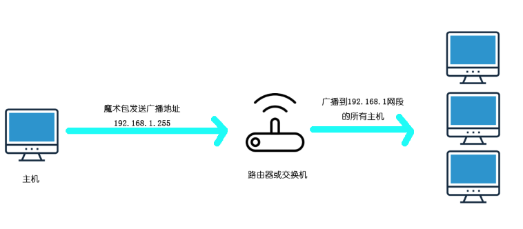

###### 在BIOS设置支持网络唤醒  
    大多数集成网卡都能实现网络唤醒功能，不过需要事先进入BIOS中开启网络唤醒功能，不同主板的设置不一样，以VIA 主板为例，在BIOS中找到“OnBoard LAN”选项，将它设成“Enabled”。同时将“POWER MANAGEMENT SETUP（电源管理设置）”下的“Power On by LAN/Ring”选项设为“Enabled”，最后将“Wake On LAN（网络唤醒）”选项设置为“Enabled”，设置好后保存退出。
    不同系统可能还需要额外的操作才能保证网络唤醒的可用性，以win10系统为例：  
    打开设备管理器，进入网络适配器中自己网卡的属性设置，把相关的服务都启用了。  
  
    
###### 网络唤醒的必备条件

   * 网络唤醒需要终端的主板和网卡支持，需要先在BIOS设置支持网络唤醒
   * 网络唤醒要接通电源保证网卡能通电 要接网线 不能是wifi
   * 如果强制关机 可能不能通过网络唤醒来开机
   * 跨交换机或者跨路由的话就有可能不支持唤醒
   * 跨多层交换机的话即使ping通也未必能唤醒
   * 在同一网段下进行网络唤醒最为省事  

###### 网络唤醒原理  
这里提到一个魔术包Magic Packet的概念，魔术包指AMD公司开发的唤醒数据包，其实是一种特定的数据格式。将唤醒魔术包发送的被唤醒机器的网卡上，具有远程唤醒的网卡都支持这个标准，用16进制表示。  
假设你的网卡物理地址为`00:15:17:53:d4:f9`, 这段Magic Packet内容如下:  
```hex
FFFFFFFFFFFF00151753d4f900151753d4f900151753d4f900151753d4f9
00151753d4f900151753d4f900151753d4f900151753d4f900151753d4f9
00151753d4f900151753d4f900151753d4f900151753d4f900151753d4f9
00151753d4f900151753d4f9
```
这段数据转化为二进制的数据，通过socket技术发送数据包以及目的mac和目的广播地址，就会唤醒目的网卡，从而唤醒主机。  
数据包流向图：  
  
当数据包被广播到192.168.1网段之后，根据数据携带的mac信息匹配到具体的主机。  

###### 广播地址  
这里主要讲解广播地址的概念和计算。  
所谓广播地址指同时向网上所有的主机发送报文。  
对一个既定的ip来说，其网络地址就是主机位全换成0，广播地址就是主机位是全换成1  
例子：先把子网掩码化成二进制，再对应的把子网掩码后面是0的部分对着Ip地址换成0和1就是网络地址和主机地址，比如  
192.168.1.3 （地址）/255.255.255.252（掩码） ,换算一下成二进制  
```
11111111.11111111.11111111.111111 00 /掩码
11000000.10101000.00000001.000000 11 /地址
```
掩码后两位是0，那么把地址的后两位换成0就是网络地址，换成1就是广播地址,那么就是：  
```
11000000.10101000.00000001.000000 00
11000000.10101000.00000001.000000 11
```
把上面的二进制转换成10进制  
得到192.168.1.0是网络地址，192.168.1.3是广播地址。  

###### 网络唤醒  
* 计算被唤醒主机的广播地址  
```java
//根据子网掩码和ip得到主机的广播地址
    public static String getBroadcastAddress(String ip, String subnetMask){
        String ipBinary = toBinary(ip);
        String subnetBinary = toBinary(subnetMask);
        String broadcastBinary = getBroadcastBinary(ipBinary, subnetBinary);
        String wholeBroadcastBinary=spiltBinary(broadcastBinary);
        return binaryToDecimal(wholeBroadcastBinary);
    }
 
    //二进制的ip字符串转十进制
    private static String binaryToDecimal(String wholeBroadcastBinary){
        String[] strings = wholeBroadcastBinary.split("\\.");
        StringBuilder sb = new StringBuilder(40);
        for (int j = 0; j < strings.length ; j++) {
            String s = Integer.valueOf(strings[j], 2).toString();
            sb.append(s).append(".");
        }
        return sb.toString().substring(0,sb.length()-1);
    }
 
    //按8位分割二进制字符串
    private static String spiltBinary(String broadcastBinary){
        StringBuilder stringBuilder = new StringBuilder(40);
        char[] chars = broadcastBinary.toCharArray();
        int count=0;
        for (int j = 0; j < chars.length; j++) {
            if (count==8){
                stringBuilder.append(".");
                count=0;
            }
            stringBuilder.append(chars[j]);
            count++;
        }
        return stringBuilder.toString();
    }
 
    //得到广播地址的二进制码
    private static String getBroadcastBinary(String ipBinary, String subnetBinary){
        int i = subnetBinary.lastIndexOf('1');
        String broadcastIPBinary = ipBinary.substring(0,i+1);
        for (int j = broadcastIPBinary.length(); j < 32 ; j++) {
            broadcastIPBinary=broadcastIPBinary+"1";
        }
        return broadcastIPBinary;
    }
 
    //转二进制
    private static String toBinary(String content){
        String binaryString="";
        String[] ipSplit = content.split("\\.");
        for ( String split : ipSplit ) {
            String s = Integer.toBinaryString(Integer.valueOf(split));
            int length = s.length();
            for (int i = length; i <8 ; i++) {
                s="0"+s;
            }
            binaryString = binaryString +s;
        }
        return binaryString;
    }
```

* 执行网络唤醒  

```java
/**
     * 唤醒主机
     * @param ip         主机ip
     * @param mac     主机mac
     * @param subnetMask      主机子网掩码
     */
    public static void wakeUpDevice(String ip,String mac,String subnetMask){
        ip=ip.trim();
        mac=mac.trim();
        subnetMask=subnetMask.trim();
        String broadcastAddress=getBroadcastAddress(ip,subnetMask);
        mac = mac.replace("-", "");
        wakeBy(broadcastAddress,mac,389);
    }
 
    /**
     *   网络唤醒
     * @param ip            主机ip
     * @param mac        主机mac
     * @param port        端口
     */
    private static void wakeBy(String ip, String mac, int port) {
        //构建magic魔术包
        String MagicPacage = "FFFFFFFFFFFF";
        for (int i = 0; i < 16; i++) {
            MagicPacage += mac;
        }
        byte[] MPBinary = hexStr2BinArr(MagicPacage);
        try {
            InetAddress address = InetAddress.getByName(ip);
            DatagramSocket socket = new DatagramSocket(port);
            DatagramPacket packet = new DatagramPacket(MPBinary, MPBinary.length, address, port);
            //发送udp数据包到广播地址
            socket.send(packet);
            socket.close();
        } catch (IOException e) {
            e.printStackTrace();
        }
    }
 
    private static byte[] hexStr2BinArr(String hexString) {
        String hexStr = "0123456789ABCDEF";
        int len = hexString.length() / 2;
        byte[] bytes = new byte[len];
        byte high = 0;
        byte low = 0;
        for (int i = 0; i < len; i++) {
            high = (byte) ((hexStr.indexOf(hexString.charAt(2 * i))) << 4);
            low = (byte) hexStr.indexOf(hexString.charAt(2 * i + 1));
            bytes[i] = (byte) (high | low);
        }
        return bytes;
    }

```

注意：当跨网段进行唤醒时，即发起唤醒的地址和被唤醒的目的地址不在同一个网段，是否需要做一些调整取决于你的网络配置。我这边的情况是，比如当50网段的服务器发送网络唤醒魔术包到62网段，是行不通的，需要在62网关下增加ip转发广播ip forward-broadcast。  
