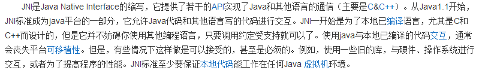
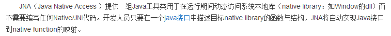
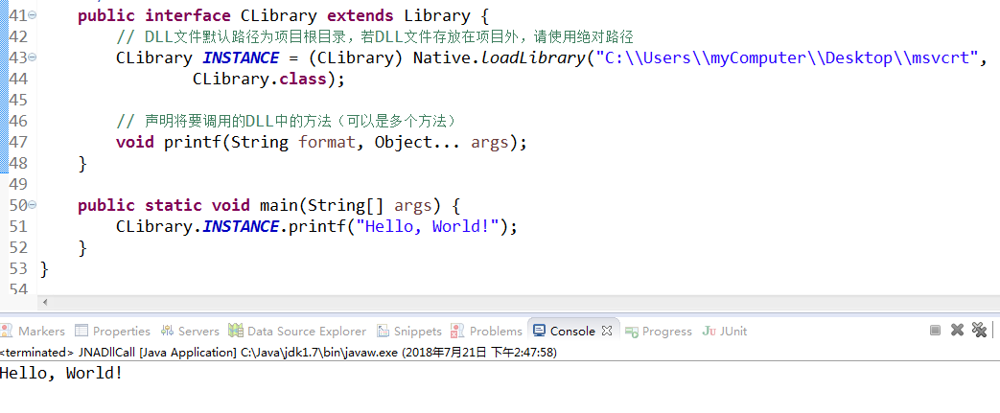

这两天了解了一下java调用dll动态库的方法，总的有三种：JNI、JNA、JNative。其中JNA调用DLL是最方便的。  

* JNI  
      
* JNA  
      
* JNative  
      
java使用 JNI来调用dll动态库的调用，工作量略大，一般情况下开发人员会选用JNA或JNative。
使用JNative调用DLL除了要引入jar包外还需要额外引入一个dll文件，而JNA只需要引入jar即可使用。  
1. 使用JNA框架调用DLL动态库，步骤如下：
   添加jna-4.x.x.jar、jna-platform-4.x.x.jar到项目buildpath中（Maven项目可在中央仓库中搜索JNA的相关依赖添加到项目中）
```xml
<!-- https://mvnrepository.com/artifact/net.java.dev.jna/jna -->
<dependency>
    <groupId>net.java.dev.jna</groupId>
    <artifactId>jna</artifactId>
    <version>5.2.0</version>
</dependency>

```
2. 代码调用DLL动态库方法

```java
import com.sun.jna.Library;
import com.sun.jna.Native;
import com.sun.jna.Platform;
import com.sun.jna.win32.StdCallLibrary;

/**
 * JNA框架DLL动态库读取调用示例类
 * @ClassName: DllCall
 * @Description: 读取调用DLL动态库文件中的方法
 * @author: LinWenLi
 * @date: 2018年7月18日 上午10:32:16
 */
public class JNADllCall {
/**
     * DLL动态库调用方法
     * @Description: 读取调用CDecl方式导出的DLL动态库方法
     * @author: LinWenLi
     * @date: 2018年7月18日 上午10:49:02
     */
    public interface CLibrary extends Library {
        // DLL文件默认路径为项目根目录，若DLL文件存放在项目外，请使用绝对路径。（此处：(Platform.isWindows()?"msvcrt":"c")指本地动态库msvcrt.dll）
        CLibrary INSTANCE = (CLibrary) Native.loadLibrary((Platform.isWindows() ? "msvcrt" : "c"),
                CLibrary.class);

        // 声明将要调用的DLL中的方法,可以是多个方法(此处示例调用本地动态库msvcrt.dll中的printf()方法)
        void printf(String format, Object... args);
    }

    public static void main(String[] args) {
        CLibrary.INSTANCE.printf("Hello, World!");
    }
}
```

`注意：要调用的DLL位数要与JDK位数相同，否则无法调用。`

郁闷的是，按照以上的官方测试代码运行后，控制台没有报错也没有打印出任何东西，在多次测试无果后我将C:\Windows\System32\msvcrt.dll复制到电脑桌面，再将代码中dll路径改为绝对路径，运行成功。  

  
DLL的函数导出方式分为两种，其中StdCall方式导出的DLL，JNA的调用代码如下方的DLL动态库调用方法1. Decl方式导出的DLL，调用代码如DLL动态库调用方法2  

```java
import com.sun.jna.Library;
import com.sun.jna.Native;
import com.sun.jna.Platform;
import com.sun.jna.win32.StdCallLibrary;

/**
 * JNA框架DLL动态库读取调用示例类
 * 
 * @ClassName: DllCall
 * @Description: 读取调用DLL动态库文件中的方法
 * @author: LinWenLi
 * @date: 2018年7月18日 上午10:32:16
 */
public class JNADllCall {

    /**
     * DLL动态库调用方法1
     * 
     * @Description: 读取调用StdCall方式导出的DLL动态库方法
     * @author: LinWenLi
     * @date: 2018年7月18日 上午10:37:58
     */
    public interface StdCallDll extends StdCallLibrary {
        // DLL文件默认路径为项目根目录，若DLL文件存放在项目外，请使用绝对路径
        StdCallDll INSTANCE = (StdCallDll) Native.loadLibrary((Platform.isWindows() ? "msvcrt" : "c"),
                StdCallDll.class);// 加载动态库文件
        // 声明将要调用的DLL中的方法（可以是多个方法）

        void printf(String format, Object... args);
    }

    /**
     * DLL动态库调用方法2
     * 
     * @Description: 读取调用Decl方式导出的DLL动态库方法
     * @author: LinWenLi
     * @date: 2018年7月18日 上午10:49:02
     */
    public interface CLibrary extends Library {
        // DLL文件默认路径为项目根目录，若DLL文件存放在项目外，请使用绝对路径
        CLibrary INSTANCE = (CLibrary) Native.loadLibrary((Platform.isWindows() ? "msvcrt" : "c"),
                CLibrary.class);

        // 声明将要调用的DLL中的方法（可以是多个方法）
        void printf(String format, Object... args);
    }

    public static void main(String[] args) {
        StdCallDll.INSTANCE.printf("Hello, World!\n");
        CLibrary.INSTANCE.printf("Hello, World\n");
    }
}
```