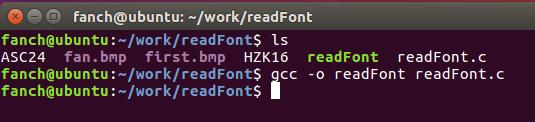
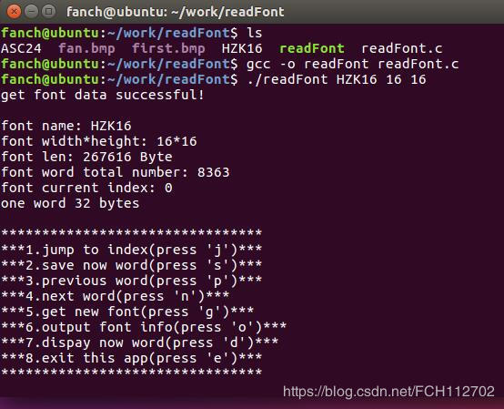
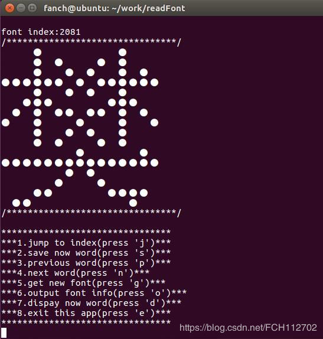
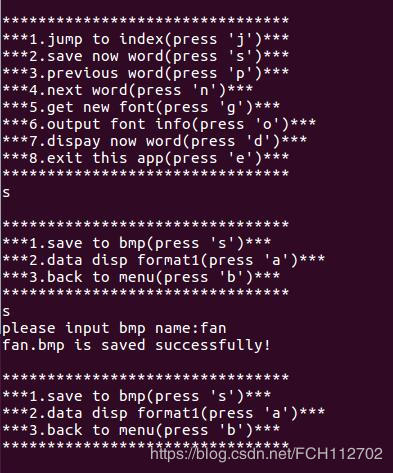
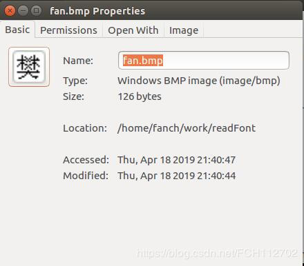
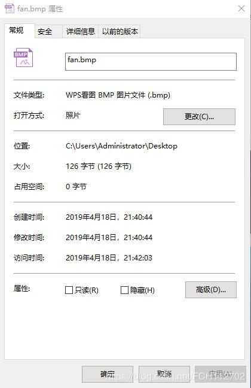
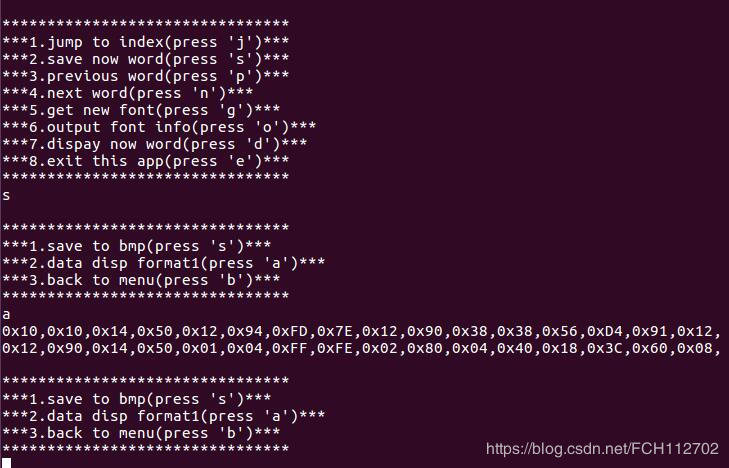

```c
#include <stdio.h>
#include <stdlib.h>
#include <string.h>
#include <unistd.h>
 
#define FONT_MAX_W	64
#define FONT_MAX_H	64
 
typedef struct{
	int valid;
	char name[20];
	int w;
	int h;
	int num;
	int one_len;
	long len;
	int index;
}FONT;
FONT font;
 
void font_reset(FONT* f)
{
	memset(f,0,sizeof(f));
}
 
long get_file_len(char* name)
{
	long flen;
	FILE* fin;
	fin=fopen(name,"r");
	fseek(fin,0,SEEK_END); 
	flen=ftell(fin); 
	fclose(fin);
	return flen;
}
 
void font_info_out(FONT* f)
{
	if(f->valid){
		printf("\nfont name: %s\n",f->name);
		printf("font width*height: %d*%d\n",f->w,f->h);
		printf("font len: %ld Byte\n",f->len);
		printf("font word total number: %d\n",f->num);
		printf("font current index: %d\n",f->index);
		printf("one word %d bytes\n",f->one_len);
	}else{
		printf("the font is invalid!\n");
	}
}
 
void font_init(FONT* f,const char* name,int w,int h)
{
	int one_len;
	strcpy(f->name,name);
	f->w = w;
	f->h = h;
	f->index = 0;
	f->len = get_file_len(f->name);
	f->one_len = (w/8+((w%8>0)?1:0))*h;
	//printf("w:%d,h:%d,len:%d\n",w,h,one_len);
	f->num = f->len/f->one_len;
	//printf("num:%d\n",f->num);
	f->valid = 1;
	printf("get font data successful!\n");
	font_info_out(f);
}
 
int check_font(char* name,int w,int h)
{
	int ret = 0;
	if(access(name, R_OK)==0){
		if((w>0)&&(w<=FONT_MAX_W)){
			if((h>0)&&(h<=FONT_MAX_H)){
				font_init(&font,name,w,h);
				ret = 0;
			}else{
				printf("height %d error!\n",h); 	
				ret = 3;
			}
		}else{
			printf("width %d error!\n",w); 	
			ret = 3;
		}
	}else{
		printf("READ %s ERROR!\nformat:name w h\n",name); 	
		ret = 2;
	}
	return ret;
}
 
int check_para(int num,char* arr[])
{
	int ret = 0;
	int w=0,h=0;
	if(num == 4){
		w = atoi(arr[2]);
		h = atoi(arr[3]);
		ret = check_font(arr[1],w,h);
	}else{
		printf("format error:name width height\n");	
		ret = 1;
	}
	return ret;
}
 
void disp_line(FONT* f,char* buf)
{
	int i;
	for(i = 0;i<f->w;i++){
		if(((buf[i/8]>>(7-i%8))&0x01)==0x01){
			printf("● ");
		}else{
			printf("  ");
		}
	}
	printf("\n");
}
 
char buf[FONT_MAX_W/8];
void disp_word(FONT* f)
{
	int i,num,offset;
	FILE* fin;
	fin=fopen(f->name,"r");
	offset=f->index*f->one_len;
	num = f->one_len/f->h;
	printf("\033[2J") ;
	printf("font index:%d\n",f->index);
	printf("/********************************/\n");
	for(i = 0;i<f->h;i++){
    	fseek(fin,offset+i*num,SEEK_SET);
    	fread(buf,1,num,fin);
		disp_line(f,buf);
	}
	printf("/********************************/\n");
	fclose(fin);
}
 
char get_font_cmd(FONT* f)
{
	char key = 0;
	int index = 0;
	printf("\n********************************\n");
	printf("***1.jump to index(press 'j')***\n");
	printf("***2.save now word(press 's')***\n");
	printf("***3.previous word(press 'p')***\n");
	printf("***4.next word(press 'n')***\n");
	printf("***5.get new font(press 'g')***\n");
	printf("***6.output font info(press 'o')***\n");
	printf("***7.dispay now word(press 'd')***\n");
	printf("***8.exit this app(press 'e')***\n");
	printf("********************************\n");
	while(1){
		scanf("%c",&key);
		if((key == 'j')||(key == 's')||(key == 'p')||(key == 'e')
			||(key == 'n')||(key == 'g')||(key == 'o')||(key == 'd')){
			break;
		}
	}
	if(key == 'j'){
		while(1){
			printf("please input index:");
			scanf("%d",&index);
			if(index<f->num){
				f->index = index;
				disp_word(f);
				break;
			}else{
				printf("index too big!\n");
			}
		}
	}
	return key;
}
 
char get_disp_cmd(void)
{
	char key = 0;
	printf("\n********************************\n");
	printf("***1.save to bmp(press 's')***\n");
	printf("***2.data disp format1(press 'a')***\n");
	printf("***3.back to menu(press 'b')***\n");
	printf("********************************\n");
	while(1){
		scanf("%c",&key);
		if((key == 's')||(key == 'a')||(key == 'b')){
			break;
		}
	}
	return key;
}
 
 
void save_bmp(FONT* f)
{
	int i,j,offset,num;
	char name[50];
	char data[FONT_MAX_W/8];
	FILE *fout,*fin;
	num = (f->w/32+((f->w%32)>0?1:0))*f->h*4;
	int head[]= {num+62,0,62,40,f->w,f->h,1|(1<<16),0,f->w*f->h,0,0,0,0,0,0xFFFFFF};
	char fill[] = {0x00,0x00,0x00};
	//char white[] = {0xFF,0xFF,0xFF};
	
	offset=f->index*f->one_len;
	num = f->one_len/f->h;
	fin=fopen(f->name,"r");
	printf("please input bmp name:");
	scanf("%s",name);
	strcat(name,".bmp");
	fout = fopen(name,"wb");
    fprintf(fout,"BM");
	fwrite(&head,sizeof(head),1,fout);
	for(i = (f->h-1);i>=0;i--){
    	fseek(fin,offset+i*num,SEEK_SET);
    	fread(buf,1,num,fin);
		/*memset(data,0,sizeof(data));
		for(j = 0;j<f->w;j++){
			if(((buf[j/8]>>(7-j%8))&0x01)==0x00){
				data[num-j/8-1] |= (1<<(7-(f->w-j-1)%8));
			}
		}
		fwrite(data,1,num,fout);*/
		//fwrite(buf,1,num,fout);
		memset(data,0,sizeof(data));
		for(j = 0;j<f->w;j++){
			if(((buf[j/8]>>(7-j%8))&0x01)==0x00){
				data[j/8] |= (1<<(7-j%8));
			}
		}
		fwrite(data,1,num,fout);
		if(num%4>0){
			fwrite(fill,1,4-num%4,fout);
		}
		/*for(j = 0;j<f->w;j++){
			if(((buf[j/8]>>(7-j%8))&0x01)==0x01){
				fwrite(black,1,sizeof(black),fout);
			}else{
				fwrite(white,1,sizeof(white),fout);
			}
		}*/
	}
	fclose(fin);
	fclose(fout);
	printf("%s is saved successfully!\n",name);
}
void disp_data_format1(FONT* f)
{
	int i,j,num,offset;
	FILE *fout,*fin;
	fin=fopen(f->name,"r");
	num = f->one_len/f->h;
	offset=f->index*f->one_len;
	for(i = 0;i<f->h;i++){
    	fseek(fin,offset+i*num,SEEK_SET);
    	fread(buf,1,num,fin);
		for(j=0;j<num;j++){
			printf("0x%02X,",(unsigned char)buf[j]);
		}
	}
	printf("\n");
	fclose(fin);
}
 
void save_word_bmp(FONT* f)
{
	char key;
	int flag = 1;
	while(flag){
		key = get_disp_cmd();
		switch(key){
			case 's':
				save_bmp(f);
				break;
			case 'a':
				disp_data_format1(f);
				break;
			case 'b':
				flag = 0;
				break;
			default:
				break;
		}
	}
	
}
int font_deal(FONT* f)
{
	char key;
	int ret = 1;
	key = get_font_cmd(f);
	switch(key){
		case 's':
			save_word_bmp(f);
			break;
		case 'p':
			if(f->index == 0){
				printf("now is the first word!\n");
			}else{
				f->index--;
				disp_word(f);
			}
			break;
		case 'n':
			if(f->index == (f->num-1)){
				printf("now is the last word!\n");
			}else{
				f->index++;
				disp_word(f);
			}
			break;
		case 'd':
			disp_word(f);
			break;
		case 'g':
			font_reset(f);
			ret = 0;
			break;
		case 'o':
			font_info_out(f);
			break;
		case 'e':
			ret = 2;
			break;
		default:
			break;
	}
	//printf("press %c\n",key);
	return ret;
}
 
int font_get(FONT* f)
{
	char name[50];
	int w,h;
	int flag = 1;
	while(flag){
		printf("please input fontname and fontpara:(format:name width height)\n");
		scanf("%s %d %d",name,&w,&h);
		if(!check_font(name,w,h))
			flag = 0;
	}
	return 1;
}
 
int main(int num,char* arr[])
{
	int flag = 1;
	int state = 0;
	font_reset(&font);
	if(check_para(num,arr)>0){
		state = 0;
	}else{
		state = 1;
	}
	while(flag){
		switch(state){
			case 0:
				state = font_get(&font);
				break;
			case 1:
				state = font_deal(&font);
				break;
			default:
				flag = 0;
				printf("exit successful!\n");
				break;
		}
	}
	return 0;
}
```


  

```console
#readFont.c中的代码即为上方代码。
#编译 
gcc -o readFont readFont.c 
```

  

```console
#执行 ./readFont HZK16 16 16
./readFont为可执行文件名+HZK16为字库文件名+16为宽度+16为高度
```

具体功能：显示指定编号字模  j 2081  
  

具体功能：保存成BMP图片，位深度为1  
  

在windows下查询的图片属性  
  

具体功能：显示字模数据  
