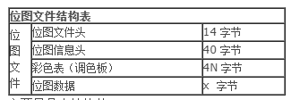

要实现在lcd上实时显示usb摄像头采集的图像，前面已经能够采集到图像了，并保存为jpg文件，现在要在lcd上显示这个图片，有几种方法：一 种是移植好minigui，然后使用minigui提供的函数FillBoxWithBitmap显示图像；一种是直接将图像数据写入 framebuffer中，不管使用哪种前提是要把jpg文件解压得到RGB24数据流。最后决定使用framebuffer,这样可以了解一些底层的东 西。  

这里先介绍如何在framebuffer上绘图，首先有两个结构体struct fb_fix_screeninfo 和struct fb_var_screeninfo，应用程序通过这两个结构体可以获取framebuffer设备相关参数。定义两个变量  

```c++
struct fb_fix_screeninfo  finfo;
struct fb_var_screeninfo vinfo;
int fb = open("/dev/fb0", O_RDWR);
ioctl ( fb, FBIOGET_FSCREENINFO, &finfo)//获取与Framebuffer有关的固定的信息
ioctl( fb, FBIOGET_VSCREENINFO, &vinfo)//获取与Framebuffer有关的可变信息
```

应用程序中通常要用到`struct fb_var_screeninfo`的下面这几个字段：`xres、yres、bits_per_pixel`，分别表示x轴的分辨率、y轴的分辨率以及每像素的颜色深度（每个像素占用的比特数）。  

与Framebuffer设备有关的IO通常都是通过mmap()系统调用来完成的。系统调用mmap()用来实现内存映射IO。所谓内存映射IO，是指 将一个磁盘文件的内容与内存中的一个空间相映射。当从这个映射内存空间中取数据时，就相当于从文件中读取相应的字节，而当向此映射内存空间写入数据时，就 相当于向磁盘文件中写入数据。这就是内存映射IO的含义。mmap()的函数原型如下:  

```c++
void  * mmap(void *start, size_t length, int prot , int flags, int fd,off_t offset);
当调用成功时，返回值就是与磁盘文件建立了映射关系的内存空间的起始地址
当调用失败时，mmap()的返回值是-1。
第一个参 数start通常设置为0，表示由系统选择映射内存空间；
第二个参数length指定了要映射的字节数；
第三个参数指明了映射内存空间的保护属性，对于 Framebuffer通常将其设置为PROT_READ | PROT_WRITE，表示既可读也可写；
第四个参数flags指明了影响映射内存空间行为的标志，对于Framebuffer编程而言，要将flags 设置为MAP_SHARED，表明当向映射内存空间写入数据时，将数据写入磁盘文件中；
第五个参数fd是要映射的文件的文件描述符；第六个参数 offset指明了要映射的字节在文件中的偏移量。

#define WIDTH 320
#define HEIGHT  240
#define BYTE_PER_PIXEL 2

//我的LCD的bpp模式设置为RGB565
//定义全局变量
static unsigned char *fb_mem = NULL;
fb_mem = mmap( NULL, WIDTH * HEIGHT * BYTE_PER_PIXEL,PROT_READ | PROT_WRITE, MAP_SHARED, fb, 0);
//如果mmap()调用成功，就可以在程序中对得到的映射内存空间进行读写操作了。所有的读写都将由操作系统内核转换成IO操作。
int munmap(void *start, size_t length);
//在使用完映射内存空间之后，应当将其释放，这是通过munmap()系统调用完成的。munmap()的第一个参数是映射内存空间的起始地址，第二个参数length是映射内存空间的长度，单位为字节。如果释放成功，munmap()返回0，否则返回-1。
```  
初始化framebufer程序：  

```c++
#include <stdio.h>
#include <stdlib.h>
#include <sys/types.h>
#include <sys/stat.h>
#include <fcntl.h>
#include <sys/mman.h>
#include <linux/fb.h>
#include <unistd.h>
#include <sys/ioctl.h>
#include <ctype.h>
#include <jpeglib.h>
#include <linux/videodev.h>
#include <errno.h>

#define WIDTH 320
#define HEIGHT  240
#define BYTE_PER_PIXEL 2
#define MAX_X      WIDTH
#define MAX_Y      HEIGHT
#define FB_DEVICE "/dev/fb0"

static unsigned char *fb_mem = NULL;

int init_framebuffer(void)
{
  struct fb_fix_screeninfo finfo;
  struct fb_var_screeninfo vinfo;
  int fb;

  fb = open (FB_DEVICE, O_RDWR);
  if ( fb < 0)
  {
   printf("Can't open framebuffer device %s\n",FB_DEVICE);
    return -1;
  }
 
  if ( ioctl ( fb, FBIOGET_FSCREENINFO, &finfo) )
  {
    printf("read fixed framebuffer infomation error\n");
    return -2;
  }

  printf("printing fixed screen infomation:\n");
  printf("id:%s\n",finfo.id);
 printf("smem_start:%d\n",finfo.smem_start);
  printf("smem_len:%d\n",finfo.smem_len);
  printf("type:%d\n",finfo.type);
  printf("type_aux:%d\n",finfo.type_aux);
  printf("visual:%d\n",finfo.visual);
  printf("xpanstep:%d\n",finfo.xpanstep);
  printf("ypanstep:%d\n",finfo.ypanstep);
  printf("ywrapstep:%d\n",finfo.ywrapstep);
 printf("line_length:%d\n",finfo.line_length);
 printf("mmio_start:%d\n",finfo.mmio_start);
  printf("mmio_len:%d\n",finfo.mmio_len);
  printf("accel:%d\n",finfo.accel);

  if ( ioctl( fb, FBIOGET_VSCREENINFO, &vinfo) )
  {
    printf("read variable framebuffer information\n");
    return -3;
  }
  printf("printing variable screen information\n");
  printf("xres:%d\n",vinfo.xres);
  printf("yres:%d\n",vinfo.yres);
 printf("xres_virtual:%d\n",vinfo.xres_virtual);
 printf("yres_virtual:%d\n",vinfo.yres_virtual);
  printf("xoffset:%d\n",vinfo.xoffset);
  printf("yoffset:%d\n",vinfo.yoffset);
 printf("bits_per_pixel:%d\n",vinfo.bits_per_pixel);
  printf("grayscale:%d\n",vinfo.grayscale);
  printf("nonstd:%d\n",vinfo.nonstd);
  printf("activate:%d\n",vinfo.activate);
  printf("height:%d\n",vinfo.height);
  printf("width:%d\n",vinfo.width);
 printf("accel_flags:%d\n",vinfo.accel_flags);
  printf("pixclock:%d\n",vinfo.pixclock);
 printf("left_margin:%d\n",vinfo.left_margin);
 printf("right_margin:%d\n",vinfo.right_margin);
 printf("upper_margin:%d\n",vinfo.upper_margin);
 printf("lower_margin:%d\n",vinfo.lower_margin);
  printf("hsyns_len:%d\n",vinfo.hsync_len);
  printf("vsync_len:%d\n",vinfo.vsync_len);
  printf("sync:%d\n",vinfo.sync);
  printf("vmode:%d\n",vinfo.vmode);
  //printf("rotate:%d\n",vinfo.rotate);
  fb_mem = mmap( NULL, WIDTH * HEIGHT * BYTE_PER_PIXEL,PROT_READ | PROT_WRITE, MAP_SHARED, fb, 0);
  if ( fb_mem < 0 )
  {
   printf("failed to map framebuffer device to memory\n");
    return -4;
  }
  memset( fb_mem, 0, WIDTH * HEIGHT * BYTE_PER_PIXEL);
  return fb;
}
```

现在直接向得到的映射内存空间写入数据就可以绘图了，下面的函数控制向某个像素点的颜色:

```c++
#define BYTE_PER_PIXEL 2
#define MAX_X 320
#define MAX_Y 240
void putpixel( unsigned int x, unsigned int y,unsigned short color)
{
  unsigned long offset;
  offset = ( y * MAX_X * BYTE_PER_PIXEL) + ( x * BYTE_PER_PIXEL);
  *(unsigned short *)(fb_mem + offset ) = color;
}
```

下面这个函数填充某个区域,输入参数中x1,x2的范围是0~319,y1,y2的范围是0~239 :  

```c++
void fillrect(unsigned int x1, unsigned int y1, unsigned int x2, unsigned int y2, unsigned short color)
{
  int i , j;
  int xlen;
  unsigned long offset;
  if ( x1 >= MAX_X ) {
    x1 = MAX_X - 1;
  }
  if ( x2 >= MAX_X ) {
    x2 = MAX_X - 1;
  }  
  if ( y1 >= MAX_Y ) {
    y1 = MAX_Y - 1;
  }
  if ( y2 >= MAX_Y ) {
    y2 = MAX_Y -1;
  }
  if ( ( x2 - x1 ) < 0 ) {
    i = x2; x2 = x1; x1 = i;
  }
  if ( ( y2 - y1 ) < 0 ) {
    i = y2; y2 = y1; y1 = i;
  }
 
  offset = ( y1 * MAX_X * BYTE_PER_PIXEL ) + (x1 * BYTE_PER_PIXEL);
  xlen = (x2 - x1 + 1) * BYTE_PER_PIXEL;
  for ( i = y1; i <= y2; i++) {
    for (j = 0; j < xlen; j += 2) {
     *(unsigned short *)(fb_mem + offset + j) = color;
    }
    offset += MAX_X * BYTE_PER_PIXEL;
  }
}
```

这里主要是要搞清楚坐标和内存空间地址的转换。  
在lcd上显示bmp图像  
实现需要了解bmp图像文件的格式:  
  

```c++
//主要是几个结构体位图文件头包含文件类型、文件大小、存放位置等信息。结构定义如下：
typedef struct tagBITMAPFILEHEADER
{
  UNIT bfType;         //说明文件类型，在windows系统中为BM。
  DWORD bfSize;        //说明文件大小。
  UINT bfReserved1;    //保留，设置为０。
  UINT bfReserved2;    //保留，设置为０。
  DWORD bfOffBits;    //说明实际图形数据的偏移量。
}BITMAPFILEHEADER;

//位图信息头包含位图的大小、压缩类型、和颜色格式，结构定义如下：
typedef struct tagBITMAPINFOHEADER
{
  DWORD biSize;            //说明BITMAPINFOHEADER结构所需字节数，在windows系统中为28h
  LONG biWidth;            //说明图像宽度
  LONG biHeight;            //说明图像高度
  WORD biPlanes;            //为目标设备说明位面数，其值设为１
  WORD biBitCount;          //每个像素的位数，单色位图为１，２５６色为８，２４bit为２４。
  DWORD biCompression;      //压缩说明，BI_RGB：无压缩，BI_RLE8：８位RLE压缩，BI_RLE4：４位RLE压缩
  DWORD biSizeImage;        //说明图像大小，如无压缩，可设为０
  LONG biXPelsPerMerer;     //水平分辨率
  LONG biYPelsPerMerer;     //垂直分辨率
  DWORD biClrUsed;         //位图使用的颜色数
  DWORD biClrImportant;    //重要颜色数目
}BITMAPINFOHEADER;

//彩色表包含的元素与位图所具有的颜色数目相同，像素颜色用结构RGBQUAD来表示：
typedef struct tagRGBQUAD 
{ 
    BYTE rgbBlue;          //指定蓝色强度
    BYTE rgbGreen;         //指定绿色强度
    BYTE rgbRed;           //指定红色强度
    BYTE rgbReserved;      //保留，设为０
}RGBQUAD;

```

位图数据  

紧跟在彩色表后的是图像数据阵列，图像每一扫描行有连续的字节组成，扫描行由底向上存储，阵列中第一字节为左下角像素，最后一字节为右上角像素  

显示bmp图像程序如下(显示一幅320*240的bmp图像)：  

```c++
#define BYTE_PER_PIXEL 2
#define MAX_X 320
#define MAX_Y 240
#pragma pack(1)
typedef  struct 
{ 
     short     bfType;                         
     long      bfSize;                       
     short     bfReserved1;              
     short     bfReserved2;            
     long      bfoffBits;               
}  BITMAPFILEHEADER;
#pragma pack()
int showbmp(char *bmpfile)
{
  int fp_bmp;
  long height;
  long width;
  int  length, offset = 0;
  int i, y1 = 0, x1 = 0;
  BITMAPFILEHEADER bfile;

  unsigned char *pDIBData = NULL;
  unsigned char r = 0, g = 0, b = 0;
  unsigned short R = 0, G = 0, B = 0;
  unsigned short color = 0;

  printf("open bmp file\n");
  fp_bmp = open( bmpfile, O_RDONLY);//打开文件
  if ( fp_bmp < 0 )
  {
    printf("can not open file %s\n",bmpfile);
    return 0;
  }
  read( fp_bmp, &bfile, sizeof(bfile) );//读取文件头信息
  printf("bfsize=%d, bfoffbits=%d\n",bfile.bfSize, bfile.bfoffBits);
  lseek( fp_bmp, 18, SEEK_SET );
  read( fp_bmp, (void *)&width, sizeof(long) );//获取文件的宽度
  read( fp_bmp, (void *)&height, sizeof(long) );//获取文件的高度
  printf("width=%d\n",width);
  printf("height=%d\n",height);
//分配图像数据存储空间,实际的图像数据大小为文件大小 减去  图像数据与文件头的偏移量
  pDIBData = (unsigned char *)malloc(bfile.bfSize -  bfile.bfoffBits);
  if(pDIBData == NULL)
  {
    printf("mem allocate failed\n");
    return 0;
  }
  lseek( fp_bmp, bfile.bfoffBits, SEEK_SET );
  read( fp_bmp, pDIBData, bfile.bfSize -  bfile.bfoffBits);//读取图像数据至分配的存储空间
   //显示图像,这里需要注意如何将RGB24转换为RGB565
   //从bmp文件读出的图像数据是RGB24格式,LCD显示需要RGB565数据格式
  for (y1 = 0; y1 < MAX_Y; y1++)
    for (x1 = 0; x1 < MAX_X; x1++)
    {
         //注意从bmp文件中读出的图像数据连续的三个字节中第一个字节为蓝色分量
         //第二个字节为绿色分量 第三个字节为红色分量
         b = *pDIBData ; g = *(pDIBData + 1) ; r = *(pDIBData + 2);
         //下面5跳语句实现了RGB24转换为RGB565
         //红色r占5为屏蔽低三位 绿色g占6为屏蔽低两位   蓝色b占5为屏蔽低三位
         r = r & (~(0x07)); g = g & (~(0x03)); b = b & (~(0x7));
         R = (unsigned short)r << 8;
         G = (unsigned short)g << 3;
         B = (unsigned short)b >> 3;
         color = R | G | B;
         //计算偏移量 ,注意最先读出的三个字节对应的是图像中的左下角的那个像素,最后三个字节对应图像
         //中右上 角 的那个像素
         offset = (MAX_Y - y1 -1) * MAX_X * BYTE_PER_PIXEL + (x1 * BYTE_PER_PIXEL);
        //将颜色数据写入显存
        *(unsigned short *)(fb_mem + offset) = color;
        pDIBData += 3;
    }
  close(fp_bmp);
  free(pDIBData);
}
```