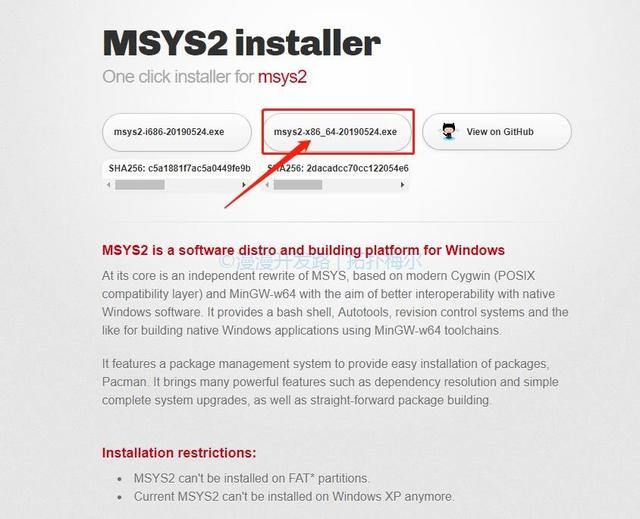
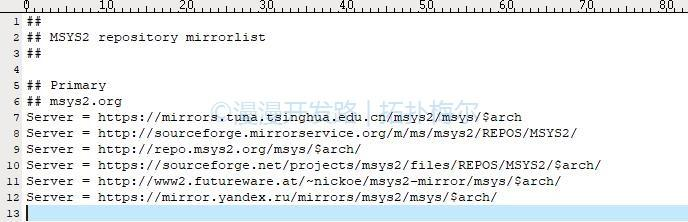
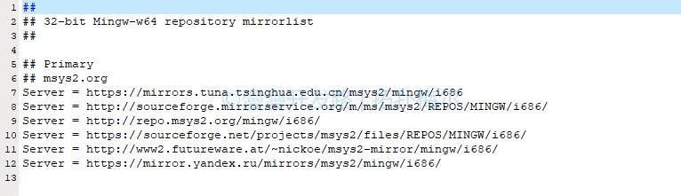
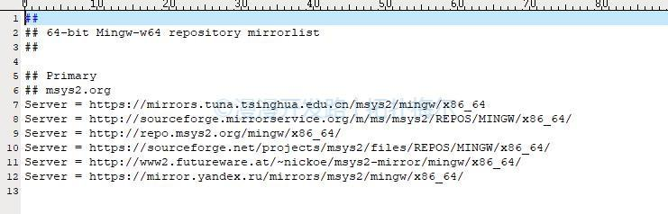

# 一. MSYS2配置  

1) 首先去[MSYS2](https://www.msys2.org/)官网安装包，因为我的电脑是64位系统，所以，这里我选择x86_64版本。MSYS2可以根据需要安装32位和64位版本的mingw和编译工具链，而且还有个十分好用的包管理器：pacman，简直是谁用谁知道啊。  

  

2) 双击下载下来的安装包，然后，直接无脑下一步就好。  

3) 更新包数据块和系统核心包 `pacman -Syu`  

4) 更新其他包 `pacman -Su`  

5) 分别安装32位版本和64位版本的工具链  

```shell
pacman -S mingw-w64-i686-gcc
pacman -S mingw-w64-x86_64-gcc
```
  
6) 安装软件组和其他工具  

```shell
pacman -S base-devel
pacman -S vim
pacman -S nasm
pacman -S git
```

7) 检查编译器是否正常  
打开开始菜单的”MSYS2 64bit”，分别打开下面的“MSYS2 MinGW 32-bit”和”MSYS2 MinGW 64-bit”，执行`gcc -v`，看是否执行正常。特别是要看看gcc的编译平台是否对应。  


# 二. x264编译  

1) 去[VLC官网下载x264源码包](https://www.videolan.org/developers/x264.html)并解压到`msys64\home`目录下。  

2) 工程配置  

```shell
#如果是编译32位版本的x264，请打开MSYS2 MinGW 32-bit，然后执行以下命令：
./configure --host=i686-w64-mingw32 --enable-shared --enable-static --extra-ldflags=-Wl,-output-def=libx264.def

#如果是编译64位版本的x264，请打开MSYS2 MinGW 64-bit，然后执行以下命令：  
./configure -–host=x86_64-w64-mingw32 --enable-shared --enable-static --extra-ldflags=-Wl,-output-def=libx264.def
```

3) 工程编译及安装  

```shell
make
make install
```

4) 编译完成  
注意，编译成功后，会在x264的目录下生成如下几个文件：  

```shell
libx264.a: Linux库，暂时不需要
libx264.def: 模块定义文件，后面会基于它来生成Windows下的Lib文件
libx264.dll.a: Linux库，暂时不需要
libx264-157.dll: 用于Windows的动态链接库
```

5) 将DEF文件转换为Lib文件  

打开Visual Studio的VC/Bin目录，下面有个lib工具可以用来生成Lib文件
```shell
#32位版本Lib文件生成：
VC/Bin/Lib /DEF:libx264.def /machine:x86

#64位版本Lib文件生成：
VC/Bin/amd64/Lib /DEF:libx264.def /machine:x64
```

# 三. 测试程序  

至此，调用x264库的几个文件都已经成功生成了，可以编写一些简单的代码进行测试了。  

  

注意包含相关头文件：  
  


# 四. 碰到的坑  

1) 默认安装后，发现安装源连接速度太慢导致安装失败，可以修改如下文件，添加比较快的源。  

`msys64\etc\pacman.d\mirrorlist.msys`
  

`msys64\etc\pacman.d\mirrorlist.mingw32`  
  

`msys64\etc\pacman.d\mirrorlist.mingw64`  
  

2) 生成的32位x264.dll，还依赖以下两个文件：  

```shell
libgcc_s_dw2-1.dll
libwinpthread-1.dll
#别担心，以上两个文件可以在这里找到：msys64\mingw32\bin
```

3) 配置x264库时，可能会发生找不到C编译器的问题，可以按照以上步骤重新安装一下基础包和工具链，然后重试。  

