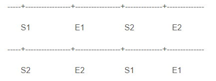

SQL中常常要判断两个时间段是否相交，该如何判断呢？比如两个时间段(S1，E1)和（S2，E2）。我最先想到的是下面的方法一。  
方法一：（S1 BETWEEN S2 AND E2） OR （S2 BETWEEN S1 AND E1）。很好理解：一个时间段的开始时间S1在另一个时间中间（S2，E2），或者开始时间S2在另一个时间中间（S1，E1）。

这个方法比较繁琐，我们来看方法二.  

方法二：本方法先考虑这两段时间什么情况下不相交，如下图：  
  
 无非两种情况：(S1，E1)段在(S2，E2)段前面和(S1，E1)段在(S2，E2)段后面。其对应的表达式为：（S2 > E1） OR （S1 >  E2）。于是相交条件就是 NOT（（S2 > E1） OR （S1 >  E2））该式等价于  
 `（S2 <= E1）AND (S1 <= E2）`  
 这就是我们要的。  
 其实方法一和方法二的条件是一致的：  
 ((S1 <=  E2) AND (S1 >= S2)) OR ((E1 <= E2) AND (E1 >= S2))  
 =>((S1 <= E2) AND (S1 >= S2) ) OR ((`S1 <= E2`) AND (E1 >= S2))  (因为S1 <= E1)  
 <=> (S1 <= E2) AND ((S1 >= S2) OR (E1 >= S2))  
 => (S1 <= E2) AND ((`E1 >= S2`) OR (E1 >= S2))  (因为 S1 <= E1)  
 <=>(S1 <= E2) AND (E1 >= S2)