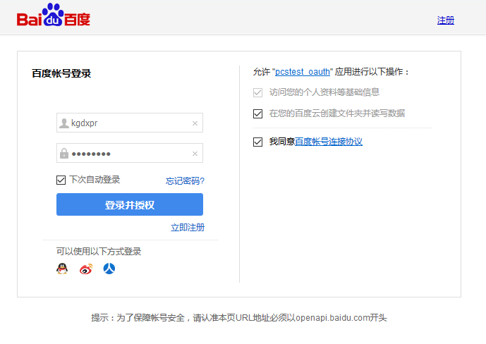
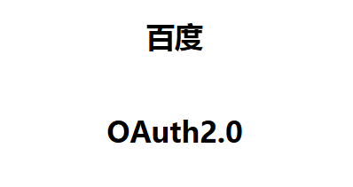

#### 获取Access Token  

* 访问：https://openapi.baidu.com/oauth/2.0/authorize?response_type=token&client_id=L6g70tBRRIXLsY0Z3HwKqlRE&redirect_uri=oob&scope=netdisk
* 执行后，弹出百度登录页面，登录后弹出以下授权页面：  
  
* 授权后，将跳转到以下百度OAuth2.0页面：  
  
* 请将此页面地址栏的内容拷贝出来，您将看到：   

```url
http://openapi.baidu.com/oauth/2.0/login_success#expires_in=2592000&access_token=3.811a254908d094012df764a38882a179.2592000.1348661720.2233553628-238347&session_secret=9deaa587f9cd177f02079506dc4391ab&session_key=94rrnl7qf2cYVnSZ0KfARwLS%2BIMuQn%2FbZKgbYBEnwDZv1O%2Bzp7fJxo8cN%2BrrhLAQsJy8FeBD2SP6Ioux%2B2TW6IgR8JFIGsU%3D&scope=basic+netdisk  

说明：红色字就是access_token。    expires_in:access_token过期秒数
```

#### 获取用户信息  

```console
curl "https://pan.baidu.com/rest/2.0/xpan/nas?method=uinfo&access_token=xxxxxxxxxxxxxxxxxxxxxxxxx" -H "User-Agent: pan.baidu.com"
#返回
{
  "avatar_url": "https://ss0.bdstatic.com/7Ls0a8Sm1A5BphGlnYG/sys/portrait/item/5923e63a.jpg",
  "baidu_name": "青袍浪人",
  "errmsg": "succ",
  "errno": 0,
  "netdisk_name": "",
  "request_id": "1734729899651722785",
  "uk": 591271737,
  "vip_type": 0
}
```

#### 百度网盘开放平台SDK
https://pan.baidu.com/union/document/basic